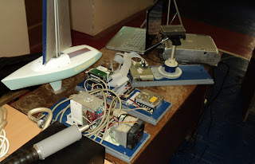
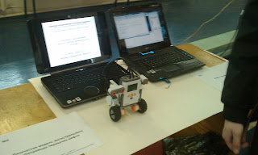
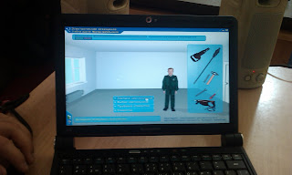
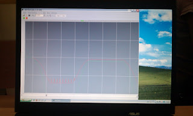
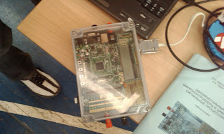
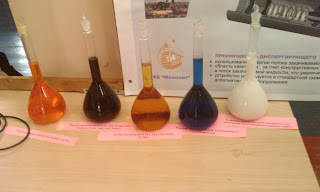
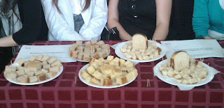

<!--
{
  "draft": false,
  "tags": [ "Другое"]
}
-->

# Выставка СамГТУ "Дни науки" 2010

```blogEnginePageDate
08 апреля 2010
```

С 5 по 9 апреля 2010 в СамГТУ прошли ["Дни науки"](http://dn.samgtu.ru/), в рамках которой была проведена выставка
научных проектов студентов.

На ней было представлено порядка 20 проектов различной направленности начиная от электротехники и программных продуктов
до мыла и хлеба. Хоть и оценивание научных трудов неблагодарное дело, особенно если проекты действительно стоящие, но
оценивать их надо. Для этого на выставке работала специальная комиссия из 8 человек, которая по 20(!) минут беседовала с
участниками выставки.

К сожалению, я не в силах понять все особенности различных проектов, поэтому приведу наиболее заметные проекты, которые
можно было запечатлеть на фотоаппарат.



Естественно для начала я расскажу о проекте, который я разрабатываю еще с несколькими людьми. Проект представляет собой
робота-яхту, который по нашему желанию обладателя самостоятельно перемещается. На рисунке представлена уменьшенная
модель аппарата, а также стенды внутренностей робота (бортовой компьютер, плата навигации, альтернативный источник
энергии), ноутбук в поставку с яхтой, конечно же, не идёт. Глобальной же целью проекта является создание множества таких
аппаратов, которые, работая бы как измерительная сеть, следили бы за состоянием океана.



Следующий проект в сфере робототехники - это робот, который вы видите на фотографии. По заверению разработчиков он
движется на свет, а также останавливается около препятствий.



Мне очень понравилась идея следующего проекта, который представляет собой интерактивную программу для обучения и
тестирования студентов в сфере строительства и электротехники. Может быть читатель слышал об очках, которые подсказывают
человеку что нужно сделать, скажем для замены колеса в машине. Я думаю эту программу было бы очень интересно сделать для
таких очков. Тогда бы мы могли с помощью компьютерного гида менять лампочки в зале и краны на кухне.



Не только парни могут делать хорошие проект. Вот вам "женский" проект, который позволяет регистрировать некоторые
параметры человеческого тела. Принцип работы регистрирующего устройства заключается в 30-секундном нажатии на кнопку, в
течении которого программа снимает порядка 20 МБ информации. На фото плохо, но видна линия колебаний снятых с моей руки.
Вывод заключений из полученных данных - это уже дело медиков.



А вот устройство, которое, как я понял, представляет собой сразу несколько лабораторных работ для студентов. В
зависимости от лабораторной преподаватель выбирает какую из функций должен реализовывать прибор и затем студент
выполняет лабораторную.



А вот и химия. Как вам колбочки? Красиво? Но подозреваю что открывать их опасно, т.к. там находятся очень
концентрированные реагенты.



Даже хлеб может быть научным. По словам девушек-создателей сего хлеба он насыщен витаминами. К нему бы варенья да чаю, и
можно было сразу давать им первое место.

Итак ждем результатов выставки, которые должны быть вывешены 9 апреля [здесь](http://dn.samgtu.ru/section_result_v).

