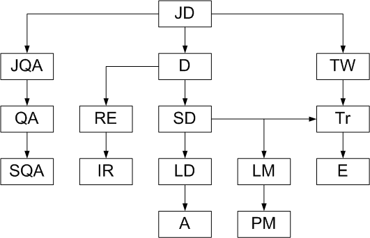

<!--
{
  "draft": false,
  "tags": ["Программирование"]
}
-->

# Звания IT-работников

```blogEnginePageDate
07 декабря 2010
```

Некоторое время назад я пытался найти кем можно стать начиная с программиста и куда эта дорога может привести. К
сожалению ничего толкового мне найти не удалось. Поэтому я попытался самостоятельно провести исследование на эту тему.
Итак представляю вам на обозрение схему развития программиста начального уровня в нечто более разумное. Особое спасибо
Дмитрию Ч. за помощь.



Стрелки обозначают переходы из одной должности в другую. В общем случае, возможен любой переход, однако на мой взгляд,
нарисованный на схеме переходы наиболее вероятны.

Итак все начинается с JD - Junior Developer (тот кто только, что устроился на работу в компанию на последнем курсе
университета). У него 3 пути.

Он может продолжать подниматься по лестнице разработчика: D - Developer (понимает чем отличается программирование в
комании от программирования в университете или школе); SD - Senior Developer (хорошо знает ряд технологий); LD - Lead
Developer (знает еще больше технологий, знает как работает весь проект, управляет разработчиками); A - Architect (не
работает с кодом, составляет схему работы компонент проекта, работает с заказчиком, определяет требования к проекту,
определяет как лучше согласовать компоненты проекта).

На этапе D программист может соскочить на альтернативную карьерную лестницу, где может стать RE - Release Engineer (
собирает/компилирует проекты/сборки), откуда уже перейти в IR (установка проекта у заказчика).

Кроме того хороший программист поcле SD может устать от писания кода и решить стать менеджером LM - Line Manager (
управление небольшим IT-отделом), а потом и PM - Product Manager (управление всем проектом и соответственно всеми людьми
связанными с этим проектом, здесь не обойтись без периодических встреч с заказчиком).

Теперь немного о тех, кто занимается качеством продукта. JQA - Junior Quality Assurance (в моем понимании, это тот кто
занимается поиском ошибок в программах). QA - Quality Assurance (наполовину тестировщик, наполовину программист, т.к.
занимается разработкой программ для тестирования программ). SQA - Senior Quality Assurance (разработка и проектирования
программ проверки качества проекта).

И еще один путь это TW - Technical Writer (документация), затем Tr - Trainer (проводит курсы для программистов), ну и
потом можно стать при условии, что вас многие знают E - Evangelist (пропаганда/реклама той или иной технологии или пути
развития).

Вот такая схема получилась у меня. Конечно можно добавить еще и администраторов и HR-менеджеров, но как мне кажется эти
профессии уже находятся на довольно далеком расстоянии от описанных мною. Комментарии и поправки приветствуются.


