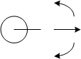
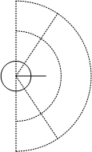
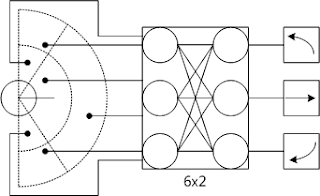
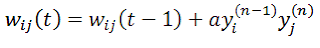
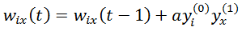

<!--
{
  "draft": false,
  "tags": ["Программирование"]
}
-->

# Нейронная сеть для обхода препятствий

```blogEnginePageDate
07 мая 2010
```

Некоторое время назад мне нужно было написать нейронную сеть для управления простым роботом, цель которого ездить и не
врезаться в препятствия.

Программа, написанная мной на java находится [здесь](robot.zip), и предоставляется "как есть". Для просмотра работы
программы нажимаем кнопку NEW, удостоверяемся что checkbox DRAW находится в положении false, нажимаем DO EDUCATION, ждем
секунд 20 - теперь сеть обучена, ставим DRAW в положение true, нажимаем DO EDUCATED AI.

Робот должен не врезаться в препятствия. Если это происходит то сделайте эти шаги заново. Врезание после обучения
происходит из-за неправильного распределения начальных весов сети (они распределяются случайно) и эта ситуация довольно
редка в минимум 90% случаях сеть обучается обходить препятствия.

Поскольку я раньше почти не сталкивался с нейронными сетями мне пришлось прочитать несколько книжек, а также перерыть
интернет. И может конечно я плохо искал, но готовой программы или алгоритма как это сделать я не нашел. Однако по
крупицам все таки смог написать программу. Именно с ней я хочу вас познакомить, а также рассказать пару секретов, хотя
для профессионалов эти секреты покажутся наверно детской забавой.

Итак робот представляет собой следующее:



Он может поворачиваться вправо, влево и двигаться вперед (это указано на рисунке).

У робота есть система датчиков, которая позволяет ему определять в какой области пространства находиться ближайшее к
нему препятствие. Области пространства разбиты следующим образом:



Возьмем простую нейронную сеть из двух слоев: 6 нейронов первого слоя - по одному на область и 3 выходных нейрона - по
одному на выбор движения. Схематично это можно представить так:



Теперь поговорим об алгоритмах обучения НС (нейронной сети). Есть два вида обучения:

* с учителем;
* без учителя.

Правда иногда выделяют еще один вид обучения - с подкреплением.

Для обучения СУ (системы управления) робота выберем обучение без учителя, основанное на методе Хебба, о нем можно
прочитать где угодно:



где yi(n-1) – выходное значение нейрона i слоя (n-1), yj(n) – выходное значение нейрона j слоя n; wij(t) и wij(t-1) –
весовой коэффициент синапса, соединяющего эти нейроны, на итерациях t и t‑1 соответственно; a – коэффициент скорости
обучения ([0;0.3]). Здесь и далее, для общности, под n подразу­мевается произвольный слой сети. При обучении по данному
методу усиливаются связи между возбужденными нейронами.

Однако кроме этого есть пара улучшений, которые я ввел в процесс обучения.

Если роботу не видит препятствий, то он движется вперед.

После каждого этапа изменения весов по формуле Хебба проверяется веса НС и, если какой-либо вес сети стал больше
среднего веса в 10 раз, то он уменьшается в 3 раза. Это помогает избежать паралича сети.

НС робота запоминает последний образ. Это необходимо в том случае, когда робот правильно реагирует на препятствие (не
врезается) и отъезжает от препятствия, если после этого попытаться обучить сеть, то ничего не выйдет, т.к. отклики
нейронов будут нулевые, поскольку и на входных нейронах будут нулевые сигналы. Для сети достижения цели это было не
нужно т.к. датчики были неограниченны по дальности, т.е. входной не нулевой образ всегда существовал.

Если робот цели не достигает, то коэффициент скорости обучения увеличивается на 0.001 и обучении проводится по нашей
модификации метода Хебба (уменьшаются все веса, связанные с “нейроном-победителем”), формула приведена с учетом, что
сеть состоит всего из 2 слоев:



где x – номер нейрона победителя.

Вот и все. В дальнейшем попытаюсь выложить больше информации по этой теме.


