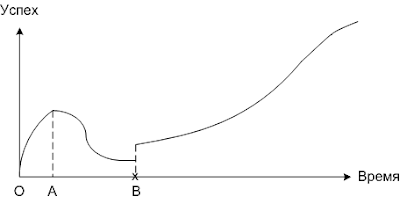

<!--
{
  "draft": false,
  "tags": ["Программирование"]
}
-->

# График успеха

```blogEnginePageDate
19 февраля 2011
```

Я участвовал в нескольких проектах, и как-то раз, начиная новый проект, я заметил, что сложность, с которой у меня
получается решать задачи на проектах, меняется со временем в общем-то одинаково для различных проектов. Поэтому
представляю график зависимости успеха (под успехом я понимаю насколько оптимально получается решать задачи на
проекте) в зависимости от времени, которое человек проработал на проекте. Стоит отметить, что этот график субъективен,
поскольку я его строил исходя из собственных ощущений.



В самом начале человек приходит на проект, проект кажется очень интересным, обычно в этот период дают простые задачи.
Также в период О-А присутствует так называемый эффект новичка, когда все решается легко.

Но потом в период А-B задачи становятся сложнее их иногда вообще не получается решить быстро и легко. Человеку перестает
нравиться проект, кажется, что он не сможет его решить никогда, и он для него не подходит. К моменту B все становиться
совсем плохо. В этот переломный момент многие покидают проект. Но если человек выдержит этот период, если пересилит
трудности, не переставая работать, то сразу после момента B задачи раньше никак не решавшиеся вдруг решаются. Сразу
появляется уверенность. И впоследствии успех только растет.

Правда стоит отметить, что линия после B - это средняя линия (тренд) успеха, сам успех колеблется по синусоиде вокруг
нее. Но после момента B это колебание уже не так заметно для человека.

Еще раз повторюсь, что этот график очень субъективен. Для меня период О-А обычно длиться 0.5-1.0 месяц, период А-В
длиться 1.5-2.0 месяца.

А как у вас?

**Update**: этот эффект называется - **Эффект Даннинга-Крюгера**


