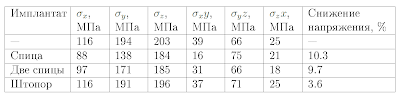
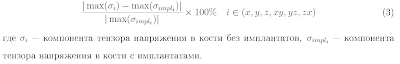

<!--
{
  "draft": false,
  "tags": ["Программирование"]
}
-->

# Пример статьи (Название Статьи)

```blogEnginePageDate
24 сентября 2011
```

В этой статья рассказывается о тех командах и фокусах, которые пригодились мне для написания диплома. Поскольку иногда
удобнее изучать что-либо на примере, сразу привожу пример моего Ссылка
на [диплом](http://code.google.com/p/testlatex/downloads/detail?name=diploma.7z&can=2&q=#makechanges) (но только
несущественную по смыслу часть). А так он
выглядит [после конвертации в pdf](https://docs.google.com/viewer?a=v&pid=explorer&chrome=true&srcid=0B79AZKsPFMqjZjBmZTQ4ODYtMDc1OC00MzMwLWJkMWItMjVlMmY5MjQ1ZjI0&hl=ru).

> Начнем с самого начала, хотя порядок может быть и другим.
> Доктор Who, Meglos

## Установка

Скачиваем [LaTeX](http://miktex.org/). При установки разрешаем скачивать дополнительные файлы из интернета, т.к. в
последующем при подключении разных модулей для форматирования текста, потребуется докачка файлов.

## Полезные ссылки

* Ссылка не небольшой [справочник](http://latex.tostudents.ru/files/2009/11/Text_in_LaTeX.pdf).
* При наборе формул может помочь [редактор формул](http://latex.tostudents.ru/files/2009/11/Text_in_LaTeX.pdf).

## оздание документа

Набирать диплом в стандартной оболочке Miktex не очень удобно, т.к. у него есть маленькие проблемы с русским языком.
Вместо этого я набирал диплом в Notepad++, в котором также есть поддержка синтаксиса LaTeX.

Теперь определимся с иерархией файлов для документа. Я использовал следующую структуру:

* main.tex - главный файл, в котором содержится подключение различных модулей и файлов диплома;
* остальные *.tex содержат текст документа и команды (например chapterX.tex - содержит главу X, introduction.tex -
  введение, bible.tex - список литературы);
* в папке img содержаться все рисунки.

Несколько простых команд для начала:

`\documentclass[a4paper,12pt]{article}` - определяем тип бумаги A4, размер шрифта 12pt, стандартный класс документа
article, для которого предопределен форматирование документа (следующие команды переопределяются формат некоторых частей
документа).

`\usepackage[left=3cm,right=1cm,top=2cm,bottom=2cm]{geometry}` - задаем отступы текста от границ листа.

`\usepackage[russian]{babel}` - подключаем возможность использования русского языка.

`\begin{document} ... \end{document}` - между этими командами можно писать текст и пользоваться командами
форматирования.

В своём дипломе я решил вынести текст и команды форматирования в отдельный файлы:

```
// main.tex
......
\begin{document} 
  ......
  \tableofcontents 
  \clearpage
  \input{referat.tex}
  \clearpage 
  ......
\end{document}
```

`\clearpage` - разрыв страницы.

`\tableofcontents` - содержание документа, в качестве элементов содержания используется нумерованные заголовки, которые
задаются командами \section{}, \subsection{}, \subsubsection{}.

`\section{Заголовок}` - форматирование текста как заголовок с нумерацией (в LaTeX у многих команд есть внутренний
счетчик, который увеличивается при повторении команды), если нумерация не нужна, то можно воспользоваться \section*
{Заголовок}.

`\input{referat.tex}` - выполнение команд из файла.

Ненумерованный список реализуется следующим образом

```
\begin{itemize}
\item 33\% женщин и более 17\% мужчин, которые доживут до 90 лет,
перенесут перелом бедра\footnote[1]{Melton III LJ , 1993};
\item лечение 75\% переломов не удовлетворительно;
\item кость после перелома невозможно восстановить до первоначальной прочности;
\end{itemize}
```

`%` - все что идет после этого символа и до перехода на новый строку считается комментарием.

`\` - экранирует спец символы и команды, например \% позволит вывести "%".

`\footnote[1]{Текст}` - сноска, в качестве номера используется текст из [], иначе нумерация идет сквозная через весь
документ

`\begin{enumerate} ... \end{enumerate}` - использование enumerate вместо itemize позволяет вывести нумерованный список.
Если необходимо использовать нумерацию типа "1)" вместо "1.", то можно задать свою нумерацию следующим образом

```
\begin{enumerate}
\item[1)] слизистый;
\item[2)] красный или лимфоидный;
\item[3)] желтый или жировой.
\end{enumerate}
```

Если в тексте присутствует рисунок, то стоит подключить модули

```
\usepackage{graphicx}
\usepackage{graphics}
\usepackage{float}
```

Рисунок выводится при помощи команд

```
\begin{figure}[H]
\centering
\includegraphics[scale=1.0]{img/bm2.png}
\caption{Основные отделы бедренной кости}
\label{ris1_1}
\end{figure}
```

Все команды предельно понятны за исключением опции [H]. Не моими словами опцию можно объяснить так (оригинал):

* `[h]` "хотелось бы картинку здесь"
* `[h!]` "очень хочу картинку здесь"
* `[H]` "ХОЧУ картинку здесь и баста"

Для того чтобы в подписе к рисунку стояла "." нужно в преамбуле дописать

```
\usepackage{ccaption}
\usepackage{topcapt}
\captiondelim{. }
```

`\label{Текст}` - позволяет сделать метку, к которой замет можно обратиться в тексте.

`\ref{Текст}` - возвращает порядковый номер таблицы или рисунка, для которого была сделана метка \label{} (например
можно использовать так рис.~\ref{surfs}).

Вывод таблицы:

```
\begin{table}[h]
\centering
\begin{tabular}{ |p{2cm}|p{1cm}|p{1cm}|p{1cm}|p{1cm}|p{1cm}|p{1cm}|p{3cm}| }
\hline
Имплантат & $\sigma_x$, МПа & $\sigma_y$, МПа & $\sigma_z$, МПа & $\sigma_xy$, МПа &
$\sigma_yz$, МПа & $\sigma_zx$, МПа & Снижение напряжения, \% \\ \hline
--- & 116 & 194 & 203 & 39 & 66 & 25 & --- \\ \hline
Спица & 88 & 138 & 184 & 16 & 75 & 21 & 10.3 \\ \hline
Две спицы & 97 & 171 & 185 & 31 & 66 & 18 & 9.7 \\ \hline
Штопор & 116 & 191 & 196 & 37 & 71 & 25 & 3.6 \\ \hline
\end{tabular}
\label{t1}
\end{table}
```

При выполнении этого кода увидим такую таблицу



Вывод формулы можно организовать так

```
\begin{equation}
\frac{|\max(\sigma_i)-\max(\sigma_{impl_{i}})|}
{|\max(\sigma_{impl_{i}})|}\times 100\%~~~i
\in (x,y,z,xy,yz,zx)
\end{equation}
```

где `$\sigma_i$` --- компонента тензора напряжения в кости без имплантатов,

`$\sigma_{impl_{i}}$` --- компонента тензора напряжения в кости с имплантатами.

Выглядит формула следующим образом



Основные команды:

`$\sigma$` - позволяет использовать математическое форматирование в тексте без заключения выражения в конструкцию
\begin{equation} ... \end{equation}

`\sigma_i` - нижний индекс "_i"

`"~"` - не разрывный пробел (перенос на следующую строчку происходит вместе с правым и левым словом, относительно
пробела). В данном же случае используется как несколько обязательных пробелов.

`\usepackage{amsmath}` - этот модуль нужно подключить для работы с математическими формулами

`\times` - знак умножения

`\frac` - дробь

> При наборе формул может помочь редактор [формул](http://latex.tostudents.ru/files/2009/11/Text_in_LaTeX.pdf).

В конце диплома обязательно должен присутствовать список используемой литературы. Его оформить можно с
помощью [BibTeX](http://ru.wikipedia.org/wiki/BibTeX), однако для этого нужно дополнительно установить некоторые
программы. В своем дипломе я решил использовать более старый подход.

```
\addcontentsline{toc}{section}{Список используемой литературы}
\begin{thebibliography}{}
\bibitem[1]{b_1}
Минасов Б.Ш., Ханин М.Ю., Якупов Р.Р., Минасов Т.Б. Результаты стендовых испытаний
системы кость-имплантат-кость в условиях стандартного остеосинтеза при переломах
проксимального отдела бедра // Казанский медицинский журнал, 2010. \No1. С.~40--44.
```

`\cite{b_4}` - ссылка на литературу в тексте диплома
`\addto\captionsrussian{\def\refname{Список используемой литературы}}` - переименование названия списка литературы на "
Список используемой литературы"

Код программы нужно оформлять в конструкции `\begin{verbatim} ... \end{verbatim}`

```
\begin{verbatim}
def main():
...
f.write('CSYS,0\n')
f.write('WPCSYS,-1,0')
f.write('\n')
f.close()
...
main()
\end{verbatim}
```

`\tolerance=10000` - коэффициент, который определяет когда слова нужно переносить на новую строку. Мне подошло значение
10000.

`\linespread{1.5}` - полуторный интервал

`\usepackage{indentfirst}` - первый абзац будет начинаться с красной строки

`\setlength{\parindent}{1cm}` - установка размера отступа для красной строки Изменение обозначений в параграфах, пунктах
и подпунктах:

```
\makeatletter
\renewcommand{\@biblabel}[1]{#1.}
\renewcommand \thesection {\@arabic\c@section.}
\renewcommand\thesubsection {\thesection\@arabic\c@subsection.}
\renewcommand\thesubsubsection {\thesubsection\@arabic\c@subsubsection.}
```

Возможность использования своего собственного счетчика

```
\makeatother
\newcounter{N}
```

И в конце еще раз ссылка
на [исходный код](http://code.google.com/p/testlatex/downloads/detail?name=diploma.7z&can=2&q=#makechanges). Удачи в
написании дипломов, курсовых и др.


