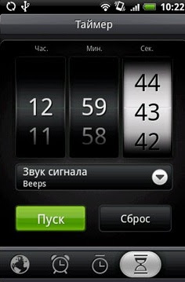
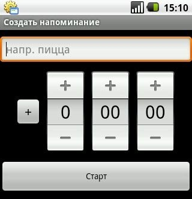

<!--
{
  "draft": false,
  "tags": ["Программирование"]
}
-->

# Концепт набора времени для смартфонов

```blogEnginePageDate
18 июня 2011
```

Многие, наверно, знают как выглядит контрол для набора времени в htc sense



На мой субъективный взляд htc sense позволяет быстрее выбирать время, чем стандартный контрол для android



Но мне кажется можно сделать контрол, который позволит еще быстрее выбирать время (по крайней мере 'эффективнее, чем стандартный контрол). Поэтому представляю свой концепт набора времени.
Концепт написан на html+js+css. исходный код можно взять [здесь](MyTime.7z).


