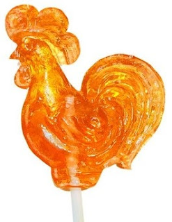
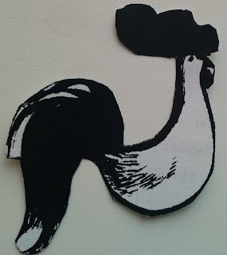
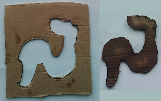
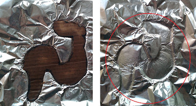
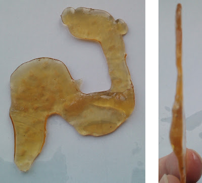

<!--
{
  "draft": false,
  "tags": ["Другое"]
}
-->

# Метод создания форм для конфеты "Петушок"

```blogEnginePageDate
16 мая 2011
```

Как-то захотелось поесть конфету "Петушок", давно уже не видел их в продаже, везде сплошной чупа-чупс. Для тех кто не в
теме Петушок состоит из вареного сахара и воды (рецепт можно найти например здесь), а выглядит он так:



Готовить Петушок на ложке это не интересно, а результат не столь красивый. Поискав формы в интернете по магазинам, я с
удивление отметил, что форм нет. Немного расстроившись решил почитать форумы. После
прочтения [этого ресурса](http://www.diforum.ru/index.php?showtopic=13979) идея конфеты, именно в форме петуха, меня
захватила.

Т.к. форм у меня не было пришлось выкручиваться и тогда я решил сделать slim-петушок. Для этого нам понадобиться:

1. Ножницы
2. Картон
3. Бумага

Для начала скачаем силуэт петуха из инета (причем можно выбрать любую другую фигуру), у меня он выглядит так:



Теперь вырежем из картона фигуру петуха, получим:



Далее нам понадобиться фольга, которую, в отличие от форм, легко купить в магазине. Положим ее на картон с отверстием в
виде петуха и прижмем картонкой в виде петуха:



Хотя ширина картонки довольно малая, кофета получится за счет вязкости жидкости вареного сахара, шире чем глубина
вогнутости в фольге. Не забудьте смазать форму маслом, чтобы можно было без проблем вытащить конфету из фольги.

Теперь дело за вами - готовьте жидкость из вареного сахара и заливайте.

Итак, данный метод позволяет реализовывать любые формы для конфеты Петушок. Проблема в основном возникает с
выдерживанием рецепта, с этим к сожалению у меня не так гладко.

Первый экземпляр у меня получился лучше, чем приведенный на рисунке, но сделать фото я не успел, т.к. он был съеден. А
второй экземпляр выглядит так:




