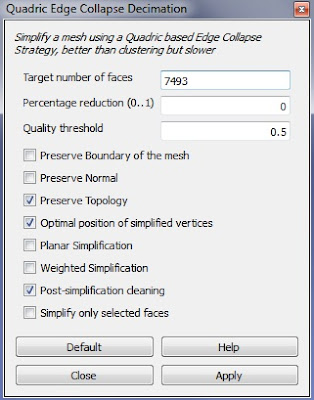

<!--
{
  "draft": false,
  "tags": ["Другое"]
}
-->

# Упрощение 3D модели

```blogEnginePageDate
18 августа 2011
```

Если необходимо провести упрощение 3D модели, в частности уменьшить количество узлов и поверхностей тела, то возможно
пригодиться программа [MeshLab](http://meshlab.sourceforge.net/).

В данной программе присутствует множество различных фильтров, однако в них можно и запутаться (как это произошло со
мной). Для моей цели необходимо было упростить модель примерно в 15000 узлов до 3000. Затем набор точек преобразовывался
с помощью небольшой программы на Python из формата *.wrl в команды понятные ANSYS. К сожалению не все фильтры из MeshLab
упрощают модель, и еще меньше фильтров позволяют не поломать топологию (из-за чего ANSYS не может построить объемную
модель из поверхностей).

Quadric Edge Collapse Decimation - один из фильтров, который позволяет упростить модель без нарушения топологии. Он
находиться в Filters \ Remeshing, simplification and reconstruction \ Quadric Edge Collapse Decimation.

Настройки фильтра показаны на рисунке ниже



> Для последовательного применения фильтра необходимо закрыть и снова открыть фильтр.


