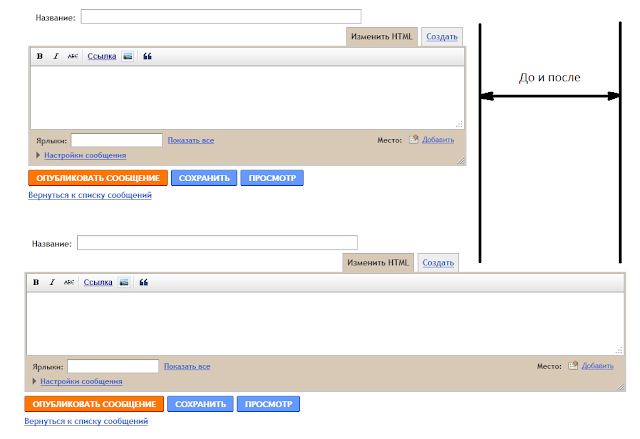

<!--
{
  "draft": false,
  "tags": ["Программирование"]
}
-->

# Пример статьи (Название Статьи)

```blogEnginePageDate
01 августа 2011
```

Когда пишешь новый пост, по появляется довольно узкое окно ввода. Почему оно не расширяется мне не понятно, а так как я
недавно начал писать большой пост - узкое окно просто не приемлемо для меня. В связи с этим я решил
написать [плагин для FF](https://addons.mozilla.org/ru/firefox/addon/google-blogger-expand-posti/), что бы окно было
шире. Прощу прощения за ошибки в коде/архитектуре плагина, т.к. это мой первый плагин, на данный момент в большей
степени пробный экземпляр нежели готовый продукт. Результат же выглядит следующим образом



Изменения размера формы происходит благодаря коду (overlay.js, подробности можно посмотреть в [предыдущем посте](../Минимализация%20плагина%20для%20FF/index.md) о том как
создавать плагины для FF):

```js
var gbepfw = {
    onLoad: function () {
        var appcontent = document.getElementById("appcontent");
        if (appcontent)
            appcontent.addEventListener("DOMContentLoaded", gbepfw.onPageLoad, true);
    },
    getFirstDivByClass: function (theClass, doc) {
        var allHTMLTags = doc.getElementsByTagName("div");
        for (i = 0; i < allHTMLTags.length; i++)
            if (allHTMLTags[i].className == theClass)
                return allHTMLTags[i];
    },
    onPageLoad: function (aEvent) {
        //TODO - check url on http://www.blogger.com/post-edit.g
        var doc = aEvent.originalTarget; // doc - документ, на котором произошло событие "onload"
        doc.getElementById("postingHtmlBox").style.width = "100%";
        gbepfw.getFirstDivByClass("main", doc).style.width = gbepfw.getClientWidth(0.9, doc) + "px";
    },
    getClientWidth: function (koef, doc) {
        var width = 1000;
        if (window.innerWidth)
            width = window.innerWidth;
        else if (doc.documentElement && doc.documentElement.clientWidth)
            width = doc.documentElement.clientWidth;
        else if (doc.body && doc.body.clientWidth)
            width = doc.body.clientWidth;
        width *= koef;
        return width;
    }
};
window.addEventListener("load", function () {
    gbepfw.onLoad();
}, false);
```

Описание функций:
* `getClientWidth()` - вычисляет размер окна;
* `getFirstDivByClass()` - ищет первый "div" (он единственный) с css-классом "main" ;
* `onLoad()` - точка входа;
* `onPageLoad()` - применяем новые стилевые свойства для "div" с css-классом "main" и элемента с id "postingHtmlBox".

