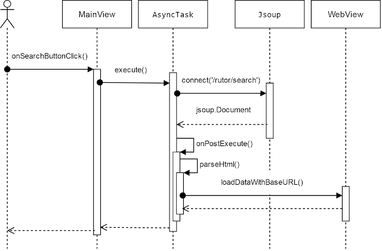
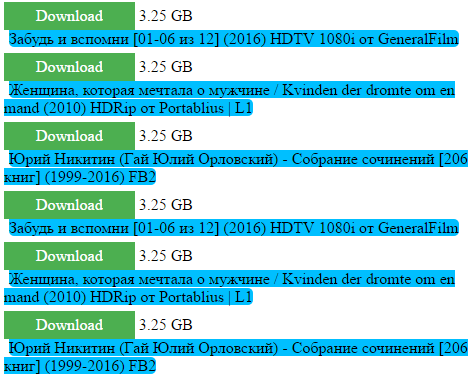

<!--
{
  "draft": false,
  "tags": ["Программирование"]
}
-->

# Rutor Parser

```blogEnginePageDate
25 октября 2016
```

В интернете часто ходят слухи, что можно легко зарабатывать на мобильных приложениях. Где-то я видел статистику 100$ за
10 000 активных пользователей. Вот я и решил попробовать написать приложение, тем более что, наконец, нашлась
нереализованная, на мой взгляд, идея, причем нужная мне самому.

Скачать [Rutor Parser](https://play.google.com/store/apps/details?id=andr.nodomain.stswoon.rutorparser)

### Идея

Я иногда скачивают торренты на мобильный телефон, но заходить на сайт и пытаться там попасть в магнет-ссылку, а еще
надоедливая реклама. Я залез в google play но там не было удобных приложения для rutor и rutracker (для rutracker
появились некоторое время назад удобные приложения). Поэтому я решил написать такое приложение – парсер формы поиска
rutor с большими кнопками для скачки. Естественно для самого скачивания нужно пользоваться торрент-клиентами типа Flud,
utorrent и др.

### Девелопмент

Разработка была сделана по принципу – быстро вывести проект на рынок, т.к. если гнаться за прекрасным, с точки зрения
инженера, то можно надолго засеть за кодингом, а ведь еще есть работа\семья\отдых.



Пользователь нажимает на кнопку поиска. Загружаем html через библиотеку Jsoup. Запрос происходт на урл search для rutor
с сортировкой по убыванию сидов. Делаем это в отдельном треде, чтобы не лочился экран (требование гугла). Далее парсим
html – выкусываем магнет-ссылки и описание. Затем результат кладем в WebView. Причем результат оформлен в виде простой
верстки. Благодаря WebView магнет-ссылки положенные в тег <a> отлично распознаются сторонней программой торрент-клиентом
и после нажатия на ссылку открывается программа с запросом на скачивание.



Подробнее см. исходный код (код несколько
устарел) – [здесь](https://drive.google.com/open?id=0B79AZKsPFMqjTnptSDZSTzZzSzg).

Все технические вопросы легко решались поиском в интернете. Единственно, что не очень понятно это описание как сделать
приложение signed и подключить рекламу – пришлось внимательно читать, что написано.

Перечислю некоторые сложности и их решения.

1. Обычно для того чтобы отобразить html используется WebView#loadData, но это метод не понимает русский язык, поэтому
   нужно пользоваться WebView#loadDataWithBaseURL(null, html, "text/html", "UTF-8", null);
2. Чтобы получить русский язык из EditText нужно делать такой финт String searchText = new String(
   searchEditText.getText().toString().getBytes(), "UTF-8");
3. Компиляция программы вызывала ошибку, когда я пытался анализировать DOM-дерево в главном треде. Решение простое –
   использовать AsyncTask
4. Прежде чем выложить приложение его нужно подписать иначе google play его не позволить выложить. Решение этой проблемы
   можно прочитать [здесь](http://developer.alexanderklimov.ru/android/publish.php).
5. Выкладывание приложения происходит не мгновенно - решение - просто нужно подождать. Обычно в течение часа, но на
   выходных у меня было ожидание 1 день.

### Литература

* https://developer.android.com/reference/android/webkit/WebView.html
* http://stackoverflow.com/questions/2116162/how-to-display-html-in-textview
* http://developer.alexanderklimov.ru/android/library/jsoup.php
* https://developer.android.com/reference/android/content/Intent.html#Intent()
* http://stackoverflow.com/questions/2201917/how-can-i-open-a-url-in-androids-web-browser-from-my-application
* https://developer.android.com/reference/javax/xml/parsers/DocumentBuilder.html
* https://habrahabr.ru/sandbox/93869/
* http://developer.alexanderklimov.ru/android/publish.php (выкладывание приложения)

### Цифры

Я потратил суммарно 16mh (man hour):

* 1h – дизаин
* 7h – билд
* 3h – регистрация на сервиса google
* 2h – на написание этой статьи
* 3h – багофикс по фидбеку от коллег\друзей + ожидание из-за не многовенной публикации на google play

### Планы

Есть много планов на добавление новой функциональности: поддержки топ вкладки, rutracker, планшетного режима;
рефакторинг кода. Ну и проверить, сколько субективно для меня дает заработать реклама от google. И конечно жду вашего
фидбека.


