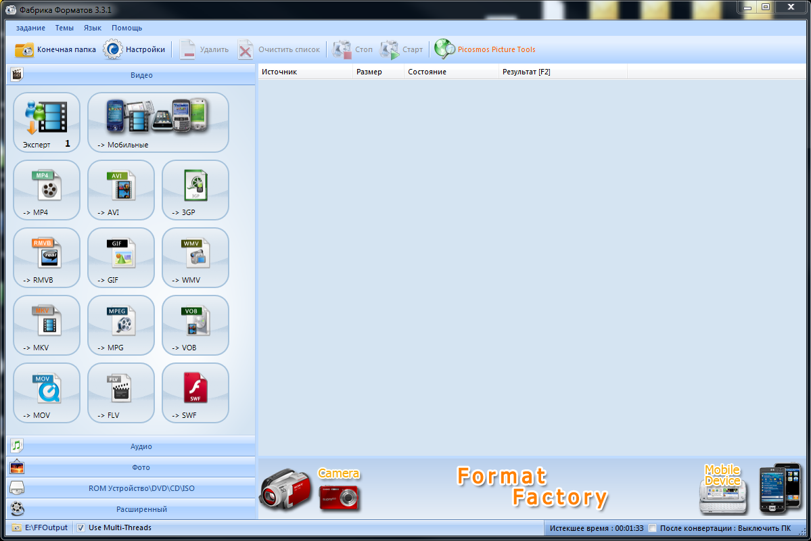

<!--
{
  "draft": false,
  "tags": ["Другое"]
}
-->

# Как сделать бесплатный screencast

```blogEnginePageDate
05 августа 2016
```

Если вы захотите записать screencast то можете столкнуться с проблемой, что многие бесплатные программы: добавляют
водяные знаки, не дают записывать больше N минут, при записи происходит рассинхрон звука и видео. Пройдя через более 15
программ я вынес для себя следующий процесс записи screencast’а. Для начала запишем видео. Для этого
воспользуемся [Free Screen Video Recorder](http://www.dvdvideosoft.com/ru/products/dvd/Free-Screen-Video-Recorder.htm)


Здесь в опциях выберем наиболее качественную картинку и аудио. Лучше записывать в максимальном разрешении, т.к. если
записывать в 720p, то на 1080p экране видео будет смотреться не очень. Но даже в этой программе после 5 минут может
начаться рассинхрон.
Далее записанное видео нужно перегнать из mp4 в avi, т.к. следующим шагом будет использоваться Window Movie Maker, а он
плохо работает с mp4. Для конвертации воспользуется
программой [Any Video Converter](http://www.any-video-converter.com/products/for_video_free/).


Важная деталь – качество видео должно быть не меньше, чем в исходном файле, иначе качество картинки может значительно
упасть, даже при понижении на несколько битрейтов. Чтобы узнать битрейт нужно посмотреть свойства видео файла.


Далее видео нужно закинуть в [Movie Maker](https://support.microsoft.com/ru-ru/help/14220/windows-movie-maker-download).
Тут можно нарезать и склеить видео, добавить эффекты, фото и музыку. При
склейке видео стоит увеличить звук на максимум, т.к. обычно звук от стандартного микрофона не очень громкий.


Затем сохраним видео.


Для этого выбере создание своих параметров видео. Но не забывайте, что нужно использовать оригинальные зарактеристика
размера картинки и не меньший битрейт.


Следующий шаг можно пропустить, но у меня как выяснилось, что на большинстве наушников был тихий звук. Для решения этой
проблемы воспользуемся [Format Factory](http://format-factory.net/).



Для повышения звуку выберите +12dB в настройках.


Нужно обязательно сделать конвертацию в mp4 с видео кодеком H264 и аудио MP3\ACC, т.к. в противном случае могут быть
проблемы при выкладывании видео в тег `<video>`, если же вы выкладываете видео в видео сервис типа youtube, то в них есть
встроенные конверторы, которые смогут распознать большинство распространённых видео.
И в заключении можете выложить видео к себе на сайт, например при помощи тега [video](https://webref.ru/html/video):

```html

<video width="600" controls="controls">
    <source src="video.mp4">
</video>
```


