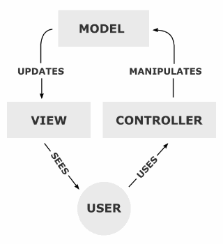
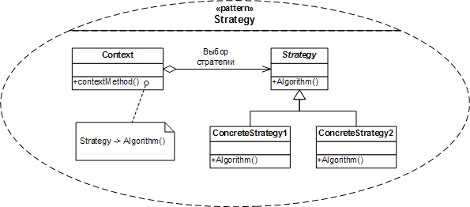
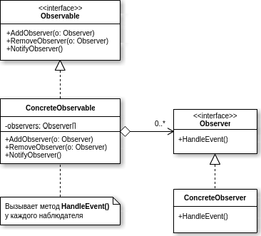

<!--
{
  "draft": false,
  "tags": ["Программирование"]
}
-->

# Мои вопросы для собеседования

```blogEnginePageDate
01 сентября 2016
```

Как то раз пришлось вести собеседования и я решил подготовить для себя список вопросов, точнее ответов, чтобы не сесть в
лужу. Вот что получилось. Заранее скажу не претендую на "правильность" вопросов, т.к. я не профессиональный
собеседователь.

## General

So you are going to work for us?

## Spring

**Will it work or not?**

```java

@Controller
class MySpringBean {
    @Autowire
    MyAnotherBean field;
}

@Controller
class MyAnotherBeanA extends MyAnotherBean {
}

@Controller
class MyAnotherBeanB extends MyAnotherBean {
}
```

**Ways to handle exception without try-catch**

```java

@Service
class MySevice {
    @ExceptionHandler(RuntimeException.class)
    void handle() {
    }
}

@Controller
class EH implements HandlerExceptionResolver {
    resolveEx() {
    }
}

@ControllerAdvice
class GlobalEh {
    @ExeptionHandler()
    resolveEx() {
    }
}

@Controller
class EHInterceptor implements HandlerInterceptor {
}
```

**Null view**

```java
class MyController implements Controller {
    ModelAndView handlerequest(req, res) {
        return null;
    }
}
```

Also ask what spring will do if we return normal ModelAndView – it will resolve view and put data to response

## Java

* == VS equals
* String s1 = “a1”, s2=”a2”; s1==s2
* Object o1 = null; o2 = new SomeClass(); o1.equals(o2), o1==o2; o2=null, o1==o2//true
* Sort array
* Public MyClass {void make(){}} – what visibility level does method have without any access modifiers?
* Find max in array - O(?)
* HashMap#get – O(?) //O(1) – O(n)
* Class MyR implements Runnable {}
* (new MyR()).run() VS (new Thread(new MyR())).start()
* SPI (Service provide interface)? //loader = ServiceLoader(MyClass.class); loader.iterator()
* Stateful VS stateless

## Servlet/JSP

* Servlet VS Jsp
* 1xx, 2xx, 3xx, 4xx, 5xx http codes?
* What does browser do with 302 code? //Location
* GET VS POST? Else? //PUT, DELETE

**Servlet registration**

```
<servlet>
    <servlet-name>register</servlet-name>
    <servlet-class>…</servlet-class>
</servlet>
<servlet-mapping>
    <servlet-name>register</servlet-name>
    <url-pattern>/blue/</ url-pattern>
</servlet-mapping>
```

**Right way of catching exception in filter**

```java
class MyFilter implements Filter {
    void init() {
    }

    void doFilter(req, res, chain) throws ServletException {
        try {
            chain.doDilter(req, res)
        } catch (ServletException e) {
            throw e;
        } catch (Exception) {
            throw new ServletException(e);
        }
    }
}
```

**Order of filters**

```
<filterMapping/>
```

**Forward VS Redirect**

* Forward – on a server, servlet forward, same request to different URL without browser notification
* Redirect – via 302 using browser, new request is created so we cannot access to data from first request

## SQL

* Find max in table column
* Joins definition (eiler circles)
* Make join //select * from Person inner join City on Person.CityId = City.Id

## Html/Css

* Fixed VS absolute
* do we have these tags in html4?
* Link js only for ie? `<!—[if IE]>`
* Ccs hack for ie? .style{_background:#F00}
* Graceful degradation?
* Visibility:hidden VS display:none //not occupy space

## JS

* ‘use strint’; x = 5; //error in ff44, chrome48, ie10
* == VS ===
* sourceMaps
* private method in JS
  ```js
  (function() {
    function my() {
      alert(‘hello’);
    }
    window.myAPI = my;
  })(); //js closure
  ```
* Show alert with vertical scroll value
  ```js
  var timeout
  function my_scroll() {
    clearTimeout(timeout)
    timeout = setTimeout(function() {
      alert(document.body.scrollTop);
    }, 500);
  }
  ```
* Write program with text and button on button click the text should appear
* localStorage? //setItem
* XSS/ CSRF protection way //recheck your knowledge
* Cross domain ajax call? //yes if server provide x-domain or proxy

## GWT

* Access to js
  ```java
  static native void method() /*-{
    $wnd.alert(‘q’);
  }-*/;
  ```
* EventBus
* Can we use 2 super dev mode simultaneously //-codeServerPort 9901
* Simple task to write panel, label, button and click on button
* UIBinder
* If we have a lot of data what type of widget should we use //Cell Tablem cell widget
* GWT.create(MyInterface.class) what we need to do to create interface?

## JQuery

* `<div class=’somename’/> //$(‘.somename’);`
* `<div class=’some.name’/>  //$(‘.some\\.name’);`
* $(selector).toogle();
* .position() VS .offset() //relative to parent, to document

## Patterns

**MVC**



MVC is complex pattern. It consists from Observer (Model notifies View) and Strategy (View chooses Controller)

**Strategy**



**Observer**



**Singleton**

Complex variant:

```java
public class Singelton {
    private static Singelton INSTANCE = null;

    public static Singelton getSingelton() {
        if (INSTANCE == null) {
            synchronized (INSTANCE) {
                if (INSTANCE == null) {
                    INSTANCE = new Singelton();
                }
            }
        }
        return INSTANCE;
    }
}
```