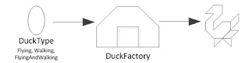

<!--
{
  "draft": false,
  "tags": ["Программирование"]
}
-->

# Компонента Angular \ Angular2

```blogEnginePageDate
17 августа 2017
```

В этой статье больше шутки нежели полезной информацией. Под влиянием
книги [Head First Design Patterns](http://shop.oreilly.com/product/9780596007126.do) я когда-то давно
нарисовал такую картинку.


Слева мы видим типичное наследование и проблему двойного наследования когда хотим реализовать в одном классе два поведения.
А справа наследование от абстрактного класса и реализация интерфейсов. В этом случае нам конечно придется писать под для каждого интерфейса, зато это провоцирует нас писать классы с одной обязанностью как и ожидает от нас один из пунктов принципа SOLID.

А под конец картинка про фабрику

