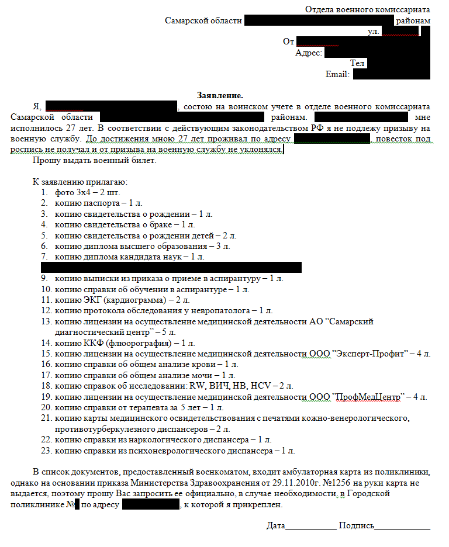
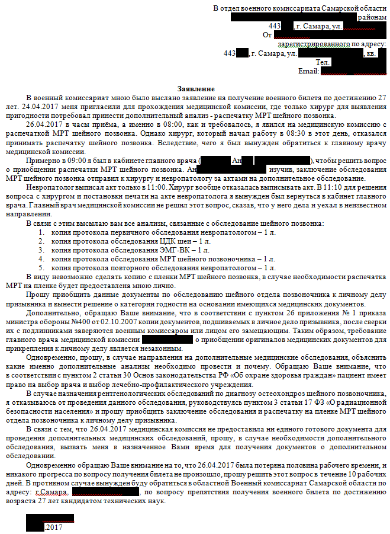

<!--
{
  "draft": false,
  "tags": ["Другое"]
}
-->

# Как получить военник

```blogEnginePageDate
15 июня 2017
```

Решил я получить законный военник, но не тут то было...

## Введение

Я учился в аспирантуре, она закончилась когда мне было 25 лет, однако кандидатскую получил только в 28 лет. Призывной
возраст заканчивается в 27 лет. Я подождал кандидатскую и после ее получения решил получить военник. Отмечу, что вроде
бы, у меня были законные отсрочки, а именно в промежуток 25-27 лет у меня родился сын (там дается какая-то отсрочка
около 3 месяцев до и после рождения), а также я прикреплялся на пару месяцев к другой аспирантуре (повторное обучение
вроде тоже дает отсрочку).

## Иду в военкомат на разведку

Для начала надо было выяснить что нужно сделать чтобы начать процесс получения военника. Пришел я в военкоммат меня
отправили то туда то сюда, говорили типа кто ты такой, мы не знаем что делать с тобой, ты уже не призывник, не можем
тебе дать военник и вообще иди отсюда.

Весело подумал я, но кое как я выяснил что нужно принести справки и документы о себе, мне дали такие листочки где было
написан список документов:

1. фото 3х4 – 2 шт.
2. паспорт
3. свидетельство о рождении
4. свидетельство о браке
5. свидетельство о рождении детей
6. диплом высшего образования

Очевидно к ним прибавляются справки о том что я учился в аспирантуре с указанием срока и диплом кандидатской.

Также дали лист для прохождения медицинской комиссии формата A4, чтобы пройти диспансеры и анализы:

1. ЭКГ (кардиограмма) с расшифровкой
2. ККФ (флюорография)
3. справка об общем анализе крови
4. справка об общем анализе мочи
5. справка об исследовании: RW, ВИЧ, НВ, HCV
6. справка от терапевта за 5 лет
7. справка из кожно-венерологического диспансера
8. справка из противотурберкулезного диспансера
9. справка из наркологического диспансера
10. справка из психоневрологического диспансера
11. карточка из поликлиники

Небольшое отступление - военкомат для выдачи билета должен сделать бюрократическую процедуру: 1) провести медкомисиию
для установления годности; 2) провести комиссии которая решает давать билет или справку "уклониста" или забирать в
армию; 3) выдать документ или забрать в армию.

## Готовлю анализы

Итак я решил подождать начала весеннего призыва чтобы было полегче и начал собирать анализы.

Отмечу что "справка от терапевта за 5 лет" берется в поликлинике где вы прикреплены. В моем случае я там не появлялся
очень долго, поэтому было написано медицинскими терминами фраза "за 5 лет ничем не болел". На ней ставится печать врача.

А вот "карточку из поликлиники" мне не дали сказали что на руки не выдается (приказ Министерства Здравоохранения от
29.11.2010г. №1256)

Диспансеры пришлось объезжать самому. Здесь самое проблемное это наркодиспансер, где нужно ждать 2 недели, а кожвен дает
справку сроком действия на 3 недели.

Если кому нужно то для советского района в Самаре, т.к. чтобы их найти пришлось покапаться в инете, позвонить и еще
поездить, т.к. иногда перенеправляли

* нарк - Партизанская, 130
* кожвен - Революционная 138, но для военкомата надо ехать кажется на Степана Разина, 53
* псих - 22 Партсъезда 12
* противотуберкулез (возьмите с собой марлевую повязку на лицо) - Революционная 66

А вот остальные анализы я сделал в платных клинниках, это разрешено законом, главное взять у низ лицензии (хотя мне они
не пригодились).

Если кому-то пригодится то в Самаре анализы можно сдавать в **ПрофМедЦентр** для военкоммата, Эксперт-Профит здесь я
сдавал только флюрографию, т.к. они сказали что военкоммат постоянно придирается к ним, зато там можно на права все
анализы сдать в обном месте. Самарский диагностический центр - здесь я делал ЭКГ с расшифровкой.

Обязательно берите везде листок медицинской комиссии формата A4, т.к. большинство диспансеров ставят туда печати.

## Отправка документов

Я долго думал стоит отнести документы самому или как я прочитал в ините можно отправить письмом. Но теперь я точно знаю
ВСЕ ДЕЛА С ВОЕНКОММАТОМ НАДО ВЕСТИ ЧЕРЕЗ ПОЧТУ РОССИИ ЧЕРЕЗ ЗАКАЗНЫЕ ПИСЬМА С УВЕДОМЛЕНИЕМ.

Я решил отправить через почту и это мне помогло. Итак делаем копии всех документов. Пишем заявление вида (тут же есть
ссылка на закон про карточку)



И отправляем почтой России заказным письмом с письменным уведомлением, т.к. если что это уведомление от почты России
будет доказательством в суде.

Тут сделаю отступления про почту - у них даже уведомлений не было! Поэтому если кому нужно конверты и уведомления
заполняем и печатаем через сервисы;

* Уведомление о вручении ф 119 - http://formz.ru/forms/uvedomlenie/
* конверт C4 (для документов A4) - http://konvert-online.ru/

Через 1-2 недели мне позвонили и уже приятным голосом пригласили на прохождение комиссии.

## Мед комиссия

Почти прошел комиссию, только хирург завернул сказал принести рентген шеи, т.к. она у меня проблемная, а я принес только
заключение. Нашел в инете что подходит МРТ - пошел в туже больницу где я его делал и распечатал МРТ на пленке с диска.

Пришел пройти дальше и тут началось. Принимать снимок не будем. И вообще неси карточку с больницы. Кое как решил эти
вопросы с глав врачом, он отправил к хирургу выписать доп обследования (хотя они нафиг ни кому не нужны). А еще неси
оригиналы документов. Документ один чуть не потеряли. Выписывать обследование не захотели. Врач убежал. В общем бардак.
Позвонил по телефону в основной военкомат - ответили решайте сами.

## Попытка № 2

Я конечно расстроился, но подумав, успокоившись, решил мне уже больше 27 лет, а значит по закону они мне должны в любом
случае выдать документ, тем более что никаких доп обследований выписано не было, а значит они нарушают мои права. В
результате я написал заявление. В нем были следующие моменты

1. Отказ отдавать оригиналы, т.к. военкомат их часто теряет из моего опыта и из опыта знакомых и инета. Тем более по
   закону они обязаны принять копии.
2. Отказ от рентгена в пользу МРТ
3. Отказ от прохождения доп исследований, т.к. у меня и так полно исследований по шее, а если нужно то пусть скажут
   какие именно
4. Ну и в случае отсутствия реакции готовность идти в областной военкома (очевидно что дальше прокуратура)
   Пример заявления с ссылками на закон:



Также я отправил копию военкому на всякий случай.

Через неделю они мне перезвонили сказали, что зачем выносить сор из избы, надо было сразу позвонить (хотя я им звонил и
они ответили решай сам). В общем опять вызвали на комиссию, стали называть меня жалобщиком и раза три переспросили что я
хочу от них. Но потихоньку все же приняли копии документов.
Потом дождался главного человека по комиссии, она сама меня позвала спросила есть ли проблемы, к этому времени все
проблемы были решены, хтя елси бы не были она наверное бы решила, а может и нет - не знаю. В общем все решилось.

## Получение военника

Наконец еще через неделю пригласили придти забрать военник, именно военник, а не справку "уклониста".

## Выводы

* с военкоматом нужно говорить только официально, т.е. через почту россии, все что не задокументировано будет
  использовано против вас
* отдавать только копии документов
* даже законный военник очень сложно получить

## Литература

Здесь приведены ссылки на ресурсы где я искал законы и алгоритм как общаться с военкоматом.

* http://antiprizyv.narod.ru/pd/
* http://antiprizyv.narod.ru/vopros/
* [страница из книги из books.google.ru про военкомат](https://books.google.ru/books?id=MprVBQAAQBAJ&pg=PA77&lpg=PA77&dq=%D0%BA%D0%BE%D0%BF%D0%B8%D0%B8+%D0%B4%D0%BE%D0%BA%D1%83%D0%BC%D0%B5%D0%BD%D1%82%D0%BE%D0%B2,+%D0%BF%D0%BE%D0%B4%D1%88%D0%B8%D0%B2%D0%B0%D0%B5%D0%BC%D1%8B%D1%85+%D0%B2+%D0%BB%D0%B8%D1%87%D0%BD%D0%BE%D0%B5+%D0%B4%D0%B5%D0%BB%D0%BE+%D0%BF%D1%80%D0%B8%D0%B7%D1%8B%D0%B2%D0%BD%D0%B8%D0%BA%D0%B0,+%D0%BF%D0%BE%D1%81%D0%BB%D0%B5+%D1%81%D0%B2%D0%B5%D1%80%D0%BA%D0%B8+%D0%B8%D1%85+%D1%81+%D0%BF%D0%BE%D0%B4%D0%BB%D0%B8%D0%BD%D0%BD%D0%B8%D0%BA%D0%B0%D0%BC%D0%B8+%D0%B7%D0%B0%D0%B2%D0%B5%D1%80%D1%8F%D1%8E%D1%82%D1%81%D1%8F+%D0%B2%D0%BE%D0%B5%D0%BD%D0%BD%D1%8B%D0%BC+%D0%BA%D0%BE%D0%BC%D0%B8%D1%81%D1%81%D0%B0%D1%80%D0%BE%D0%BC+%D0%B8%D0%BB%D0%B8+%D0%BB%D0%B8%D1%86%D0%BE%D0%BC,+%D0%B5%D0%B3%D0%BE+%D0%B7%D0%B0%D0%BC%D0%B5%D1%89%D0%B0%D1%8E%D1%89%D0%B8%D0%BC.&source=bl&ots=_QlCke-oeQ&sig=W6iv5qG-H2KYb_JNtUA8rYlsOH8&hl=ru&sa=X&ved=0ahUKEwiJ5f7r9czTAhUCOJoKHQZjCHIQ6AEIMDAB#v=onepage&q&f=false)
* http://pravomer.info/forum/viewtopic.php?t=3804
