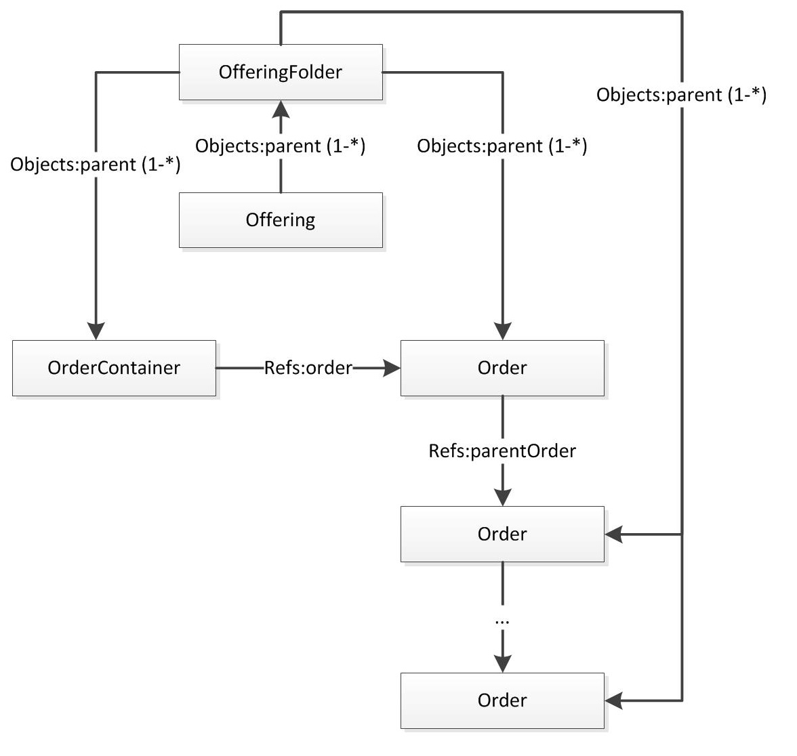

<!--
{
  "draft": false,
  "tags": ["Программирование"]
}
-->

# Мой самый сложный SQL запрос

```blogEnginePageDate
08 августа 2017
```

Я работу по большей части во фронтэнде на как-то раза два у меня была задача написать сложный SQL-запрос. В принципе
получилось довольно быстро при использовании интернет. Может кому и пригодиться.

## Задача 1 - посчитать количество ордеров определенного типа

```
DROP TABLE IF EXISTS Objects;
DROP TABLE IF EXISTS ObjectTypes;
DROP TABLE IF EXISTS Attrs;
DROP TABLE IF EXISTS Params;

CREATE TABLE Objects (id int, objectTypeId int, name varchar(30));
INSERT INTO Objects (id, objectTypeId, name) VALUES (1, 1, 'Order-Tv#1');
INSERT INTO Objects (id, objectTypeId, name) VALUES (2, 1, 'Order-Tv#2');
INSERT INTO Objects (id, objectTypeId, name) VALUES (3, 1, 'Order-Tv#3');
INSERT INTO Objects (id, objectTypeId, name) VALUES (4, 1, 'Order-Internet#1');
INSERT INTO Objects (id, objectTypeId, name) VALUES (5, 1, 'Order-Internet#2');
INSERT INTO Objects (id, objectTypeId, name) VALUES (6, 1, 'Order-Radio#1');

CREATE TABLE ObjectTypes (id int, name varchar(30));
INSERT INTO ObjectTypes (id, name) VALUES (1, 'order');

CREATE TABLE Attrs (id int, name varchar(30));
INSERT INTO Attrs (id, name) VALUES (1, 'not started');
INSERT INTO Attrs (id, name) VALUES (2, 'failed');
INSERT INTO Attrs (id, name) VALUES (3, 'success');

CREATE TABLE Params (objectId int, attrId int, val varchar(30));
INSERT INTO Params (objectId, attrId, val) VALUES (1, 1, '+');
INSERT INTO Params (objectId, attrId, val) VALUES (1, 2, '+');
INSERT INTO Params (objectId, attrId, val) VALUES (1, 3, '+');
INSERT INTO Params (objectId, attrId, val) VALUES (2, 1, '+');
INSERT INTO Params (objectId, attrId, val) VALUES (3, 2, '+');
INSERT INTO Params (objectId, attrId, val) VALUES (1, 3, '+');
INSERT INTO Params (objectId, attrId, val) VALUES (4, 1, '+');
INSERT INTO Params (objectId, attrId, val) VALUES (4, 4, '+');
INSERT INTO Params (objectId, attrId, val) VALUES (5, 1, '+');
INSERT INTO Params (objectId, attrId, val) VALUES (6, 1, '+');
INSERT INTO Params (objectId, attrId, val) VALUES (6, 2, '+');
INSERT INTO Params (objectId, attrId, val) VALUES (6, 4, '+');
```

```
SELECT t0."type", t1."failed", t2."success", t3."not started" FROM
        (
                SELECT name AS "type" FROM ObjectTypes WHERE id IN (1)
        ) AS t0
FULL OUTER JOIN
        (
                SELECT COUNT(*) as "failed" FROM Params, Objects WHERE
                Params.objectId IN (SELECT id FROM Objects WHERE objectTypeId IN (1))
                AND Params.attrId = 1
                AND Params.value = 'failed'
                AND Params.objectId = Objects.id
                GROUP BY objectTypeId
        ) as t1
ON t0.objectTypeId = t1.ObjectTypeId
FULL OUTER JOIN
        (
                SELECT COUNT(*) as "success" FROM Params, Objects WHERE
                Params.objectId IN (SELECT id FROM Objects WHERE objectTypeId IN (1))
                AND Params.attrId = 2
                AND Params.objectId = Objects.id
                GROUP BY objectTypeId
        ) as t2
ON t0.objectTypeId = t1.ObjectTypeId
FULL OUTER JOIN
        (
                SELECT COUNT(*) as "not started" FROM Params, Objects WHERE
                Params.objectId IN (SELECT id FROM Objects WHERE objectTypeId IN (1))
                AND Params.attrId = 3
                AND Params.objectId = Objects.id
                GROUP BY objectTypeId
        ) as t3
ON t0.objectTypeId = t1.ObjectTypeId;
```

Cначала находим все типа объектов в строке 55 и называем такую таблицу t0. Затем находим все объекты у которых тип это
Order, а атрибут используется номер 1 и записываем результат в t1 (строка 58-65). То же самое повторяем для всех типов и
затем склеиваем через JOIN. Конечно здесь есть не оптимальности типа копипаста t1-t3, но я же не SQL девелопер.

Отмечу, что запрос переписан и может не работать, т.к. я убирал всю специфику и чуть упростил запрос - убрал табличу и
уменьшил количество типов, а там запрос у меня занимал А4 шрифтом 10.

## Задача 2 - пробежаться по иерархии



Здесь задача посложнее нужно пробежаться по иерархии Order и найти все Offering, причем Offering из родительского Order
может быть заоверрайджен, тогда его показывать не нужно.

```
(
  /*compatibility - get Offerings FROM Order which are children for Order Container*/
  SELECT
    OrderOffering.id AS objectId,
    OrderOffering.name AS value
  FROM
    Objects OrderContainerOffering,
    Objects OrderContainerOfferingFolder,
    Refs OrderContainer2Order,
    Objects OrderOfferingFolder,
    Objects OrderOffering
  WHERE
    OrderContainerOffering.id IN (#$objectids$#)
    AND OrderContainerOfferingFolder.id = OrderContainerOffering.parentId
    AND OrderContainer2Order.objectId = OrderContainerOfferingFolder.parentId
    AND OrderContainer2Order.attrId = 1 /*order*/
    AND OrderOfferingFolder.parentId = OrderContainer2Order.objectRefId
    AND OrderOfferingFolder.typeId = OrderContainerOfferingFolder.typeId
    AND OrderOffering.parentId = OrderOfferingFolder.id
    AND OrderOffering.typeId = 1 /*offering*/
)
UNION
(
  /*get Offerings FROM Order hierarchy*/
  SELECT
    ParentOrderOffering.id AS objectId,
    ParentOrderOffering.name AS value
  FROM
    Objects OrderOffering,
    Objects OrderOfferingFolder,
    Objects ParentOrderOfferingFolder,
    Objects ParentOrderOffering
  WHERE
    OrderOffering.id IN (#$objectids$#)
    AND OrderOfferingFolder.id = OrderOffering.parentId
    AND ParentOrderOfferingFolder.parentId IN (
      /*get all parent Orders*/
      SELECT reference FROM Refs ref
      START WITH ref.objectId = OrderOfferingFolder.parentId
      /*OrderOfferingFolder.parentId: parent of Offering Folder
        is Order AND this is Order to start find parents FROM*/
      CONNECT BY PRIOR ref.objectRefId = ref.objectId 
      AND PRIOR ref.attrId = 2 /*parent order*/
    )
    AND ParentOrderOffering.parentId = ParentOrderOfferingFolder.id
    AND ParentOrderOffering.typeId = 1 /*offering*/
    AND ParentOrderOffering.id not IN (
      /*exclude Offerings which are already overrided - 
        only not overrided Offerings available for override*/
      SELECT reference FROM Refs WHERE attr_id = 3 /*ancestor offering*/
      AND objectId IN (
        /*SELECT Offerings which are set IN attr ancestor offering*/
                SELECT /*get offerings FROM order hierarchy*/
          ParentOrderOffering.id AS objectId
                FROM
          Objects OrderOffering,
          Objects OrderOfferingFolder,
          Objects ParentOrderOfferingFolder,
          Objects ParentOrderOffering
                WHERE
          OrderOffering.id IN (#$objectids$#)
          AND OrderOfferingFolder.id = OrderOffering.parentId
          AND ParentOrderOfferingFolder.parentId IN (
            /*get all parent orders*/
            SELECT reference FROM Refs ref
            START WITH ref.objectId = OrderOfferingFolder.parentId
            /*OrderOfferingFolder.parentId: parent of Offering folder 
              is Order AND this is Order to start find parents FROM*/
            CONNECT BY PRIOR ref.reference = ref.object_id 
            AND PRIOR ref.attr_id = 2 /*attr parent order*/
            UNION ALL
            SELECT id FROM Objects 
            WHERE id = OrderOfferingFolder.parentId /*plus current Order*/
          )
          AND ParentOrderOffering.parentId = ParentOrderOfferingFolder.id
          AND ParentOrderOffering.typeId = 1 /*offering*/
      )
    )
)
```

## Итог

* я познакомился с иерархическими запросами - START WITH
* первый раз использовал UNION
* наконец в боевых условиях использовал JOIN
* попрактиковался в сложных WHERE и GROUP BY
* использовал вложенные запросы
* сделал параметризацию запросов
* попробовал AS для именования

SQL не такой уж и сложный поначалу, хотя конечно чем дальше тем дремучей лес.