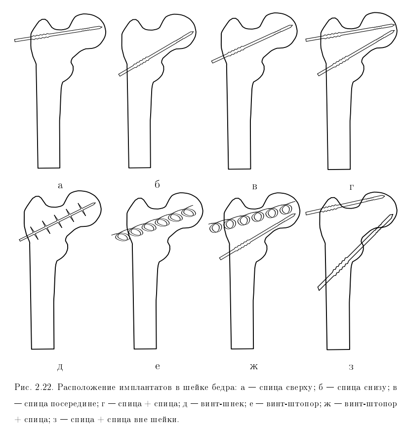

<!--
{
  "draft": false,
  "tags": ["Наука"]
}
-->

# Армирование бедра человека

```blogEnginePageDate
24 августа 2019
```

В университет занимался работой по превентивному армированию бедра человека. Бедро тяжело лечиться. Во многих случаях не
получается восстановить первоначальную прочность кости, это ведет к малоподвижному образу, а малоподвижный образ для
людей преклонного в течении 3 лет может привести к летальному исходу. Подробнее про актуальность проблемы можно почитать
в научных статьях. Поэтому было решено армировать кость превентивно, если по медицинским указаниям есть
предрасположенность к разрушению кости (остеопорозу).

В рамках научной моделировалось нагрузка при падении и хождении человека с и без кость. и было выявлено ряд улучшения.
Это только теоретическое исследование но возможно оно кому-нибудь пригодиться для более точного теоретического и
практического применения.



Что может быть полезным:

* 3d-модель
* механические характеристики кости
* схема нагрузок на кость
* программы для генерации ANSYS команд
* выводы расчетов

Диссертация - http://d21221703.samgtu.ru/sites/d21221703.samgtu.ru/files/nehozhin_dis.pdf
