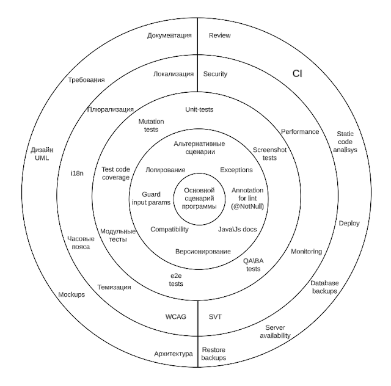

<!--
{
  "draft": false,
  "tags": ["Программирование"]
}
-->

# Круги Ада Разработки

```blogEnginePageDate
23 декабря 2019
```

Данная диаграмма построена c точки зрения разработчика, чтобы показать что решение основного бизнес кейса это маленькая толика разработки, т.е. это 20% времени которая дается 80% функционала, но нужно потратить еще 80% чтобы доделать оставшиеся вещи, без которых нормальной функционирование программы будет ущербным.

Круги (и полукруги) ада разработки - https://www.lucidchart.com/documents/view/d9199324-40fa-461b-b095-380a19453695:



Например без CI делать большую программу будет тяжело, т.к. не будет запускаться тестирование и раскатка не сервер. А раз не будет раскатки на сервер, то программа е будет запущена и ей никто не будет пользоваться (конечно можно сделать раскатку руками, но каждый раз делать раскатку утомительно в нормальном рабочем процессе, где каждый день могут быть десятки коммитов).
