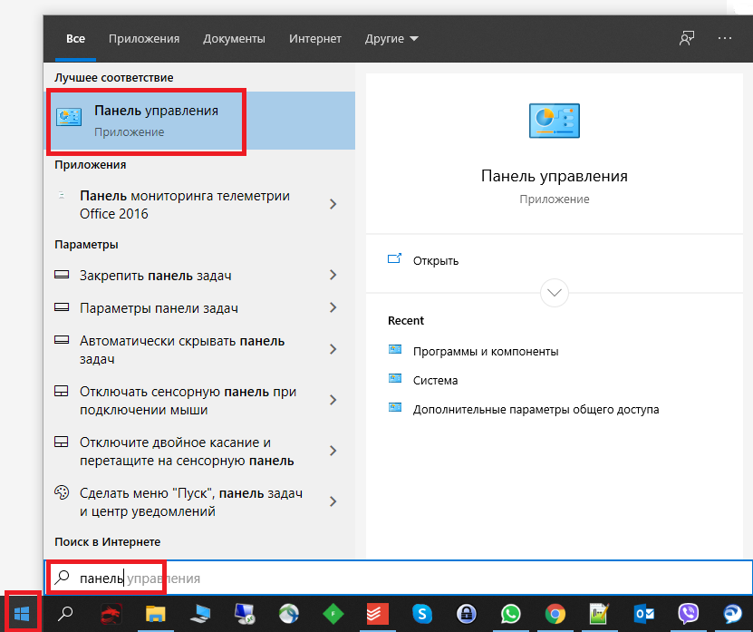
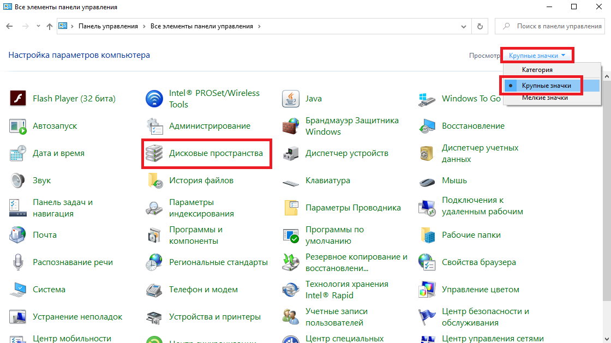
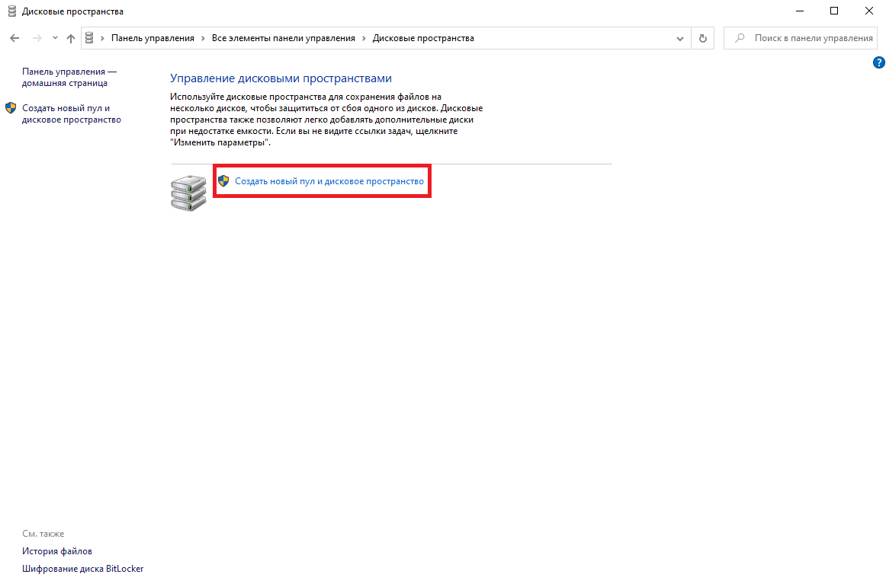
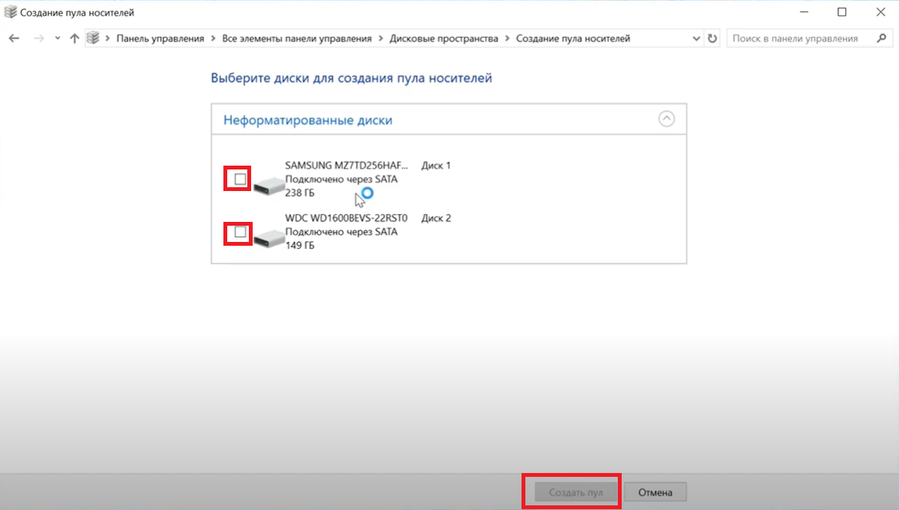
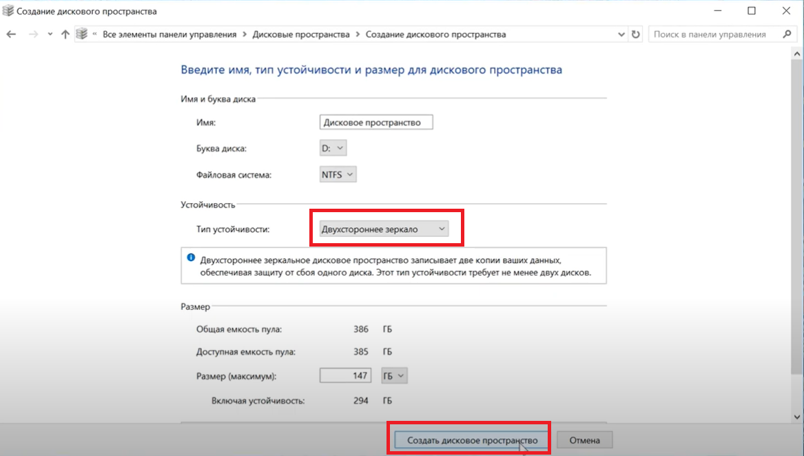
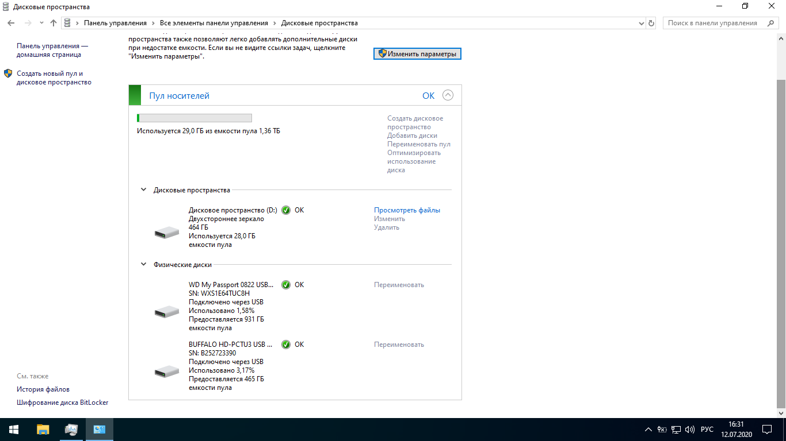
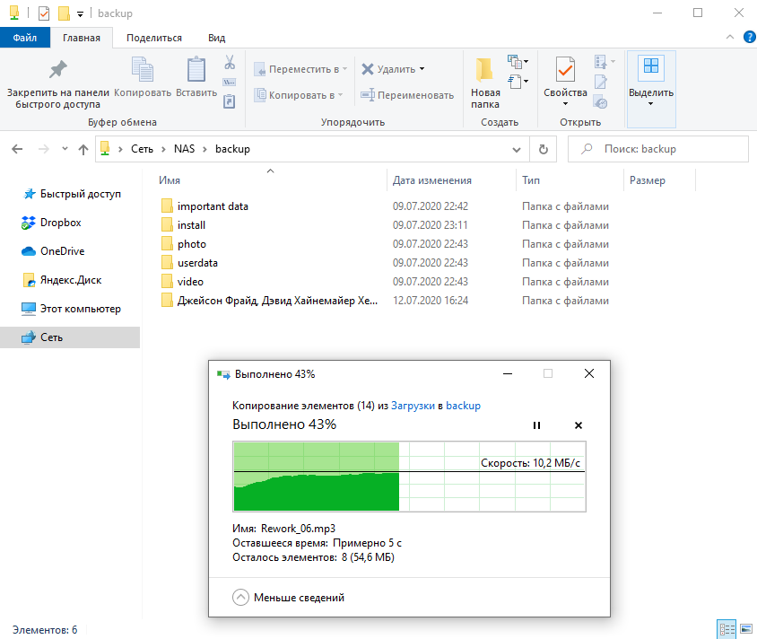
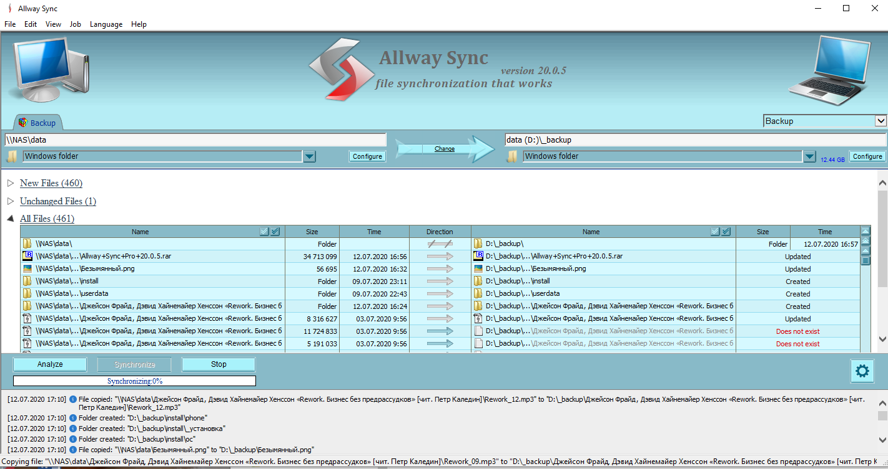

<!--
{
  "draft": false,
  "tags": ["Программирование"]
}
-->

# Домашний NAS для бедных

```blogEnginePageDate
12 июля 2020
```

Давно возникала идея создать бекап данных. Особенно остро это стало, когда пару лет назад начал сыпаться HDD, и
буквально за пару дней до беды, пришел
наконец [HDD Western Digital WD30EFRX](https://market.yandex.ru/product--zhestkii-disk-western-digital-wd30efrx/8348877)
серии Red (долго выбирал и решил, что он довольно надежный, ведь на него завод давал гарантию до 5 лет, с заменой на
новый, если что-то сломается). В общем тогда все обошлось - всего пару фоточек потерялось.
Выглядит так, что срок жизни для жесткого диска 3, 5, максимум 10 лет, поэтому меня пугает, что большинство людей не
задумываются о том, что могут все потерять. В общем, решил я наконец заняться этим вопросом.

## Дешевое решение

Дешевым и простым решением на мой взгляд является установка яндекс диска + акция подключение его к мобилке (ну или
любого другого клаудного зранилища), это даст вам 50 GB диска - достаточно для хранения фоточек. Решение довольно
надежное решение, т.к. документы будут у вас на локальном компе и в облаке. Плюс в том, что можно будет важные данные
получить через интернет в любой точке мира, на любом устройстве. Но тут есть и минус, вдруг кто украдет аккаунт или
данные вдруг станут обще доступными. Ну и покупка следущих гигабайт довольно дорогая.

## Простое решение

Второй вариант попроще, но стоит где-нибудь 5к - это покупка внешнего HDD. Из плюсов это приватно и большой объем, в
этом ценнике это порядка 1-2 TB на сегодняшний день. Дополнительно, но это чуть сложнее, можно установить программу для
автоматической синхронизации локального диска и внешнего, чтобы не копировать файлы вручную, например программку
[AlwaySync](https://allwaysync.com/).

Оба варианта просты и можно научить легко, например ваших родителей этим пользоваться.

## Дорогое решение

Давайте разберем сложные решения, чтобы сразу их откинуть (в моем случае я их не стал использовать, но возможно вам это
подойдет как нельзя кстати).

Дорогое решение состоит в том, чтобы купить готовое NAS решение типа:

* [ZYXEL NAS326](https://market.yandex.ru/product--setevoi-nakopitel-nas-zyxel-nas326/1971186033?nid=55415&show-uid=15945535173236562657216001&context=search&onstock=1) (~
  9к)
* [QNAP D2](https://market.yandex.ru/product--setevoi-nakopitel-nas-qnap-d2/1725695891?nid=55415&show-uid=15945535173236562657216005&context=search&onstock=1) (~
  15.5к)
* [Synology DS218+](https://market.yandex.ru/product--setevoi-nakopitel-nas-synology-ds218/1879546505?nid=55415&show-uid=15945535173236562657216002&context=search&onstock=1) (~
  30к)

К этому решению вам нужно купить еще минумум 2 диска,
например [HDD Western Digital WD30EFRX](https://market.yandex.ru/product--zhestkii-disk-western-digital-wd30efrx/8348877)
серии Red за ~8.5к каждый. Выглядит что ZYXEL должен сработать, но как-то не все комментарии радужные, странные
характеристики с оперативкой в 512 MB как из прошлого века. Выглядит что тут лучше сразу брать решения типа Synology,
чтобы не поплатиться дважды.

## Сложное решение

Однако, я нашел более дешевое решение в этом отличном на самом деле видео - Превращаем старый комп в сетевое хранилище с
[ОС FreeNAS](https://www.youtube.com/watch?v=Hc7Mu6HqABY). Я сразу загорелся этой идеей. Тут также нужно купить два
диска, но саму систему можно сделать из старого
компа, например купить в Юле\Авито за пару тысяч, либо найти старый ПК у родственников или даже у себя. А также нужно
купить бесперебойник. И тут я вспомнил, что у меня вообще-то есть ноутбук и минимум 1 лишний внешний HDD. Получается,
что стоимость решения всего один внешний диск - я остановился на 2 TB, поэтому получается та же сумма (~5к), что и в
простом решении.

Я наконец нашел время и сразу установил рекомендуемое решение FreeNAS через usb флешку. Тут произошло 2 звоночка.
Во-первых, система сказала, что ей желательно иметь 8GB оперативки (у меня было только 4 GB, для линукс решений выглядит
жирновато, на мой взгляд). Во-вторых система уж очень долго устанавливалась на старый нетбук ASUS с Intel Atom + SSD,
даже ubuntu быстрее ставиться. Но все запустилось, я вошел в веб-интерфейс как на видео, и начал подключать диски. И тут
я заметил, что мне нужно конвертнуть диск в систему ZFS. У меня закралась мысль, а что если диск выйдет из строя или
сломается ноутбук или ОС, смогу ли я переподключить диски? А что будет если выключиться свет, ведь к ноуту не подключишь
бесперебойник (батарейка давно сдохла, 2 раза)? **Смогу ли я потом подключить диск к винде и скопировать если что
данные?**

Я решил полазить в инете и нашел,
что [бесперебойная работа и плавное выключение](https://qastack.ru/server/47021/is-freenas-reliable) действительно
важно, проблемы с восстановлением диска тоже есть, но решаются импортом диска (не добавлением, а именно импортом) правда
для этого
[нужно минумум 8GB оперативки](https://www.ixsystems.com/community/threads/%D0%92%D0%BE%D1%81%D1%81%D1%82%D0%B0%D0%BD%D0%BE%D0%B2%D0%BB%D0%B5%D0%BD%D0%B8%D0%B5-%D0%BF%D0%BE%D1%81%D0%BB%D0%B5-%D0%BF%D0%B5%D1%80%D0%B5%D1%83%D1%81%D1%82%D0%B0%D0%BD%D0%BE%D0%B2%D0%BA%D0%B8-freenas.23767/),
иначе не заработает. И вообще лучше делать бекап с raid-массива FreeNAS куда-нибуть. Выглядит
так, что я изобретаю систему для безопасного хранения, но чтобы оно было безопасным надо его бекапить. Выглядит не
очень.

В качестве альтернатив можете
рассмотреть [другие ОС](https://zen.yandex.ru/media/mdex/6-luchshih-alternativ-freenas-dlia-samodelnogo-setevogo-nakopitelia-5d984f162fda8600b152e52f)
например XigmaNAS с меньшим количеством оператики, но ведь они не масмаркет и возможно проблем там будет еще больше.

## Мое решение

Итак, я решил попробовать найти решение на виндовс, ведь тогда я легко смогу выдернуть диск и подключить его к другому
ПК. И действительно такое решение
нашел - [Создание зеркала (программного RAID 1) для Windows](https://www.white-windows.ru/sozdanie-zerkala-programmnogo-raid-1-dlya-windows/).
Но вот беда - оно не работает для внешних HDD - я пробовал - говорит не поддерживется диск - и даже в инете нашел этому
подтверждение. Я думал все закончить на этом, но тут нашел
решение - [создать пул дисков в windows](https://www.youtube.com/watch?v=A2yk19_7OvY) (почему-то пул дисков можно
создать с внешними HDD)

Итак, **требования**:

1. создаем nas систему с raid1 с windows, чтобы не боятся за потерю данных
2. делаем ее на старом ноуте для экономии
3. ноут подключаем напрямую к ethernet wifi точки, чтобы мой и ПК жены могли к нему подключиться, например чтобы
   сбросить фоточки в одно место или получить доступ к документам.

**Решение**:

1) устанавливаем виндовс на ноут

2) подключаем 2 внешних HDD (можно разных размеров)

3) настраиваем пул







_Следующие 2 фото взяты с видео, т.к. лень было пересоздавать пространство ради статьи_







4) подключаем к сети, расшариваем папку с общим доступом по сети

### Проверка



Получаем скорость по wifi до 10 MB/sec, это всего в 2 раза меньше, чем если бы я копировал данные через USB2.0 на прямую
с ноутбука на внешний диск, так что считаю приемлемым.

Дополнительно я повырубал пару раз аварийно питание для ноута, в процессе копирования данных. Потом выключал диск,
записывал данные через сеть и напрямую на диск на другом компе. Все автоматически синхронизировалось. Ну и диск доступен
на другом ПК без плясок с бубном.

**Дополнительно** я решил исхитриться и установил программку [AllWay Sync](https://allwaysync.com/) и программно бекаплю
данные с NAS на стационарный ПК. Получается такой двойной программный raid1. Тут уж извините мне мою паранойю - "нужно
больше бекапов". 

