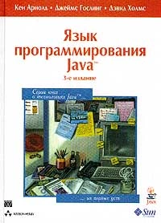
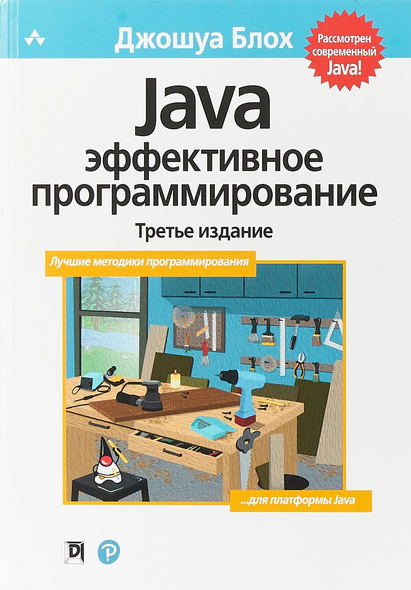
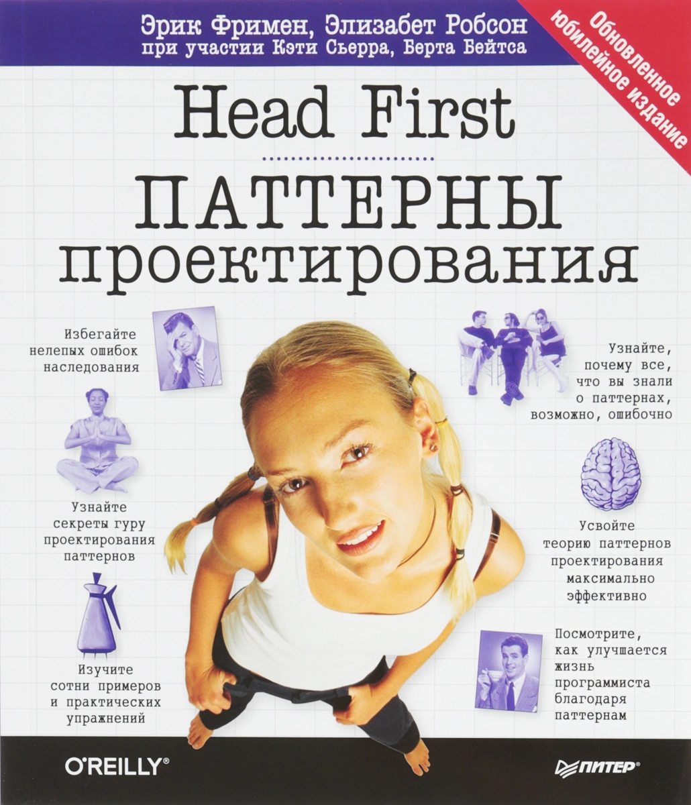
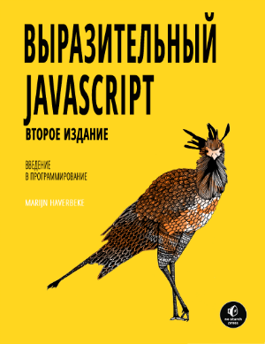
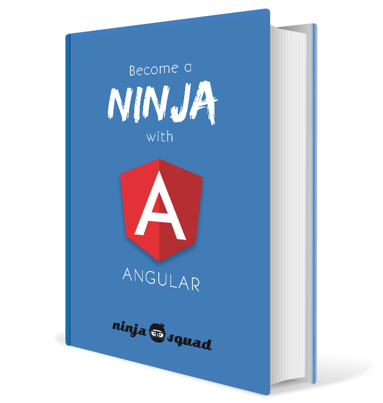
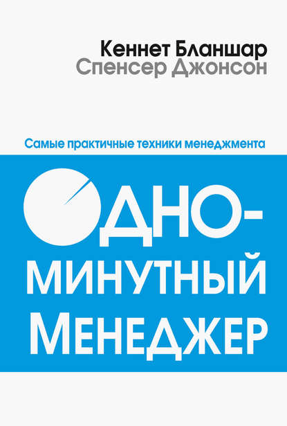
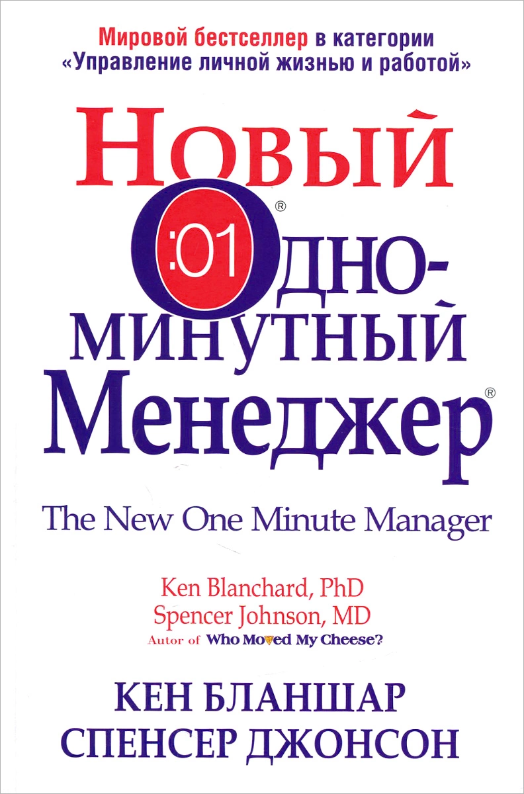
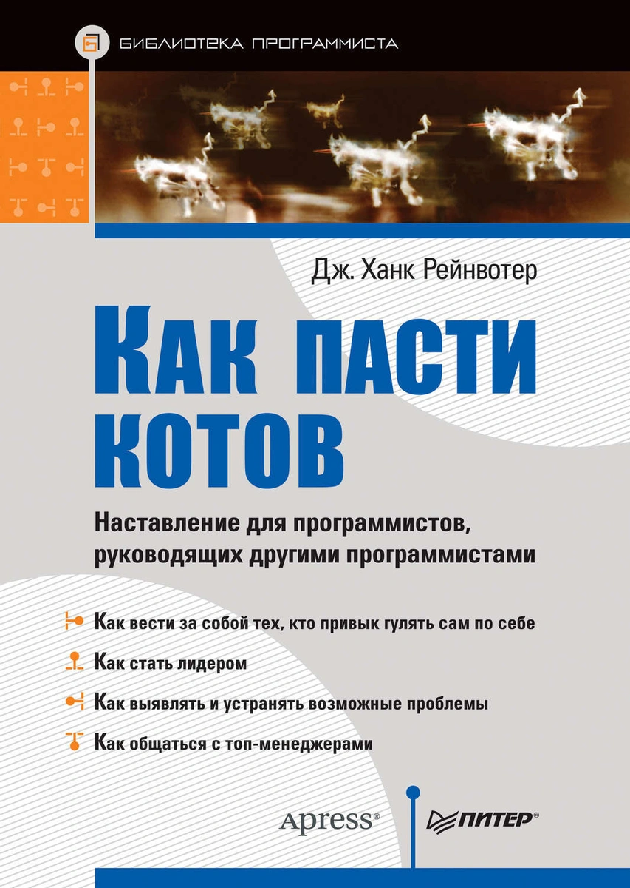
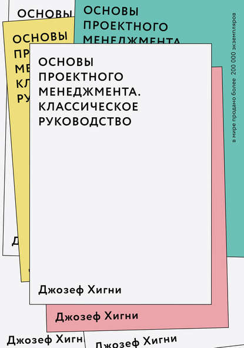

<!--
{
  "draft": false,
  "tags": ["Программирование"]
}
-->

# Книжная полка

```blogEnginePageDate
07 декабря 2020
```

Решил собрать пару наиболее интересных книжек про программирование, которые я считаю важным прочитать. Они довольно
долго на мой взгляд остаются актуальными.

<table style="max-width: 800px; margin: 0 auto;">

<tr>
<td style="width: 50%">
<div style="height: 300px">



</div>
</td>
<td style="width: 50%">

**Язык программирования Java.**

Кен Арнольд, Джеймс Гослинг, Дэвид Холмс

[Ссылка](https://www.ozon.ru/context/detail/id/928761?__rr=1)

</td>
</tr>

<tr>
<td>

**Java: эффективное программирование.**

Джошуа Блох

[Ссылка](https://www.ozon.ru/context/detail/id/148627191)

</td>
<td>
<div style="height:300px">



</div>
</td>
</tr>

<tr>
<td>
<div style="height: 300px">



</div>
</td>
<td>

**Head First. Паттерны проектирования.**

Фримен Эрик, Робсон Элизабет

[Ссылка](https://www.ozon.ru/context/detail/id/144233005)

</td>
</tr>

<tr>
<td>

Выразительный Javascript Автор

Марейн Хавербек

[Ссылка](https://habr.com/ru/post/253101)

</td>
<td>
<div style="height:300px">



</div>
</td>
</tr>

<tr>
<td>
<div style="height: 300px">



</div>
</td>
<td>

Become a ninja with Angular

Cédric Exbrayat

[Ссылка](https://books.ninja-squad.com/angular)

</td>
</tr>

<tr>
<td>

**Одноминутный менеджер**

и

**Новый Одноминутный Менеджер**

Джонсон Спенсер, Бланшар Кеннет

[Ссылка 1](https://www.litres.ru/ken-blanshar/odnominutnyy-menedzher)
и
[Ссылка 2](https://www.ozon.ru/context/detail/id/34423694)

</td>
<td>
<div style="height:300px">



</div>
<div style="height:300px">



</div>
</td>
</tr>

<tr>
<td>
<div style="height: 300px">



</div>
</td>
<td>

**Как пасти котов. Наставление для программистов, руководящих другими программистами.**

Рейнвотер Дж.Ханк

[Ссылка](https://www.ozon.ru/context/detail/id/34748015)

</td>
</tr>

<tr>
<td>

**Основы проектного менеджмента. Классическое руководство**

Джозеф Хигни

[Ссылка](https://www.litres.ru/dzhozef-higni/osnovy-proektnogo-menedzhmenta-klassicheskoe-rukovodstvo)

</td>
<td>
<div style="height:300px">



</div>
</td>
</tr>

</table>