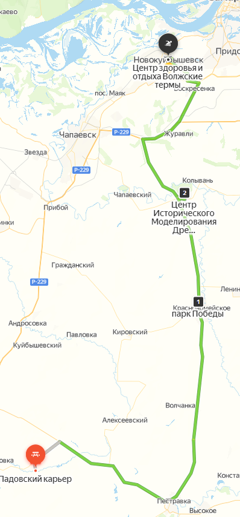
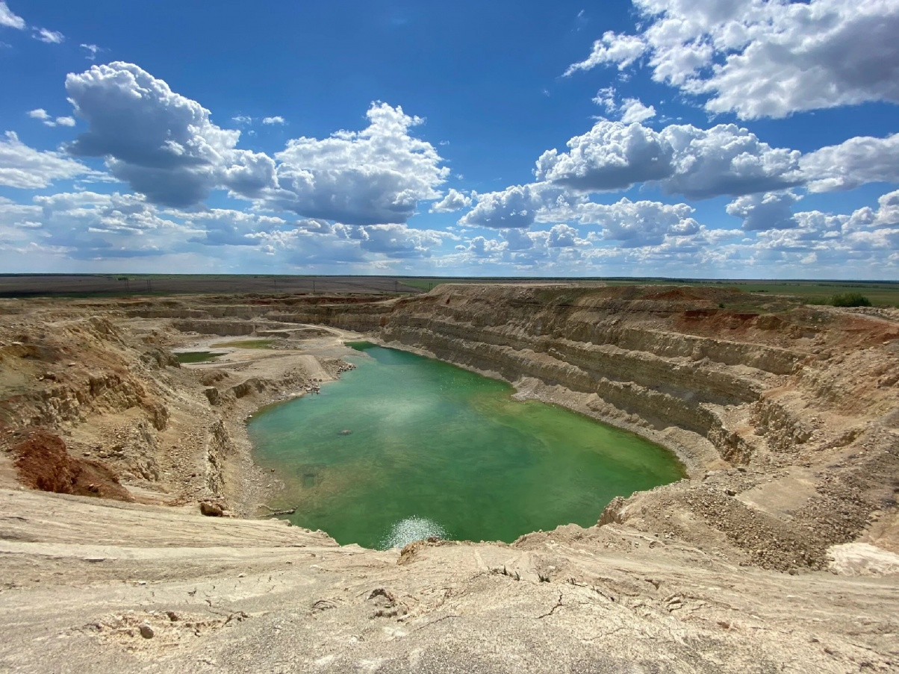
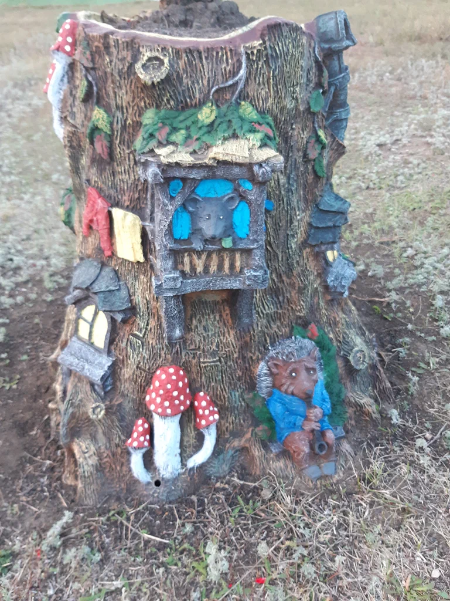
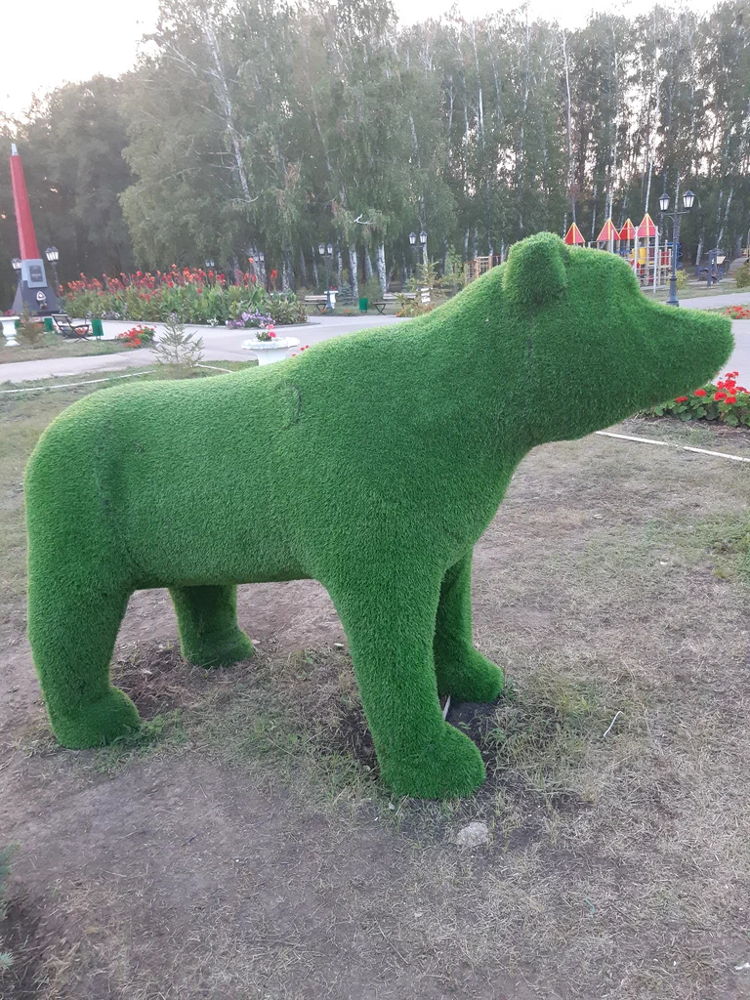
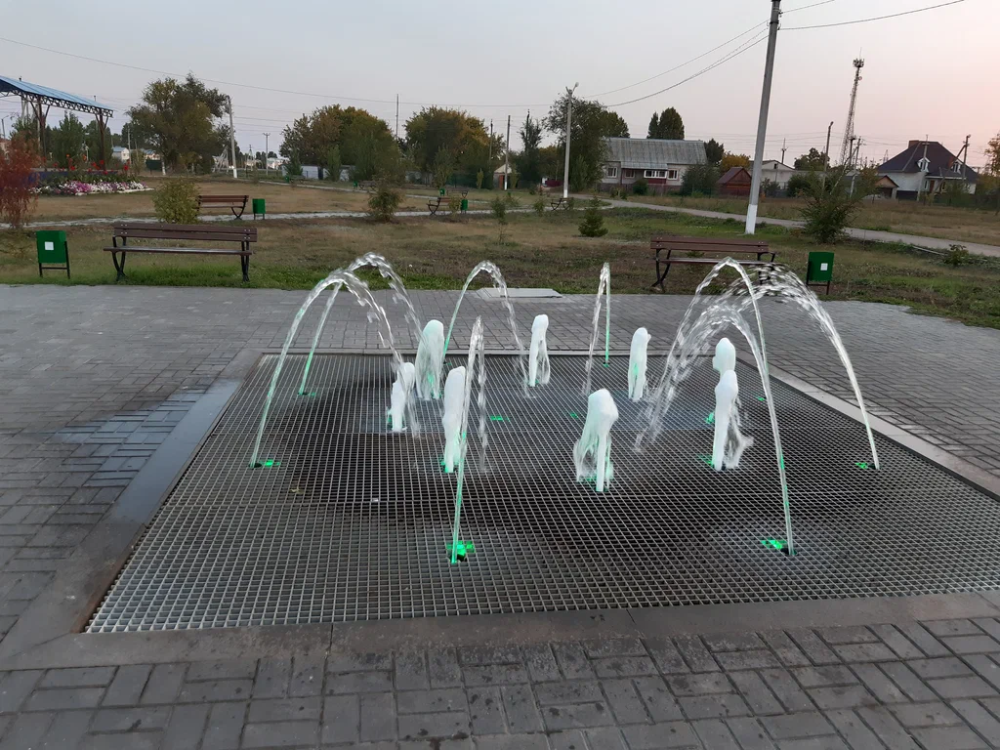
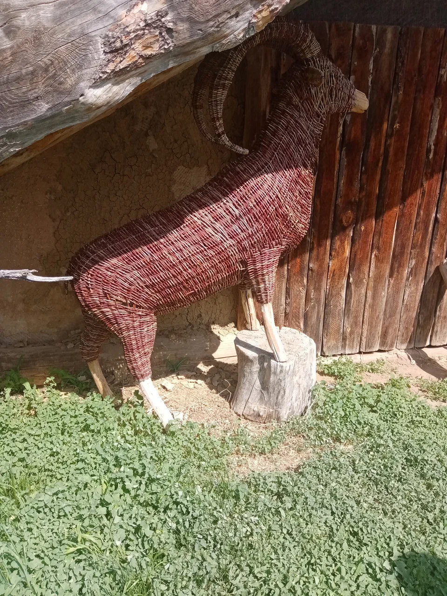
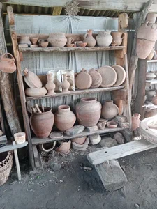
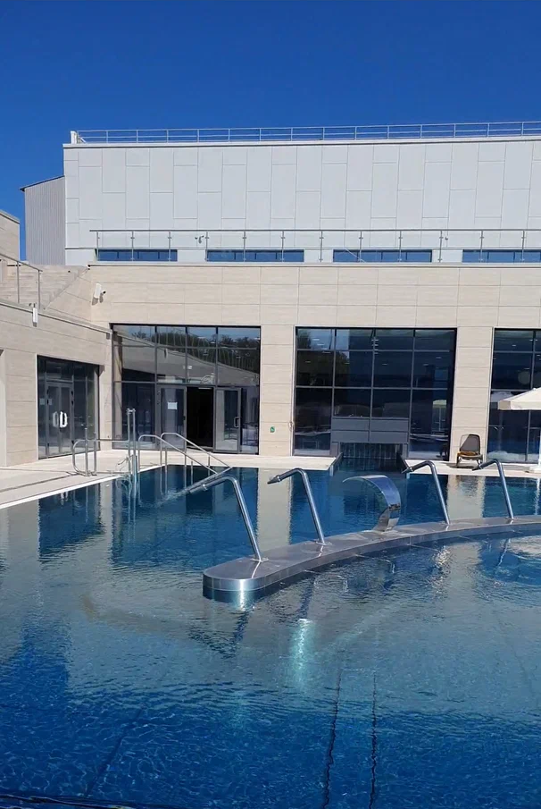
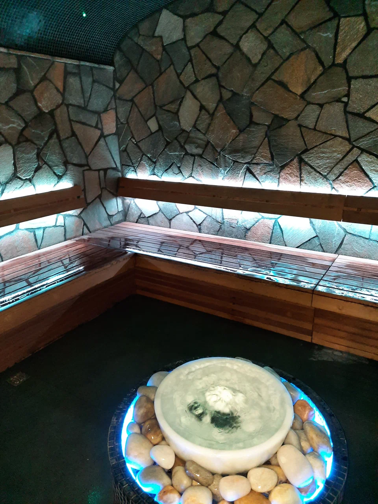

<!--
{
  "draft": false,
  "tags": ["Путешествие"]
}
-->

# Куда съездить в Самаре? (Часть 1) - Падовский карьер

```blogEnginePageDate
26 августа 2023
```

Несколько лет назад я задался вопросом куда же можно съездить в Самара (Самарской области)? Какие есть интересные места?
И вот в этом году я составил большущую карту интересных мест.

Для части из них я сделали целый недельный маршрут, который я выложу позже. А пока разделю поездки на 3-4 статьи,
сjответствующие как-бы "сторонам света" относительно Самары.

Начнем с левого нижнего
квадрата - [ссылка на маршрут](https://yandex.ru/maps/?ll=50.297703%2C52.766210&mode=routes&rtext=52.460638%2C49.599147~52.726173%2C50.025983~52.898347%2C49.990019~53.109890%2C49.946880&rtt=auto&ruri=ymapsbm1%3A%2F%2Forg%3Foid%3D215326287582~ymapsbm1%3A%2F%2Forg%3Foid%3D155743161778~ymapsbm1%3A%2F%2Forg%3Foid%3D220581392806~ymapsbm1%3A%2F%2Forg%3Foid%3D30694605141&z=9)




## Падовский карьер

Поезду лучше начинать на мой взгляд с самой дальней точки. Итак едем от Самары
до [Падовский карьер](https://yandex.ru/maps/org/padovskiy_karyer/215326287582/?ll=49.600173%2C52.460410&z=16)
**(координаты 52.460600, 49.599250)**. Тут можно будет увидеть интересные виды на озеро и на "скалы" и сделать много
фотографий. Вход
платный - 150р с человека. Оплату принимает охранник, который дежурит около шлагбаума. Мы когда приехали вход был
перегорожен цепочкой, на на против через дорогу кто-то был. Подъехали к нему и он за плату пропустил нас. Было очень
интересно, фоткались наверно час. В карьере за счет "стен" может быть очень жарко в солнечную погоду.



## Парк Победы в селе Красноармейское

Проезжали мимо и случайно увидели
красивый [парк Победы в селе Красноармейское](https://yandex.ru/maps/org/park_pobedy/155743161778/?ll=50.025626%2C52.726087&z=18)
**(координаты 52.726172, 50.025983)**. Развернулись и заехали и не пожалели. С десяток "артефактов" с которыми можно
сфотографироваться. Жалко фонтан не работал.

<div style="display: flex; justify-content: center; gap: 30px; height: 500px;">




</div>



## Древний мир

Следующим по плану было посещение места под
названием [Древний мир](https://yandex.ru/maps/org/tsentr_istoricheskogo_modelirovaniya_drevniy_mir/220581392806/?ll=49.991358%2C52.902460&mode=search&sctx=ZAAAAAgBEAAaKAoSCQEZOnZQA0lAESwP0lPkXEpAEhIJyCO4kbJFcj8RL26jAbwFUj8iBgABAgMEBSgKOABA%2B5cGSAFiEmxldG9fdl9nb3JvZGU9dHJ1ZWoCcnWdAc3MTD2gAQCoAQC9AdqGrFzCAQum47PdtQac66GsO%2BoBAPIBAPgBAIICFdC00YDQtdCy0L3QuNC5INC80LjRgIoCAJICAJoCDGRlc2t0b3AtbWFwcw%3D%3D&sll=49.991358%2C52.902460&sspn=0.106311%2C0.032027&text=%D0%B4%D1%80%D0%B5%D0%B2%D0%BD%D0%B8%D0%B9%20%D0%BC%D0%B8%D1%80&z=14.45)
**(координаты 52.898351, 49.989942)**. К сожалению вход туда по времени - нужно записываться на экскурсии. Пока мы
искали управляющего пофоткались в древней юрте, с мамонтом и др. Но лучше кончено записаться, может кому пригодиться
ссылка на их сайт.

<div style="display: flex; justify-content: center; gap: 30px; height: 500px;">

<div style="width: 50%;">



</div>

<div style="width: 50%;">



</div>

</div>

## Волжские термы

[Волжские термы](https://yandex.ru/maps/org/tsentr_zdorovya_i_otdykha_volzhskiye_termy/30694605141/?ll=49.943670%2C53.109890&mode=search&sll=49.930075%2C53.075026&sspn=0.452618%2C0.135807&text=%D0%B2%D0%BE%D0%BB%D0%B6%D1%81%D0%BA%D0%B8%D0%B5%20%D1%82%D0%B5%D1%80%D0%BC%D1%8B&z=16.36)
**(координаты 53.109784, 49.946596)**. Сюда конечно нужно ездить отдельным днем, по будням с самого утра мало
народу. Много саун и бассейнов, часа 4 как раз хватает обойти все бассейны с детьми. Хотя нам больше понравился зимний
поход без детей с купанием в теплом бассейне под открытым небом и немного снегом. Особенно мне понравился аттракцион
катания на волнах, когда несколько человек заходят в почти замкнутый круг и прыгают создавай волны наверно выше полутора
человеческого роста.

<div style="display: flex; justify-content: center; gap: 30px; height: 500px;">

<div style="width: 50%;">



</div>

<div style="width: 50%;">



</div>

</div>