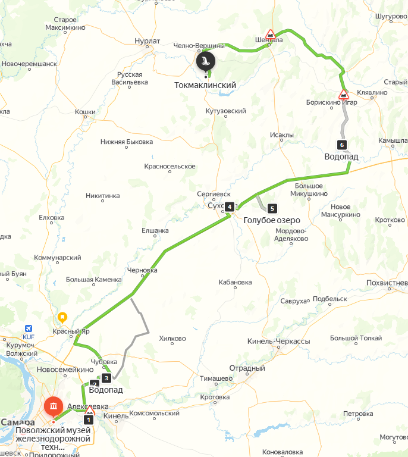
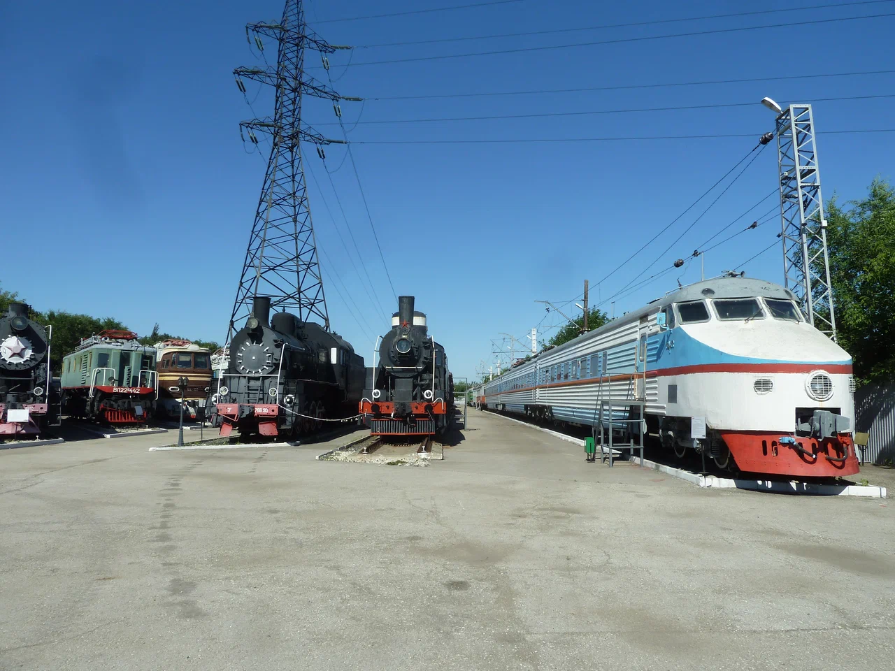
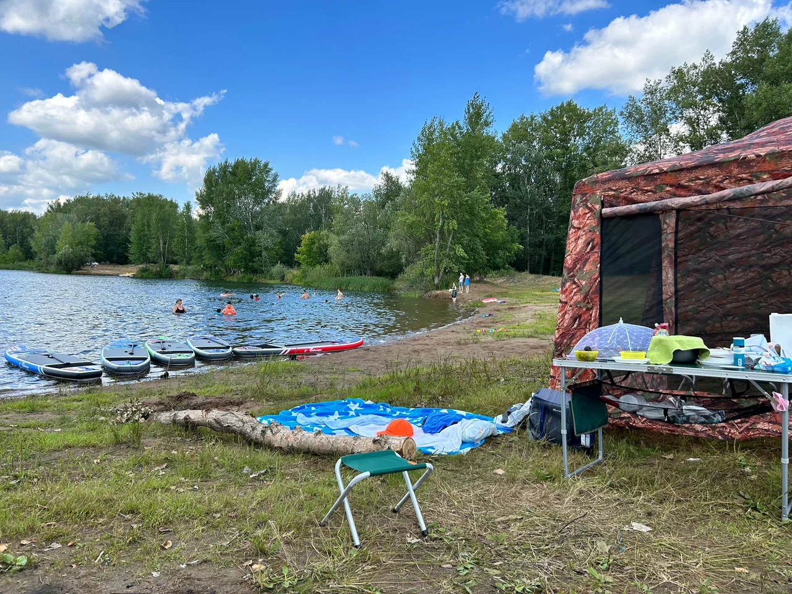
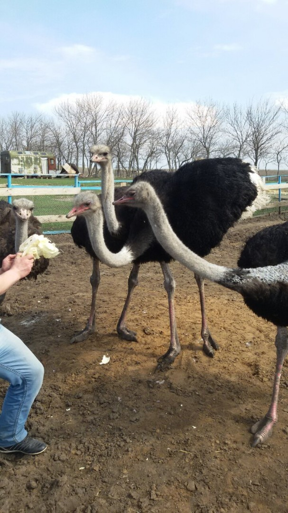
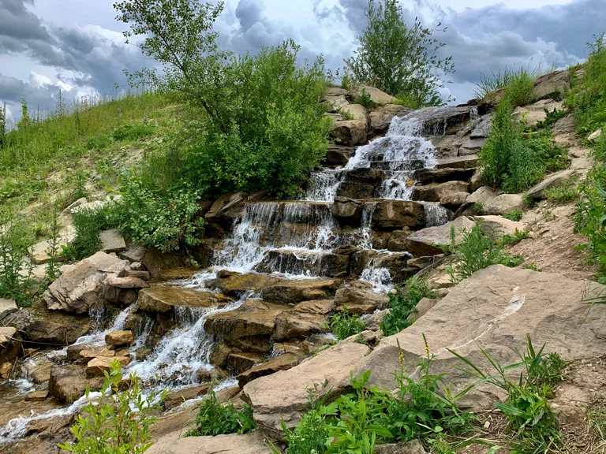
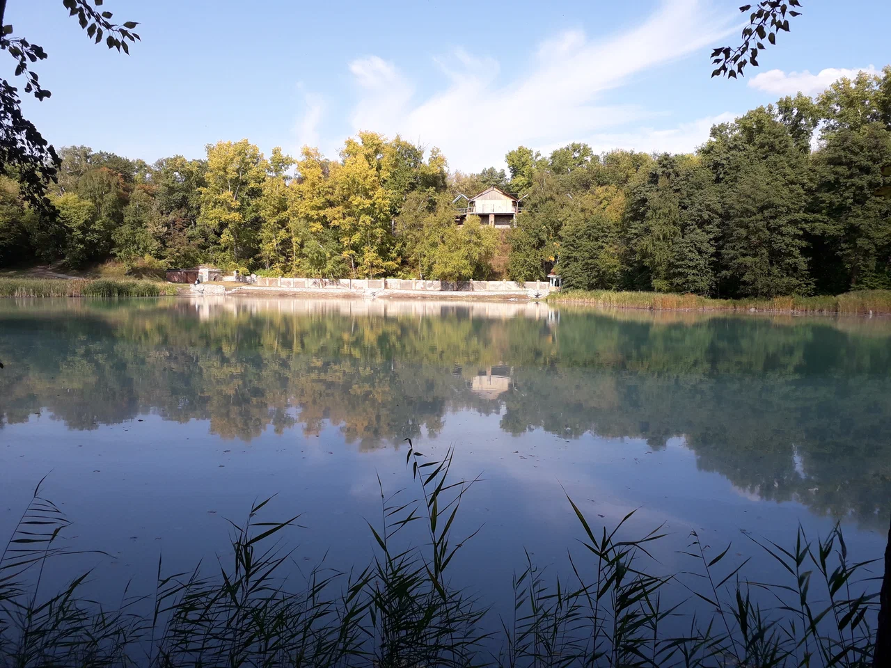
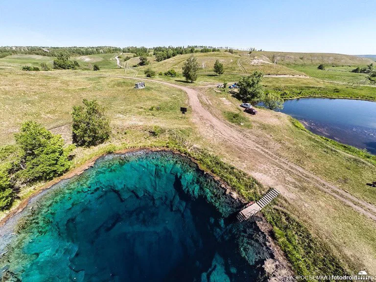
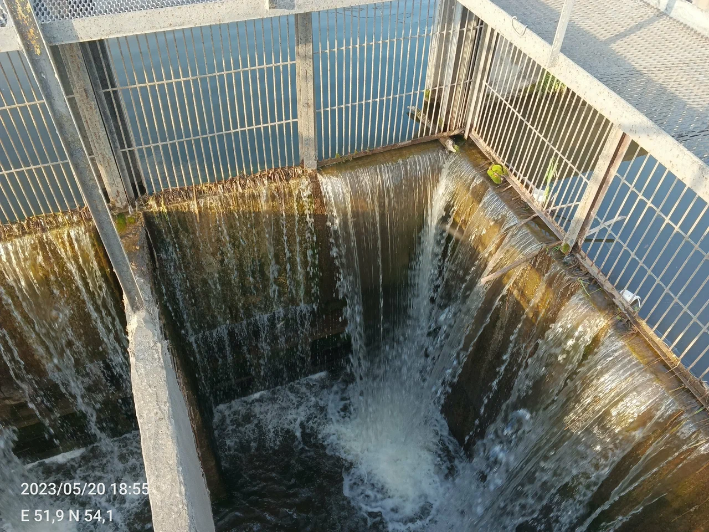
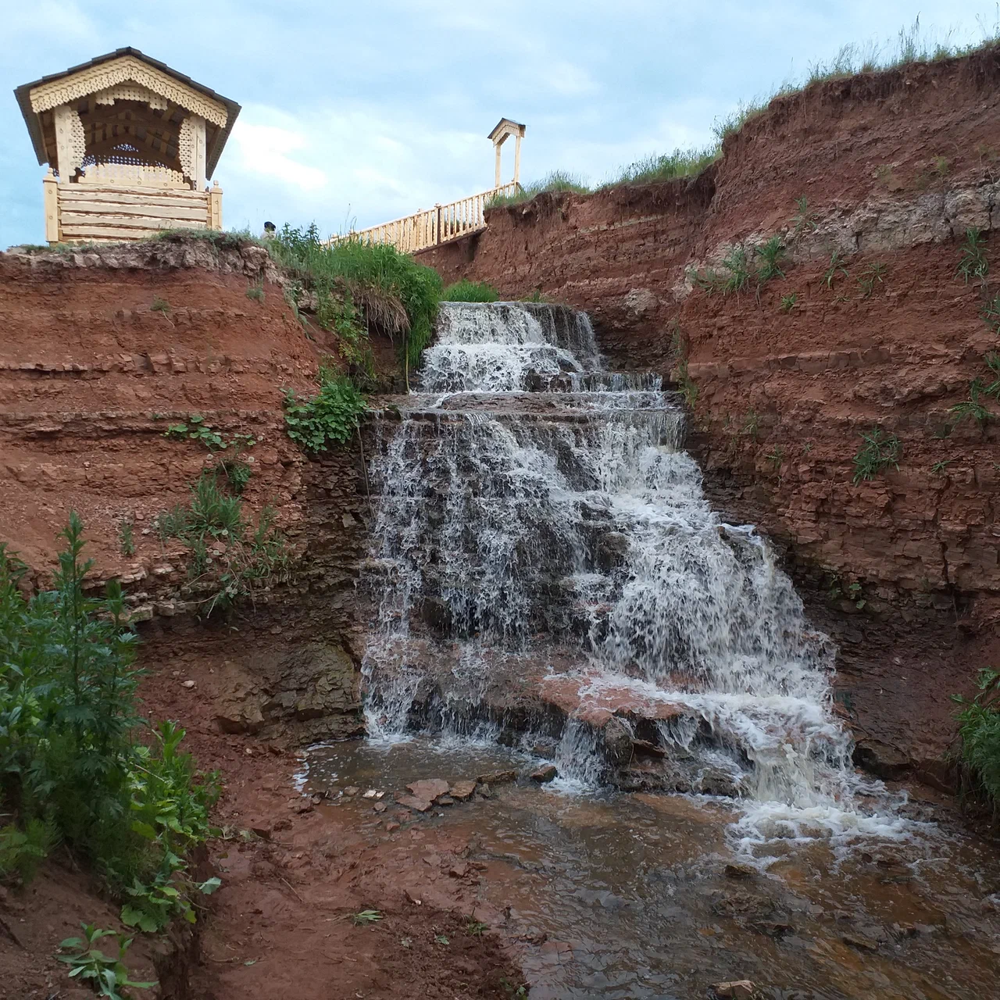

<!--
{
  "draft": false,
  "tags": ["Путешествие"]
}
-->

# Куда съездить в Самаре? (Часть 2) - Водопады и Озера

```blogEnginePageDate
04 сентября 2023
```

Теперь отправимся вправо от Самары. Я построил примерно
такой [путь](https://yandex.ru/maps/?ll=51.103742%2C53.857313&mode=routes&rtext=53.224501%2C50.295778~53.227344%2C50.487304~53.342558%2C50.519477~53.364028%2C50.584328~53.917893%2C51.252336~53.912215%2C51.487645~54.116484%2C51.867131~54.336537%2C51.123622&rtt=auto&ruri=ymapsbm1%3A%2F%2Forg%3Foid%3D1254564559~~ymapsbm1%3A%2F%2Forg%3Foid%3D1004274022~ymapsbm1%3A%2F%2Forg%3Foid%3D104580614285~~ymapsbm1%3A%2F%2Forg%3Foid%3D129448822385~ymapsbm1%3A%2F%2Forg%3Foid%3D42357144780~ymapsbm1%3A%2F%2Forg%3Foid%3D20100238581&z=9.12).
Если интересно то предыдущая [часть 1](../КудаСъездитьВСамареЧасть1/index.html)



## Музей поездов (53.224573, 50.295960)

С детьми очень интересно. Можно полазить по некоторым поездам и если повезет дополнительно пустят в ряд других поездов.



## Алексеевские озера (53.226989, 50.491656)

Озера платные, но всего 200р с машины. В связи с этим наверно тут не так много народа, есть пляж метров 15, и несколько
примерно 10 мест маленьких стоянок со спуском к озеру. Можно взять лоду поплавать по озеру, искупаться, пожарить
шашлыки, поездить по грунтовке с детьми. Полетать на квадракоптере. Поиграть в волейбол, бадминтон. Можно остаться с
палаткой. Еще есть услуга сапов.



## Страусиная ферма (53.365320, 50.539577)

Есть Страусиная ферма, где разводят страусов, а есть Страусиная дача где как раз проводят экскурсию. Поэтому езжайте по
координатам с сайта https://straus63.ru/contacts. Стоимость 400р с человека на 2023г. Однако экскурсия интересная и 2
часа пролетают быстро как для взрослых так и для детей. Есть страусы, "обнимашки" с ними. "Погоня" за свинками. Козлики,
гуси, собаки, кошки и др. Экскурсии проводятся каждые 2 часа так что лучше позвонить, договориться о времени.



## Водопад под Сырейкой (53.363993, 50.584323)

Недалеко от Страусиной дачи есть водопад, минут 20 езды по грунтовке, где в сухую погоду проедет и легковушка, так что
не стоит упускать возможность. Около водопада можно устроить пикник. А можно искупаться в озере, которое является
истоком водопада.



## Озеро Серное (53.918051, 51.252669)

Далее далековато ехать, но есть интересное и вонючее Серное озеро в поселке Серноводск. Находится на территории видимо
какой-то лечебницы, вход через ворота с охраной, но вход бесплатный. Озеро окружено немного запущенными каменным забором
и лестницами, но виды не плохие. К запаху начинаешь привлекать еще в момент заезда в поселок.



## Голубое озеро (53.912193, 51.487541)

Далее можно заехать на голубое озеро. Честно говоря мне особо не зашло оно. Много народу и озеро не такое голубое как на
картинке. Там очень холодная вода и иногда ныряют дайверы.



## Водопад под Воскресенкой (54.116497, 51.867080)

Технически, на мой взгляд, это не водопад. Да вода падает, но это искусственное сооружение с "дыркой внутри" куда падает
вода. Тем не менее можно с другой стороны залезть внутрь "дырки" и сделать забавное фото. Еще можно прогуляться по
каменному полукругу и виды хороши пока едешь до точки в небольшие горки. Грунтовка ровнее чем асфальт. Я бы еще раз
съездил.



## Токмаклинский водопад (54.336538, 51.123627)

От водопада под Воскресенской можно поехать назад, а можно вверх (к сожалению я туда не поехал, из-за изменения планов).
Видимо самый большой "водопад" Самарской области.



