<!--
{
  "draft": false,
  "tags": ["Путешествие"]
}
-->

# Куда съездить в Самаре? -  (Часть 3) Пещеры и Горы

```blogEnginePageDate
08 сентября 2023
```

Теперь отправимся вверх от Самары. Я построил примерно
такой [путь](https://yandex.ru/maps/?ll=49.963288%2C53.529539&mode=routes&rtext=53.325456%2C50.195044~53.337465%2C50.207388~53.343817%2C50.197630~53.401955%2C50.161396~53.414707%2C50.149215~53.423442%2C50.122406~53.429873%2C50.096461~53.473311%2C49.912102~53.470207%2C49.762191~53.553092%2C49.249838&rtt=auto&ruri=ymapsbm1%3A%2F%2Forg%3Foid%3D235292620598~ymapsbm1%3A%2F%2Forg%3Foid%3D223641812742~ymapsbm1%3A%2F%2Forg%3Foid%3D209490064375~ymapsbm1%3A%2F%2Forg%3Foid%3D29949671635~ymapsbm1%3A%2F%2Forg%3Foid%3D189831361848~ymapsbm1%3A%2F%2Forg%3Foid%3D191157895808~ymapsbm1%3A%2F%2Forg%3Foid%3D58936544231~ymapsbm1%3A%2F%2Forg%3Foid%3D4511508373~ymapsbm1%3A%2F%2Forg%3Foid%3D164195425115~ymapsbm1%3A%2F%2Forg%3Foid%3D1039760000&z=10.27).
Если интересно, то предыдущая [часть 2](../КудаСъездитьВСамареЧасть2/index.html)

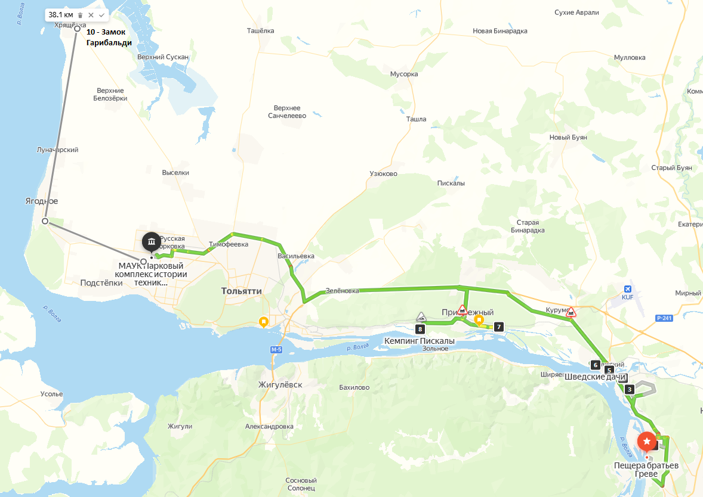

## Пещера Братьев Грейве (53.325398, 50.195164)

В пещере придется ползать немного - полметра до первого грота. Обязательно нужны фонари. Дети могут испугаться и не
залезть. Также есть более дальние ходы для более отважных и даже расщелина в которой вертикально вверх можно подняться
на вверх горы.

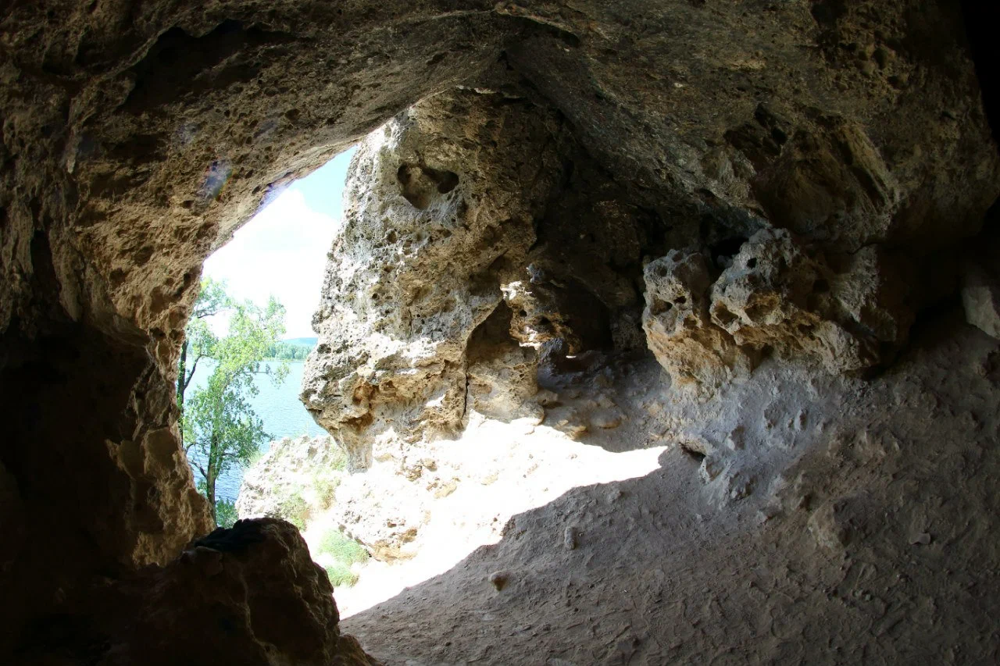

## Коптевский водопад (53.337460, 50.207389)

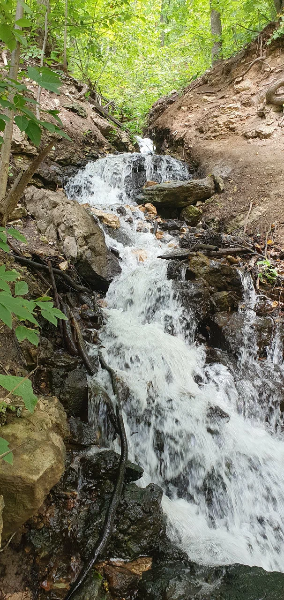

## Вертолетка (53.343800, 50.197638)

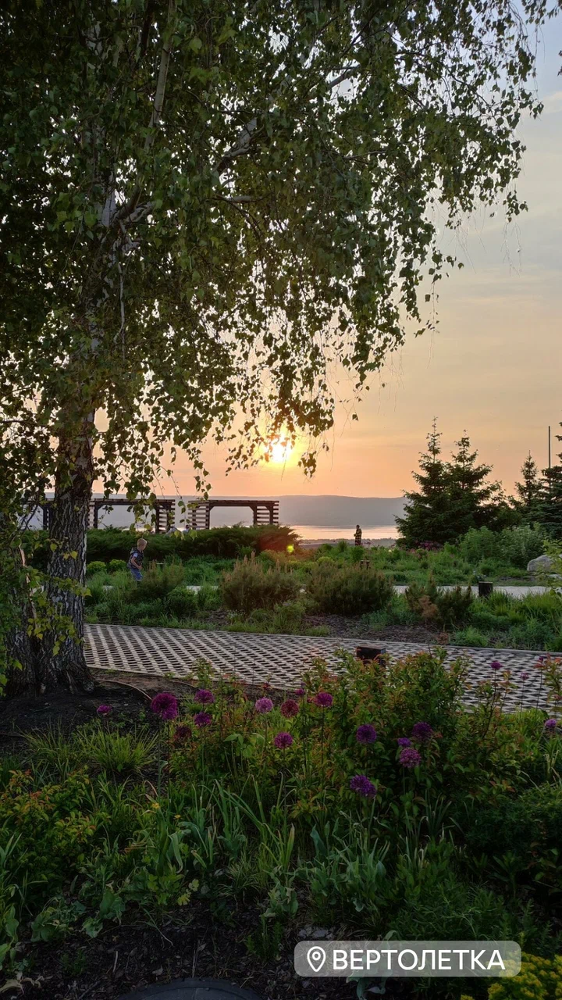

## Гора Тип-Тяв (53.401923, 50.161420)

Едем до магазина Магнит по адресу 4-й квартал, 15, посёлок Красная Глинка, Самара. Далее по тропе например через OsmAnd
приложении поднимаемся в гору. Можно дойти до карьера нижней и верхней дорогой. Можно пойти и дальше.


## Сокские Штольни (53.414729, 50.149152)

В штольнях есть примерно 2 десятка достопримечательностей. Но там можно и потеряться. До первого места можно дойти и
самому, но вот дальше лучше наверно пойти с экскурсией
типа [этой](https://extremesamara.ru/ekskursii_v_sokskie_shtolni), чтобы не потеряться.

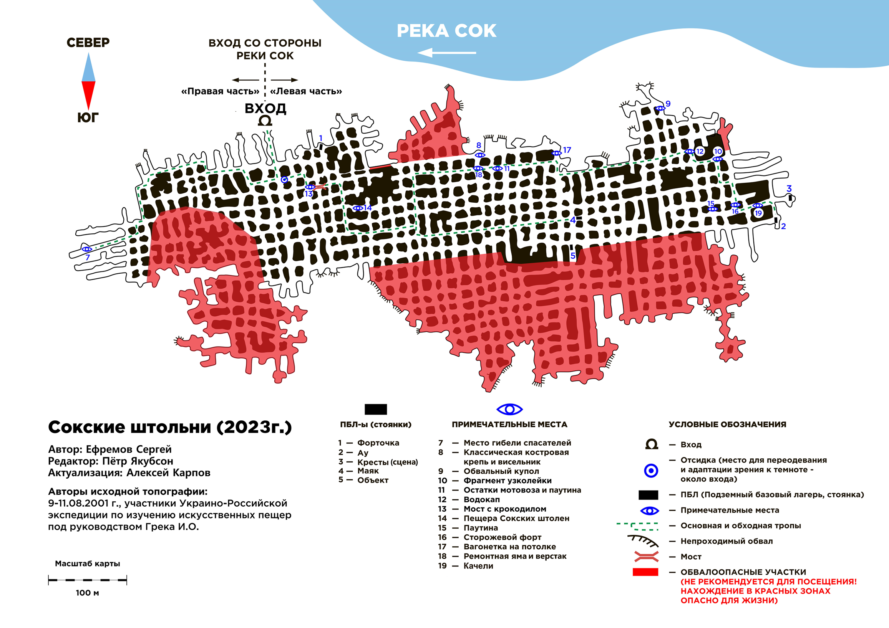

## Царев Курган (53.423370, 50.122035)

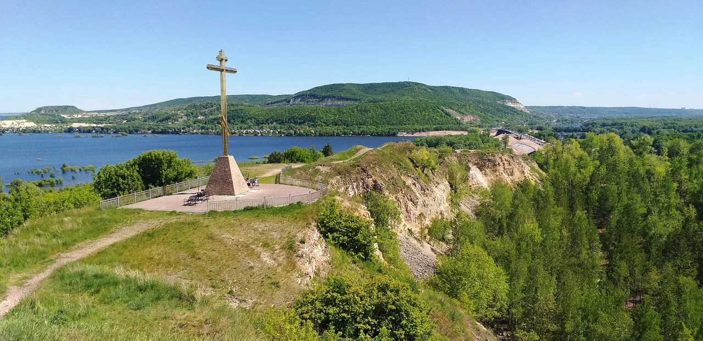

## Шведские дачи (53.429842, 50.096362)

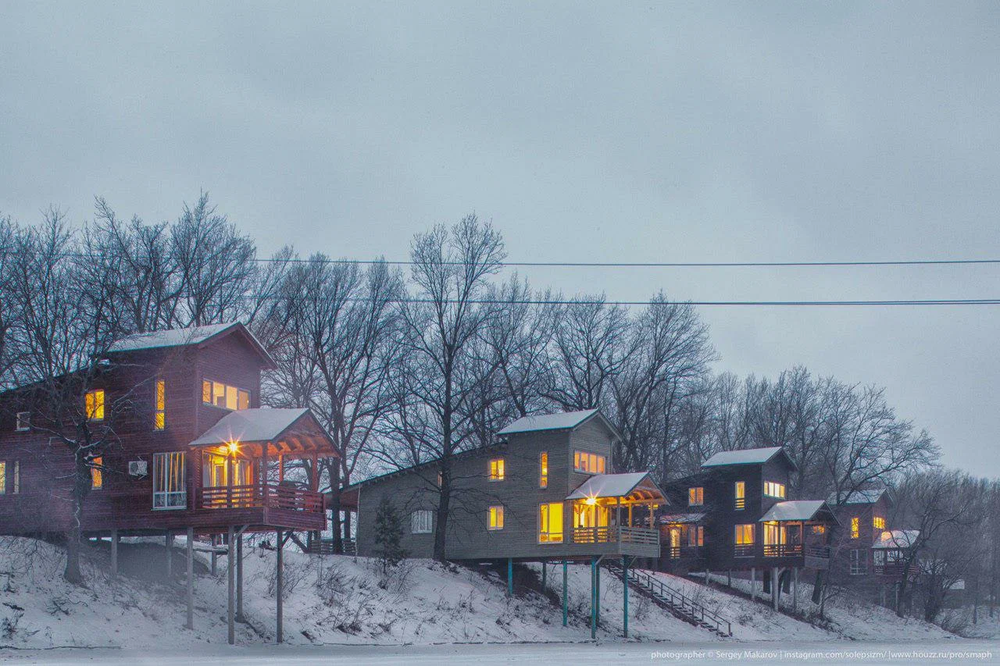

## Мастрюковские озера - Задельный бор (53.474116, 49.873467)

Укромное местечко посидеть с палатками, можно забаррикадироваться машинами.

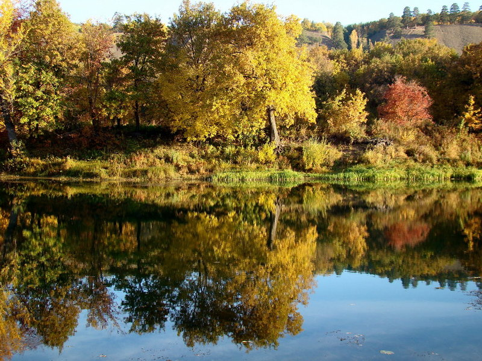

## Кемпинг Пискалы (53.470109, 49.762205)

Можно с палатками, а можно в домиках, можно заказать сапы

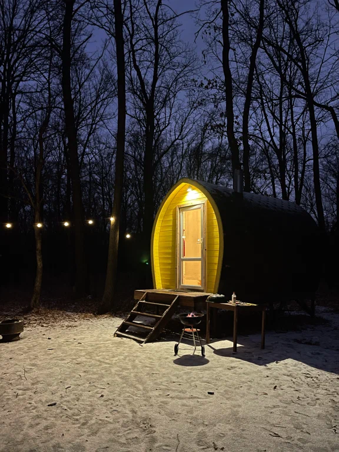

## Парковый комплекс истории техники имени Сахарова (53.553082, 49.249901)

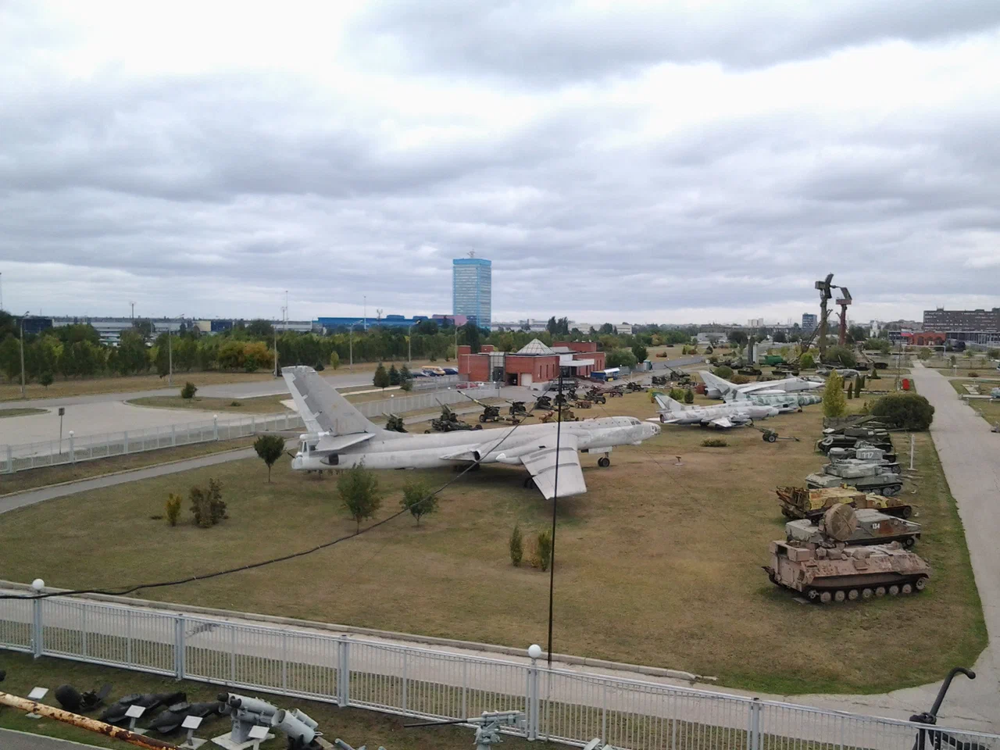

## Замок Гарибальди (53.822282, 49.086861)

Можно пофоткаться и посидеть на пляже.

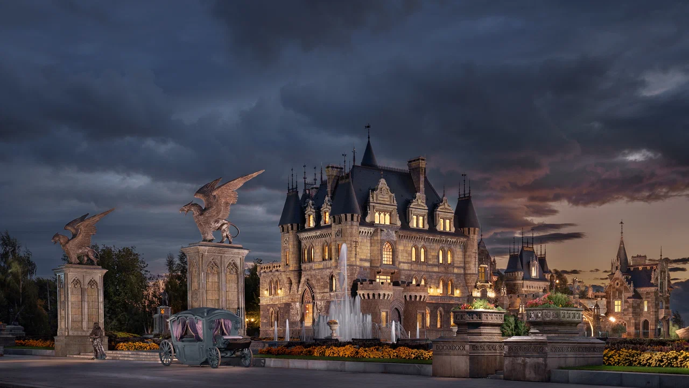