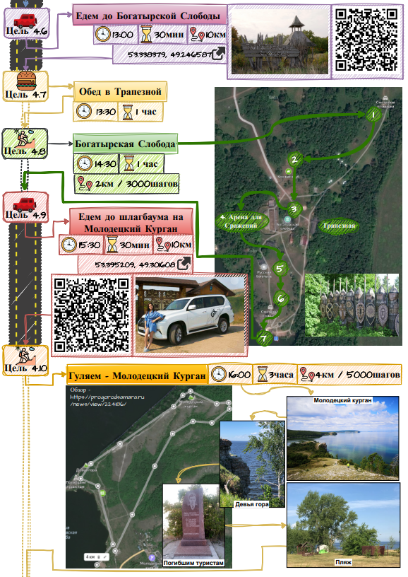

<!--
{
  "draft": false,
  "tags": ["Путешествие"]
}
-->

# Куда съездить в Самаре? (Часть 4) - Самарская лука и Карта

```blogEnginePageDate
11 сентября 2023
```

Теперь отправимся по Самарской луке и за ней. Я построил примерно такой большую карту.

Если интересно, то предыдущая часть 3 тут - [Куда съездить в Самаре? (Часть 3)](../КудаСъездитьВСамареЧасть3/index.html)

## Карта

Здесь порядка 40-ка объектов а может и больше. Тут и кафе и кемпинги и достопримечательности природы. Также здесь есть
объекты с предыдущих частей. Коротко перечислю пару названий

* [Смолькино Эко Виладж](https://campglamp.ru/catalog/glemping-smolkino-eko-villadzh-263)
* Рачейские скалы
* Камень Кобра
* Водопад Женские Слезы
* Парк Усадьба Орловых
* Богатырская Слобода
* Стрельная
* Ширяево
* Водопад под Сырейкой
* Токмаклинский Водопад
* Падовский карьер

Около каждого пункта есть еще примерно по 5 мест обозначенных на карте. Также можно
скачать [точки](Лето-v-3_18-04-2023_21-29-43.kml) для офлайн карт, а они
точно пригодятся ибо не везде есть интернет. Например в Смолькино интернета не было, сказали подключись к wifi, но и там
его не было, а почему, потому что ветер )).

<iframe src="https://yandex.com/map-widget/v1/?um=constructor%3Acded35aa4fef4c2ab6e7586964d54a7bd14432688249d0b7aa13c7ddb04634c5&amp;source=constructor" width="744" height="408" frameborder="0"></iframe>

## Маршрут

Но и это еще не все. Я полгода планировал маршрут на неделю с учетом ночевок, времени, расстояния, цен и др. Получился
монументальный труд. Если кому нужно то делюсь ссылкой. А вот так это выглядит примерно:

Но и это еще не все. Я полгода планировал маршрут на неделю с учетом ночевок, времени, расстояния, цен и др. Получился
монументальный труд. Если кому нужно то
делюсь [ссылкой](https://drive.google.com/drive/folders/122i4g-EtNDIyeQHsjruCIe30DTavJgmF?usp=sharing). А вот так это
выглядит примерно:



-----

PS: еще один полезный сайт по интересным местам Самарской области и России в
целом - https://tur-ray.ru/samarskaya-oblast-dostoprimechatelnosti.html


