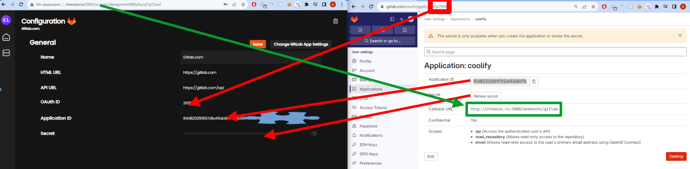

<!--
{
  "draft": false,
  "tags": ["Программирование"]
}
-->

# Настройка GitLab для Coolify

```blogEnginePageDate
18 ноября 2023
```

В прошлой статье - [Собственный Heroku](../СобственныйHeroku/index.html) - мы настроили Coolify. Из коробки он работает с GitHub.
Но вдруг вам захочется не раскрывать свои исходники, но в тоже время уметь их легко заливать в Coolify.

Для этого создадим новый Source, выберем тип GitLab. Теперь нам нужно заполнить несколько секретов и произвести
аутентификацию.

Чтобы узнать секреты создайте Application в настройках аккаунта GitLab. Должна получиться такая картина.



Хотел я сделать таким же образом мой сайт для перевода книжек в голос, но пока решил оставить его на GitHub. Если кому
интересно то вот он - [http://voice-book.stswoon.ru/](http://voice-book.stswoon.ru/)


