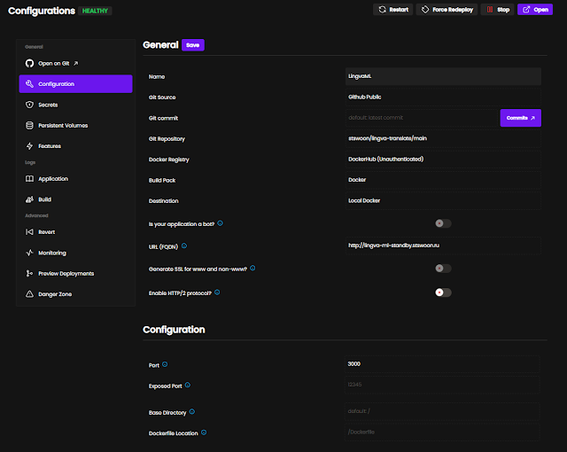
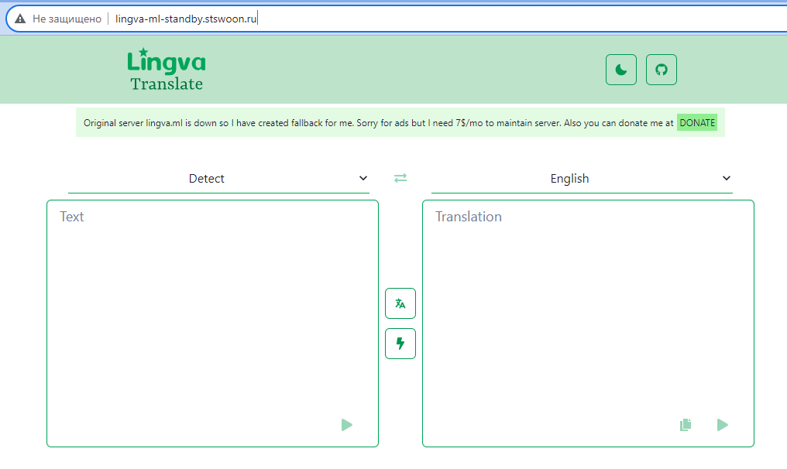

# Собственный Heroku

> 01 август 2023

### Проблема

Эх раньше был бесплатный [Heroku](https://www.heroku.com/), потом его
бесплатныеаналоги [Render и Railway](https://habr.com/ru/articles/702206/), потом другие. Но вот почти все они
закрыли бесплатные аккаунты. Где-то кусаются цены, а где-то не возможно оплатить с русской карты. Где-то есть
технические ограничения на CPU, память или даже ["эфемерное" дисковое пространство](https://render.com/docs/disks), что
не дает работать с файлами на диске.

### Решение

А не поставить ли докер на какой-нить VPS? Вот бы только еще дописать утилитку по выкачиванию гита и автоматического
разворота докера, да еще и UI админку для этого. И естественно при решении любой проблемы нужно либо спросить старшего
товарища, либо делать прототип.

Поэтому я пошел в Интернет и нашел там [Dokku](https://dokku.com/). Но установка и результат, судя по описанию, выглядят
не лучше своей поделки, на первый взгляд. Я порыл дальше и
нашел [аналоги Dokku](https://alternativeto.net/software/dokku/). Среди них я нашел [Сoolify.io](https://coolify.io/),
который выглядит многообещающим, хоть и стартовая страничка несколько перенасыщена цветами, на мой взгляд.

И... я не прогадал!

### Выбор VPS

Сначала покупаем VPS. Я выбрал [TimeWeb](https://timeweb.com/ru/), т.к. тут самые дешевые тарифы на тот момент были,
особенно по диску.

Я взял 1 CPU (правда в нем нет поддержки нейромодуля для программ на нейросети, но это другая история - расскажу ее
позже), 2 гига оперативки и 20 гигов диска. В принципе, чтобы поставить Coolify можно и меньше, но я оставил под будущие
проекты (потом расширил до 3 и 30 соответственно, т.к. 2+ проектам тесновато на 2 гигах).

Выбрал Debian 11, теперь подключаемся через SSH. Как это сделать можно посмотреть по аналогии с моей статьей про
[Настройку VPN](https://stswoon.blogspot.com/2023/07/vpn.html).

### Установка

Далее нужно выполнить одну команду из документации Coolify... но это не работает ... точнее не совсем.

1. Debian пустой поэтому сначала ставим sudo
   ```shell
   apt install sudo -y
   ```
   (-y это чтобы он не спрашивал "вы точно хотите установить 12KB" - мы тут пару гигов потом закачаем...)
2. Ставим curl (он юзается в скрипте позже)
   ```shell
   sudo apt install curl -y
   ```
3. Наконец ставим Coolify
   ```shell
   wget -q https://get.coollabs.io/coolify/install.sh -O install.sh; sudo bash ./install.sh
   ```
4. На вопрос "установить ли докер" соглашаемся.

И вуаля - готово - открываем в браузере ваш IPшник на порту 3000. Первый раз вводим почту и пароль. Больше никто не
сможет зарегаться (если не разрешите). Теперь можно раскатывать проекты.

### Раскатка из git-repository

Создаем Application. Указываем гит репозиторий, указываем ветку (обычно main). Выбираем тип Application, например
Docker.



В этом окне указываем Port, на котором стартует приложение в докере (обычно, как нас учил Heroku, порт считывается из
переменной PORT либо 3000). Указываем Exposed Port. Это позволит нам на IPшнике от VPSки открыть приложение.

Дополнительно я купил домен без https (для экономии). Создал сабдомены и указал их в URL (FQDN). Далее ждем от 1 до 24
часов, чтобы новый DNS "разлетелся" по Интернету и можем заходить на сабдомен. Он, за счет встроенного в Collify
reverse-proxy, откроет на них приложения (а то я уж было стал ставить nginx, а он не стартует - думаю, что такое - порт
занят - а кто занял - Coolify)

На скриншоте выше как пример взят
репозиторий [https://github.com/stswoon/lingva-translate](https://github.com/stswoon/lingva-translate), который основа
на lingva.ml модели. К сожалению их сайт по какой-то причине умер уже длительное время назад, а я его использовал в
своих пет-проектах (типа угадай-песню - [song-riddle](https://stswoon-song-riddle.onrender.com/)) для перевода. Вот
теперь если кому-нибудь понадобиться, то можете использовать для перевода сайт https://lingva-ml-standby.stswoon.ru/.
Сорри за рекламу на сайте, но нужно хотя бы VPS отбить, а то семья не поймет.

