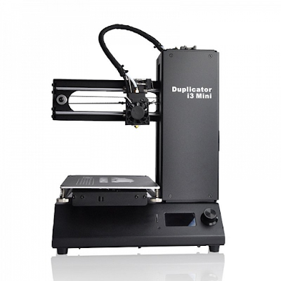
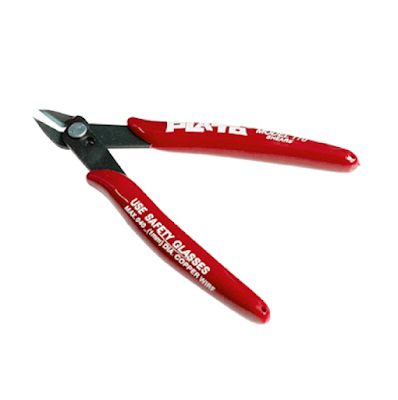
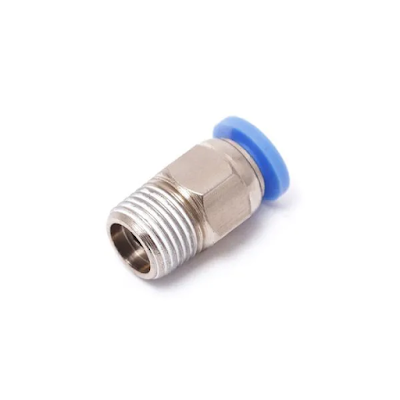
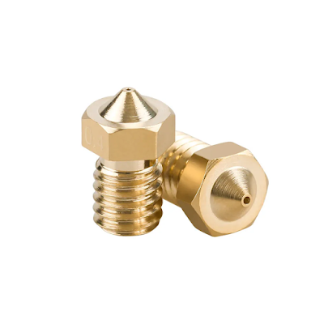
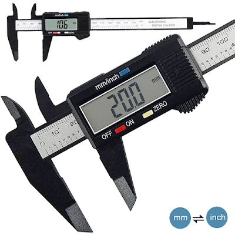
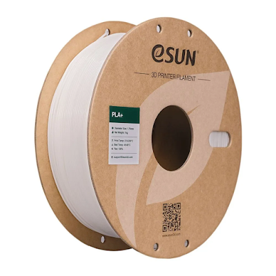
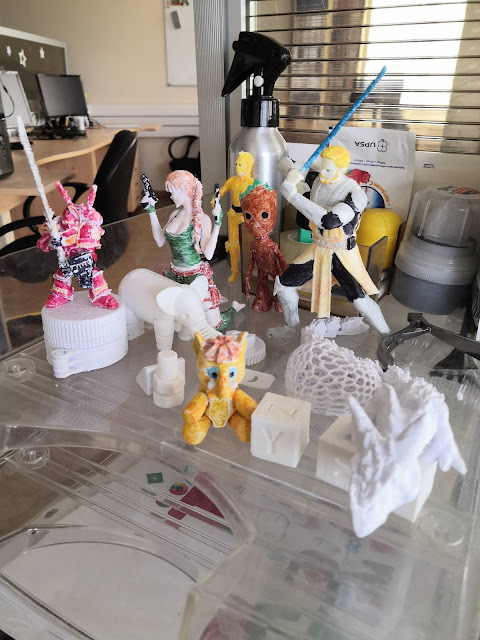
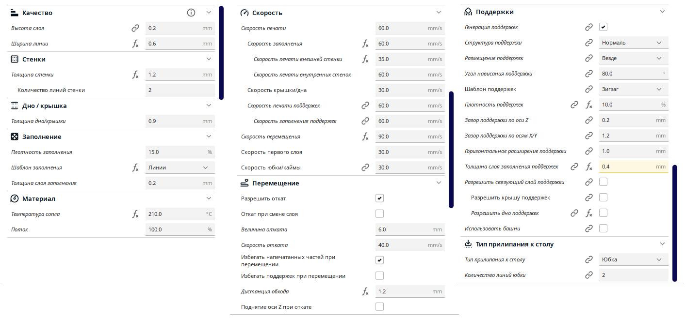
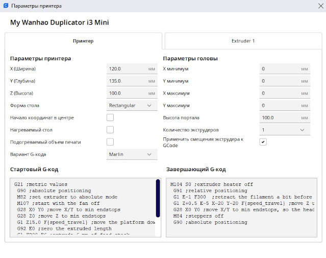

<!--
{
  "draft": false,
  "tags": ["Другое"]
}
-->

# 3D принтер

```blogEnginePageDate
03 апреля 2024
```

Купил я ребенку (оказалось себе) принтер на новый год
принтер [Wanhao Duplicator I3 mini](https://wanhao3d.ru/catalog/3d-printery/wanhao_duplicator_i3_mini/) за кажется 13к.
Это мой первый принтер, поэтому покупал в DNS, боялся заказывать из Китаю. По отзывам все хорошо было и он уже в сборе
поставлялся. Первая тестовая печать из подготовленных файлов с флешки прошла успешно, но очень долго - 6 часов на
носорога небольшого. Свои простые модели типа кубика тоже получилось сделать. А вот дальше начались проблемы. Поддержки
прилипают к детали их не отдерешь Печать начинает "полосить", получается объект как будто из паутины. В общем ужас. Как
я понимаю основная проблема принтера скорость вместо заявленных 70 мм\с можно печатать на 30 мм\с что очень долго.
Примерно 3 месяца я игрался и параметрами в Cura и наконец разобрался. Чем хочу и поделиться ниже. Но сперва закончим
секцию железо.



## Железо

По железу дополнительно докупил на озон бокорезы и обычный клей карандаш.



А вот из сложного доставал пластмассовый прут, а он сломался внутри. пришлось разбирать трубку - сломался держатель
трубы, который как бы своими железными "зубами" не дает трубке соскальзывать. Пробовал из подручных хомутов и гаек
сделать решении, но сила принтера такова, что выдавливает через пару часов печати трубку. Кажется нашел на алиэкспрессе
или озоне или в [https://3d-diy.ru/](https://3d-diy.ru/). Далее пришлось еще купить и трубку для подачи прута. А потом
еще искал тефлоновую
трубку внутрь хотенда, как раз на 3diy нашел.



> Кажется
> такой [фитинг](https://www.ozon.ru/product/fiting-dlya-plastikovyh-trubok-4mm-s-naruzhnoy-rezboy-1-4-820570871/) для
> 3д
> принтера я покупал, но это не точно.

Следующее что я решил сделать - поменять сопло на 0.6мм, чтобы хоть как-то увеличить скорость печати за счет большего
подачи пластика. И это оказалось классным решением. Во первых я смог повысить скорость до заявленных 60-70мм\с. Далее за
счет толщины слоя получаются более прочные детали, поэтому вместо 3 стенок я могу печатать 2. Вообще надо было печатать
всегда 2 стенки, если не нужна супер прочность но на старом сопле частенько появлялись дыры и нужно было 3 стены. Далее
я теперь могу печатать слоем 0.2мм или даже 0.3 мм вместо 0.1мм (конечно из-за этого и большей ширины слоя портиться
детализации и увеличивается процентов на 20% потребление пластика). Ну и наконец я смог настроить более тонкие поддержки
в 0.2мм что позволяет их легче отделять. В результате скорость печати увеличилась примерно **в 2.5 раза**. Т.е.
человечка во весь рост (10 см) я могу напечатать за 2-3 часа вместо 6 часов. Он получается более прочный и уменьшилось
количество сбоев. Например бывало что по оси х дернется принтер и все слои на 1мм сдвинуты приходилось стопать печать и
начинать заново. А 6 часов это значит у менять только 1-2 попытки в день, т.к. опасненько оставлять принтер без
присмотра.



> Примерно [такое](https://www.ozon.ru/product/soplo-dlya-3d-printera-e3d-0-4mm-dlya-3d-printera-1-sht-588019424/) сопло
> только под 0.6мм.

Но сопло которое мне нужно я не смог найти, все подобрал кроме лощины внутренней. И тут меня поразила мысль ведь латунь
наверняка мягче чем металл. В результат вооружившись дрелью и пассатижами просверлил нужны мне диаметр, использовав
маленькое сверло.

Однако и тут меня ждала подстава. Изначально я начал использовать сопло чуть длинее чем было, из-за этого нижняя часть
не сильно сдавливала хотенд и почему-то только через пару месяцев пластмасса начала вылезать из всех щелей между
хотендом, соплом и радиатором. Поэтому сменил на меньшее длину и потуже затянул. Так что добавим еще к списку железа
маленькое сверло, и маленький гаечный ключ для откручивание сопла (это нужно делать на разогретом сопле, чтобы не
повредить)

Также я немного повредил поверхность печати, но не критично да и есть запасная наклейка.

Еще из интересного распечатал проставки под пружины, удерживающие поверхность печати, чтобы она меньше разбалтывалась и
реже нужно было делать калибровку стола.
Дополнительно еще нужно прикупить очки, чтобы при резки ножницами лишней пластмассы в глаза не попали в глаза.

Клей карандаш, чтобы наносить на поверхность для того, чтобы первый слой приклеился.

Однажды возникла проблема - застрял пруток в хотенде и не получалось его вытащить. Помог совет разогреть хотенд до 250
градусов, чуть подождать - пластмасса застрявшая внутри станет жидкой и получилось вытащить.

Еще один важный предмет - электронный штангенциркуль, очень удобно - обмерил много разных деталей, дополнительные "
ножки" позволяют мерить внутренние и внешние диаметры, высоту и др. Не нужно думать какое число на линейке получилось,
электронный циферблат сразу показывается. Жалко угол не мерит, пришлось тригонометрические формулы вспоминать.



Прошивку побоялся обновлять, т.к. находил в инете много отзывов с окирпичиванием принтера, решил не рисковать.

Еще ода не маловажная делать - это сырье. Печатал PLA пластиком. Но потом решил перейти на PLA+. Он чуть более прочный -
условно на 20%. Правда и стоит где-то на 20% дороже. Для него пришлось заново подбирать характеристики, основная -
повышение температуры до 210C и необходимость использовать клей карандаш. На PLA частенько удавалось печатать без клея,
т.к. он лучше приклеивался к столу. Причем интересно что даже цвет влияет на качество печати. Брал холодный-белый и
теплый-белый одной фирмы и последний лучше печатает и гораздо лучше (более гладко) выглядит. Я покупаю пластик от eSun (
[например](https://www.ozon.ru/product/plastik-dlya-3d-pechati-pla-pla-material-dlya-3d-printera-esun-1-75-mm-1kg-belaya-306557972/?advert=geHUTYZje8inE7IJall3v-rlTJnPbNuj3TpSYyC7LIBnYxUGLc8gTtuwGcbRhNSzKeJFsHr5wH01NYlcQU1dVfFDaEId2REUNXPVJejcGl7jDttg4st2qpDDLTqDmryl38jGTiz4BduFOroTFIwXlhCKKn80By_Tq5CgNqaQp7l1GBn9sFw70v9iemTaAAENm2OmdXtRBrs82Pdia04impixPEdRNFTjkjtO9ZhTwDdIR3ni1BfmaxIKPtW3U2eQm_h5ljrgELy08oE22fQmhhwxmP6h2YQeFhNRZTVYBCfg6rCOHZ1HbnVAnKuWDgEsLHO3Q-PnSSp5l_6g-r9mzJyRpQTrvnI&avtc=1&avte=2&avts=1712127048&keywords=esun+pla+plus)).



Белый пластик я беру потому что его можно раскрасить, например чуть более профессиональьными чем дествие фломастеры.
Взял у детей коробок где было 100 фломастером и он цвет отлично сел. Вот примеры работ.



Еще можно заниматься пост обработкой, но больно кропотливо. Есть какие-то ультрафиалетовые бани за 20к. Можно еще купить
сушилку для катушки, т.к. влага из воздуха портит пластик. Не замечал особо, у меня пластик по полгода лежит в открытом
виде. Единственно пару раз пруток действительно сломался в месте входа в принтерную трубку, поэтому если я не печатаю
больше недели, то вытаскиваю филамент из принтера.

Однажды сломалась тонкая ножка тяжелой модели при падении, хотел склеить но момент вообще не берет PLA. Тут нужен
какой-то хитрый клей по пластмассе, видимо типо как для моделек. Я для себя
нашел [Okong C-501](https://www.ozon.ru/product/mega-kley-stroitelnyy-super-kley-momentalnyy-okong-c-501-20-ml-0-02-kg-1-sht-847234344/?advert=VcDgR7mCM8ipFGVev-fEELS8WXnlkaeC7N_Xq08A4stgVqvBaf3UZSRLq4DKJY3wRBfL5SJMb2Y61kh2uUH2GLL98R9g3tdvKUb69_SzTe37PMs2orSbAyHW4OhJ7Ps4a35Sy7jXiNcbP23lbwTfvmNka9XKtLdHrLjwJLI-2RACp3objvX_yMB7YCSOz6m81FEwxmffhEG5sxfUihSyvTIIaLyowzRbY2qj2CS7cNTp-33obAlbrt-TNRPye521feR_yJXW4j2nFrNL40dl_fz1vsDhDYIaizu7UT97vifwKeRzKAVqIL0Iuyi5C6-Sl2H0PBGBzHu9o1sBvz40ZZVBnmiC7w&avtc=1&avte=2&avts=1712162322&keywords=%D0%BA%D0%BB%D0%B5%D0%B9+okong),
но склеивает пальцы за секунду потом кожей немного отдирается.

## Софт

Во первых нужен слайсер. Тут не долго думая я выбрал Cura, на тот момент наиболее распространенная программа.

Далее искал сайты где можно взять 3д модели и нашел примерно такие:

* [https://cults3d.com/](https://cults3d.com/)
* [https://3dmag.org/](https://3dmag.org/)
* [https://3dtoday.ru/](https://3dtoday.ru/)

Тут главная хитрость когда ищещь деталь добавить в начала запроса слово **stl** (это расширение фалов, которые
используются
часто для моделей для 3д принтера, хотя модно легко из obj сконвертировать).

Если возникают проблемы в принтере то можно почитать сайты, там собраны основные проблемы, с которыми можно столкнуться:

* [https://3dpt.ru/page/faq](https://3dpt.ru/page/faq)
* [https://3d-diy.ru/wiki/3d-printery/osnovnye-problemy-3d-pechati-sposoby-ih-resheniya/](https://3d-diy.ru/wiki/3d-printery/osnovnye-problemy-3d-pechati-sposoby-ih-resheniya/)
* [https://3d-diy.ru/wiki/3d-printery/rukovodstvo-ustraneniyu-problem-3d-pechati/](https://3d-diy.ru/wiki/3d-printery/rukovodstvo-ustraneniyu-problem-3d-pechati/)
* [https://cvetmir3d.ru/blog/poleznoe/problemy-3d-pechati-i-varianty-ikh-resheniya-ustranenie-prichin-defektov-i-oshibok-vo-vremya-pechati/](https://cvetmir3d.ru/blog/poleznoe/problemy-3d-pechati-i-varianty-ikh-resheniya-ustranenie-prichin-defektov-i-oshibok-vo-vremya-pechati/)

Для вдохновения можно посмотреть каналы:

* [https://www.youtube.com/@voltNik_channel](https://www.youtube.com/@voltNik_channel)
* [https://www.youtube.com/@SorkinDmitry](https://www.youtube.com/@SorkinDmitry)
* [https://www.youtube.com/@3d-diy](https://www.youtube.com/@3d-diy)

Самое важное искал программы для 3д моделирования:

* [blender](https://www.blender.org/) - бесплатное по, но оно больше для скульптинга, можно на нем и детали
  моделировать, но мне показалось сложноватым
* [vectary 3d](https://www.vectary.com/) - позволяет работать с 3д примитивами, почти все параметры можно задать в
  цифрах + удобно на слабом компьютере, работает через браузер.
* [TinkerCad](https://www.tinkercad.com/) - еще одна программа для работы с 3д примитивами от известной фирмы AutoDesk,
  даже проще чем vectary, на мой взгляд, однако нет возможности двигать предметы через заданич чисел, поэтому сложно
  сделать точную деталь по размерам.
* [Autodesk Fusion 360](https://www.autodesk.com/products/fusion-360) - говорят удобная программа для чертежей, чуть
  проще чем топовых продукт для профессионалов. Однако требуется средней мощности ПК.
* [DesignSpark Mechanical](https://www.rs-online.com/designspark/mechanical-software) - еще одна программа для чертежей,
  аналогично Fusion 360, но работает на маломощный ПК, однако есть некоторое количество глюков, не удобностей, но
  работать можно.
* [3DF Zephyr](https://www.3dflow.net/3df-zephyr-photogrammetry-software/) - еще одна классная программа, реализует
  подход фотограмметрии, когда объект сфотканный вокруг склеивается
  в программе и получается 3д модель. Аналог 3д сканера, но без необходимости его покупать. Точность меньше, но зато
  можно моделировать огромные объекты, для такого сканеров нет. Баловался но для печати не очень получились объекты,
  хотя в инете полно роликов, где этот подход плюс-минус сработал.

## Параметры печати Cura

### Параметры для сопла 0.6мм

* Параметры для печати на сопле 0.6 - [my0.6-v15](my0.6-v15.curaprofile)



Во первых предлагаю сделать видимыми следующие параметры.

**Высота слоя** - для быстроты печатаю на 0.2, можно даже 0.3, если не нужна прочность (т.к. спекаемость слоев может
стать хуже), и детализация. Вообще высоту слоя предлагают выбирать от 25% до 100% от ширины сопла.

**Ширина линии** - соответственно ширина отверстия сопла, однако можно печатать любым соплом чуть более толстые (вокруг
отверстия есть ширина стенок и принтер может как бы выдавливать чуть больше пластика) или тонкие линии (принтер как бы
быстрее двигает сопло и пруток быстрее вытягивается), например более тонкие линии я использую в поддержках, т.к. 0.6мм
поддержки очень трудно отрезать, слишком плотные получаются.

**Толщина стенки** - ставят кратное диаметру сопла. Для обычных моделей достаточно две стенки, соответственно в моем
случае 0.6х2=1.2мм. Если нужны более прочные модели то можно поставить 3 стенки или даже 4. На одной стенке моели могу
получиться слишком хрупкие и просвечивающие на свет.

**Количество линий стенки** - связанный с толщиной стенки параметр, обычно выставляется автоматически.

**Дно\Крышка** - поставил 0.9, нужно быть кратным высоте слоя иначе принтер будет округлять в какую-то сторону. Однако
как вы могли заметить у меня шаг 0.2 обычно. Крышку лучше делать в больше слоев чем стенки, т.к. иногда на плоских
поверхностях могут появиться пропери из-за сложности печати навесу например. Видимо 0.9 я поставил если переключусь в
режим 0.3 высоты слоя и забуду поменять крышку.

**Плотность заполнения** - 15% (для скорости, и когда мало плоских деталей, например в моделях человечков их мало)
иногда даже ставлю 10% (обычно не хватает), рекомендуют ставить 20% или даже 30% для того чтобы принтеру проще было
печатать
плоские крыши. Также есть хитрость что если нужно 100% заполнения, то возможно лучше поставить большое количество
стенок, это может оказаться быстрее и прочнее.

**Шаблон заполнения** - линии - нет смысла менять, наиболее удобное заполнение

**Толщина слоя заполнения** - поставил аж 0.2, наверное для экономии скорости и пластика, наверное можно поставить 0.4

**Температура сопла** - нужно подбирать под пластик, для белого PLA+ от eSun у меня получилось 210, хотя иногда печатаю
на 205 и даже 200, ниже совсем плохо, может филамент начать застревать. Но и больше не хочется, в рекомендация 220, но
из-за сопла 0.6 появляются так называемые сопли\нити, при перемещении между частями сложно рельефных деталей принтеру
нужно без печати перетащить сопло, и пока он перетаскивает пластик чуть вытекает и появляется нить тонкой паутины из
пластика, которых очень много. Для обычного PLA я использовал 190.

**Поток** - если стенки модели получаются с прорехами, можно попробовать увеличить поток пластика например поставить 105
или
110, больше это значит нужно искать проблемы в другом. Хотя обычно всегда 100% должно удовлетворять.

**Скорость печати** - 60мм, можно даже 70, но иногда появляются артефакты, поэтому решил снизить. Остальные параметры в
обще зависят от этого и автоматически настраиваются. Для печати шурупов можно снизить скорость вдвое до 30мм.

**Скорость заполнения** - 60мм - на максимум (кажется из-за заполнений и поддержек, которые идут более тонкими линиями
пришлось снизить скорость чуток с 70 до 60, иначе принтер не успевал выдавливать и они не успевали напечататься и дальше
модель проваливалась)

**Скорость печати внешней стенки** - 35мм (обычно 0.5-0.7 от скорости, чтобы было более гладкая поверхность), видать 0.5
от 70 осталось у меня.

**Скорость печати внутренних стенок** - 60мм - на максимум.

**Скорость перемещения** - поставил 90, не уверен что это работает, вероятно на 70 ограничение идет. Со скорость также
есть проблема в ускорении - нужна твердая поверхность иначе принтер дергается от ускорений, хотя он у меня стоит на
маленьком столике сейчас, который от принтера чуток ходит ходуном и модель все равно получается.

**Скорость первого слоя** - 30мм (обычно половина от скорости), занижают чтобы пластик к поверхности приклеился - именно
этот момент важно контролировать в начале печати, если не приклеится модель точно нужно стопать и начинать сначала. Либо
клея мало, либо с прошлого раза много и надо почистить стол, либо калибровку стола нужно сделать - пластик не
придавливается к столу. Первый слой это на самом деле все слои ниже параметра толщина дна.

**Скорость юбки\каймы** - 30мм (такая же как скорость первого слоя)

**Разрешить откат** - включено (далее true) - разрешает принтеру втянуть пруток назад чтобы например переместиться на
другую позицию без печати, нужно чтобы не "капал" пластик, чтобы не появлялись паутинки.

**Величина отката** - 6мм, если ставить больше бывало что обратно он не мог его втянуть, т.к. видимо выходил из сопла, а
при входе задевал за что-то.

**Скорость отката** - 40мм - пусть будет такая, чтобы сильно прут не мучить.

**Избегать напечатанных частей при перемещении** - true - чтобы принтер случайно не задел модель и не сдернул ее со
стола.

**Избегать поддержек при перемещении** - false - вроде не было с ними проблем да и они менее монументальны.

**Дистанция обхода** - 1.2 мм - при обходе деталей идет на расстоянии двух стенок, половина значения на сопло, вторая на
стенку сопла.

**Поднятие оси Z при откате** - false - по идее чтобы не объезжать деталь модно поднять сопло, но говорят что при
опускании могут быть ошибки, может в новых принтерах этого уже нет.

**Генерация поддержек** - обычно стоит true. Но. поддержки всегда портят гладкость поверхности. Поэтому генерирую
нарезку и смотрю где поддержки. Если их не много, то старюсь сделать без них. Например принтер может печатать так
называемые мосты, когда есть две опоры, и пару см он может провести поверхность без поддержек. Или даже может печатать
небольшие выступающие навесы в пару миллиметров, за счет склеивания боков и добавлении чуток наклонов. Также стараюсь в
некоторых местах обойтись самодельными поддержками через Custom Support аддон.

**Структура поддержки** - нормаль - это просто прямые снизу вверх. Еще есть тип дерево - получаются эдакие тентакли,
тратит много пластика и на моем принтере что-то не получаются. Однако позволяют сделать поддержки всегда снизу и
уменьшить площадь прикосновения, что хорошо сказывается на гладкости поверхности.

**Размещение поддержек** - везде стоит по умолчанию, опять же чтобы увидеть проблемные места. однако всегда ставлю тип "
от стола" иначе поверхность сверзу куда и попадает обычно глаз будет безнадежно испещрена.

**Угол нависания поддержки** - 80, чтобы поменьше было поддержек, а то на 50 их очень много и замучаешься их отдирать.
Обычно я даже ставлю 85 или 89 если позволяет модель по ощущениям. Разницы между 86,87,88 и 89 не вижу также как и между
81,82,83,84 и 85. На 90 поддержки вообще не геренируются.

**Шаблон поддержек** - зигзаг - наиболее удобный, другими не пользуюсь.

**Плотность поддержек** - 10% - чтобы было легче резать

**Зазор по оси Z** - 0.2мм - ставлю пропуск одного слоя (высота шага), т.к. два слоя деталь может упасть, а 0 слоев
поддержка слишком прикипает к детали, а так за время печати одного слоя ей удается чуть остыть. Также большой пропуск
может плохо сработать когда поддержка печатается на детали - может не приклеиться и отвалиться.

**Зазор поддержки по осям Х\Y** - 1.2мм - две толщины сопла, идея таже не приклеиться к детали, тут как раз 1-2 мм можно
отступать спокойно, т.к. принтер сможет напечатать навесы, но больше 1 мм не вижу смысла, т.к. поддержка никак не сможет
прилипнуть по горизонтали.

**Горизонтальное расширение поддержки** - 1мм - по идее поддержка может расширяться от низа к верху, но что-то видимо не
смог настроить, ни разы не видел.

**Толщина слоя заполнения поддержек** - 0.4мм - вот тут как раз соплом рисуем более тонкую линию, иначе бокорезами
тяжело резать поддержку. Больше 0.4 нет смысла делать. 0.2 - возможно слишком слабая поддержка для веса детали.

**Разрешить связывающий слой поддержки** - false, открыл видимость для двух характеристик ниже, но false т.к. не
пользуюсь, показалось что не дает полезности.

**Разрешить крышу поддержек** - false - печатает слоя на конце поддержи, потом уже на него печатает деталь, показалось
что отдирать поддержи стало тяжелее.

**Разрешить дно поддержек** - false - тоже что и выше.

**Использовать башни** - false - поддержи иногда превращаются в цилиндры, но тоже выглядит что обычна поддержка лучше.

**Тип прилипания к столу** - юбка - если у модели есть достаточная основа или много поддержек которые позволяют ей
удержаться на столе. Также Юбка не соприкасается с моделью поэтому ее не нужно отрезать. Другой вариант Кайма - тут
появляется дополнительный 1 слой который прилипает к модели и создает площадь прилипания, но ее приходиться отделять,
довольно просто, но чуток остается. Например ее использую для ног. Остальные виды кажется бесполезными.

**Количество линий юбки** - 2 - достаточно чтобы хотенд выплюнул пластик, обычно даже половины "круга" хватает.

**Ширина каймы** - 2мм там где достаточная площадь, но обычно ставлю на 4-6мм если модель никак не хочет держаться.

**Количество линий каймы** - выставляется автоматически из предыдущего параметра.

**Кайма только снаружи** - false - обычно все-таки удобно когда кайма и поддержки под моделью сторит.

### Параметры для сопла 0.4мм

* Параметры для медленной печати на сопле 0.4 - [slow0.4](my2.curaprofile)
* Параметры для более быстрой печати на сопле 0.4 - [fast0.4](my4-fast.curaprofile)

### Параметры стола

Изначально программа выставляет стол размером 10х10х10 см. Однако на самом деле с принтера можно двигать горизонтальные
оси чуть больше. Можно еще говорят поставить прошивку, которая использует всю ширину стола в 20см, но я побоялся
окирпичить принтер. Мне нужно было напечатать дракончика. Он был сделан под принтер в 20х20 по горизонтали, я и так его
по диагонали ставили и уменьшал, и получилось распечатать на 55% масштаба. Но хотелось еще выиграть пару процентов,
поэтому настроил стол побольше и получилось до 63% поднять показатель ну и качество детали, т.к. дракончик был
двигающимся. Как скачать профиль принтера я не нашел поэтому показываю картинкой. Получилось увеличить стол до
12х13.5х10см:



### Аддон для поддержек

Иногда не нравятся как Cura делает поддержки и хочется сделать их самому или добавить дополнительные. Соответственно
установил плагин [Cura Custom Support](https://marketplace.ultimaker.com/app/cura/plugins/5axes/CustomSupportCylinder).
В основном использую цилиндры для поддержки.

### Печать с разными параметрами для частей модели

Как то раз понадобилось мне часть модели напечатать с меньшей скоростью (в целом получилось, но это не помогло мне, все
равно конец делали на рожок мороженного походил). Пользовался
этой [инструкцией](https://www.youtube.com/watch?v=miwmP_r87ns). В целом нужно сделать следующее:

* Устанавливаем аддон Custom Support из раздела чуть выше.
* Выделяем кубом часть модели
* У куба меняем параметры печати:
    * Ставим параметр печати обычная модель вместо поддержки
    * Выбираем параметры, к сожалению не все параметры можно менять, например можно менять плотность заполнения,
      скорость, а вот температуру нет.

## Стоимость печати

Пластик PLA+ на данный момент стоит 2100р за 1кг (обычный PLA где-то 1500р). Таким образом 1 грамм - 2.1р. В слайсере
Cura можно посмотреть сколько пластика потратиться вместе с поддержками (зависит от параметров пластика установленных в
программе, но обычно совпадает, проверял на весах). Но обычно никогда деталь не получается как нужно с первого раза
поэтому нужно заложить x2, на самом деле в половине случаем мне приходилось в новых деталях стопать деталь в начале и
перезапускать. Поэтому рекомендую брать x3 запас.

Также есть еще электричество, + расходники для принтера, сопла, трубки, хотенды, клей + работа по запуску принтера,
работе в Cura, отрезка лишнего. Наверное получается еще x0.5 от стоимости пластика. По электричеству считал так -
15грамм это примерно час работы моего принтера, в инете говорят, что принтер потребляет до 0.25 кВтч, а стоисость вроде
как 5.5р за 1кВтч, т.е. 1 грамм пластика дает = 5.5 * 0.25 \ 15 = 0.1р

Амортизация принтера, не знаю как посчитать надо стоимость принтера поделить на количество печатных граммов но у меня
нет статистики сколько выдержит принтер. Условно считаю x0.5-x1

Еще хотелось бы добавить заработок оператора также x0.5-x1 (частично это зависит от опыта в экономии пластика в первом
параграфе).

Еще есть постобработка - но я не занимаюсь ей.

И еще есть стоимость моделирования \ скульптинга, но это отдельная тема).

Получаем от x4.5 до x5.5 при цене 2.1р за 1 грамм пластика.

**Итого в среднем 10р за 1 грамм филамента в модели по данным Cura.**

-----

PS: еще один полезный сайт по вопросам 3д
печати - [https://3dpt.ru/page/faq#description-6](https://3dpt.ru/page/faq#description-6)
