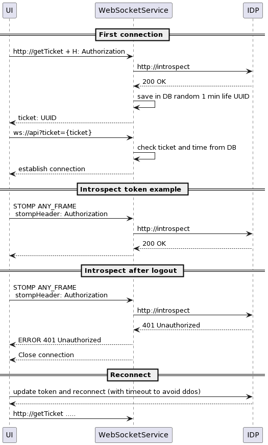

# WebSocket Security

> 22 апреля 2024

В случает REST запросов для авторизации нужно отправить токен авторизации в хедере или в куки.

Но в случае вебсокетов возникают проблемы. Во первых веб сокеты с именно браузера (бек-2-бек позволяет добавлять хедеры)
не разрешают добавлять кастомные хедеры (можно только указать версию протокола и в нее хаком воткнуть токен). Во вторых
вебсокет держит соединение, т.е. если у вас протухнет токен, то соединение все равно останется.

Я искал в интернете разные решение и в целом пришел к схеме, которую расскажу ниже. Список источников я уже забыл, но
помню что был один из документации по вебсокетам в Spring (Java), а другой вебсокеты в Heroku, которые также подводили
меня к этой схеме.

**Первый вопрос - проверка токена при запросе**. Сразу в момент соединения нужно понять стоит ли открывать коннекшен,
для этого подходит токен в куках, т.к. первичное соединение идет через HTTP, потом браузер и сервер автоматически
переводят соединение в WS, которое уже работает поверх TCP.

Если куками пользоваться нельзя, то можно пойти по пути дополнительного запроса в сервис, которые генерирует
короткоживущий рандомный ИДшник, и уже его передавать в квери параметрах и валидировать его. Можно и сам токен отправть
в квери параметрах, но это считается менее секьюрным. Чтобы валидировать ИДшник его с таймстемпом нужно положить в базу,
либо распрделенный кеш для микросервисов.

**Второй вопрос - как прервать соединение если токен протух**. Для этого предлагаю при каждом входящем соединение
присылать токен снова (если он не в куках). Если токен в куках, то добраться к немы видимо не получиться, т.к. обычно
они с ключем http-only и js их не увидит, только браузер и сервер. Тут наверно могу предложить решение открывать
соединени например на 5 минут и потом сервер должен его разорвать, чтобы клиент пришел с новой кукой.

Чтобы прислать токен можно сделать собственный формат сообщения, либо воспользоваться протоколом STOMP. По сути он
просто регламертирует в каком формате отправлять текст и соотвественно у него всегда есть текстовый блок HEADERS, хотя
конечно [STOMP](https://stomp.github.io/stomp-specification-1.2.html) заточен под MQ подход в большей степени. Далее
токен нужно валидировать. Но полноценная интроспекция токена возможно окажет дополнительное аффект на IDP (Identity
Provider service). Поэтому можно как вариант экономить и отправлять только через каждые 5 минут. Тут есть ассампшен что
пользователь сможет получать сообщения еще 5 минут после протухания токена, но возможно это не критично если WS
использвется для информирования. Если же через WS в вашем решении можно влиять на состояние сервисов, то наверно стоит
проверять каждый раз. Исключение составляют технические сообщения типа ping-pong, heart-bit, которыми пользуется
протокол WS для понимания не пропал ли сервер\клиент.

Также обращаю внимание что в случает если по WS соединение удалось понять что токен протух то нужно сообщить клиенту об
это и разорвать соединение. Аналоги 401 в REST запросах. А дальше клиент решит что делать, например взять и обновиться.

**Третий вопрос - стоит ли валидировать токен при исходящем от сервер сообщении**. Из второго вопроса вытекает третий.
Если мы валидируем токен на входящее сообщение, то почему бы не валидировать токен на исходящем от сервера. Тут уже в
целом согласен с рекомендацией спринг документации. Во первых сообщений может быть много от сервера к каждому клиенту и
это даст дополнительную нагрузку, во вторых обычно клиент может подделать токен, а серверу мы доверяем и не зачем тогда
его валидировать. В третьих возмножо у сервер и нет токена, например сообщение из кафки пришло от внешней
инфраструктуры, у которой токена юзера нет. А хранить токен юзера в WebSocketService тоже нельзя, т.к. это нарушает
серьезно секюрити, потому что наврят ли тот кто будет писать WebSocketService сможет реализовать тот же уровень защиты
что и IDP, да и токены по идее должны зраниться только в одном месте - в IDP. Хотя если у вас монолит что вероятно IDP
это тот же WebSocketService и тогда вы можете это сделать, если данные во WS каналу действително стоит секьюрить
настолько.

Исходный код прототипа можно найти
тут - [https://github.com/stswoon/ws-security-example](https://github.com/stswoon/ws-security-example)