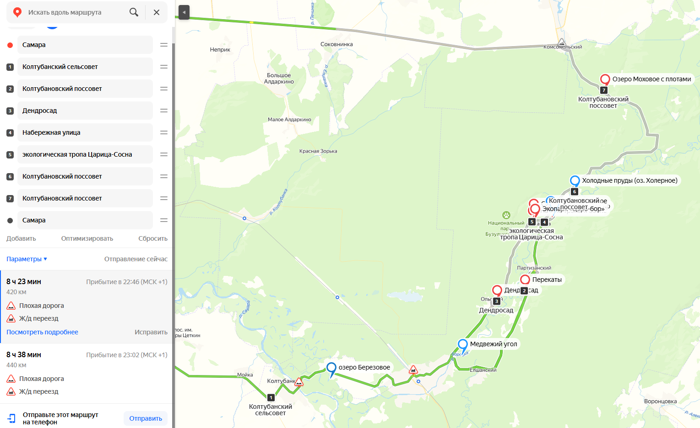

<!--
{
  "draft": "false",
  "tags": ["Путешествие"]
}
-->

# Путешествие: Бузулукский Бор

```@blogEngine:pageDate
04 ноября 2024
```

Информацию о Бузулукском Бору можно найти на официальном сайте - [https://npbuzbor.ru/](https://npbuzbor.ru/). Там же
можно купить билеты, всего 200р со взрослого человека. Бузулукский бор - это набор нескольких интересных мест. Наиболее
известные - это эко-тропа до царицы сосны **Царь-Бор**, где можно посмотреть почти самую высокую сосну в мире (2-ое
место), дети могут побегать по парку, покататься на качелях. Далее я бы отметил место - **Перекаты** - тут можно
посидеть на пляже и отдохнуть (мы ездили в начале осени). И место - **Паникинский Яр**, где можно постоять на парапете
над пропастью в реку. К сожалению нам не хватило осеннего светового дня чтобы доехать до конца бора, поэтому придется
ехать еще разок&nbsp;)). Оставляю ниже мой маршрут и места, которые я отобрал для просмотра, т.к. на каждом озере
останавливаться - не хватит времени.

Путь от Самары до Самары через основные
точки - [https://yandex.ru/maps](https://yandex.ru/maps/?ll=52.156889%2C53.017997&mode=routes&rtext=53.195878%2C50.100202~52.929576%2C51.893031~52.989039%2C52.125711~52.983122%2C52.100308~53.027135%2C52.144126~53.027502%2C52.132935~53.044115%2C52.172082~53.100580%2C52.199199~53.195878%2C50.100202&rtt=auto&ruri=ymapsbm1%3A%2F%2Fgeo%3Fdata%3DCgg1MzEwNTMxNhIa0KDQvtGB0YHQuNGPLCDQodCw0LzQsNGA0LAiCg2bZkhCFZTIVEI%2C~~~ymapsbm1%3A%2F%2Forg%3Foid%3D174720680678~~~~~ymapsbm1%3A%2F%2Fgeo%3Fdata%3DCgg1MzEwNTMxNhIa0KDQvtGB0YHQuNGPLCDQodCw0LzQsNGA0LAiCg2bZkhCFZTIVEI%2C&source=constructorLink&um=constructor%3A3e2a2ab866937645b2142f9545fec472e8d68c371297d95e6d659d03c8ae08fc&z=13.51) -
возле Паникинского Яра можно пешеходом дойти до Царь Бор, т.к. автомобильный мост сломан, а пешеходный есть. Причем
только на яндекс картах это было указано, на других картах мост еще существует почему-то. Если же время есть то можно
развернуться и сделав крюк доехать до Царь Бора и поехать потом дальше на озера, но повторюсь светового дня не хватило.
Возле перекатов также есть еще хаски-парк, а с другой стороны эко-тропа по лесу, которая видимо идет через весь лес. Еще
один вариант остановиться в гостинице в Панике, если хочется удлинить путешествие с одного до двух дней. Также отмечу
что заезжали мы через деревню Колтубанка по добротному понтонному мосту, по которому многие ездят, чтобы не делать крюк
через Бузулук.



Также прикладываю оффлайн точки
интереса - [оффлайн точки](https://drive.google.com/file/d/1178NoJYlpJp9y0MG_WBPMvqrH03dh-dI/view?usp=drive_link%C2%A0).