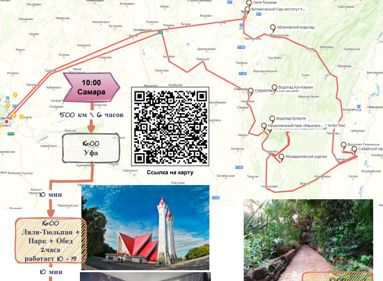

<!--
{
  "draft": false,
  "tags": ["Путешествие"]
}
-->

# Путешествие в Башкирию

```blogEnginePageDate
06 сентября 2024
```

Путешествие в Башкирию решили сделать в августе, т.к. говорят в июне много клещей. Однако дождь лил как из ведра в
начале поездки и периодически лил в течении всего путешествия, поэтому не получилось посетить множество мест. Да и дети
устали, видимо придется ездить без них. Тем не менее мы везде проехали на кроссовере и наверно было всего 1 место (по
разрешенной для проезда, но разбитой, дороге в природном парке Башкирии), где на моноприводе пришлось бы проходить
ходом.

Предоставляю карту путешествий если кому она будет полезна - маршрут на неделю по основным точкам:

* [pdf с маршрутом](https://drive.google.com/file/d/1hvacVhrvtWByEMC3iYThM6BL--UafvU8/view?usp=sharing)
* [координаты](https://drive.google.com/file/d/1lA6GvBsx_fDol9fPzbbnBfGdWiB3zszU/view?usp=sharing)



Отмечу некоторые моменты. В Сибайский карьер попасть нельзя, она закрыт и затоплен. Ляля- Тюльпан в живую смотрится
попроще чем на фото, зато рядом есть парк победы, где можно погулять. Площадь Салавата Юлаева гораздо меньше, чем то что
я видел в видео от Орел и Решка. Абзановский водопад можно посмотреть, но останавливаться на ночь там не зачем.

А вот водопад Гадельша красив. Подъехать к нему из-за грязи не удалось, так что проще от парковки с турбазы к нему
стартовать. До таблички с началом тропы дойти легко. А вот дальше есть две дороги, по низу и вокруг через горы. Я видел
комментарии, где говорилось о легкости дороги, но с детьми там не пройти, приходиться проходить по скользким камням
реки, залазить по крутой тропинке, цепляясь руками и ногами за камни. Путь в 500 метров превращается в полтора часа, за
счет подъемов и спусков. Мне понравилось, можно дойти без подготовки, но только взрослым. В результате мы потратили
примерно весь день на эту точку вместо 3-5 часов. На всякий случай, мы пошли по нижней дороге, которая на карте была
отмечена как более легкая.

В Сибае мы остановились в
гостинице [Алтынай](https://yandex.ru/maps/org/altynay/1280416967/reviews/?ll=58.607224%2C52.739095&mode=search&sctx=ZAAAAAgCEAAaKAoSCcQLIlLTDElAESAJ%2B3YSmUpAEhIJnZ53Y0Fh0z8RP3EA%2Fb5%2Fuz8iBgABAgMEBSgKOABA%2B1ZIAWJIcmVhcnI9c2NoZW1lX0xvY2FsL0dlby9NZWRpYUZsb3cvU3Rvcmllc0NvbnRlbnRUeXBlPW9sZF9tZWRpYV9jbGFzc2lmaWVyagJydZ0BzcxMPaABAKgBAL0BoVFxx8IBiQG7l92t6AS2z9iUiQXbocmgBsWkrOKAAd%2BHktHjA%2Bf0gNf0AezL5JPeBNu0xa6mAr%2BK8Nu1Br3QwJYGpdO4qATN37DGhwGd%2BsOQnwbAocjKBuDfxYMxhc3fwgSUgPLkA%2F6Ivp2aBt%2BFuPTCAa%2Bju%2FkXs%2FKC5gPt3LH1A8CSvOcDn6uB%2FgSRw%2Bf9BIICIdCz0L7RgdGC0LjQvdC40YbQsCDQsNC70YLRi9C90LDQuYoCCTE4NDEwNjQxNJICBjIxNjk4NpoCDGRlc2t0b3AtbWFwc6oCCzk5MjAxNjY1NjM1&sll=58.640335%2C52.743355&sspn=0.207597%2C0.131805&tab=reviews&text=%D0%B3%D0%BE%D1%81%D1%82%D0%B8%D0%BD%D0%B8%D1%86%D0%B0%20%D0%B0%D0%BB%D1%82%D1%8B%D0%BD%D0%B0%D0%B9&z=12.62),
которая нам очень понравилась. Далее поехали немного назад и приехали в
Капову пещеру (или второе название пещера Шульган Таш). Дорога асфальтовая, есть ямы как везде. Пейзажи на горы. Я бы
сказал, что Башкирия это мини Алтай (туда мы пока только собираемся поехать). Красивое место, билет не дорогой (350р).
Можно увидеть восстановленные пещерные рисунки. Но глубоко не пускают, максимум 300м углубились, хотелось бы хотя бы
километр, но детям очень понравилось.

Далее поехали по дороге через природный парк. Что заняло 2-3 часа. Но это лучше чем асфальтовая на 8 часов.

Приехали в Нугуш, но заброску не делают, смыло мост, приехали в Мурамудым, а там пещеру затопило. В общем переночевали,
заехала на шихан Торотау, причем лучше заехать по второстепенной дороге (яндекс предлагают две дороги основную к вратам
и сбоку по грунтовке). Около основной дороги можно пофоткаться и поесть, но второстепенная экономит полчаса прогулки.
Т.к. чтобы забраться в гору от основного входа, нужно ее обойти с задней стороны, и уже там подняться по лестнице. Мы
правда подъехали к основному входу. Вид с горы хорош.

И далее отправились домой.

-----

Так что нужно теперь посетить еще раз Башкирию уже недельки на две чтобы посетить все точки силы. Список точек можно
взять с сайта - https://terrabashkiria.ru/category/turizm/dostupnyj-ural/

Для себя я составил уже точки для второй попытке. если кому
пригодиться - [Башкирия попытка номер 2](Башкирия-вторая-попытка-v2_01-09-2024_19-50-29.kml)

