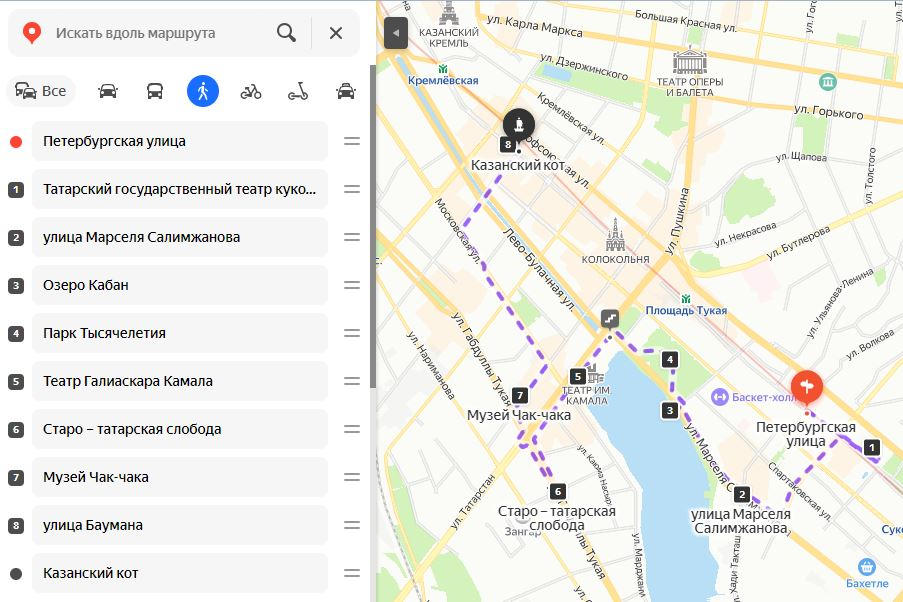
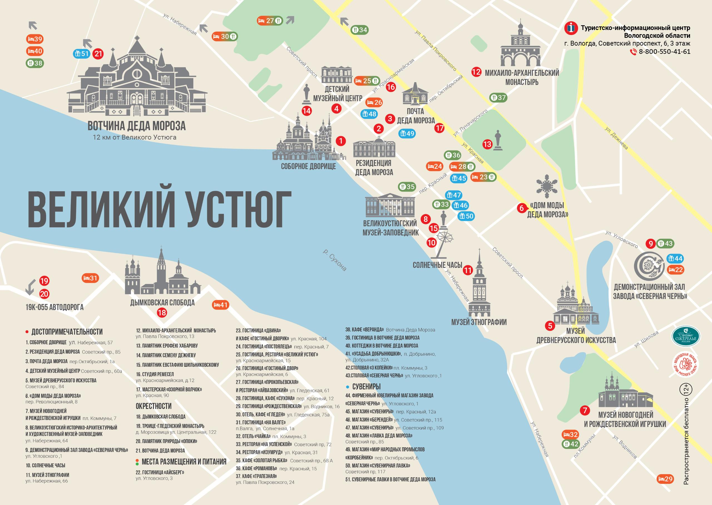
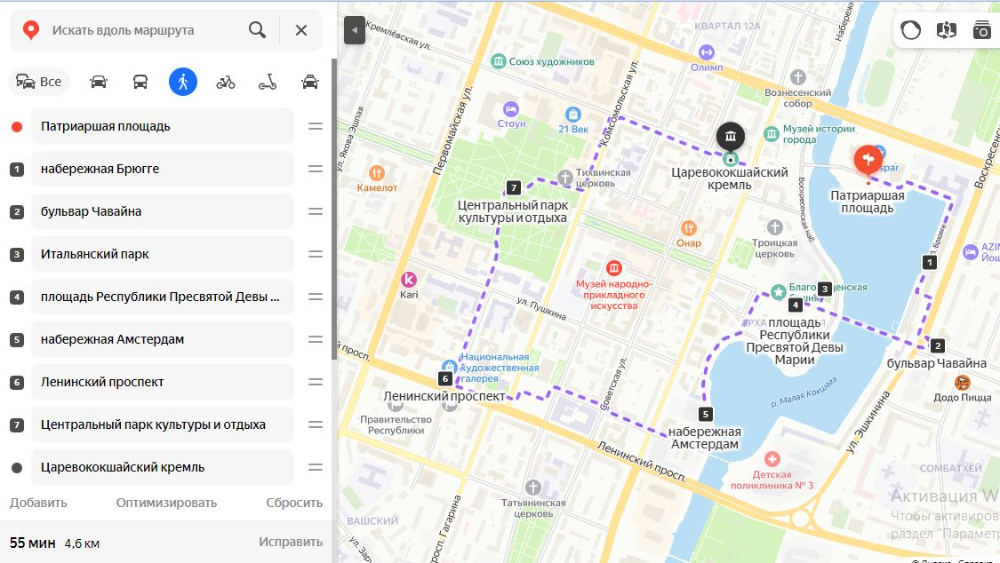

<!--
{
  "draft": false,
  "tags": ["Путешествие"]
}
-->

# Путешествие к Деду Морозу (Великий Устюг)

```blogEnginePageDate
07 сентября 2024
```

Как-то пообещал я детям свозить к Деду Морозу. Но на поезде не доедешь, пересадка через Москву + автобус до места. И
поэтому поехали на машине по маршруту Казань - Великий Устюг - Йошкар Ола.


**Казань** - тут маршрут разбит на 2 дня, т.к. за один не получается пройти. Лучше даже взять 3 дня, если любите гулять
по городу, заходить в музеи, например в кремле можно на день застрять.


В первый день мы пошли в Аквапарк, но не Ривьеру, а с динозаврами. Во первых дешевле, во вторых разрешали детям кататься
с горок повыше. На второй обошли все достопримечательности с утра до ночи ходили.



Лучше брать квартиру, она гораздо дешевле чем отели. У Отелей ценник х2 от реальной стоимости.

Далее мы поехали в **Великий Устюг**. К сожалению погода начала портиться. Да и последние 200км дорога была полностью из
мелких ямок. Ездили в мае, так что ощущение было что едем из живого мира в мертвый, т.к. температура понижалась и
деревья стали становиться без листочков. Занял путь часов 10. Остановились в недорогой но комфортной (наверно в люксе
было бы еще лучше, но решили сэкономить)
гостинице [Прокопьевская](https://yandex.ru/maps/org/prokopyevskaya/1020041729/?filter=alternate_vertical%3AWhatWhere&ll=46.278330%2C60.769832&mode=search&sctx=ZAAAAAgCEAAaKAoSCYG0%2FwHWJkdAEaGhf4KLYU5AEhIJzm3CvTJvhT8Rv%2B%2FfvDjxdT8iBgABAgMEBSgKOABA5lRIAWJIcmVhcnI9c2NoZW1lX0xvY2FsL0dlby9NZWRpYUZsb3cvU3Rvcmllc0NvbnRlbnRUeXBlPW9sZF9tZWRpYV9jbGFzc2lmaWVyagJydZ0BzcxMPaABAKgBAL0BlezGqcIBiwHa%2FsPi1AL%2Bnb3HjQGgtuz9Vdqi19UTpO32u93mhtrqAais4eQD6%2BeVggTs0%2FXpBM6Xt8UF%2F5PAy9cGgbSy5gOTw8mO3wLF55uUyAXSyMfSBaaWqZaCAozErMtmitex%2B8kBsOb5pAT1uN6YBKyi4I5w3MqApASqn%2BftBOOEkb7xAdD4iZ6uBZO93%2F4EggIs0LPQvtGB0YLQuNC90LjRhtCwINCy0LXQu9C40LrQuNC5INGD0YHRgtGO0LOKAgkxODQxMDY0MTSSAgUxMDg1NJoCDGRlc2t0b3AtbWFwcw%3D%3D&sll=46.273470%2C60.769832&sspn=0.022351%2C0.006458&text=%D0%B3%D0%BE%D1%81%D1%82%D0%B8%D0%BD%D0%B8%D1%86%D0%B0%20%D0%B2%D0%B5%D0%BB%D0%B8%D0%BA%D0%B8%D0%B9%20%D1%83%D1%81%D1%82%D1%8E%D0%B3&z=15.76).

Музеев в городе полно.



Однако становилось все холоднее и холоднее, поэтому решили ехать в вотчину и оттуда стартовать в Йошкар-Ола, т.к. ночью
температура должны была опуститься ниже нуля до -2, а шины летние (да и ветровки с Кофтами под конец уже не спасали)



Вотчина Деда Мороза, минутах в 15 от города. Добрались утром и получилось так что Было всего 4 ребенка в первую смену.
Так что сказка была почти персональная. Детям понравилось. Побыли бы еще но стало холодно и полдороги за нами гнался
снег, то начинался, то заканчивался. Даже в тему получилось - Дед Мороз чуть нас не заморозил )).

В **Йошкар-Оле** остановились в гостинице [Вернисаж](https://hotelvernissage12.ru/rooms/). Тоже очень понравилась,
приехали туда уже ночью.


С утра пошли гулять. Понравилось даже больше чем в Казани, потому что все достопримечательности в одном месте.
Концентрация фоток очень большая. Но было холодно и оставаться еще не стали. По той же причине не заехали в Свияж около
Казани.

В целом сказка получилась.