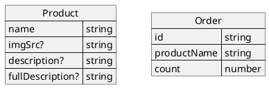
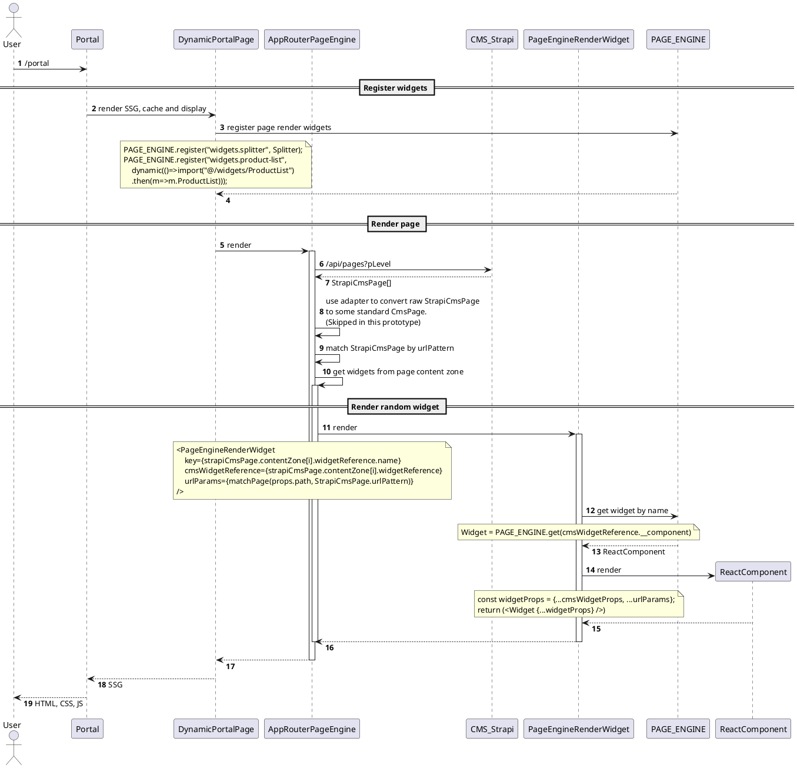

<!--
{
  "draft": true,
  "tags": ["Программирование"]
}
-->

# Configurable Portal

```blogEnginePageDate
11 августа 2025
```

TODO: Спросить аннотацию у AI


## Data Service

В качестве стаба использован `json-server`.

В качестве модели используется две сущности `orders` и `products`



## CMS (Strapi)

В качестве CMS, очевидно, может использоваться любая CMS. Я взял за основу [Strapi](https://strapi.io), т.к. имею
опыт работы с ней и ее можно легко настроить для работы стендалон.

Проделаны некоторые мелкие моменты, которые понадобятся для работы

* установлен плагин `strapi-v5-plugin-populate-deep` который позволяет получать вложенные сущности будь то компоненты
  или референцы с любой вложенностью
* сгенерирован токен для RO доступа к контенту
* выставлены настроики пейджинга чтобы отдавать по 1000 елементов вместо стандартных 10, т.к. нам все равно нужно на
  портале получить всю конфигу и пока она не такая уж и большая чтобы делать пейджинг (см `defaultLimit` в файле
  `cms/config/api.ts`)

в идеале еще сделать возможноность раскатки данных из некоего экспорта, вместо того чтобы хранить базу целиком (что-то
подобное я делал для предыдущей весии страпи, но в данном прототипе это пропущено)

### Модель

Модель состоит из пейджи, в которой есть `urlPattern` (паблик апи по сути) который соотвествует общеиспользваому формату
вида `/order/:id` в
частности на портале используется библиотека `path-to-regexp` для матчинга страницы, причем на всякий случай добавлена
функциональность что статичекий путь вида `/order/123` приоитетнее (но это логика портала). Также можно еще всякий сео
атирбутов накидать и др.

Далее есть headerWidget и contentZone которые ссылаются на обзекты `WidgetInstance` причем хеадер оди, а вот контен
множественный набор, предпологается что лайот просто вертикальный. Для потрала еще стоит добавить футер райт панедл для
драуэра ну и можно поддержать грид свойства в виджетах чтобы можно было располагать из по колонкам, но для простоты
протоипа опускаем.

WidgetInstance это динамические компоненты - виджеты. В одном WidgetInstance можно выбрать только 1один компонент.
На даный момент это выглядит избыточно и можно было бы напрямуд ставить компонент, в пейджу, но это удобно когда
мы столкномся с кейсом вдигет-виждгет или туда можно будет положить свойтва грида или еще общих ствойств лайауту не
нужнжных самому виджету. Хотя в некоторый CMS типа contenfull нет модели компонент и там всегда референсы,
возможно там этот слой избыточеке и не нужен будет. В свою очередь по хороему в портале в пейдж рендерере должно быть
адаптер который из разных смс моделей делает одну стандартную так например можно убрать WidgetInstance.
Главным параметром сделсь будет `widget` из которого мы будет добывать виджет, так что этот ключ является контрактом (
паблик апи). Посколько это диамик зон то в ресте модеь возвращает `__component` а значение имя компоненты (через
адампрет оба ключа можно поменять было бы)

Имя компоненты используется для инстанциации виджета, а опять же можно подрихтовать имя через адаптер

Пример респонса
убрал не нужные поля createdAt, updatedAt, publishedAt, id, documentId

```
{
  "data": [
    ...
    {
      "urlPattern": "/product/:name",
      "headerWidget": {
        "name": "HeaderWidget",
        "widget": [
          {
            "__component": "widgets.header-widget",
            "menuWidget": {
              "name": "HeaderMenuWidget",
              "widget": [
                {
                  "__component": "widgets.menu-widget",
                  "menu": [
                    {
                      "title": "Samsung Galaxy S24 Ultra",
                      "url": "/portal/product/Samsung%20Galaxy%20S24%20Ultra"
                    },
                    {
                      "title": "Apple iPhone 15 Pro",
                      "url": "/portal/product/Apple%20iPhone%2015%20Pro"
                    },
                    {
                      "title": "Google Pixel 404",
                      "url": "/portal/product/google-pixel-404-not-exist"
                    },
                    {
                      "title": "About",
                      "url": "/portal/about"
                    }
                  ]
                }
              ]
            }
          }
        ]
      },
      "contentZone": [
        {
          "name": "Splitter40px",
          "widget": [
            {
              "__component": "widgets.splitter",
              "value": "px40"
            }
          ]
        },
        {
          "name": "Product Widget",
          "widget": [
            {
              "__component": "widgets.product-widget",
              "name": "{name}"
            }
          ]
        }
      ]
    },
  ...
  ],
  "meta": {
    "pagination": {
      "page": 1,
      "pageSize": 1000,
      "pageCount": 1,
      "total": 4
    }
  }
}
```

Здесь мы видим что в HeaderWidget есть поле menuWidget, которое в свою очередь тоже виджет - MenuWidget, и в нем тоже
есть уже свои параметры - menu в виде json

В контент зоне есть 2 виджета Splitter со значение разделителя 40px чтобы визуально разделить хедее и виджет (значение
специально перепутано потому как в страпи походу бага и нельзя начать с числа листовой тип атримта) и product-widget
который имеет в себе макрос `{name}` значение которого будет заполнено из `urlPattern`

## Portal

Основан на next.js т.к. является хоть и небольшим на мой взгляд но все же стандартом для генерации SSG. Но решение можно
применить и на другом фремворке, правда придется переписть на контексты и др. Я же делал решние для SPA и SSR но вот
захочелось на Server Components переложить.

Для начла подговтовим нектс

* добавим `MUI` как UI фремворк
* добавим профкси т.к. мидлваре работае плоовато (не поддерживает множество кейсов) см
  `portal/src/app/api/proxy/[...path]/route.ts`
* для клиетских запросов будем исползовать `useSWR`

### поскольку страницы кешируются нужно сбрасывать кеш

будем использватть `revalidatePath` но нужно явно перечислить список страниц, для этого в каждой странице вызовем
синглетов тсервис и запишем урл, а уже на специальном апи роуте сбросим все урлы.
см `portal/src/app/api/revalidate/route.ts`
Возмножно в продакшене роутов может
быть много тогда понядобиться исползовать какойнить подход с фремами (сбрасывать в цикле по 100 роутов а раз и делая
передышку на пару милли секунд)

### перформанс

некст джс ждрет как не в себя да и билдить в рантайме считаю млохим тоном, и в конце концов сервер бека может еще не
успеть подняться
напрмер в клауде портал можнт поднять раньше чем бек даже есть техника проверки канареечный запуск???
ну и сервис должне легко скалироваться
поэтому подкачка роутов должна быть лезиная

**лезийность**

вротое лезийность для этого в пейдже говорим что у нас нет страниц и теперь нест не геренир их при старте зато при
первом заходе он сгенерит страниц и положит в кеши причем если на этой странице есть ссылки заимпорченные из "next"
тогда он заодно подгрузить и друге страницы.

```js
export const revalidate = 120; 
export const dynamicParams = true;
export const generateStaticParams = async () => []; 
```

**standalone**

первое что мы делаем это включаем режим standalone

```js
const nextConfig: NextConfig = {
    output: "standalone"
};
```

теперь у нас запускается не `next start` а `node .next/standalone/server.js` что экономи пямяти ???

** саммари **

для анализа установим плагин Resource Usage в Rancher Descktop (бесплатный аналог докера) ну и заюзаем ключ
`docker run ... -m 2048m` для ограничения

в результате у нас нект компилация и линтинг происходит на билдере а в продакшене только старт и дже страницы не
генерятся
также стендалоне забирает тоьлко те тщде моули которые нужны а ряд не используемы не берет

итого у нас экнопия по диску из-за но модулей для докер образа, по CPU т.к. сложные копиляци в ропде нет и по мятия в
районе `256mb`
для реальных кейсом может и пондобится еще 100мб т.к. у меня то обекыт и колчисство виджето мало


на предыдущей версии некста без стендалона у меня до 3-4 ГБ доходило даже на стравнительно простых кейсах

### Page Renderer



### регистрация

### динамическая страница

`portal/src/app/portal/[[...paths]]/page.tsx`

но можно и статику см /about - `portal/src/app/portal/about/page.tsx`

```
export const revalidate = 120; //cannot assign constant from other file
export const dynamicParams = true; // or false, to 404 on unknown paths
export const generateStaticParams = async () => []; // to spic generate pages for all paths, generate only by demand

registerPageRenderWidgets();

interface DynamicPortalPageProps {
  params: Promise<{ paths: string[] | undefined }>;
}

const DynamicPortalPage: FC<DynamicPortalPageProps> = async ({ params }) => {
  const { paths } = await params;
  const path = "/" + (paths ?? []).join("/");
  console.log(`DynamicPortalPage::path=${path}`);
  ROUTE_REGISTER_SERVICE.register(urlJoin(LINKS.portal, path));
  return (
    <main className="taDynamicPortalPage">
      <AppRouterPageEngine path={path} customHelperComponent={<Discount />} />
    </main>
  );
};

export default DynamicPortalPage;

```

### cms an urlmathc

`portal/src/app/portal/about/page.tsx`


```tsx

export const AppRouterPageEngine: FC<PageEngineProps> = memo(async (props) => {
  console.log(`AppRouterPageEngine::path=${props.path}`);

  const cmsToken = CMS_TOKEN;
  console.log(`AppRouterPageEngine::cmsToken=${cmsToken}`);

  const cmsPageResponse: CmsPageResponse = await fetch(ROUTES.cmsPages, {
    method: "GET",
    headers: { Authorization: `Bearer ${cmsToken}` }
  }).then((res) => res.json());

  //here should be CmsAdapter pattern to converter Strapi CMS model or other CMS model
  //into standard PageEngine model but it is skipped because it is only PoC.

  const [matchedPage, urlParams] = matchPage(props.path, cmsPageResponse.data);
  if (!matchedPage) {
    notFound();
  }

  console.log(`AppRouterPageEngine::found page=${matchedPage.urlPattern}, urlParams=`, urlParams);

  return (
          <Box className="taAppRouterPageEngine">
            {!!matchedPage.headerWidget && (
                    <PageEngineRenderWidget
                            cmsWidgetReference={matchedPage.headerWidget}
                            urlParams={urlParams}
                    />
            )}

            {matchedPage.contentZone.map((cmsWidgetReference) => {
              return (
                      <PageEngineRenderWidget
                              key={cmsWidgetReference.name}
                              cmsWidgetReference={cmsWidgetReference}
                              urlParams={urlParams}
                              customHelperComponent={props.customHelperComponent}
                      />
              );
            })}
          </Box>
  );
});
```

### виджет в виджете

`portal/src/app-router-page-engine/PageEngineRenderWidget.tsx`

```tsx
import { FC, memo, ReactNode } from "react";
import { CmsWidgetReference } from "@/app-router-page-engine/PageEngine.model";
import { PAGE_ENGINE_REGISTER } from "@/app-router-page-engine/PageEngineRegister";
import { AlertError } from "@/components/AlertError";
import SkipNotFoundErrorBoundary from "@/components/SkipNotFoundErrorBoundary";

interface PageEngineRenderWidgetProps {
  cmsWidgetReference: CmsWidgetReference;
  urlParams?: Record<string, string>;

  customHelperComponent?: ReactNode;
}

export const PageEngineRenderWidget: FC<PageEngineRenderWidgetProps> = memo(async (props) => {
  const widgetData = props.cmsWidgetReference.widget[0];
  const Widget = PAGE_ENGINE_REGISTER.get(widgetData.__component);
  if (!Widget) {
    return (
      <div className="taPageRendererWidget">
        <AlertError message={`Widget not found: ${widgetData.__component}`} />
      </div>
    );
  }

  for (const key in widgetData) {
    const anyWidgetValue: unknown | CmsWidgetReference = widgetData[key];
    if ((anyWidgetValue as CmsWidgetReference).widget) {
      //means inner widget
      widgetData[key] = (
        <PageEngineRenderWidget cmsWidgetReference={anyWidgetValue as CmsWidgetReference} />
      );
    }
  }

  const widgetProps = {
    ...widgetData,
    ...props.urlParams,
    customHelperComponent: props.customHelperComponent
  };

  return (
    <div className="taPageRendererWidget">
      <SkipNotFoundErrorBoundary
        fallback={
          <AlertError
            message={`Failed to load widget with name "${props.cmsWidgetReference.name}"`}
          />
        }
      >
        <Widget key={props.cmsWidgetReference.name} {...widgetProps} />
      </SkipNotFoundErrorBoundary>
    </div>
  );
});

PageEngineRenderWidget.displayName = "PageEngineRenderWidget";

```

### смс и урл параметры

### not found

Работает тольк не перхватить ошибку

```tsx
export default class SkipNotFoundErrorBoundary extends Component<Props, State> {
    //...

    static getDerivedStateFromError(error: Error) {
        if (error?.message === "NEXT_HTTP_ERROR_FALLBACK;404") {
            return {hasError: false};
        }
        return {hasError: true};
    }

    //...
}
```

### SSG

из минусов нелья выбрать тип кеша но по мне так лучше всегда SSG ведь не смысла перегенериться описание продукта лучше
его закешировать и не тратить CPU


