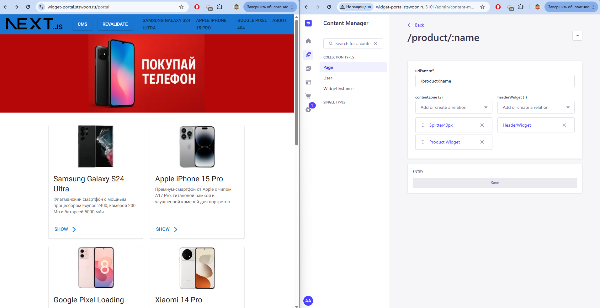
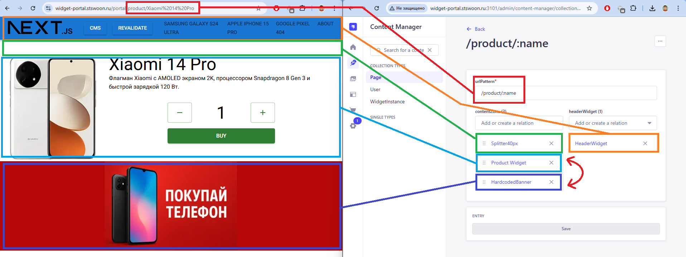
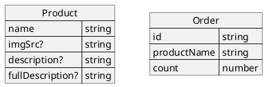
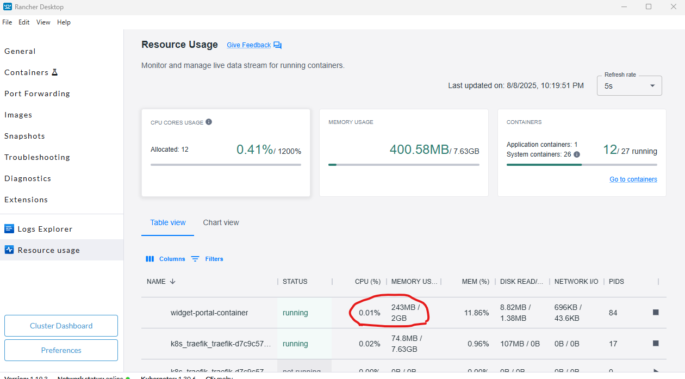
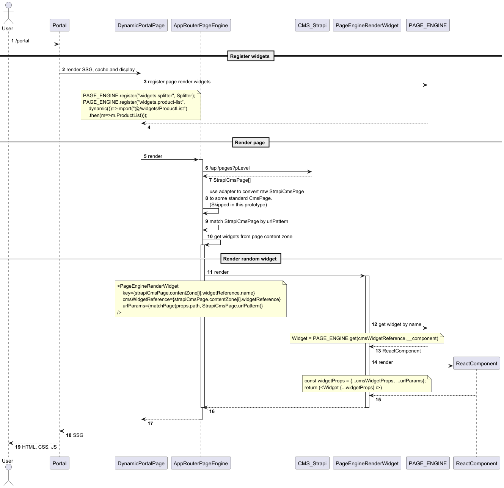
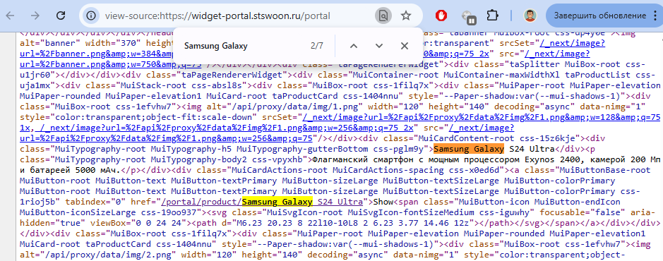

<!--
{
  "draft": false,
  "tags": ["Программирование"]
}
-->

# Configurable Portal

```blogEnginePageDate
11 августа 2025
```

Решил попробовать сделать прототип портала, страницы и содержимое, которого можно конфигурить из CSM (например Strapi).
И попробовать сделать это на App Router от NextJs с Server Components, т.к. для SPA и обычного SSR такую штуку я знаю
сделать можно. Итак, нужно сделать механизм, который обеспечивает гибкую конфигурацию портала через CMS без
необходимости изменения кода, что позволяет контент-менеджерам самостоятельно управлять структурой и содержимым страниц.



Ключевые особенности механизма, которые нужно достичь:

1. **Регистрация виджетов**: Централизованный реестр компонентов с поддержкой ленивой загрузки
2. **Динамический маршрутизатор**: Обработка различных URL-шаблонов с извлечением параметров
3. **Интеграция с CMS**: Получение структуры страниц и виджетов из внешней системы управления контентом
4. **Композиция виджетов**: Возможность вложенных виджетов (виджет внутри виджета)
5. **SSG**: Использование статической генерации для оптимизации производительности

> Решение можно увидеть тут - https://github.com/stswoon/widget-portal



## Описание data-service

Директория data-service представляет собой простой сервис данных для приложения, который выполняет функции
локального REST API сервера, реализованного с помощью библиотеки `json-server`. Он предоставляет тестовые данные
для приложения:

- Коллекцию orders (заказы) с информацией о заказанных продуктах и их количестве:
    - id заказа
    - купленный телефон
    - и количество купленных телефонов
- Коллекцию products (продукты) с подробной информацией о смартфонах, включая:
    - Название смартфона
    - Путь к изображению
    - Краткое описание
    - Для некоторых продуктов - подробное описание в формате Markdown



В папке `data-service/public/img/` - лежат изображения смартфонов.

## CMS (Strapi)

В проекте используется Headless [Strapi](https://strapi.io) CMS для управления контентом портала. Выбор Strapi
обусловлен возможностью автономной работы.

Основные настройки CMS:

- Установлен плагин `strapi-v5-plugin-populate-deep` для получения вложенных сущностей любой глубины
- Настроен токен для доступа к контенту в режиме только чтения
- Увеличен лимит пагинации до 1000 элементов вместо стандартных 10 (см. `cms/config/api.ts`)

В идеале сделать возможность импортировать данные из json, вместо хранения БД в гите, но в данном
прототипе этот момент пропущен для лаконичности, хотя я и делал подобное решение для предыдущей версии.

### Модель данных

Модель состоит из следующих основных компонентов:

1. `Page` - страница, которая используется для маршрутизации, она содержит:
    - `urlPattern` - урл строка в специальном формате роутинга, например `/product/:id`
    - `headerWidget` - один виджет для шапки страницы
    - `contentZone` - набор виджетов для основного содержимого

2. `WidgetInstance` - экземпляр виджета, который содержит:
    - `name` - имя экземпляра
    - `widget` - динамическая зона, содержащая только один компонент виджета

3. Компоненты виджетов - различные типы виджетов:
    - `HeaderWidget` - виджет шапки с вложенным menuWidget
    - `MenuWidget` - виджет меню с JSON-структурой пунктов меню
    - `ProductWidget` - виджет продукта с параметром name
    - `Splitter` - разделитель с настраиваемым размером
    - И другие (`BannerWidget`, `CheckoutWidget`, `HtmlWidget`, `ProductList`)

При запросе страницы из CMS возвращается структура с компонентами, где каждый компонент имеет атрибут `__component`
(например, `widgets.header-widget`), который используется для инстанцирования соответствующего React-компонента на
портале.

Виджеты внутри себя также могут рисовать виджеты, например в `HeaderWidget` есть полюшко `menuWidget`, которое в свою
очередь тоже виджет - `MenuWidget`, и в нем тоже есть уже свои параметры - `menu` в виде json.

Параметры из `urlPattern` (например, `:name`) могут использоваться в виджетах через макросы вида `{name}`, что позволяет
динамически формировать содержимое страницы.

Пример ответа API `/api/pages?pLevel` (сокращенный - убрал не нужные поля createdAt, updatedAt, publishedAt, id,
documentId):

```
{
  "data": [
    {
      "urlPattern": "/product/:name",
      "headerWidget": {
        "name": "HeaderWidget",
        "widget": [
          {
            "__component": "widgets.header-widget",
            "menuWidget": {
              "name": "HeaderMenuWidget",
              "widget": [
                {
                  "__component": "widgets.menu-widget",
                  "menu": [
                    {
                      "title": "Samsung Galaxy S24 Ultra",
                      "url": "/portal/product/Samsung%20Galaxy%20S24%20Ultra"
                    },
                    // ... другие пункты меню
                  ]
                }
              ]
            }
          }
        ]
      },
      "contentZone": [
        {
          "name": "Splitter40px",
          "widget": [
            {
              "__component": "widgets.splitter",
              "value": "px40"
            }
          ]
        },
        {
          "name": "Product Widget",
          "widget": [
            {
              "__component": "widgets.product-widget",
              "name": "{name}"
            }
          ]
        }
      ]
    }
  ],
  "meta": {
    "pagination": {
      "page": 1,
      "pageSize": 1000,
      "pageCount": 1,
      "total": 4
    }
  }
}
```

Такая архитектура позволяет гибко настраивать страницы и виджеты через CMS без необходимости изменения кода портала.

## Портал на Next.js

Портал построен на Next.js, который является стандартом для генерации статических сайтов (SSG). Решение адаптировано для
Server Components, хотя может быть перенесено и на другие фреймворки (например обычный SSR или SPA, правда придется
сильно его переписать под использование контекста, говорю это т.к. уже решал данную задачу, здесь же мне было интересно
перенести решение на **App Router**).

### Основные компоненты

- `MUI` в качестве UI-фреймворка
- Прокси-сервер для обхода ограничений middleware (`/api/proxy/[...path]/route.ts`), т.к. `middleware.ts` поддерживает
  только самые простые кейсы проксирования, а мне нужно было спрятать три "микросервиса" в один docker контейнер для
  демонстрации
- `useSWR` для клиентских запросов

### Управление кешом

Для сброса кеша используется `revalidatePath`. Каждая страница регистрирует свой URL в singleton-сервисе
`RouteRegisterService`, а специальный API-маршрут (`/api/revalidate/route.ts`) сбрасывает кеш для всех
зарегистрированных URL.

Возможно в продакшене роутов может быть много тогда понадобиться использовать например подход с frame-окном, т.е.
сбрасывать в цикле по 100 роутов за раз, затем делать микро-перерыв и продолжать сбарсывать дальше.

### Оптимизация производительности

На предыдуще версии некста я столкнулся с тем что некст ест память и CPU как не в себя, во время компиляции, да и во
время работы тоже, поэтому ниже я описываю решения помогающие драматически снизить косты на ресурсах:

- Экономия дискового пространства за счет включения только необходимых npm модулей
- Снижение нагрузки на CPU благодаря отсутствию компиляции в runtime
- Снижение потребления памяти до ~256MB (против 3-4GB) за счет использования node вместо next (вроде бы почти одно и
  тоже, а вон как выстрелило)
- StartUp time мгновенный, т.к. не тратиться время на компиляциию и генерацию страниц
- Решена проблема курицы и яйца - теперь некст сможет стартовать, даже если бекенд с данными еще не поднялся.
- Происходит компиляция только тех страниц куда идет пользователь, а не сразу всех (хотя может быть это и не такой уж и
  плюс в проде).



**Ленивая загрузка**

Страницы **не** генерируются при старте, а создаются при первом запросе и кешируются:

```ts
export const revalidate = 120; // время жизни кеша в секундах
export const dynamicParams = true; // разрешить динамические параметры
export const generateStaticParams = async () => []; // не генерировать страницы заранее
```

**Режим Standalone**

Включен режим standalone в конфигурации Next.js:

```ts
const nextConfig = {
    output: "standalone"
};
```

Это позволяет запускать приложение через `node .next/standalone/server.js` вместо `next start`, что дает следующие
преимущества:

- Компиляция и линтинг происходят только на этапе сборки
- В продакшен-версию включаются только используемые npm модули
- Используется next plugin внутри node что оказывает более экономно нежели запуска некст напрямую

## Механизм Page Renderer (app-router-page-engine) в Widget Portal

### Архитектура



Диаграмма последовательности наглядно демонстрирует процесс работы механизма app-router-page-engine в портале. Разберем
ее по шагам:

**Регистрация виджетов**

1. Пользователь обращается к порталу по адресу `/portal`
2. Портал запускает рендеринг `DynamicPortalPage` с использованием SSG (Static Site Generation), кеширует и отображает
   страницу
3. `DynamicPortalPage` регистрирует виджеты в реестре `PAGE_ENGINE` через функцию `registerPageRenderWidgets()`
4. Регистрация происходит двумя способами: Прямая регистрация или Динамическая регистрация с ленивой загрузкой

**Рендеринг страницы**

5. `DynamicPortalPage` вызывает компонент `AppRouterPageEngine` для рендеринга содержимого
6. AppRouterPageEngine делает запрос к `CMS Strapi` по адресу `/api/pages?pLevel` для получения данных страниц
7. CMS возвращает массив `StrapiCmsPage[]` с описанием всех доступных страниц
8. `AppRouterPageEngine` должен был бы использовать адаптер для преобразования сырых данных Strapi в стандартный формат
   CmsPage (в прототипе этот шаг пропущен)
9. `AppRouterPageEngine` находит подходящую страницу по шаблону URL (urlPattern)
10. `AppRouterPageEngine` получает список виджетов из зоны контента страницы (contentZone)

**Рендеринг отдельного виджета**

11. Для каждого виджета в зоне контента `AppRouterPageEngine` вызывает компонент `PageEngineRenderWidget` с параметрами
    (уникальное имя виджета, cmsWidgetReference - ссылка на виджет из CMS, urlParams - параметры URL, извлеченные из
    сопоставления пути с шаблоном)
12. `PageEngineRenderWidget` запрашивает у реестра `PAGE_ENGINE` компонент по имени
13. `PAGE_ENGINE` возвращает соответствующий React-компонент
14. `PageEngineRenderWidget` подготавливает свойства для виджета, объединяя данные из CMS и параметры URL.
15. `PageEngineRenderWidget` рендерит полученный компонент с подготовленными свойствами
16. Результат рендеринга возвращается обратно в `AppRouterPageEngine`

**Завершение процесса**

17. `AppRouterPageEngine` возвращает результат рендеринга в `DynamicPortalPage`
18. `DynamicPortalPage` возвращает готовую страницу в портал
19. Портал отправляет пользователю готовый HTML, CSS и JavaScript

### Регистрация

Регистрация виджетов осуществляется через класс `PageEngineRegister`, который представляет собой реестр компонентов:

- Класс хранит Map с соответствием имени компонента (widgets.header-widget) и React-компонента
- Метод register(name, widget) добавляет компонент в реестр
- Метод get(name) возвращает компонент по имени
- Синглтон ёPAGE_ENGINE_REGISTERё экспортируется для использования во всем приложении

Регистрация всех доступных виджетов происходит в функции `registerPageRenderWidgets()`, которая вызывается при
инициализации динамических страниц:

```tsx
PAGE_ENGINE_REGISTER.register("widgets.header-widget", Header);
```

Для оптимизации размера бандла часть виджетов регистрируется с использованием динамического импорта:

```tsx
PAGE_ENGINE_REGISTER.register(
    "widgets.product-list",
    dynamic(() => import("@/widgets/ProductList").then((m) => m.ProductList))
);
```

### Динамическая страница

Динамические страницы реализованы через механизм Next.js с использованием catch-all параметров `[[...paths]]`:

Файл `portal/src/app/portal/[[...paths]]/page.tsx` обрабатывает все динамические маршруты

```
export const revalidate = 120; //cannot assign constant from other file
export const dynamicParams = true; // or false, to 404 on unknown paths
export const generateStaticParams = async () => []; // to spic generate pages for all paths, generate only by demand

registerPageRenderWidgets(); // ерегистрация всех виджетов

interface DynamicPortalPageProps {
  params: Promise<{ paths: string[] | undefined }>;
}

const DynamicPortalPage: FC<DynamicPortalPageProps> = async ({ params }) => {
  const { paths } = await params;
  const path = "/" + (paths ?? []).join("/");
  ROUTE_REGISTER_SERVICE.register(urlJoin(LINKS.portal, path)); // для возможности сброса кеша
  return (
    <main className="taDynamicPortalPage">
      <AppRouterPageEngine path={path} customHelperComponent={<Discount />} />
    </main>
  );
};

export default DynamicPortalPage;
```

- `customHelperComponent` - проверка возможность глобально прокидывать объекты в SSG, аналог React Context
- также можно использовать и обычные статичные пейджи, например роут `/about` - `portal/src/app/portal/about/page.tsx`
- динамическая страницу лежит под отдельной папкой `portal/[[...paths]]`, если положить ее в корень то она перехватывает
  все запросы, в том числе и статичные страницы, апи-роуты и даже системные типа `.well-known/` (в Page Router такой
  проблемы не было, возможно баг нового роутера)

### CMS параметры, URL параметры

Основной компонент `AppRouterPageEngine` выполняет следующие действия:

1. Получает данные страниц из CMS с использованием токена авторизации
2. Использует функцию matchPage для поиска подходящей страницы и извлечения URL-параметров
3. Если страница не найдена, вызывает `notFound()` для отображения 404
4. Рендерит виджеты из `headerWidget` и `contentZone` найденной страницы

Функция `matchPage` в `pageRender.util.ts` использует библиотеку `path-to-regexp` для сопоставления URL-шаблонов:

- Поддерживает параметризованные URL вида `/product/:id`
- Возвращает найденную страницу и извлеченные параметры
- Обрабатывает конфликты маршрутов, предпочитая статические пути динамическим

```tsx
export const AppRouterPageEngine: FC<PageEngineProps> = memo(async (props) => {
    const cmsToken = CMS_TOKEN;
    const cmsPageResponse: CmsPageResponse = await fetch(ROUTES.cmsPages, {
        method: "GET",
        headers: {Authorization: `Bearer ${cmsToken}`}
    }).then((res) => res.json());

    const [matchedPage, urlParams] = matchPage(props.path, cmsPageResponse.data);
    if (!matchedPage) {
        notFound();
    }

    return (
        <Box className="taAppRouterPageEngine">
            {!!matchedPage.headerWidget && (
                <PageEngineRenderWidget
                    cmsWidgetReference={matchedPage.headerWidget}
                    urlParams={urlParams}
                />
            )}

            {matchedPage.contentZone.map((cmsWidgetReference) => {
                return (
                    <PageEngineRenderWidget
                        key={cmsWidgetReference.name}
                        cmsWidgetReference={cmsWidgetReference}
                        urlParams={urlParams}
                        customHelperComponent={props.customHelperComponent}
                    />
                );
            })}
        </Box>
    );
});
```

URL параметры достаются из урла через  `path-to-regexp`. Далее эти параметры и склеиваются с параметрами из CMS с
большим приоритетом и отдаются внутрь виджета. Если имя параметра в виджете совпало, то он заберёт значение из урла.
Можно сделать чуть более умное решение и смотреть какой макрос прости виджет и забирать из урлов только нужные
параметры. Решение понятное и просто поэтому пропущено в данном прототипе.

```tsx
export const AppRouterPageEngine: FC<PageEngineProps> = memo(async (props) => {
    //...
    const [matchedPage, urlParams] = matchPage(props.path, cmsPageResponse.data);
    //...
    return (
        <Box className="taAppRouterPageEngine">
            {/*...*/}
            <PageEngineRenderWidget
                key={cmsWidgetReference.name}
                cmsWidgetReference={cmsWidgetReference}
                urlParams={urlParams}
            />
        </Box>
    );
});

export const PageEngineRenderWidget: FC<PageEngineRenderWidgetProps> = memo(async (props) => {
    const widgetData = props.cmsWidgetReference.widget[0]; // cms params
    //...
    const widgetProps = {...widgetData, ...props.urlParams};
    //...
    return (
        <div className="taPageRendererWidget">
            {/*...*/}
            <Widget key={props.cmsWidgetReference.name} {...widgetProps} />
        </div>
    );
});
```

### W-in-W (виджет в виджете)

Компонент `PageEngineRenderWidget` (`portal/src/app-router-page-engine/PageEngineRenderWidget.tsx`) отвечает за
рендеринг отдельных виджетов:

1. Получает данные виджета из CMS-ссылки
2. Находит соответствующий React-компонент через `PAGE_ENGINE_REGISTER.get()`
3. Рекурсивно обрабатывает вложенные виджеты, заменяя их на компоненты `PageEngineRenderWidget`
4. Объединяет свойства виджета с URL-параметрами и дополнительными компонентами
5. Оборачивает виджет в `SkipNotFoundErrorBoundary` для обработки ошибок

Это позволяет создавать сложные композиции виджетов, где один виджет может содержать другие виджеты.

```tsx
interface PageEngineRenderWidgetProps {
    cmsWidgetReference: CmsWidgetReference;
    urlParams?: Record<string, string>;
    customHelperComponent?: ReactNode;
}

export const PageEngineRenderWidget: FC<PageEngineRenderWidgetProps> = memo(async (props) => {
    const widgetData = props.cmsWidgetReference.widget[0];
    const Widget = PAGE_ENGINE_REGISTER.get(widgetData.__component);
    if (!Widget) {
        return (
            <div className="taPageRendererWidget">
                <AlertError message={`Widget not found: ${widgetData.__component}`}/>
            </div>
        );
    }

    for (const key in widgetData) {
        const anyWidgetValue: unknown | CmsWidgetReference = widgetData[key];
        if ((anyWidgetValue as CmsWidgetReference).widget) {
            //means inner widget
            widgetData[key] = (
                <PageEngineRenderWidget cmsWidgetReference={anyWidgetValue as CmsWidgetReference}/>
            );
        }
    }

    const widgetProps = {
        ...widgetData,
        ...props.urlParams,
        customHelperComponent: props.customHelperComponent
    };

    return (
        <div className="taPageRendererWidget">
            <SkipNotFoundErrorBoundary
                fallback={
                    <AlertError
                        message={`Failed to load widget with name "${props.cmsWidgetReference.name}"`}
                    />
                }
            >
                <Widget key={props.cmsWidgetReference.name} {...widgetProps} />
            </SkipNotFoundErrorBoundary>
        </div>
    );
});
```

### Обработка ошибок + Not Found

Компонент `SkipNotFoundErrorBoundary` обрабатывает ошибки рендеринга виджетов:

- Перехватывает ошибки через `getDerivedStateFromError`
- Игнорирует ошибки 404 (`NEXT_HTTP_ERROR_FALLBACK;404`), позволяя продолжить рендеринг, чтобы NextJs смог отработать
  404 через свой механизм
- Для других ошибок отображает fallback-компонент (для прототипа используется простенький `AlertError`)

```tsx
export default class SkipNotFoundErrorBoundary extends Component<Props, State> {
    //...
    static getDerivedStateFromError(error: Error) {
        if (error?.message === "NEXT_HTTP_ERROR_FALLBACK;404") {
            return {hasError: false};
        }
        return {hasError: true};
    }
}
```

### SSG

Портал использует статическую генерацию страниц с инкрементальной регенерацией:

- Параметр `revalidate = 120` указывает время жизни кеша (2 минуты), для прода можно сделать и больше, например 1 час
- Статические страницы (например, /about ) используют `export const dynamic = "force-static"`
- Для динамических страниц используется `generateStaticParams = async () => []`, что означает генерацию только по
  запросу
  Этот подход оптимизирует производительность, кешируя страницы и снижая нагрузку на сервер.

Из минусов нельзя выбрать тип кеша, но по мне так лучше всегда SSG ведь не смысла перегенерится описание продукта при
каждом запросе - лучше его закешировать и не тратить попусту серверный CPU.




