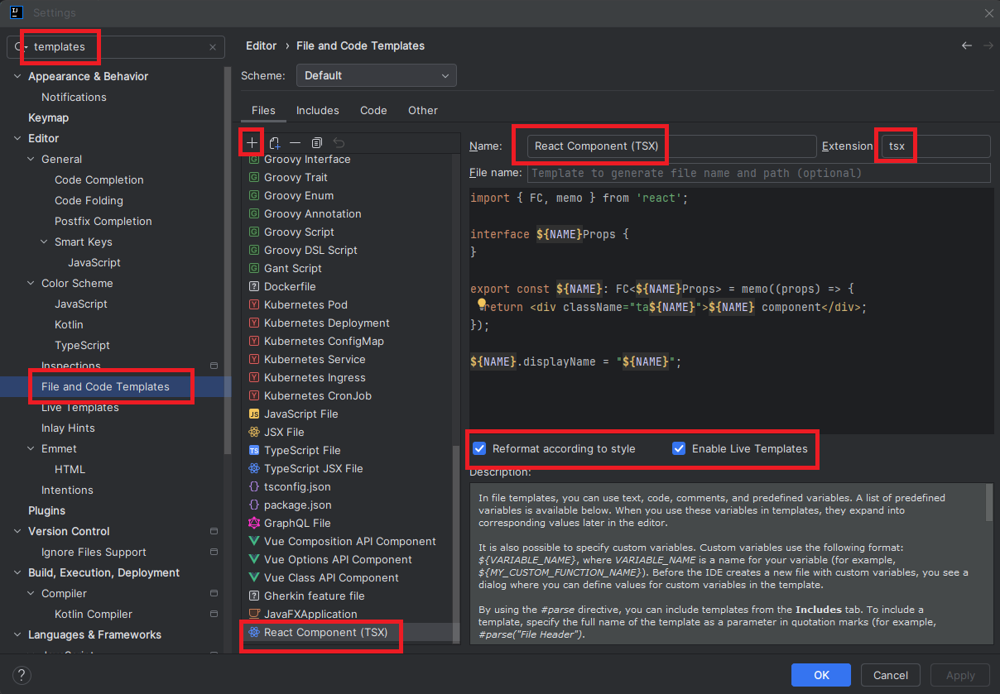

<!--
{
  "draft": false,
  "tags": ["Программирование"]
}
-->

# Intellij IDEA: Шаблоны React-компонентов

```blogEnginePageDate
28 июля 2025
```

При создании React-компонентов нужно помнить шаблон компонента или хука. В этом плане Angular выглядит удобнее — там
есть CLI, интегрированный с IDE, позволяющий быстро создавать компоненты и сервисы. В случае с React — в разных командах
шаблоны могут отличаться, поэтому имеет смысл настроить свои собственные. В этой статье — подборка шаблонов для
компонентов, хуков и контекста.



### Как создать шаблон в Intellij IDEA

Для создания шаблона, откройте настройки IDEA (`Ctrl + Alt + S`), найдите настройки `File and Code Templates`, создайте
новые новый шаблон, укажите расширение `tsx`.

### Шаблон компоненты

```
import { FC, memo } from 'react';

export interface ${NAME}Props {
}

export const ${NAME}: FC<${NAME}Props> = memo((props) => {
  return <div className="ta${NAME}">${NAME} component</div>;
});
    
${NAME}.displayName = "${NAME}";
```

Некоторые моменты:

* Не очень люблю дефолтные экспорт т.к. мне кажется она хуже индексируется.
* `displayName` - для лучшего отображения в девтулзах
* `memo` - почти всегда в компонента, где есть пропсы стоит использовать мемоизация
* `ta` - класс для поиска в дом дереве, который стоит использовать на корневом элементе
* при большом количестве пропсов форматирование выглядит слишком большим, поэтому мне больше нравиться использования
  `props` вместо деструкции

### Расширенные шаблон компоненты

Как вариант могу еще предложить шаблон под разные колбек, стейт и др

```
import { FC, ReactNode, memo, useState, useCallback } from 'react';

export interface ${NAME}Props {
  children?: ReactNode;
}

export const ${NAME}: FC<${NAME}Props> = memo(({ x, children }) => {
  const [state, setState] = useState(false);

  const handleToggle = useCallback(() => {
    setState(prev => !prev);
  }, []);

  return (
    <div className="ta${NAME}">
      <button onClick={handleToggle}>
        Toggle: {state ? 'ON' : 'OFF'}
      </button>
      <div>{children}</div>
    </div>
  );
});

${NAME}.displayName = "${NAME}";
```

### Шаблон hook'a

```
import { useCallback } from 'react';

export interface Use${NAME}Props {
}

export interface Use${NAME}Return {
  value: string | undefined;
}

export const use${NAME} = (props: Use${NAME}Props): Use${NAME}Return => {
  const value = useMemo(() => {
    return undefined;
  }, []);

  return {
    value
  };
}
```

Использование в компоненте:

```
export const MyComponent = memo(({ user }) => {
  const value = use${NAME}();
  return <div>{value}</div>;
});
```

### Шаблон сontext'a

```
import { FC, createContext, useContext, useState, ReactNode } from 'react';

interface ${NAME}ContextProps {
  value: boolean;
  setValue: (v: boolean) => void;
}

const ${NAME}Context = createContext<${NAME}ContextProps | undefined>(undefined);

interface ${NAME}ProviderProps {
  defaultValue: boolean;
  children: ReactNode
}

export const ${NAME}Provider: FC<${NAME}ProviderProps> = ({ defaultValue, children }) => {
  const [value, setValue] = useState(defaultValue);

  return (
    <${NAME}Context.Provider value={{ value, setValue }}>
      {children}
    </${NAME}Context.Provider>
  );
};

export const use${NAME} = () => {
  const context = useContext(${NAME}Context);
  if (!context) throw new Error('use${NAME} must be used within ${NAME}Provider');
  return context;
};
```

Использование в компоненте:

```
export default function App() {
  return (
    <${NAME}Provider defaultValue={false}>
      <MyComponent />
    </${NAME}Provider>
  );
}
```

```
import { FC, memo } from 'react';
export const ${NAME}: FC = memo(() => {
  const { value, setValue } = useAppContext();
  return <div>{value}</div>;
});
```