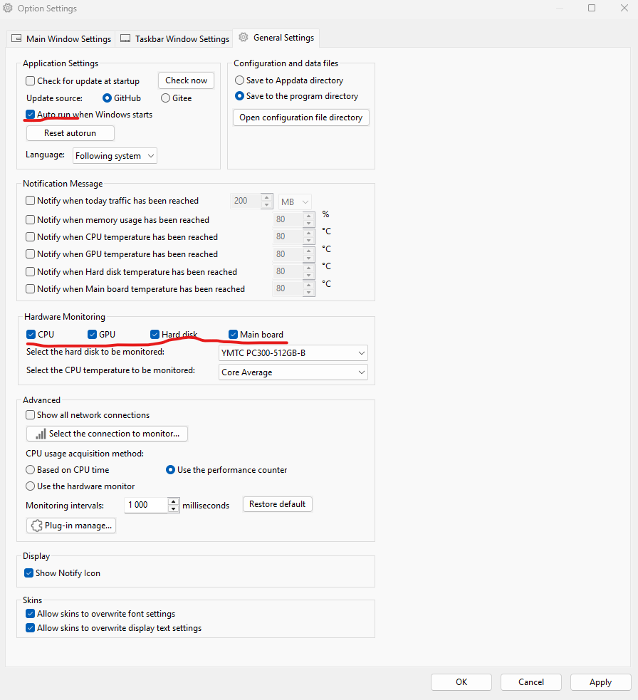
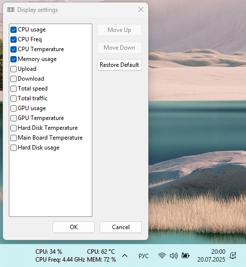

<!--
{
  "draft": false,
  "tags": ["Другое"]
}
-->

# Виджет для постоянного отображение CPU (TrafficMonitor)

```blogEnginePageDate
20 июля 2025
```

Иногда кажется, что компьютер должен работать быстро, крутить вентиляторы, но код компилируется долго и ничего не
происходит. Проблема может быть в перерасходе памяти или нагреве процессора, а может стоит режим энергосбережения.
Чтобы понять что происходит хочется увидеть нагрузка на систему, ее можно увидеть открыв диспетчер задач, но было бы
хорошо видеть данные постоянно на приборной панели, как у машины 😄. Не мог долго найти подходящих решений, но наконец
нашел, и хочу с вами поделиться
решением - [TrafficMonitor](https://github.com/zhongyang219/TrafficMonitor/blob/master/README_en-us.md)

Нашел решение в
YouTube - [Display System Resource Usage on Windows 11 Taskbar](https://www.youtube.com/watch?v=5l51NwidHK4).

## Краткое описание ролика

**Первое**. Скачиваем TrafficMonitor с [github](https://github.com/zhongyang219/TrafficMonitor/releases). 

**Второе**. Включаем автозапуск и использование метрик для интересующих нас частей компьютера.



**Третье**. Выбираем что хотим показать, я выбрал вот так:




