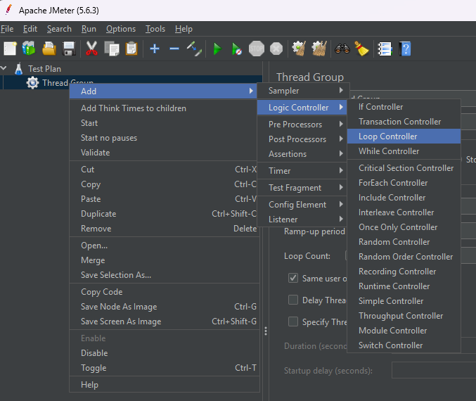

<!--
{
  "draft": false,
  "tags": ["Программирование"]
}
-->

# Простой скрипт на jMeter

```blogEnginePageDate
25 августа 2025
```

Apache jMeter это утилита для стрес тестирования апи. Она позволяет делать сложные запросы с for и if и другое. Похоже
на Runner в Postman (но они появились гораздо позже и все же цель их другая больше тестирование), но более
функциональное и позволяет производить разнообразную нагрузку больших систем. Давайте составим наш первый стресс тест.

1) jMeter можно скачать тут - https://jmeter.apache.org/download_jmeter.cgi. Скачиваем, разархивируем, идем в папку
   `apache-jmeter-5.6.3\bin` и запускаем файл `jmeter.bat`. Перед нами появляется такое окно


2) Создаем Thread Group


3) Создаем Loop



4) Указываем повторить 10 раз в поле Loop Count


5) Создаем HTTP Request (если сделать 2 запроса то они будут последовательны, например первый POST создает сущность, а
   вторым GET проверяем что она точно создалась)


6) Заполним запрос, например на `https://random-word-api.herokuapp.com/word`


К сожалению, тут важно не ошибиться в мелочах. Если что-то не работает проверьте протокол, порт (80 для http и 443 для
https), проверьте что у path нет лишних `\`.

7) Добавляем Aggregate Report, куда будут складироваться данные от запросов


8) Сохраняемся и запускаем замер, нажимая на зеленый треугольник кнопки play и получаем результаты


Обычно стоит смотреть на 95% Line, т.к. бывают выбросы, лаги сети, кеши. На и чтобы ошибок не было в колонке Error.

Пример запроса можно скачать тут - [HTTP Request.jmx](HTTP%20Request.jmx)


