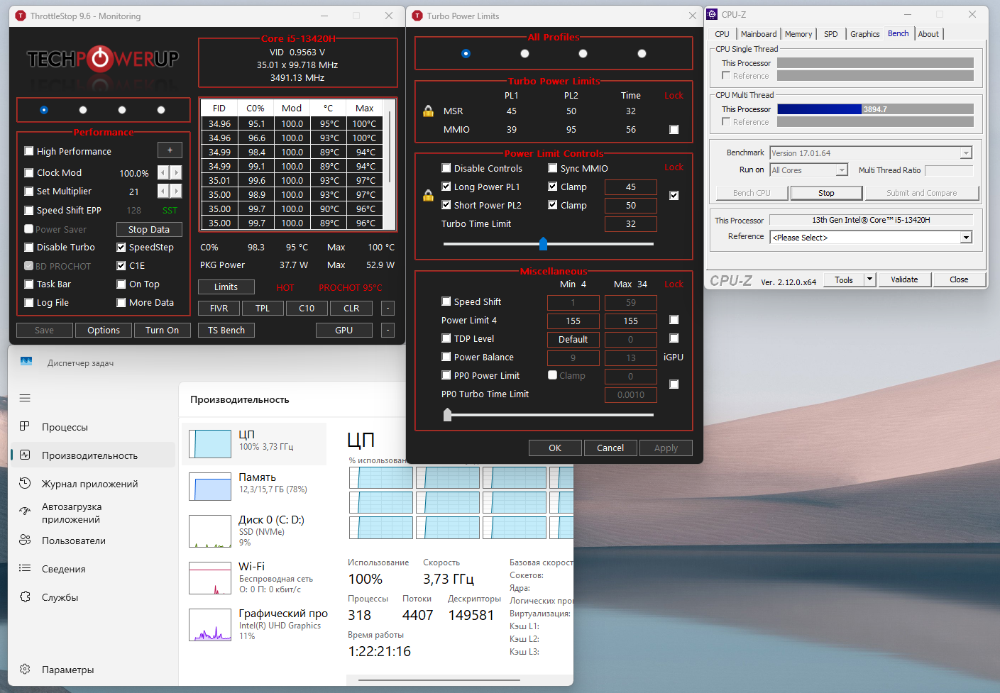

<!--
{
  "draft": false,
  "tags": ["Другое"]
}
-->

# Решение проблемы троттлинга на Honor MagicBook X14 Pro с помощью ThrottleStop

```blogEnginePageDate
12 июля 2025
```

Если вы планируете использовать **Honor MagicBook X14 Pro** для работы — будьте осторожны. Несмотря на
привлекательный внешний вид и характеристики, этот ноутбук страдает от серьезных проблем с перегревом и троттлингом
процессора Intel Core i5-13420H. В этой статье я поделюсь личным опытом использования, а также расскажу, как частично
решить проблему с помощью программы [ThrottleStop](https://throttlestop.su).

## Почему Honor MagicBook X14 Pro — не лучший выбор

После покупки ноутбука перед командировкой всё шло гладко — проекты компилировались, браузер работал, данные были
перенесены. Однако при запуске игры _Jagged Alliance 3_ начались сильные лаги. Проблема оказалась в сильном перегреве
процессора: температура доходила до **95–100°C**, после чего включался жесткий троттлинг, который не отключался без
перезагрузки.

Основные проблемы:

* 🔥 Сильный перегрев процессора Intel (особенно 12–13 поколения).
* ❌ Ограниченная совместимость с Honor-устройствами — приложения для синхронизации недоступны в некоторых регионах.
* 💾 Недостаток памяти — 16 ГБ распаяны и не расширяются.

## Вариант решения

Программа [ThrottleStop](https://throttlestop.su) позволяет управлять энергопотреблением и турбо-режимами процессоров
Intel. Ниже — скриншот моих настроек:



Настройки в разделе TPL:

* **PL1 (Long Power Limit)**: 45 Вт
* **PL2 (Short Power Limit)**: 50 Вт
* **Turbo Time Limit**: 32 секунды

Стресс-тестирование проводилось с помощью [CPU-Z](https://www.cpuid.com/softwares/cpu-z.html), во время тестирования:

* Первые 30 секунд — производительность до **4700** попугайчиков, частота **>4 ГГц**
* После — падение до **4000–3600** попугайчиков, частота стабилизируется на **3.65–3.7 ГГц**

> Пробовал делать буст подольше, но при игре иногда пробивает тротлинг, поэтому остановился на 32 секундах.

## Альтернатива: ноутбуки на базе AMD Ryzen

Если вы только рассматриваете покупку, обратите внимание на ноутбуки с **AMD Ryzen**. Современные модели работают при
**TDP 45 Вт**, греются значительно меньше, и часто предлагают лучшие варианты охлаждения.

> А ведь раньше были шутки - что на Ryzen можно жарить яичницу - а теперь все наоборот

## Проблема с памятью

Оперативная память объемом 16 ГБ быстро оказывается недостаточной для серьезной работы (например, IntelliJ IDEA +
Docker + Node.js + браузер). При этом из-за отсутствия возможности апгрейда вы ограничены виртуальной памятью диска, что
значительно снижает производительность. Для комфортной работы рекомендую минимум **24 ГБ ОЗУ**.

Как вариант если вы не работается одновременно с докером или с NodeJs и\или используете VS вместо IntelliJ IDEA, то
возможно вам будет хватать.

## Заключение

Honor MagicBook X14 Pro — не лучший выбор для разработчиков или активных пользователей. Однако если вы уже владеете этим
устройством:
* Установите ThrottleStop
* Настройте ограничения питания
* Добавьте охлаждающую подставку
* Оптимизируйте нагрузку по памяти

📌 Удачи в выборе ноутбука — не повторяйте моих ошибок!
