<!--
{
  "draft": false,
  "tags": ["Программирование"]
}
-->

# Coolify v4

```blogEnginePageDate
05 июля 2026
```

Ранее я уже рассказывал про Coolify в статьях [Собственный Heroku](../../2023/СобственныйHeroku/index.html)
и [Настройка GitLab Для Coolify](../../2023/НастройкаGitLabДляCoolify/index.html). Но он давно обновился и сильно, поэтому
тут представлю иснтрукцию, т.к. из-за известной security баги в next.js арендодатель сервера стер прошлый инстанс со
всеми настройками и пришлось вновь поднимать сервак.

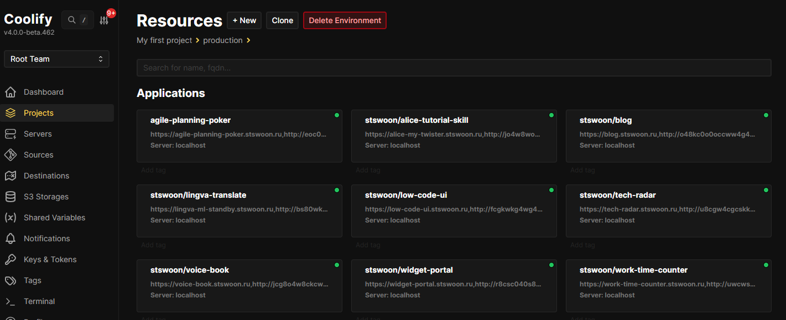

**Coolify** - это аналог Heroku для self-hosted решений. Он содержит в себе:

* docker для запуска контейнеров
* интеграции с GitLab\GitHub для ручного деплоя или деплою по коммиту через хуки
* reverse proxy для определения какой аппликейшен нужно запустить по dns имени
* ssl сертификат (**new**)
* AdminUI - для конфигурации всего этого хозяйства
* очень простую self hosted установку

## Установка

Установка не поменялась:

* покупаем vps (сейчас я расширил ресурсы в связи с next.js приложениями до 4 CPU \ 8 GB RAM \ 80 GB disk, хотя занято
  только 30 GB)
* Идем на сайт https://coolify.io/self-hosted или https://github.com/coollabsio/coolify и видим простую инструкцию

```
curl -fsSL https://cdn.coollabs.io/coolify/install.sh | sudo bash
``` 

⚠️⚠️⚠️ У меня была следующая проблема - при установке скачиваются образа - и docker сайт заблокировал по rate limit'у.
Поэтому нужно подождать пару часов \ день и снова запустать команду, тогда докачаются новые образа и все запуститься.

## Настройка application (**new**)

Вот тут в новом приложении все поменялось. Давайте расскажу вам с картинками типа в стиле "комикс".

1) Идем в `{your-domain}/project` и нажимаем `New`

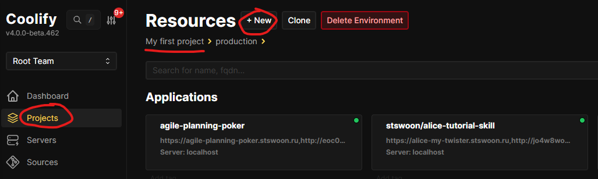

2) Выбираем `Public Repository`

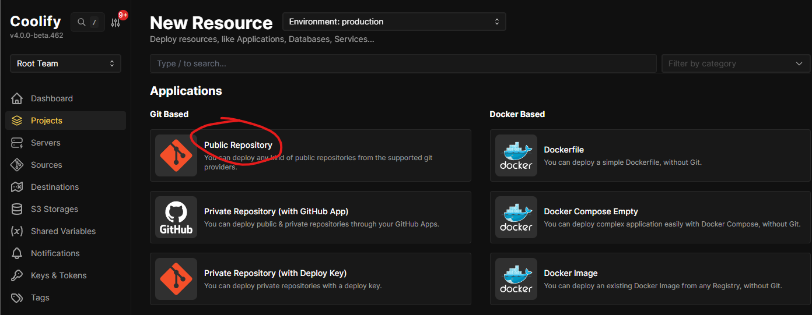

3) Указываем репозиторий URL + нажимаем `Check repository` + выбираем `Build Pack = Dockerfile` + нажимаем `Continue`

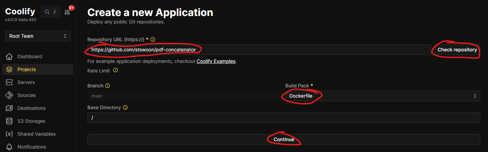

4) Убираем лишнее из `name` + указываем `domains` через запятую (первый это мой DNS, второй генерирует Coolify на
   sslip) + указывем `ports exposes` и `port mapping` (это нужно чтобы приложение запускались на разных, по аналогии как
   с обычным докером локально - нельзя запустить два приложения на одном порту одно ip-адреса) + нажимаем `Save`

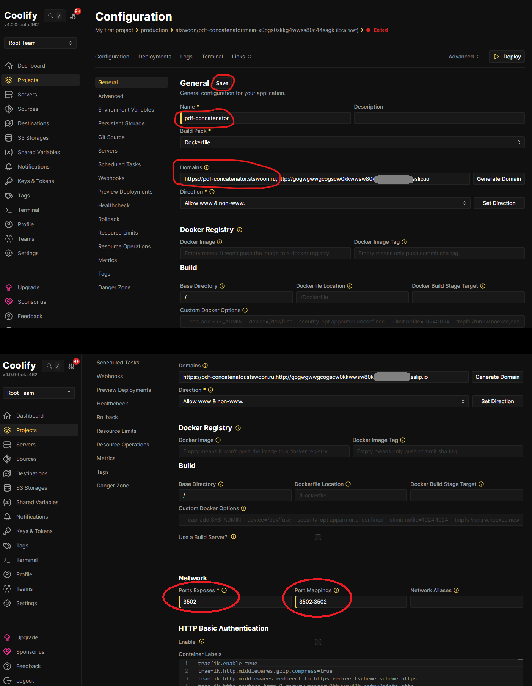

> альтернативное решение захардкодить порт в Dockerfile, но мне нравиться когда я могу им управлять, чтобы иметь
> возможность в любой момент поменять порт, если вдруг приложения пересеклись по портам. Как работает порт в коде,
> читайте в конце статьи.

5) Идем в `Enviroment Variables` + нажимем `Add`

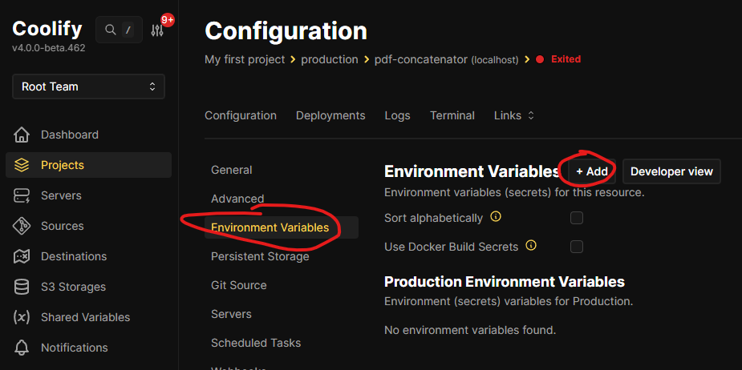

6) `Name=NGINX_PORT` + `Value=тоже что и в п.4` + `Available at Buildtime=true` + `Available at Runtime=true` + `Save`

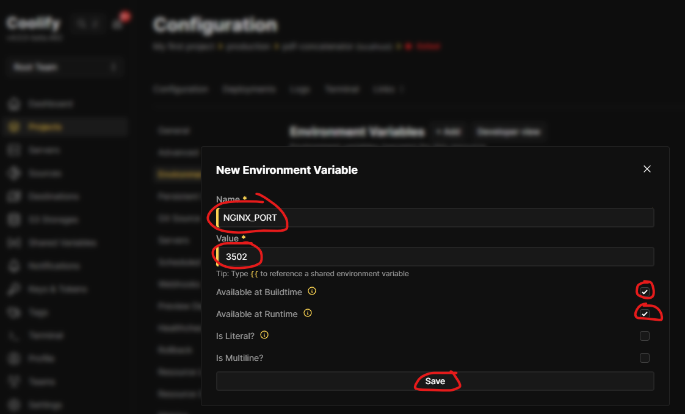

7) Нажимаем `Deploy`

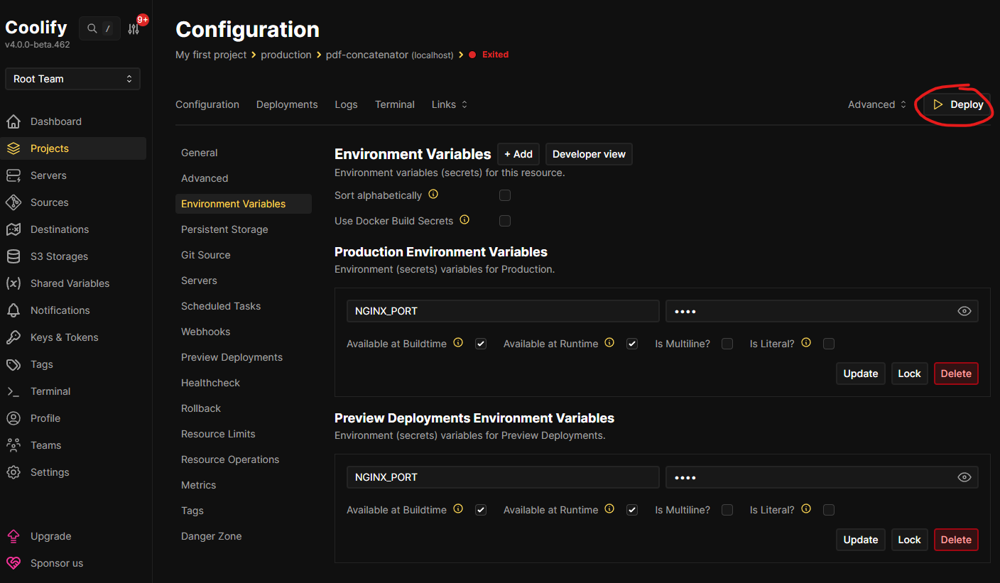

8) Проверяем что деплой успешен (если нет то можно посмотреть в логи)

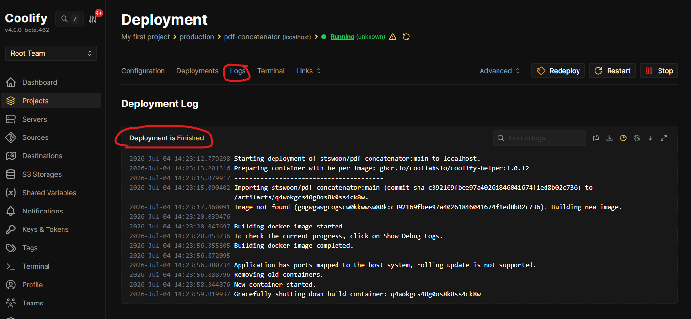

9) Открываем адрес

* урл вида http://gogwgwwgcogscw0kkwwsw80k.91.198.220.75.sslip.io/ обычно доступен сразу
* а вот DNS (https://pdf-concatenator.stswoon.ru/) может разливаться по серверам 1 - 24 часа

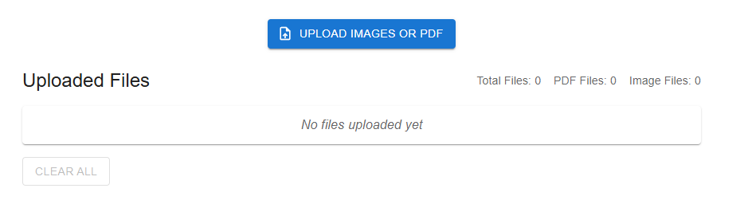

10) Идем на табу `Webhooks` + копируем урл для github + нажимаем `Webhook Configuration on GitHub`

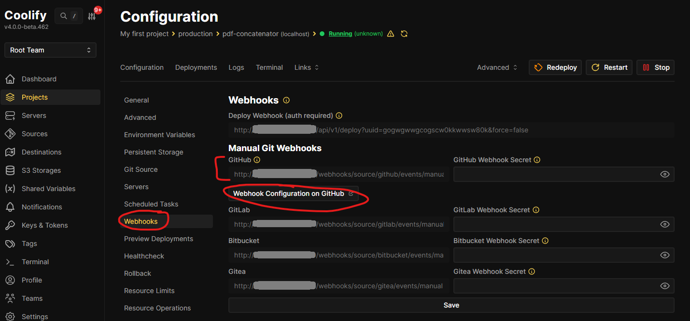

11) На сайте GitHub'a нажимаем `Add webhook`

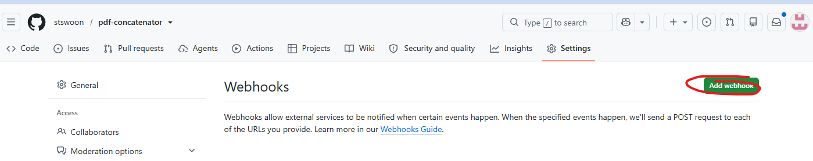

12) Вставляем скопированный URL в `Payload URL` + генерируем секрет и вставляем в `Secret` + нажимаем `Add webhook`.

* секрет это любая строка, например uuid c сайта https://www.uuidgenerator.net/version4

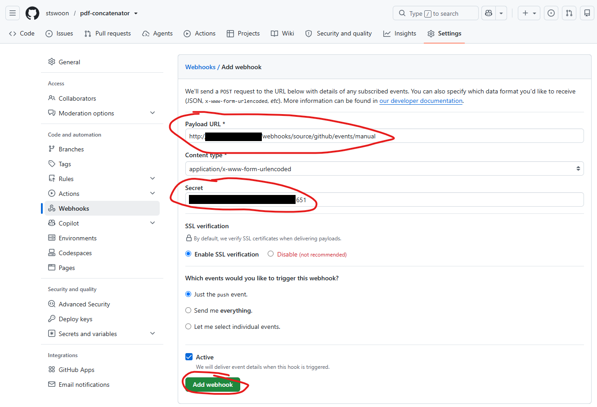

13) Этот же секрет встявляем в `GitHub Webhook Secret` + `Save`

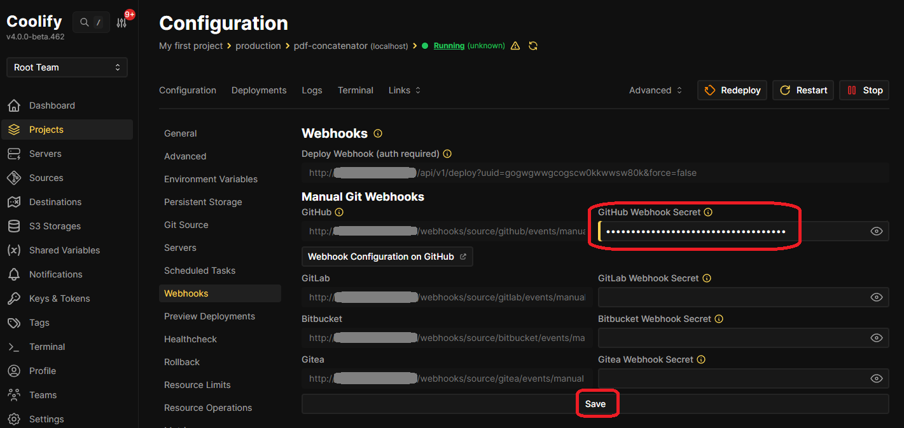

14) Теперь можно сделать пробный коммит в `main` и удостовериться, что система деплоит новую сборку.

## Настроки порта

Для **NodeJS** все довольно просто:

```dockerfile
# Dockerfile
EXPOSE ${PORT}
```

```js
//index.js
const PORT = process.env.PORT || 5000;
express()
    //...
    .listen(PORT, () => console.log(`Listening on ${PORT}`));
```

Пример
* https://github.com/stswoon/alice-tutorial-skill/blob/master/Dockerfile
* https://github.com/stswoon/alice-tutorial-skill/blob/master/index.js

А вот **NGINX** та просто не умее понимать енв переменные. Вроде как есть плагины или возможно в платной версии такая фича.
Но я пошел по пути наименьшего сопротивления и сделал string.replace порта в nginx конфигурации `default.conf`.

```dockerfile
# Dockerfile
FROM nginx:1.27.3
COPY --from=builder /app/dist ./usr/share/nginx/html
COPY start.sh /etc/nginx/
RUN chmod +x /etc/nginx/start.sh
ARG NGINX_PORT
EXPOSE $NGINX_PORT
CMD ["/etc/nginx/start.sh"]
```

```shell
//start.sh
NGINX_PORT=${NGINX_PORT:-80}
echo NGINX_PORT=${NGINX_PORT}
sed -i "s/listen       80;/listen ${NGINX_PORT};/" /etc/nginx/conf.d/default.conf
exec nginx -g "daemon off;"
```

Пример
* https://github.com/stswoon/pdf-concatenator/blob/main/Dockerfile
* https://github.com/stswoon/pdf-concatenator/blob/main/start.sh
