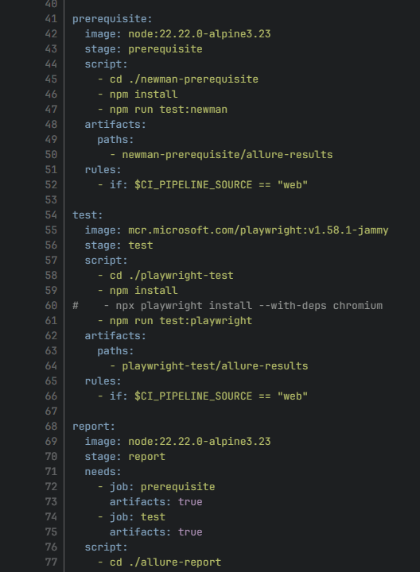

<!--
{
  "draft": false,
  "tags": ["Программирование"]
}
-->

# GitLab CI: базовые строительные блоки и E2E-пайплайн

```blogEnginePageDate
04 июля 2026
```

В данной статье хотел бы поделиться базовыми навыками настройки Gitlab CI. Данные знания полезны как для расширения
кругозора, использовании в пет проектах и более сложены, так и в при общение с devops. Предлагаю рассмотреть базовые
возможности и создать классический пайплайн `build -> deploy -> test`.



## Базовые строительные блоки

После push, создания merge request, ручного запуска или вызова из другого проекта GitLab создаёт pipeline. Pipeline
состоит из jobs — отдельных задач, которые выполняются GitLab Runner. Каждая job запускается в изолированном окружении.
Чаще всего это Docker-контейнер с указанным образом: Node.js для frontend-сборки, Maven для Java-проекта, Playwright для
браузерных тестов и так далее.

### job: отдельная задача

Job — это именованный блок YAML. Одна job должна отвечать за одну понятную задачу. Например, `build`, `deploy_staging`
или `e2e_tests`.

```
build:  # имя для отображения job в UI
    stage: build    # этап pipilene
    image: node:24.15.0-slim    # Docker-образ, внутри которого будет выполняться job
    script:
        - npm ci
        - npm run build
```

где:

* имя `build` отображается в интерфейсе GitLab.
* поле `stage` определяет этап пайплайна,
* а `script` содержит команды, которые будет выполнять runner.
* Поле `image` указывает Docker-образ, внутри которого будет выполняться job.

#### image: окружение для запуска

Для image не стоит использовать тег latest. Он делает пайплайн непредсказуемым: новая версия образа может изменить
версию Node.js, браузера или системных библиотек. Лучше фиксировать конкретную версию.

#### script: команды внутри job

Поле `script` — это список shell-команд, которые runner выполняет последовательно. Если любая команда завершится с
ненулевым кодом, job будет отмечен как failed, а следующий этап пайплайна обычно не начнётся.

Для сложной логики удобно использовать многострочный shell-скрипт:

```
e2e-tests:
script:
    - |
      if [ "$TEST_TYPE" = "all" ]; then
          npx playwright test
      else
          npx playwright test --grep "@$TEST_TYPE"
      fi
```

Но слишком большую бизнес-логику лучше выносить в файлы репозитория: например, `./ci/deploy-staging.sh`. Тогда скрипт
можно запустить и локально, а YAML останется читаемым.

### cache: ускорение установки зависимостей

Cache нужен для переиспользования зависимостей между job и пайплайнами. Для Node.js это обычно папка npm-кеша, а не
node_modules.

```
cache:
  key:
    files:
      - package-lock.json
  paths:
    - .npm/
```

Ключ кеша строится по package-lock.json. Когда зависимости не меняются, следующий пайплайн сможет использовать уже
скачанные пакеты. После изменения lock-файла GitLab создаст новый кеш.

Cache не гарантирует наличие файлов и не должен использоваться для передачи результатов сборки. Его задача — ускорять
повторяющиеся операции, например загрузку npm-пакетов. GitLab рекомендует использовать cache для зависимостей, а
`artifacts` — для передачи результатов работы job между этапами.

> Однако может так оказаться, что быстрее выкачать зависимости заново, чем читать их с диска из кеша.

### stage: показывают общий порядок

`Jobs` можно объединять в `stages`. Стадии выполняются последовательно, а задачи внутри одной стадии — параллельно, если
между ними нет явных зависимостей, например конфигурация может выглядеть так:

```
stages:
  - build
  - test

build:
  stage: build
  image: node:24.15.0-slim
  script:
    - npm ci
    - npm run build

unit-tests:
  stage: test
  image: node:24.15.0-slim
  script:
    - npm ci
    - npm run test
```

Здесь определены две стадии. Сначала GitLab выполнит `build`, а после успешной сборки перейдёт к `unit-tests`. Причем
результат работы каждой job можно созранять и передавать в другоую через `artifacts`.

Стадии полезны для визуального порядка, но иногда они создают лишнее ожидание. Если одна job зависит только от
конкретной задачи, лучше указать это через `needs`.

#### artifacts: результаты работы job

Artifacts — это файлы, которые GitLab сохраняет после завершения job. Их можно скачать из интерфейса GitLab или передать
следующей job.

Для E2E-тестов стоит сохранять отчёт, скриншоты, видео и результаты тестов даже при ошибке:

```
e2e-tests:
  stage: test
  script:
    - npx playwright test
  artifacts:
    when: always
    expire_in: 7 days
    paths:
      - playwright-report/
      - test-results/
```

Значение `when: always` особенно важно для тестов. Без него GitLab не загрузит артефакты, если тест упадёт, а значит не
получится открыть скриншот или видео падения. Пути в `artifacts.paths` задаются относительно корня проекта.

#### needs: явные зависимости пайплайна

По умолчанию GitLab ждёт завершения всей предыдущей стадии. `needs` превращает пайплайн из строго линейной
последовательности в граф зависимостей и позволяет одной job стартовать после выполнения
другой или других.

```
build: 
    stage: build 
    script: 
        - npm ci --cache .npm 
        - npm run build 
    artifacts: 
        paths: 
            - dist/ 
        expire_in: 1 day
        
deploy_staging:
    stage: deploy
    needs:
        - job: build
        artifacts: true
    script:
        - ./ci/deploy-staging.sh dist
```

Здесь `deploy_staging` ждёт `build` и применяет `deploy-staging.sh` к артефакту `dist/`.

#### rules: когда добавлять job в pipeline

`rules` определяет условия, при которых job появится в пайплайне.

```
deploy_staging:
    stage: deploy
    script:
        - ./ci/deploy-staging.sh
    rules:
        - if: '$CI_COMMIT_BRANCH == $CI_DEFAULT_BRANCH'
```

Такая job будет запускаться только для **default branch**, например `main` или `master`.

```
e2e-tests:
    rules:
        - if: '$CI_PIPELINE_SOURCE == "pipeline"'
        - if: '$CI_PIPELINE_SOURCE == "web"'
    when: manual
        - when: never
```

В этом примере E2E-тесты автоматически выполняются, когда их вызвал другой pipeline, и доступны вручную при запуске
через интерфейс GitLab.

`rules` проверяются при создании пайплайна: первая подходящая запись определяет поведение job.

### variables: env переменные job

В GitLab CI переменные используют для URL стендов, токенов, паролей, версий и параметров запуска.

```
variables:
  API_URL: "https://api-staging.example.com"
```

В job эта переменная доступна как обычная переменная окружения:

```
healthcheck:
  script:
    - curl --fail "$API_URL/health"
```

Секреты нельзя хранить в `.gitlab-ci.yml`. Токены, пароли и ключи нужно добавлять в настройках проекта или группы как
CI/CD Variables. Для production-значений обычно включают флаги Masked и Protected или подключают хранилище паролей
Vault.

### inputs: параметры запуска пайплайна

Переменные подходят для runtime-настроек и секретов. Для параметров, которые описывают структуру пайплайна и должны
проверяться при его создании, лучше использовать `inputs`. Inputs позволяют явно описать параметры пайплайна: тип,
значение по умолчанию, описание и допустимые варианты.

```
spec:
  inputs:
    test_type:
      description: "Тип запускаемых тестов"
      options:
        - all
        - smoke
        - gold
        - bronze
        - silver
      default: smoke

--- # обязательно разделять inputs сверху от job ниже
```

После разделителя `---` можно использовать значение input через выражение `$[[ inputs.<имя> ]]`.

```
variables:
  TEST_TYPE: $[[ inputs.test_type ]]
```

Полная конфигурация может выглядеть так:

```
spec:
  inputs:
    base_url:
      description: "Адрес стенда для тестирования"
      type: string
    test_type:
      description: "Тип тестов"
      options: [all, smoke, gold, bronze, silver]
      default: smoke

---

stages:
- test

e2e-tests:
  stage: test
  image: mcr.microsoft.com/playwright:v1.58.1-jammy
  variables:
    BASE_URL: $[[ inputs.base_url ]]
    TEST_TYPE: $[[ inputs.test_type ]]
  script:
    - npm ci
    - |
      if [ "$TEST_TYPE" = "all" ]; then
        npx playwright test
      else
        npx playwright test --grep "@$TEST_TYPE"
      fi
```

Если у input нет `default`, он становится обязательным. Значения inputs подставляются во время создания pipeline, до
запуска jobs. Адрес стенда, набор тестов или имя окружения — хорошие кандидаты для input. Пароль, токен доступа и API
key — нет.

### trigger: запуск пайплайна в другом проекте

В больших командах приложение и E2E-тесты часто находятся в разных репозиториях:

```
frontend-app
└── build → deploy → trigger

e2e-tests
└── prerequisite → test → report
```

После деплоя приложение запускает pipeline другого репозитория с тестами.

```
trigger-e2e:
    stage: post-deploy
    trigger:
        project: my-group/e2e-tests
        branch: main
        strategy: mirror
        inputs:
            base_url: "https://staging.example.com"
            test_type: smoke
```

`project` указывает путь к проекту с автотестами, `branch` — ветку, из которой нужно взять его конфигурацию, а `inputs`
передаёт параметры запуска.

Без `strategy` trigger-job будет считаться успешной сразу после создания downstream pipeline. С `strategy: mirror` job
ждёт завершения тестов и получает тот же итоговый статус: success, failed, canceled или manual. Для современных
конфигураций GitLab рекомендует mirror; depend остаётся совместимым вариантом, но не рекомендуется для новых пайплайнов.

### templates: шаблоны для переиспользования

По мере роста проекта `.gitlab-ci.yml` становится длинным. Повторяющиеся части стоит выносить в отдельные файлы и
подключать через `include`. Основной файл при этом становится компактным:

```
stages:
  - build
  - deploy
  - post-deploy

include:
  - local: ".gitlab/ci/build.yml"
  - local: ".gitlab/ci/deploy.yml"
  - local: ".gitlab/ci/e2e.yml"
 ```

Также можно подключать шаблоны из другого проекта:

```
include:
  - project: "my-group/ci-templates"
    ref: "v1.4.0"
    file: "/templates/playwright.yml"
```

GitLab поддерживает локальные, удалённые, проектные и встроенные include-файлы. Подключённая конфигурация объединяется с
основной, а значения из основного файла могут переопределять значения шаблона. Для формального переиспользования можно
применять CI/CD components. Они принимают inputs и позволяют не копировать одинаковые jobs между репозиториями.

```
include:
  - component: gitlab-pipelines/autotests-component@components
    inputs:
    job-suffix: ":playwright"
    test-tags: "ui"
    test-profile: "staging"
```

Такой подход особенно полезен, когда десятки проектов используют одинаковую логику запуска автотестов, публикации
отчётов или проверки качества.

### Summary

GitLab CI удобно воспринимать как набор простых строительных блоков:

* `image` задаёт окружение;
* `script` выполняет команды;
* `cache` ускоряет повторные установки зависимостей;
* `artifacts` передают результаты между jobs и сохраняют отчёты;
* `stages` показывают общий порядок;
* `needs` описывает реальные зависимости;
* `rules` определяет условия запуска;
* `inputs` делает pipeline настраиваемым;
* `trigger` связывает несколько репозиториев;
* `include` и `components` помогают не копировать одинаковую конфигурацию.

Начать можно с двух jobs — `build` и `test`. Затем добавить artifacts, deploy на staging и E2E-проверки. Главное —
постепенно усложнять пайплайн и сохранять его структуру понятной для команды.

## Пример e2e pipeline: `build -> deploy -> test`.

Рассмотрим основной проект с frontend-приложением. После сборки он публикует файлы на staging-стенд, а затем запускает
E2E-тесты в отдельном проекте.

```
workflow:
    rules:
        # Создаём pipeline для merge request.
        - if: '$CI_PIPELINE_SOURCE == "merge_request_event"'
        # Создаём pipeline после push в default branch.
        - if: '$CI_COMMIT_BRANCH == $CI_DEFAULT_BRANCH'
        # Для остальных случаев pipeline не нужен.
        - when: never

stages:
    - build
    - deploy
    - post-deploy

variables:
    BUILD_DIR: "dist"
    STAGING_URL: "https://staging.example.com"

cache:
    key:
        files:
            - package-lock.json
        paths:
            - .npm/

build:
    stage: build
    image: node:24.15.0-slim
    script:
        # Используем npm cache из папки проекта.
        - npm ci --cache .npm --prefer-offline
        # Создаём production-сборку.
        - npm run build
    artifacts:
        # Передаём результат сборки в deploy job.
        paths:
            - $BUILD_DIR/
        expire_in: 1 day
    rules:
        # Сборка нужна и в merge request, и в default branch.
        - if: '$CI_PIPELINE_SOURCE == "merge_request_event"'
        - if: '$CI_COMMIT_BRANCH == $CI_DEFAULT_BRANCH'

deploy-staging:
    stage: deploy
    image: alpine:3.21
    needs:
        - job: build
          artifacts: true
    script:
        # Скрипт должен загрузить dist/ на staging.
        # Конкретная реализация зависит от инфраструктуры:
        # S3, Kubernetes, SSH, Helm, CDN и т.д.
        - chmod +x ./ci/deploy-staging.sh
        - ./ci/deploy-staging.sh "$BUILD_DIR"
    environment:
        name: staging
        url: $STAGING_URL
    rules:
        # Не деплоим каждую ветку: staging обновляется только из default branch.
        - if: '$CI_COMMIT_BRANCH == $CI_DEFAULT_BRANCH'

trigger-e2e:
    stage: post-deploy
    needs:
        - deploy-staging
    trigger:
        # Репозиторий с Playwright-тестами.
        project: my-group/e2e-tests
        branch: main
        # Родительский pipeline ждёт результат E2E-тестов.
        strategy: mirror
        # Передаём параметры в downstream pipeline.
        inputs:
            base_url: "https://staging.example.com"
            test_type: smoke
    rules:
        - if: '$CI_COMMIT_BRANCH == $CI_DEFAULT_BRANCH'
```

Теперь добавим конфигурацию проекта `e2e-tests`.

```
spec:
    inputs:
        base_url:
            description: "URL стенда, на котором будут выполняться тесты"
            type: string
        test_type:
          description: "Набор тестов"
          options:
            - all
            - smoke
            - gold
            - bronze
            - silver
          default: smoke

---

stages:
    - prerequisite
    - test

variables:
    BASE_URL: $[[ inputs.base_url ]]
    TEST_TYPE: $[[ inputs.test_type ]]

cache:
    key:
        files:
            - package-lock.json
    paths:
        - .npm/

e2e-tests:
    stage: test
    image: mcr.microsoft.com/playwright:v1.58.1-jammy
    needs:
        - job: prerequisite
    artifacts: true
    script:
        - npm ci --cache .npm --prefer-offline
        - |
          if [ "$TEST_TYPE" = "all" ]; then
                npx playwright test
            else
                npx playwright test --grep "@$TEST_TYPE"
           fi
    artifacts:
        # Отчёт и вложения сохраняются даже при падении тестов.
        when: always
        expire_in: 7 days
        paths:
        - playwright-report/
        - test-results/
        reports:
            junit: test-results/junit.xml
    rules:
        # Автоматический запуск из pipeline приложения.
        - if: '$CI_PIPELINE_SOURCE == "pipeline"'
        # Возможность вручную запустить тесты из GitLab UI.
        - if: '$CI_PIPELINE_SOURCE == "web"'
          when: manual
        - when: never
```

Получается следующий поток:

1. Разработчик делает merge в main.
2. GitLab собирает приложение.
3. Job deploy-staging публикует dist/ на staging.
4. trigger-e2e запускает downstream pipeline.
5. Playwright запускает smoke-тесты на staging.
6. В случае ошибки GitLab сохраняет видео, скриншоты и отчёт.
7. Результат E2E-тестов возвращается в основной pipeline.

Если E2E-тесты завершатся с ошибкой, `trigger-e2e` также станет failed. Это делает качество деплоя видимым прямо в
основном pipeline.