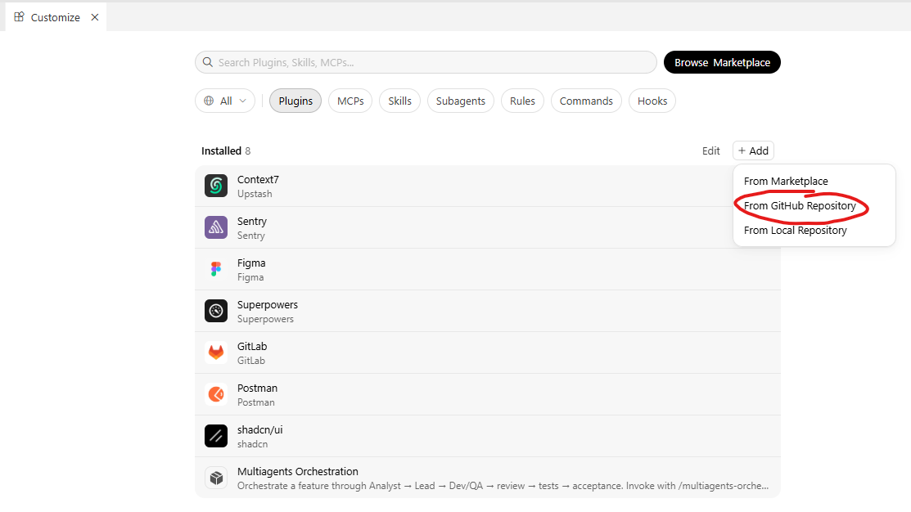
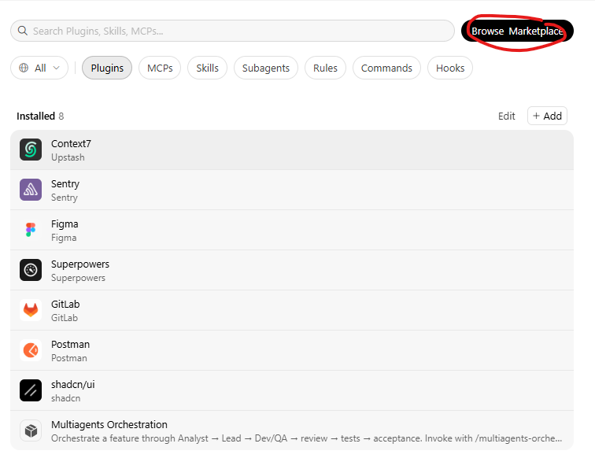
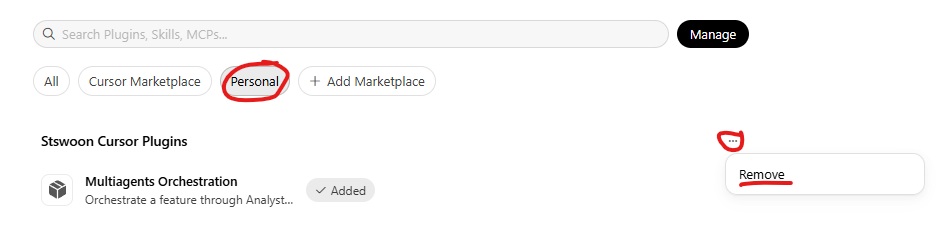

<!--
{
  "draft": false,
  "tags": ["Программирование"]
}
-->

# Cursor Plugin: как упаковать skills и агентов

```blogEnginePageDate
07 сентября 2026
```

В статье [Vibe Coding — простыми словами](../Vibe%20Coding%20—%20Getting%20Started/index.html) я уже
разбирал `agents.md`, rules, skills и мультиагентов. Всё это живёт внутри одного проекта: скопировал `.cursor/` — и
второй репозиторий ничего об этом не знает. А хочется наоборот: один раз описать команду (аналитик, lead, dev, QA) и
вызывать её в любом репозитории через `/multiagents-orchestration`. Для этого в Cursor есть **plugin** + **marketplace**.
Рабочий пример — https://github.com/stswoon/cursor-plugin


Плагин Cursor — это манифесты и markdown: command, skill, агенты. Никакого
скомпилированного кода. Простыми словами: zip с промптами, который Cursor умеет ставить из GitHub или из локальной
папки. Документация: [cursor.com/docs/plugins](https://cursor.com/docs/plugins) и
[reference](https://cursor.com/docs/reference/plugins). Шаблон — https://github.com/cursor/plugin-template

## Два формата

Cursor понимает два вида плагинов:

* **Agent Plugins** — `plugin.json` в корне папки. Только skills и MCP. Открытый стандарт
  [agent-plugins.org](https://agent-plugins.org).
* **Cursor Plugins** — `.cursor-plugin/plugin.json`. Плюс rules, agents, commands, hooks, variables.

Нам нужны **command** (точка входа `/...`) и **agents** (роли `/analyst`, `/lead`, …). Значит берём Cursor Plugin.

Можно сделать один плагин в корне репозитория. Удобнее сразу маркетплейс: в корне только каталог плагинов, сами плагины
лежат в `plugins/<имя>/`. Так сделано и в официальном template, и у меня.

## Структура репозитория

```
cursor-plugin/
├── .cursor-plugin/
│   └── marketplace.json          # каталог: какие плагины есть в этом git
├── plugins/
│   └── multiagents-orchestration/
│       ├── .cursor-plugin/
│       │   └── plugin.json       # манифест одного плагина
│       ├── commands/
│       │   └── multiagents-orchestration.md
│       └── skills/
│           └── multiagents-orchestration/
│               ├── SKILL.md
│               ├── multiagents.md
│               └── agents/
│                   ├── analyst.md
│                   ├── lead.md
│                   ├── dev-fe.md
│                   └── qa.md
└── README.md
```

Две разные папки `.cursor-plugin/` — это не опечатка:

* в **корне репозитория** — `marketplace.json` (оглавление);
* в **папке плагина** — `plugin.json` (сам плагин).

Если в корень положить только `plugin.json` и залить на GitHub, Cursor не поймёт это как маркетплейс. Ссылка на
репозиторий добавляет **marketplace**, а плагин ставится отдельной кнопкой Install.

## 1. marketplace.json

Файл `.cursor-plugin/marketplace.json` в корне:

```json
{
  "name": "stswoon-cursor-plugins",
  "owner": {
    "name": "stswoon"
  },
  "metadata": {
    "description": "Marketplace for the Multiagents Orchestration Cursor plugin.",
    "version": "1.0.1"
  },
  "plugins": [
    {
      "name": "multiagents-orchestration",
      "source": "./plugins/multiagents-orchestration",
      "description": "Orchestrate a feature through Analyst → Lead → Dev/QA → review → tests → acceptance."
    }
  ]
}
```

Где:

* `name` — id маркетплейса, kebab-case;
* `owner.name` — кто выкладывает;
* `plugins[].name` — id плагина;
* `plugins[].source` — путь **от корня репозитория** к папке плагина.

Дальше в массив можно дописать второй плагин — тот же git, другая папка в `plugins/`.

## 2. plugin.json

Файл `plugins/multiagents-orchestration/.cursor-plugin/plugin.json`:

```json
{
  "name": "multiagents-orchestration",
  "displayName": "Multiagents Orchestration",
  "version": "1.0.1",
  "description": "Orchestrate a feature through Analyst → Lead → Dev/QA → review → tests → acceptance. Invoke with /multiagents-orchestration.",
  "author": {
    "name": "stswoon"
  },
  "homepage": "https://github.com/stswoon/cursor-plugin",
  "repository": "https://github.com/stswoon/cursor-plugin",
  "keywords": [
    "multiagents",
    "orchestration",
    "analyst",
    "lead",
    "qa",
    "workflow",
    "code-review"
  ],
  "skills": "./skills/",
  "commands": "./commands/",
  "agents": [
    "./skills/multiagents-orchestration/agents/analyst.md",
    "./skills/multiagents-orchestration/agents/lead.md",
    "./skills/multiagents-orchestration/agents/dev-fe.md",
    "./skills/multiagents-orchestration/agents/qa.md"
  ]
}
```

Обязательное поле по доке — только `name` (kebab-case). Остальное лучше заполнить: в Customize будет человеческое
`displayName`, а не голый id.

Если пути не указать, Cursor ищет по умолчанию:

| Компонент | Папка по умолчанию  |
|-----------|---------------------|
| skills    | `skills/*/SKILL.md` |
| commands  | `commands/*`        |
| agents    | `agents/*.md`       |
| rules     | `rules/*.mdc`       |
| hooks     | `hooks/hooks.json`  |
| MCP       | `mcp.json`          |

У меня агенты лежат **внутри skill**, а не в `agents/` в корне плагина. Поэтому в манифесте пути прописаны явно. Если
поле `agents` задано — дефолтная папка `agents/` уже не сканируется.

`skills` и `commands` можно было не писать: они и так в стандартных папках. Написал, чтобы не гадать.

## 3. Command — то, что видно как `/...`

Command — markdown в `commands/`. Имя файла (или `name` во frontmatter) становится командой в чате.

```markdown
---
name: multiagents-orchestration
description: >-
  Запускает полный цикл фичи: Analyst → Lead → параллельно Dev/QA →
  ревью → тесты → приёмка. Use when the user types /multiagents-orchestration
  or starts a new feature that needs analysis, design, and QA.
---

# /multiagents-orchestration

Ты — оркестратор команды. Прочитай skill `multiagents-orchestration` (`SKILL.md`)
и схему `multiagents.md` в той же папке skill. Дальше веди процесс по шагам
и не перескакивай гейты.
```

Дальше в том же файле — кто какие шаги делает, куда писать артефакты, когда **не** запускать полный цикл.

Простыми словами:

* **command** — кнопка «старт» для пользователя;
* **skill** — инструкция, которую агент подхватывает и по `description`, и когда его ткнули командой;
* **agent** — отдельная роль (`/analyst`), которую оркестратор запускает как subagent.

Во frontmatter command и skill стоит писать и русские слова, и английские триггеры (`Use when the user types /...`).
Cursor выбирает skill по `description`. Если там только «оркестрация фичи», англоязычный чат может skill не найти.

## 4. Skill — правила оркестрации

Каждый skill — папка со `SKILL.md`:

```
skills/multiagents-orchestration/
├── SKILL.md          # обязательно: name + description + инструкция
├── multiagents.md    # схема процесса, агент читает по ссылке из SKILL.md
└── agents/           # промпты ролей (у меня тут, не в корне плагина)
```

Frontmatter:

```markdown
---
name: multiagents-orchestration
description: >-
  Оркестрация фичи через команду SA → Lead → Dev/QA → ревью → тесты → приёмка.
  Use when the user gives a feature task, mentions multiagents,
  /multiagents-orchestration, /multiagents, or asks to run the
  analyst-lead-dev-qa workflow.
---
```

В `SKILL.md` — короткий процесс, таблица ролей, гейты. Длинная схема и mermaid — в `multiagents.md` рядом. Так в
контекст сначала попадает compact-инструкция, а подробности агент читает сам, когда дойдёт до шага.

Артефакты пишем не в репозиторий плагина, а в **текущий проект**: `.cursor/artifacts/` (`requirements.md`, `design.md`,
`dev-tasks.md`, `test-cases.md`, …). Плагин — только промпты. Результат работы живёт там, где открыт чат.

## 5. Agents — роли команды

Агент — тоже markdown с frontmatter. Минимум по доке: `name` и `description`. Можно добавить `model` и `readonly`.

```markdown
---
name: analyst
description: >-
  Системный аналитик. Уточняет требования, пишет design.md и requirements.md,
  финальная приёмка sunny-day сценариев. Use via /analyst на шагах 1 и 7 workflow.
model: inherit
readonly: false
---

Ты — **Системный аналитик (SA)** (React + TypeScript strict).
Код в `src/` **не пишешь**.
```

В моём плагине четыре роли:

| Команда    | Файл         | Шаги  | Что делает                      |
|------------|--------------|-------|---------------------------------|
| `/analyst` | `analyst.md` | 1, 7  | требования, дизайн, приёмка     |
| `/lead`    | `lead.md`    | 2, 5  | нарезка задач, code review      |
| `/dev-fe`  | `dev-fe.md`  | 4б    | код в `src/`                    |
| `/qa`      | `qa.md`      | 4а, 6 | test-cases, прогон, баг-репорты |

Важный кусок, который легко забыть. Когда оркестратор запускает Task/subagent, у того **нет истории чата**. В промпт
нужно передать роль целиком (файл агента) плюс пути к артефактам и номер шага. Иначе subagent начнёт фичу с нуля и
перепишет `design.md`.

Ещё правило
из [Vibe Coding](https://github.com/stswoon/blog/blob/main/src/pages/2026/Vibe%20Coding%20%E2%80%94%20Getting%20Started/index.md):
один агент владеет своими файлами.
Dev не пишет `test-cases.md`, QA не лезет в `src/` фичи, Analyst не нарезает dev-задачи. Иначе два subagent правят один
файл и получается каша из diff'ов.

## Как это склеивается

```
Пользователь
    │
    ▼
 /multiagents-orchestration     ← command, оркестратор
    │
    ▼
 skill multiagents-orchestration
    │
    ├── /analyst  → requirements.md, design.md
    ├── /lead     → dev-tasks.md, qa-task.md
    ├── /qa  ┐
    └── /dev-fe ┘ параллельно
    ├── /lead     → review
    ├── /qa       → прогон TC
    └── /analyst  → sunny-day приёмка
```

Пользователь в целевом проекте пишет:

```
/multiagents-orchestration Добавь на главную страницу фильтр заказов по статусу
```

Оркестратор **сам код не пишет**. Он гоняет роли по гейтам: нет `design.md` — Dev не стартует; ревью не пройдено — QA
на шаг 6 не идёт.

Для мелкой правки в одном файле полный цикл не нужен — обычный agent. Отдельные роли тоже можно звать напрямую:
`/analyst` или `/lead`.

## Локальная установка (разработка)

Пока крутишь промпты, GitHub не нужен. Cursor подхватывает папки из `~/.cursor/plugins/local/`.

1. Если в организации запрещены локальные плагины — включи **Allow Local Plugin Imports**.
2. Скопируй **папку плагина**, не весь репозиторий. В корне этой папки должен быть `.cursor-plugin/plugin.json`.
3. `View -> Command Palette (Ctrl + Shift + A)` -> `Developer: Reload Window`.
4. Customize → плагин должен быть в установленных
5. В чате — `/multiagents-orchestration`.

## Установка из GitHub

Ссылка на репозиторий добавляет **marketplace**, а не ставит плагин.

1. Запушь актуальный `main`.
2. Customize → Plugins.



3. Добавь `https://github.com/stswoon/cursor-plugin`.
4. В каталоге появится **Multiagents Orchestration**. Нажми **Install**, выбери scope: **user** или **project**.
5. Reload: `View -> Command Palette (Ctrl + Shift + A)` -> `Developer: Reload Window`.


6. В чате должна быть `/multiagents-orchestration`.

Если уже добавляли репозиторий:

1. Найди marketplace (не только плагин) и **Remove**.
2. После reload проверь, что он не вернулся.
3. Добавь URL заново и снова нажми Install.





Если marketplace возвращается со старым коммитом — это
[известный баг](https://forum.cursor.com/t/add-plugin-github-imports-can-get-stuck-on-stale-plugin-versions/163895).
Тогда локальная копия из раздела выше.

Для team marketplace в Cursor есть Auto Refresh (нужно GitHub App, не чаще раза в 10 минут). Личный Add по URL этого не
умеет.

## Как пользоваться

Команду вызывай в Agent-чате **целевого проекта**, не в репозитории плагина.

Полный цикл:

```
/multiagents-orchestration
Сделай форму обратной связи на /contacts: имя, email, сообщение.
Валидация на клиенте, без бэкенда — покажи toast об успехе.
Не добавляй новые библиотеки.
```

Только анализ:

```
/analyst
Нужен экспорт таблицы заказов в CSV. Уточни требования и напиши design.md.
```

Только ревью уже написанного кода:

```
/lead
Проведи шаг 5: ревью текущего diff против .cursor/artifacts/design.md
```

На шаге 1 отвечай на вопросы аналитика — без этого дизайн не начнётся. На шаге 4 Dev и QA стартуют вместе: тест-кейсы не
блокируют код.

## Что ещё можно положить в плагин (у меня нет)

В этом репозитории только command + skill + agents. По доке в тот же плагин можно добавить:

* `rules/*.mdc` — как проектные rules, только раздаются с плагином;
* `mcp.json` — MCP, который встанет вместе с плагином;
* `hooks/hooks.json` + `scripts/` — хуки на edit/shell/session;
* `variables` в `plugin.json` — схема секретов, значения пользователь ставит в Customize → Configure, в конфиге
  плейсхолдеры `${API_TOKEN}`, не сами токены;
* `logo` — картинка для каталога.

Для workflow из промптов это лишнее. MCP и hooks имеет смысл, когда плагину нужны руки (API, форматирование файла после
edit), а не только текст роли.

Официальный marketplace (cursor.com/marketplace) — ручная модерация и отдельная заявка. Для себя и команды достаточно
GitHub URL или `~/.cursor/plugins/local/`.
