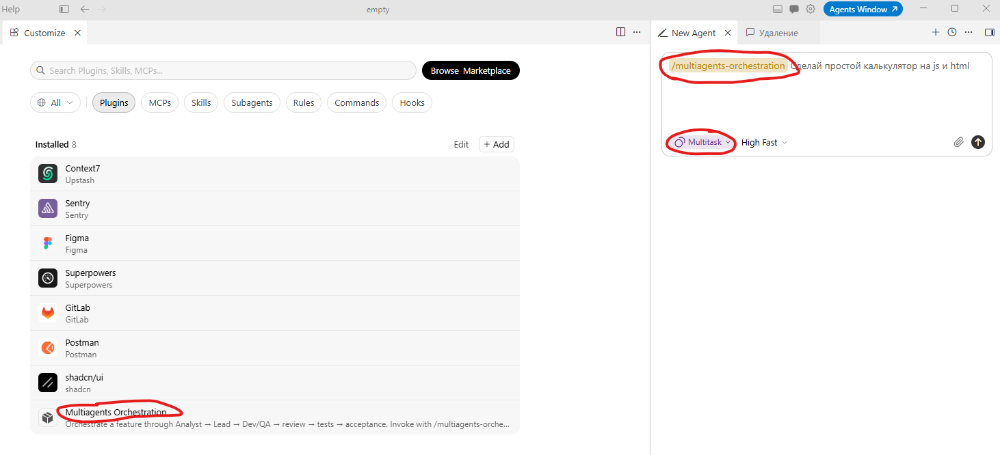

<!--
{
  "draft": false,
  "tags": ["Программирование"]
}
-->

# Hello World Chrome Plugin

```blogEnginePageDate
06 сентября 2026
```

Недавно делал Chrome-плагин, который сам заполняет форму **Run new pipeline** в GitLab. Пока собирал, понял что
hello-world для расширения сейчас уже не «три файла в одной папке»: Manifest V3, popup и content script живут в разных
мирах, а TypeScript нужно собирать в обычный JS. Ниже минимальный скелет — тот же, что в рабочем плагине, только вместо
GitLab будет «Hello World».

Пример получившегося проекта (простая структура): https://github.com/stswoon/gitlab-pipeline-chrome-plugin/tree/release/v1



Но сейчас он переделан и в main более свежая версия - https://github.com/stswoon/gitlab-pipeline-chrome-plugin

## Что получим

Два независимых куска, как в настоящем расширении:

* **popup** — маленькая HTML-страница, которая открывается по клику на иконку. Это ваш UI.
* **content script** — JS, который Chrome сам вставляет в открытую вкладку. Он видит DOM страницы.

В GitLab-плагине popup собирает URL и делает `chrome.tabs.update`, а content script уже на странице `/-/pipelines/new`
ищет поля и заполняет их. Они почти не разговаривают друг с другом: каждый делает свою работу. Для hello-world оставим
то же самое — popup скажет «привет» в своём окне, content нарисует баннер на сайте.

## Структура

```
hello-world-chrome-plugin/
  manifest.json
  package.json
  tsconfig.json
  vite.popup.config.ts
  vite.content.config.ts
  src/
    popup/
      index.html
      main.ts
      popup.css
    content/
      index.ts
```

После `npm run build` появится папка `dist/`. В Chrome загружаем именно её, не исходники.

## package.json

Расширение пишем на TypeScript, собираем Vite. Зависимостей в runtime нет — только инструменты сборки.

```
{
  "name": "hello-world-chrome-plugin",
  "private": true,
  "type": "module",
  "scripts": {
    "build": "npm run typecheck && vite build --config vite.popup.config.ts && vite build --config vite.content.config.ts",
    "typecheck": "tsc --noEmit"
  },
  "devDependencies": {
    "@types/chrome": "^0.1.43",
    "@types/node": "^26.4.1",
    "typescript": "^5.9.2",
    "vite": "^7.1.5"
  }
}
```

`@types/chrome` даёт типы для `chrome.tabs`, `chrome.storage` и остальных API. Сам Chrome их предоставляет в runtime,
в `package.json` их ставить не нужно.

## tsconfig.json

```
{
  "compilerOptions": {
    "target": "ES2022",
    "lib": ["ES2022", "DOM", "DOM.Iterable"],
    "module": "ESNext",
    "moduleResolution": "bundler",
    "strict": true,
    "noEmit": true,
    "skipLibCheck": true,
    "types": ["chrome"]
  },
  "include": [
    "src/**/*.ts",
    "vite.popup.config.ts",
    "vite.content.config.ts"
  ]
}
```

`noEmit: true` — TypeScript только проверяет типы, файлы в `dist` рисует Vite.

## manifest.json — паспорт расширения

Manifest V3. Popup вешается на `action`, content script — отдельным блоком `content_scripts`.

```
{
  "manifest_version": 3,
  "name": "Hello World",
  "version": "0.1.0",
  "description": "Hello World: popup + content script.",
  "minimum_chrome_version": "116",
  "action": {
    "default_popup": "src/popup/index.html",
    "default_title": "Hello World"
  },
  "content_scripts": [
    {
      "matches": ["http://*/*", "https://*/*"],
      "js": ["hello-world-content.js"],
      "run_at": "document_idle"
    }
  ]
}
```

Важные мелочи:

* `default_popup` указывает путь **как он будет лежать в `dist`**. Vite сохраняет `src/popup/index.html`, поэтому в
  манифесте пишем именно так, а не `popup.html`.
* В `content_scripts.js` — уже **собранный** файл. Исходник `src/content/index.ts` Chrome не умеет грузить.
* `matches` — на каких сайтах вставлять скрипт. Для hello-world — все http/https. В бою лучше сузить, например
  `https://gitlab.example.com/*`.
* `run_at: document_idle` — скрипт стартует когда DOM уже готов. Для формы, которая дорисовывается React'ом, этого мало
  (в GitLab-плагине я ещё жду появления полей), но для баннера хватает.

Манифест сам себя в `dist` не копирует. Это сделаем плагином в Vite.

## Popup

Popup — обычная HTML-страница. Можно без React: кнопка, обработчик, готово.

`src/popup/index.html`:

```
<!doctype html>
<html lang="ru">
<head>
    <meta charset="UTF-8"/>
    <title>Hello World</title>
    <link rel="stylesheet" href="./popup.css"/>
</head>
<body>
    <div id="app">
        <p id="label">Hello from popup</p>
        <button id="btn-hello" type="button">Сказать привет</button>
    </div>
    <script type="module" src="./main.ts"></script>
</body>
</html>
```

`src/popup/popup.css`:

```
body {
    margin: 0;
    min-width: 220px;
    font: 14px/1.4 system-ui, sans-serif;
}
#app {
    padding: 12px;
}
button {
    width: 100%;
}
```

`src/popup/main.ts`:

```
function init(): void {
    const label = document.getElementById('label') as HTMLElement;
    const button = document.getElementById('btn-hello') as HTMLButtonElement;

    button.addEventListener('click', () => {
        label.textContent = `Hello, ${new Date().toLocaleTimeString()}`;
    });
}
init();
```

Скрипт подключаем как `type="module"` и указываем `.ts` — Vite сам соберёт бандл. Popup живёт в своём документе: у него
свой `document`, он **не видит** DOM вкладки. Поэтому «поменять текст на сайте» из popup напрямую нельзя. Для этого есть
content script (или `chrome.scripting.executeScript`, но это уже другой сюжет).

## Content script

Content script выполняется в контексте страницы: может читать и менять DOM. Но это не совсем «скрипт сайта» — у него
отдельный JS-мир. `window` страницы он не делит с page-скриптами (isolated world), зато `document` общий.

`src/content/index.ts`:

```
function helloWorld(): void {
    if (document.getElementById('hello-world-banner')) {
        return;
    }

    const banner = document.createElement('div');
    banner.id = 'hello-world-banner';
    banner.textContent = 'Hello from content script';
    banner.style.cssText = [
        'position:fixed',
        'top:8px',
        'right:8px',
        'z-index:10000',
        'padding:8px 12px',
        'background:#111',
        'color:#fff',
    ].join(';');

    document.documentElement.appendChild(banner);
    console.info('[Hello World] content script is here');
}
helloWorld();
```

Откройте любой сайт, в консоли вкладки будет лог, в углу — баннер. Если баннера нет: проверьте `matches` в манифесте и
что загрузили именно `dist/`, а не исходники.

## Две сборки Vite

Почему не один `vite.config.ts`? Потому что popup и content — разные артефакты.

* Popup — HTML-приложение. Точка входа `index.html`, Vite кладёт рядом JS/CSS и сохраняет путь
  `src/popup/index.html`.
* Content script в `manifest.json` — обычный классический скрипт, не ES-модуль. Его нужно собрать в один IIFE-файл
  с фиксированным именем, которое прописано в манифесте.

Плюс порядок: первая сборка чистит `dist`, вторая дописывает туда content-файл и **не должна** делать `emptyOutDir`.

`vite.popup.config.ts`:

```
import { copyFileSync } from 'node:fs';
import { dirname, resolve } from 'node:path';
import { fileURLToPath } from 'node:url';
import { defineConfig } from 'vite';

const root = dirname(fileURLToPath(import.meta.url));

export default defineConfig({
  build: {
    outDir: 'dist',
    emptyOutDir: true,
    sourcemap: true,
    minify: false,
    rollupOptions: {
      input: {
        popup: resolve(root, 'src/popup/index.html'),
      },
    },
  },
  plugins: [
    {
      name: 'copy-manifest',
      closeBundle() {
        copyFileSync(resolve(root, 'manifest.json'), resolve(root, 'dist/manifest.json'));
      },
    },
  ],
});
```

`vite.content.config.ts`:

```
import { dirname, resolve } from 'node:path';
import { fileURLToPath } from 'node:url';
import { defineConfig } from 'vite';

const root = dirname(fileURLToPath(import.meta.url));

export default defineConfig({
  publicDir: false,
  build: {
    emptyOutDir: false,
    outDir: 'dist',
    sourcemap: 'inline',
    minify: false,
    rollupOptions: {
      input: resolve(root, 'src/content/index.ts'),
      output: {
        format: 'iife',
        name: 'unusedHelloWorld',
        extend: true,
        entryFileNames: 'hello-world-content.js',
        inlineDynamicImports: true,
      },
    },
  },
});
```

* `name: 'unusedHelloWorld'` — IIFE обязан иметь глобальное имя. Нам оно не нужно, поэтому `extend: true`, чтобы никого
  не затереть.
* `minify: false` — в консоли Chrome проще читать свой код. Для магазина можно включить обратно.

После сборки `dist` выглядит так:

```
dist/
  manifest.json
  hello-world-content.js
  src/popup/index.html
  src/popup/assets/...
```

Именно поэтому в манифесте `default_popup` = `src/popup/index.html`, а content = `hello-world-content.js`.

## Собрать и загрузить в Chrome

```
npm install
npm run build
```

Дальше:

1. Открыть `chrome://extensions`
2. Включить **Developer mode**
3. **Load unpacked**
4. Выбрать папку `dist/`

Кликнули по иконке — открылся popup. Открыли любой `https://...` сайт — в углу баннер от content script.

После каждого изменения исходников снова `npm run build`, затем на карточке расширения кнопка обновления. Если меняли
только popup — достаточно закрыть и снова открыть иконку. Если меняли content script — ещё и обновить вкладку: старый
скрипт уже вживлён в страницу.

## Если popup всё-таки хочет дернуть страницу

В GitLab-плагине я так не делаю: popup меняет URL вкладки, а content сам просыпается на новой странице. Но для
hello-world часто хотят кнопку «напиши на сайте». Тогда нужен канал сообщений.

В popup:

```
const [tab] = await chrome.tabs.query({active: true, currentWindow: true});
if (tab?.id) {
    await chrome.tabs.sendMessage(tab.id, {type: 'HELLO'});
}
```

В content:

```
chrome.runtime.onMessage.addListener((message) => {
    if (message?.type === 'HELLO') {
        helloWorld();
    }
});
```

В манифест добавить `"permissions": ["activeTab"]`. Сообщение дойдёт только если content script на этой вкладке уже
вставлен — то есть URL попал в `matches`. На `chrome://` и Chrome Web Store content scripts не работают.