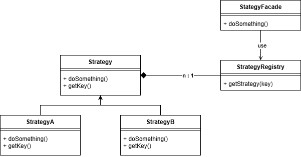

<!--
{
  "draft": false,
  "tags": ["Программирование"]
}
-->

# Синергия Паттернов Registry и Strategy

```blogEnginePageDate
18 июля 2026
```

Паттерн **Strategy** нужен, чтобы вынести разные варианты поведения в отдельные классы и выбирать нужный алгоритм во
время выполнения. **Registry** нужен, чтобы хранить набор обработчиков и быстро находить нужную реализацию по ключу.

## Strategy (Стратегия)

```java
interface ModuleService<DataType> {
    ModuleServiceKey getKey();

    void calculate(DataType moduleData);

    String print(DataType moduleData);
}

//order is important
enum ModuleServiceKey {
    GENERAL, GROUND_CALCULATION, WATER_CALCULATION, FINAL_CALCULATION
}
```

Каждый модуль может рассчитать себя через `calculate`, где DataType это контекст, который наполняет каждая стратегия.
Также модуль вывести свои данные в виде отчета, например в markdown. И у модуля есть ключ, чтобы вызывать его в
правильном порядке.

## Registry (Реестр)

Реестр достигается за счет того что через `@Autowired` можно получить список сервисов
`List<ModuleService<?>> moduleServices`. А затем через ключ `getKey` сложить их в мапу.

```java
class ModuleRegistryService {
    public final Map<ModuleServiceKey, ModuleService<?>> moduleServiceMap;

    @Autowired
    ModuleRegistryService(List<ModuleService<?>> moduleServices) {
        moduleServiceMap = moduleServices.stream()
                .collect(Collectors.toMap(ModuleService::getKey, Function.identity()));
    }
    
    get(ModuleServiceKey moduleServiceKey) {
        return moduleServiceMap.get(ModuleServiceKey);
    }
}
```

## Синергия Паттернов

Теперь мы можем в любой момент добавить новый модуль, реализовать стратегию и автоматически получим встраиваемость в
общий проект, без изменения самого проекта, реализуя принцип открытости-закрытости.

```java
class ProjectService {
    @Autowired ModuleRegistryService moduleRegistryService;
    
    void calculate(Map<ModuleServiceKey, Object> projectData) {
        for (ModuleServiceKey key : ModuleServiceKey.values()) {
            ModuleService moduleService = moduleRegistryService.get(key);
            Object moduleData = projectData.get(key);
            moduleData = moduleService.calculate(moduleData);
            projectData.put(key, moduleData);
        }
    }

    void print(Map<ModuleServiceKey, Object> projectData, StringBuilder report) {
        for (ModuleServiceKey key : ModuleServiceKey.values()) {
            ModuleService moduleService = moduleRegistryService.get(key);
            Object moduleData = projectData.get(key);
            String moduleReport = moduleService.print(moduleData);
            report.append(moduleReport);
        }
    }
}
```

