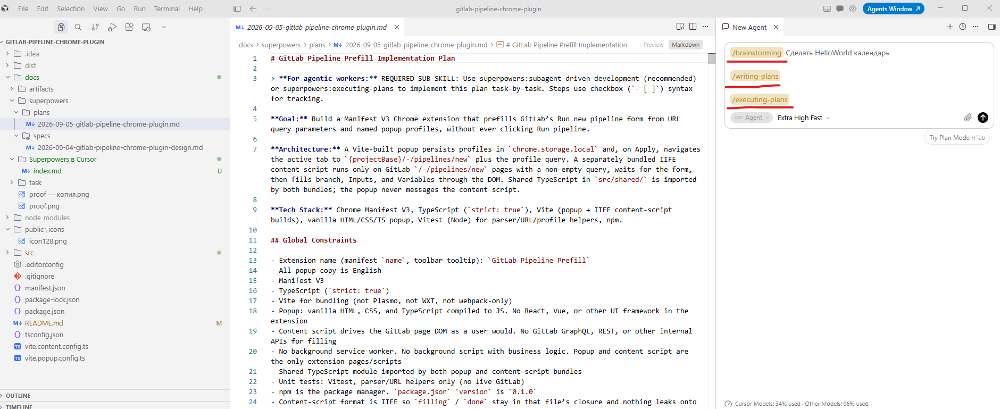

<!--
{
  "draft": false,
  "tags": ["Программирование"]
}
-->

# Superpowers в Cursor

```blogEnginePageDate
09 сентября 2026
```

В [Vibe Coding — простыми словами](../Vibe%20Coding%20—%20Getting%20Started/index.html) я разбирал
skills, rules и агентов внутри одного репозитория. В
[Cursor Plugin: как упаковать skills и агентов](../Cursor%20Plugin%20как%20упаковать%20skills%20и%20агентов/index.html)
— как упаковать свою команду в marketplace. Superpowers — это уже готовая методология разработки для агента:
не «набор промптов», а процесс, который агент обязан пройти, прежде чем писать код. 

> **Но пожирает токены только так** - возможно плагины попроще будут получше для более простых задач.



Репозиторий: https://github.com/obra/superpowers  
Установка в Cursor: https://github.com/obra/superpowers#cursor

Простыми словами: вы ставите плагин один раз, а дальше в обычном Agent-чате пишете «сделай фичу» или «почини баг».
Агент не должен сразу лезть в файлы. Сначала уточняет задачу, показывает дизайн кусками, пишет план, и только потом
кодит — часто через subagent'ов и тесты.

## Что это такое

Superpowers — Cursor Plugin (формат `.cursor-plugin/plugin.json`). Внутри:

* **skills** — markdown-инструкции: brainstorming, TDD, debugging, review, worktrees;
* **hooks** — на старте сессии агенту в контекст вставляют skill `using-superpowers`.

Slash-команды вроде `/superpowers` **нет**. Это не оркестратор с кнопкой старта, как
`/multiagents-orchestration`. Плагин молча подключается к каждому Agent-чату. Вы просто пишете задачу.

Авторы называют это методологией, а не библиотекой. Философия короткая:

* сначала тесты, потом код;
* процесс вместо «сейчас поправлю и посмотрим»;
* простота важнее фич;
* «готово» только если есть доказательство (прогнанная команда, а не «должно работать»).

## Установка в Cursor

Либо Customize → Plugins → поиск `superpowers` → Install. 

Scope: **user** (на все проекты) или **project**.

Если агент сразу пишет код и не спрашивает «а что мы вообще строим?» — хук не сработал.

## Что лежит на диске

У меня плагин приехал из официального marketplace `cursor-public` и лежит примерно так:

```
~/.cursor/plugins/cache/cursor-public/superpowers/<hash>/
├── .cursor-plugin/plugin.json
├── hooks/
│   ├── hooks-cursor.json
│   ├── session-start
│   └── run-hook.cmd
└── skills/
    ├── using-superpowers/SKILL.md
    ├── brainstorming/SKILL.md
    ├── writing-plans/SKILL.md
    └── …
```

В `plugin.json` важны два поля:

```
{
  "name": "superpowers",
  "skills": "./skills/",
  "hooks": "./hooks/hooks-cursor.json"
}
```

Ни `commands`, ни `agents`. Только skills и хук. Поэтому в чате не появится новая `/команда` — появятся skills,
которые агент должен сам открыть по `description`.

## Как оно просыпается

На `sessionStart` Cursor запускает `hooks/session-start`. Скрипт читает `skills/using-superpowers/SKILL.md` и
вкладывает текст в `additional_context`. Агент видит это ещё до вашего первого сообщения.

Правило из этого skill жёсткое: **перед любым действием** — даже перед уточняющим вопросом — проверить, нет ли
подходящего skill, прочитать его целиком и объявить «Using [skill] to …». Если есть чеклист — завести todo на каждый
пункт.

Приоритет:

1. ваши явные инструкции (`AGENTS.md`, rules, то что вы написали в чате);
2. skills Superpowers;
3. дефолтное поведение модели.

## Как пользоваться

Полный цикл. Новый чат, режим Agent:

```
Сделай Chrome-расширение, которое заполняет форму Run new pipeline в GitLab
из query string. Не нажимай Run pipeline. Сначала уточни требования.
```

Дальше агент должен включить brainstorming: вопросы, варианты, дизайн кусками. Не подтверждайте всё скопом — читайте
секции. Когда дизайн ок, он пишет план. «Делай» / «go» — уже реализация по плану.

Только баг:

```
Падает typecheck после сборки popup. Используй systematic-debugging:
сначала причина, потом патч.
```

Уже есть спека, нужен план:

```
Спека в docs/superpowers/specs/2026-09-04-….md.
Напиши implementation plan skill'ом writing-plans. Код пока не трогай.
```

План уже есть, новый чат:

```
Выполни план docs/superpowers/plans/2026-09-05-….md
через subagent-driven-development.
```

Мелочь без SDLC — так и скажите. Иначе brainstorming начнёт дизайн на правку одной строки:

```
Не запускай brainstorming и worktree.
В src/shared/query.ts поправь split list-values. Только этот файл.
```

Явно позвать skill можно и так: «use brainstorming», «use TDD», «use verification-before-completion».
В тестах Superpowers как раз проверяют, что агент не отмахивается фразами вроде «я и так знаю, что такое SDD».

## Как проверить, что плагин живой

В чате доступны хотя бы 1 скил: `using-superpowers`, `brainstorming`, `writing-plans`, `test-driven-development`,
`systematic-debugging`, `subagent-driven-development`, `verification-before-completion`.

Что хук **не** гарантирует: что агент пройдёт все гейты brainstorming (вопрос за вопросом, апрув секций, коммит
спеки). Skill говорит «обязательно», модель может срезать. Если срезает — ткните явно: «следуй brainstorming skill
буквально».

## Мелочи, о которые спотыкаешься

**TDD обязателен в их процессе.** План режет шаги «напиши падающий тест / посмотри как упал / минимум кода». Если в
проекте нет тест-раннера — либо заведите, либо в чате скажите «без TDD, проверяй typecheck и ручным сценарием».

**Worktree на Windows.** Skill хочет изолированную папку. Иногда проще: «без worktree, работай в текущем checkout,
ветку создай сам».

**Visual companion в brainstorming.** Опциональные мокапы в браузере. С логотипа Prime Radiant уходит версия плагина
(не промпт и не код). Выключить: `SUPERPOWERS_DISABLE_TELEMETRY=1`.

**Длинный чат после compact.** Хук в Cursor вешается на `sessionStart`. Если контекст схлопнули и агент «забыл»
скиллы — новый чат надёжнее, чем уговаривать старый.

**Не коммить секреты.** Плагин сам по себе секретов не просит. Спеки и планы он складывает в git — не кладите туда
токены.
