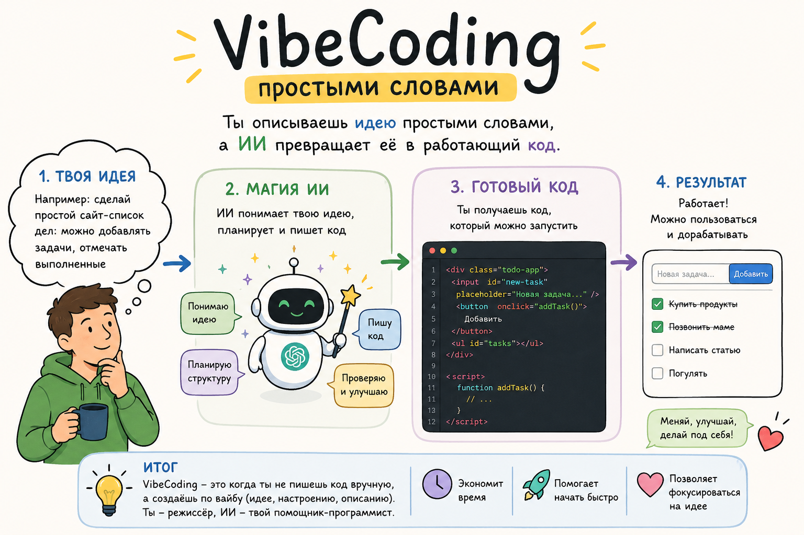
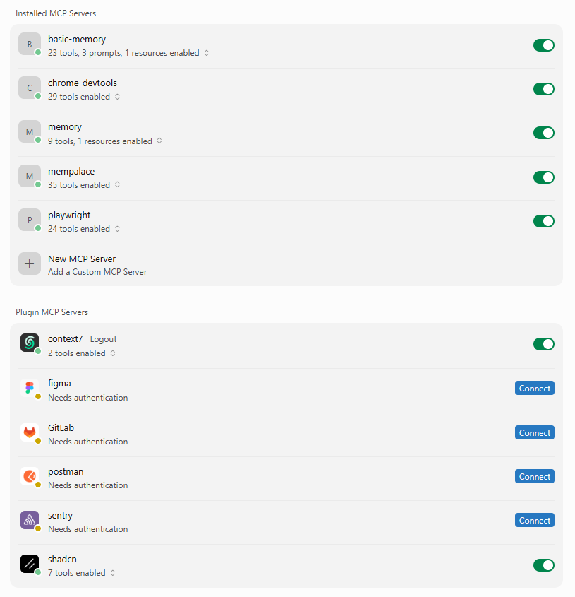
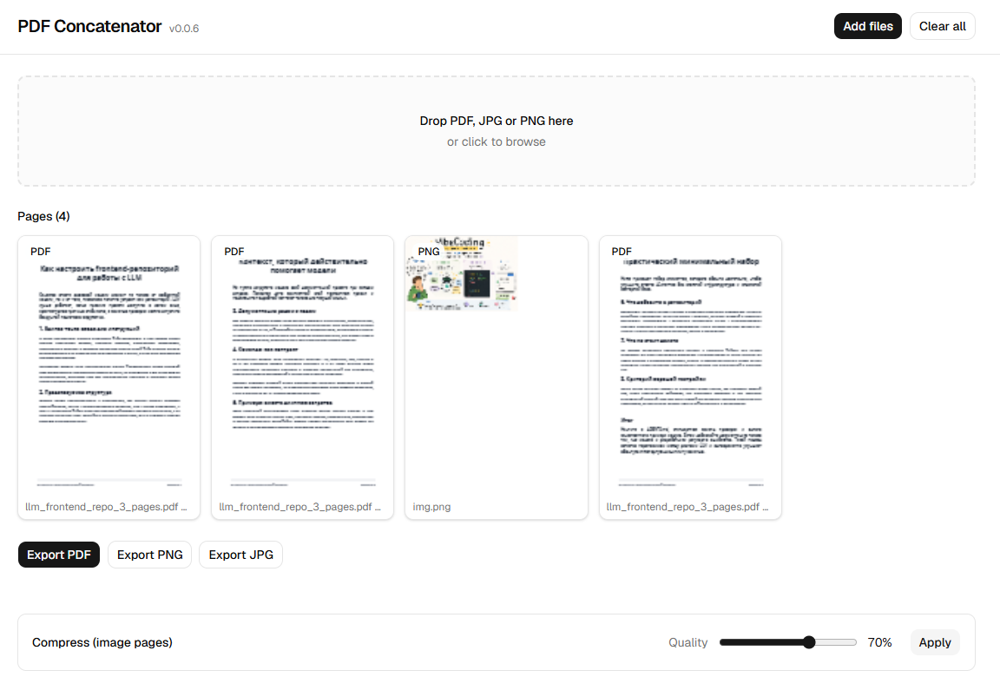

<!--
{
  "draft": false,
  "tags": ["Программирование"]
}
-->

# VibeCodding - getting started

```blogEnginePageDate
12 июля 2026
```

Модная тема VibeCodding. Но рассказывают о ней слишком сложно, на мой взгляд. Что значит подготовить проект к AI? Как
настроить tools/mcp/rules/skills? RAG? Аенты\Чаты? В этой статье постараюсб простыми словами рассказать, что это такое.
Репозиторий с примером - https://github.com/stswoon/projectForLessons/tree/master/2026/test-ai

.

## Выбор AI

Простыми словами **Chat** это когда ты задаешь вопрос + опционально прикладываешь файл\картинку, а он выдает тебе
текстовый
ответ + опционально файл\картинку.
**Agent** - это тот же чат только он имеет доступ к ОС, репозиторию в результате сам меняет файлы на компьюторе или
меняет данные на сервере, например через REST-запросы. `Agents = LLM + Tools`. Tools это руки агента (читай ниже).

Есть разные системы KiloCode, Codex, Claude, Grok, ChatGPT, Gemini, Cursor.

Ради простоты - **покупаем Cursor** и отмечаем галочкой не отсылать данные для обучения.

## Инит проект

Пишем в чате

```
Создай Hello World проект на React + Typescript
```

Все проект готов, см. коммит `12d0fb082a41b1d83ae73111f56be63fe779dabc`

## Подготовка проекта

```
Cоставь agents.md для проекта
```

Теперь все агенты читают `agents.md`. Для каждого агента используются разные подходы, но `agents.md` более менее стал
стандартом. В этом файле описываем базовые правила, привила кода, где смотреть про архитектуру, правила работы с
файлами. См. коммиты `f186247c631f28afff34ab515ec1fa99b794026e` и `356a580b2c53c1980e469d04df9645579157502a`.

## Rules

```
- Я: "какие бы rules ты добавил в проект"
- Agennt: "..."
- Я: "сделай"
```

Готово, появились .cursor/rules/*.mdc, которые описывают что нужно делать с каждым файлом в отдельности по фильтру
`globs` внутри файла, либо всегла, если `alwaysApply: true`. Все можно было бы положить в  `agents.md` и все бы
работало, однако тогда бы файл стал большим и занимал бы много места в контексте. А так агент подключает только описание
и затем если подходит уже загружает полный текст в контекст по `globs` или по `description`.

Cм. коммит `b07aa5827fee7c7d650a503eaa36ea74b4c046a3`.

## Безопастность

В рулы и agents.md следует добавить ограничения типа:

* нельзя читать .env
* нельзя отправлять сентетив данные, секреты и пароли
* нельзя менять такие-то файлы

Это называется **защитный промптинг**.

## Agents Mods

Вы могли заметить, что агент вместо того чтобы сразу сделать изменения предложил варианты и потом пришлось попросить его
сделать. Это потому что из-за формулировки он подумал что ему стоит ответить в режиме `Plan`. Вы можете сами
регулировать моды в окошке чата.

* `agent` - стандратный режим - может планировать и менять файлы
* `plan` - планирует, но файлы не меняет - можно использовать чтобы убедиться в том что он сделает то что вы хотите, а
  потом переключиться в `agent` мод.
* `ask` - ответы на вопросы, что-то типа стандартного режима chatgpt
* `multitask` - позволяет запускать sub-агентов (читай ниже)

## Context

Обычно контекст ограничен 200к токенов. Токен на русском языке это примерно 2 буквы. Токен на английском языке это
примерно 5 букв. Это связанно с тем что больше обучающих данных на английском было влито в LLM. Читай те это как
кодировки в древности - английский занимал 1 байт, а все остальные уже 2 байта.

Итак:

* на английском вы экономите в 2.5 раза, т.е. в контекст поместиться больше, либо съэкономите на лимите токенов в
  месячной подписки, но согласен на русском легче возможно воспронимать информацию (мы же тут для Vibe).
* если контекст загружен больше чем на 50% (100к токенов), то агент начнет путаться и забывать середину - как с
  человеком хорошо помниться начала и конец.
* поэтому рекомендуется разбить задачи на части чтобы уместиться, либо суммаризовать и начать новый чат с этой
  суммаризацией.
* также на каждую новую задачу нужно начинать новый чат, также это необходимо, чтобы агент меньше думал из-за большого
  количества информации.
* `Context = system prompt + agents.md + rules + mcp + tools + [user input + LLM output] * N`, поэтому перый запрос
  кушает много токенов.
* Cистемный промпт - просто текст, типа ты `senior react\angulat\spring\java\go developer`

## Prompt

Просто текст, где вы просите агента что-то сделать, а он магически угадывает, прям как человек.

### One Shot prompt

One Shot prompt - Обяснять стоит также как и человеку. Не просто `сделать приложение`, а как можно подробнее например
также как пишется история:

```
Cоздай приложение аналог https://www.ilovepdf.com/jpg_to_pdf.

Нужно уметь:
1) разбивать pdf на страницы и давать скачитьва png\jpg
2) склеивать разные pdf
3) склеивать jpg\png в pdf
4) уменьшать размер\качество jpg\png для последующего склеивание в pdf или скачивания
5) drag&drop страниц с изменением порядка
6) если pdf страница является "текстом", а не картинкой то она таковой и должна остаться чтобы не увеличивать размер 
(если это не возможно - сообщи об этом - и можно преобразовать в кратинку)
```

Чем подробнее сделаете тех задание тем лучше он ответит. Хотя сейчас сети прокачались, поэтому часть информации для
простых вещей он додумывает сам и понимает.

Также можно добавить json\open-api схемы, примеры запросов\ответов, арх.диаграмму - назовем это `prompt + examples`.

### Few-shot prompt

Даешь маленькую задачку, потом раскручиваешь. Например в кадом новом чате

* создай react приложение
* добавь ts
* добавь shadcn как ui-kit
* падает ошибка такая-то, поправь
* добавь тесты
* добавь документация

Например см. коммиты add tailwind:

* `1e6bc8e63033ae2a160b6da299ce1a397bfb0522` - `добавь tailwind`
* `e96e1b7355945aa00423ee8cb7c621a34332900e` - `добавь shadcn` (он базируется на tailwind)
* `9b04a338bbf80d8d019a3085b89ff2cbd7519c57` - `поправь ошибку сборки`

## Skills

Чтобы кажды раз не писать промнт чтобы добавить новый ui-компоненты, или опять провести ревью коммита, можно скопироть
промпты в текстовый редактор и потом вставлять их из заметок, а можно создать папку `./cusror/skils` и потом просто
написать `/dd-react-feature`.

```
- Я: "какие skiils ты бы добавил"
- LLM: "..."
- Я: "добавь: 1) commit-messages 2) add-react-feature 3) scope-guard 4) component-from-mockup"
```

См коммит `fc49042d39b97af6698049bd8f742fc7e4bfc94e`.

## Tools

**Tools** - это руки агента. Базовые возможности:

* **Terminal** - что позволяет искать, читать, редактировать файлы, например grep
* **Web Search** - поиск в инете
* **Browser** - проверять запуск приложения
* и др.

Без Terminal агент не бы бы агентом, т.к. ничего бы не смог сделать. В принципе на этом все. Всегда можно через терминал
создать програмку, которое вызовет то или иное апи. Однако создание такой програмки займет полконтекста. Поэтому можно
помочь агенту и создать удобны тул для него

### Создание своего Tool

```
Создай Tool для получения random-names из randomuser.me 
```

См. коммит `5e53e3b31c8c3f240371ad53169e2b58914ddf70`. Получаем 3 файла в папе `.cursor/tools/random-names`:

* `tool.md` - описание по принципу `One Shot prompt` - название + что делает + когда вызывать + что вызывать (
  index.mjs)
* `sheme.json` - схема параметров
* `index.mjs` - обычный node.js код с вызовом апи randomuser.me

Теперь если спросить `дай мне случайные имена`, то система выдаст имена, причем в thinking можно увидеть что запускается
именно наш тул + увидеть raw ответ тула, также raw ответ можно увидеть в настройка курсора в секции tools (удобно для
дебага).

### Tool tags

Для систем вида `n8n`, где к агенту подключаются тулы через drag-n-drop, а в системном промпте добаяляется описание
какие тулы есть и он соответсвенно вызывает либо запрос на сервер А или сервер Б, либо отправку данных в телеграм или
почту.

Видео документация про `n8n`:

* https://www.youtube.com/watch?v=XVO3zsHdvio
* https://www.youtube.com/watch?v=lK3veuZAg0c&t=1962s

## MCP

Более удобной версией тулов является MCP, их легко подключить в маркете курсора или через глобальный `mcp.json`. Я
подключил:



* `context7` - добавляет информацию про новые версии библиотек, которой нет у LLM, т.к. обычалась она несколько месяцев
  назад.
* `playwright` - для запуска тестов и работы с барузром - кликанием на кнопки дя проверки
* `chrome-devtools` - дебаг ошибок
* интеграции с системами поможет легче доставать данне, ревить мры, смотреть логи и др
* memory - смотр ниже

### Memory MCP

Когда задаешь вопрос ChatGPT, он может найти в истории релеватный диалоги и воспользоваться данными из него, так что
создается впечатление что, чат адптируется под тебя. Cursor и другие не умеют этого делать. Однако для этого есть Memory
MCP.

Сходу я нашел

* `@modelcontextprotocol/server-memory` - сохраняет в jsonl
* https://github.com/basicmachines-co/basic-memory - тоже самое только сохраняет в folders/*.md
* https://github.com/mempalace/mempalace - сохраняет в векторную БД

Из минусов сохраняет не все а своей логике. Даже явное добавление `сохраняй все` блокируется, если система считает
данные не существенными. Поэтому помогает ли система я не понял.

Довольно быстро установил `@modelcontextprotocol/server-memory`

А вот с `mempalace` не смог разобраться

С `basic-memory` были проблемы, но удобно что можно видеть результат в md. Поэтому см. коммит
`4386203927a80b61309675ac74878a2cf374e0ee`.

```
1) `powershell -c "irm https://astral.sh/uv/install.ps1 | iex"` // ставим uv 
2) `uv tool install basic-memory` //устанавливаем basic-memory
3) `mkdir D:\AI-memory`
4) add mcpServers
"basic-memory": {
  "command": "%USERPROFILE%\\.local\\bin\\uvx.exe",
  "args": [
    "basic-memory",
    "mcp"
  ]
}
5) добавить rule автосохранения - memory.mdc
6) добавить hook автосохранения после окончания сессии
```

### Создание своего MCP

`Создай local mcp для получения случайных цветов`

См коммиты `e4aaaa6d926a61791aeb01fd725566a99a9656ad` и `9ab9a1b851f20a1e7c60fd6d731279cc23630407`.

Создается `lib.mjs` c основной логикой. Далее создается `server.js` и `package.json`, где по аналогии с `tool.md`
регистрируем tool с его описанием.

```js
import {McpServer} from '@modelcontextprotocol/sdk/server/mcp.js'
import {StdioServerTransport} from '@modelcontextprotocol/sdk/server/stdio.js'
import {z} from 'zod'
import {generateRandomColors} from './lib.mjs'

const server = new McpServer({name: 'random-colors-mcp', version: '1.0.0'})
server.registerTool(
    'random-colors-mcp',
    {
        title: 'Random Colors MCP',
        description: 'Генерирует случайные цвета в формате HEX (#RRGGBB)',
        inputSchema: {
            count: z.number().int().min(1).max(100).default(5)
                .describe('Количество цветов. По умолчанию 5, максимум 100.'),
        },
    },
    async ({count}) => {
        const colors = generateRandomColors(count ?? 5)
        return {
            content: [{type: 'text', text: result}]
        }
    }
);

async function main() {
    const transport = new StdioServerTransport();
    await server.connect(transport);
}
```

Далее создадим `./cursor/mcp.json`, чтобы не применять глобально ко всем проектам, а только локально в нашем тестовом
проекте

```
{
  "mcpServers": {
    "random-colors-mcp": {
      "command": "node",
      "args": [".cursor/tools/random-colors-mcp/server.mjs"]
    }
  }
}
```

## Самодельный RAG

`RAG` - нужен чтобы дать новую информацию для агента. Самый простой способ закинуть все документы в контекст. Но оно
тогда не поместиться при больших документах. Поэтому можно создать векторную БД, которая по типу elastic search будет
искать подходящую информацию и если найдется то уже тогда документ, точнее чанк документа подгружается в котекст.

Предпожим нам нужно сделать MCP для работы с нашим фрейворком.

1) `сгенерируй документацию по фрейворку, каждый компонент описывается отдельным сабагентоп, потом собирается в /docs`

2) добавим mcp c использованием библиотеки `mcp-local-rag`, которая генерирует RAG по папке

```
{
  "mcpServers": {
    "local-rag": {
      "command": "npx",
      "args": ["-y", "mcp-local-rag"],
      "env": {
        "BASE_DIR": "D:\\mycode\\frontend-repo"
      }
    }
  }
}
```

3) Зададим агенту вопросы, чтобы удостовериться что система правильно отвечает.

## Multitask

```
Создай описание для мультиагентов для работы по диаграмме
                    ┌─────────────────┐
                    │  Lead / Planner │
                    │  декомпозиция   │
                    └────────┬────────┘
                             │
          ┌──────────────────┼──────────────────┐
          │                  │                  │
          ▼                  ▼                  ▼
   Architecture agent   UI/API agent       Test agent
   читает код,          изучает контракт,  ищет сценарии,
   предлагает план      UI kit, edge cases пишет тест-план
          │                  │                  │
          └──────────────────┴──────────────────┘
                             │
                             ▼
                   Implementation agent
                  пишет код в своём worktree
                             │
                             ▼
                     Review / QA agent
                проверяет diff, тесты, регрессии
```

**Главный принцип** - один агент владеет изменением конкретного файла или модуля. Два агента не должны одновременно
редактировать CheckoutPage.tsx, общий Zustand store, package.json. Иначе получите конфликтующие диффы.

Получим скилл `/complex-task-orchestration` и `./cursor/agents/*.md`. См. коммит
`30cf77e460246040849e7411fe13436334c88eaa`.

Теперь если перейти в мод `Multitask` и запускить скилл `/complex-task-orchestration`. то сначала Lead раздаст задачи,
а потом 3 сабагента в парралель будут делать свои задачи, что позволит ускорить работу, или улучшить результат за счет
цикла написал девелоперв - проверил куа - отправил на переделку.

## Commit

Частно агент может сделать что-то не то. Поэтому после каждого ответа агента делайте коммит. Может так случится что
первый раз агент сделает все хорошо, потом еще разщ все хорошо, а на третий раз сломает код и захочется откаиться
обратно а сколько файлом там было изменено черт ногу сломит и 100% это откатиться к последниему коммиту, астальные
способы могуть быть сложными лдя распутывания изменений, поэтому всегда делайте `коммит`!

## PDF-concatenator

Например, таким образом я создал приложение PDF-concatenator, который на клиенет работает с PDF, тем самым ваши данные
остаются защищенными, т.к. никуда не отправляются.

Единственное я заменил мултиагентов чуть на другую схему. Все чаты написаны (а их всегод 6, по 2 промпта в каждом)
в [README.md](https://github.com/stswoon/pdf-concatenator-2/blob/main/README.md).

Вот что получилось - https://pdf-concatenator.stswoon.ru



