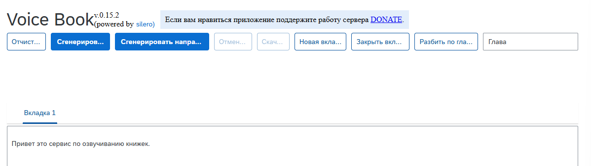
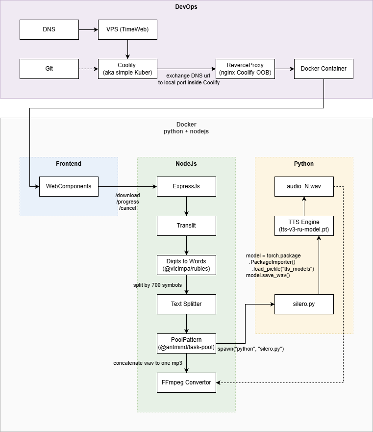

<!--
{
  "draft": false,
  "tags": ["Программирование"]
}
-->

# Voice Book

```blogEnginePageDate
13 июля 2026
```

Одно время я подсел на книжную подписку как на сервиалы. Это когда автор продает еще не написанную книгу, выкладывая
главу за главой каждую неделю. Очень хотелось сразу прослушать главу. Да, да именно прослушать как аудиокнигу, т.к.
время на чтение художественной литературы нет. А между делом, в процессе прогулки или домашних дел - пожалуйста. Или
вообще как сказку на ночь 😄. Но вот бесплатных программ для озучивания уже нет, по крайней мере я не нашел. А AI движки
больно дороги, порядка 1000р за книжку получается. Дешевле дождаться аудио книждки за 300р с хорошим чтецом. Хотя не
факт что чтец нормальный будет, может робо-голос даже лучше некоторых звучит. Короче я решил создать такую программу - и
вот что получилось - https://voice-book.stswoon.ru.



## Бизнес идея

Создать систему озвучивания книжек, которая закроет следующие потребности:

1. возможность прослушать книгу, для которой еще нет аудиокниги
2. возможность прослушать книгу, для которой похоже и не будет никогда аудиокниги
3. возможность прослушать книгу, для которой голос диктора ужасен
4. возможность прослушать книгу, которая еще не написана до конца

## Движок

Мне удалось найти условно бесплатный движок TTS - https://silero.ai

## Архитектура



### Python

* код вызова TTS - https://github.com/stswoon/voice-book/blob/main/python/silero.test.py
* депенды для python - https://github.com/stswoon/voice-book/blob/main/python/requirements.txt
* заранее скачанная модель - https://github.com/stswoon/voice-book/blob/main/python/tts-v3-ru-model.pt

### Frontend

* WebComponents - https://github.com/stswoon/voice-book/blob/main/client/src/app/AbstractComponent.ts
* вызов апи, поллинг - https://github.com/stswoon/voice-book/blob/main/client/src/app/services/AppService.ts

### NodeJs

* Разблиение текста на чанки, т.к. модель не может обрботать больше 1000 символов, а луше с запасом брать
  меньше - https://github.com/stswoon/voice-book/blob/main/server/src/services/splitText.ts
* Обратная траслитерация + превращение чисел в слова, т.к. модель воспринимает только русские
  буквы - https://github.com/stswoon/voice-book/blob/main/server/src/services/textTranslits.ts
* Генерация тасок для паттерна TaskPool + каждая таска это отдельный spawn процесс, чтобы вызвать python через консоль и
  сделать парралелизм для чанков текста, а также подписка на сигналы из
  spawn - https://github.com/stswoon/voice-book/blob/main/server/src/services/ttsService.ts

### DevOps

Размешение Docker контейнера, происходит в системе Coolify (см как настрить в
статье [Coolify v4](../../2026/Coolify%20v4/index.html)), которая расположена на VPS.

Сам Docker image тут - https://github.com/stswoon/voice-book/blob/main/Dockerfile
