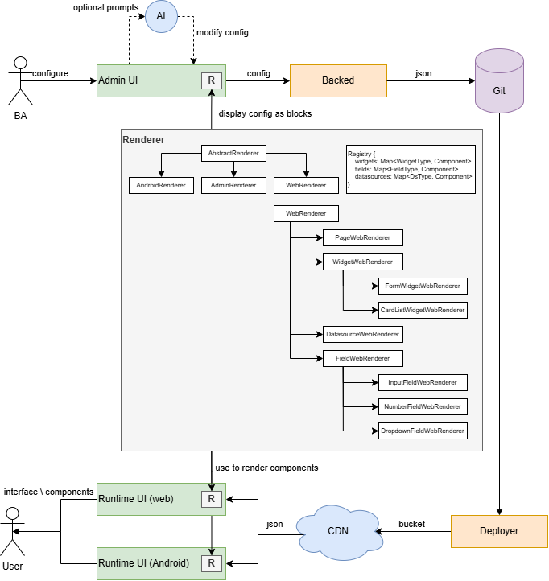
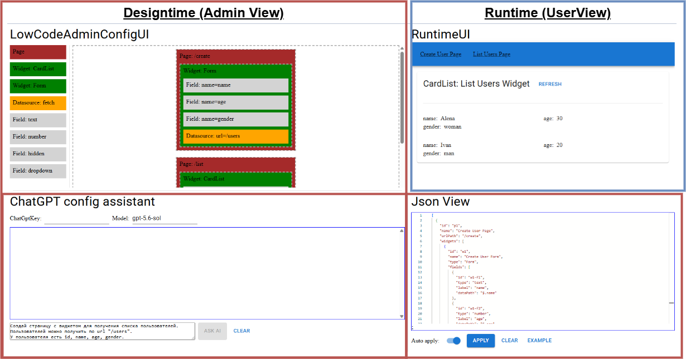

<!--
{
  "draft": false,
  "tags": ["Программирование"]
}
-->

# Low-Code UI

```blogEnginePageDate
21 июля 2026
```

Классическая разработка UI требует знания фреймворка, роутинга, форм, запросов к API. Low-Code UI снимает этот барьер:
достаточно описать **страницы → виджеты → поля → источник данных** в JSON, и приложение отрисуется само.
Low-code-платформы часто выглядят как сложные корпоративные системы: визуальный редактор, десятки компонентов,
собственный язык описания интерфейсов, система плагинов и отдельный runtime. Проект **Low-Code UI** показывает, что
базовую архитектуру такой платформы можно реализовать значительно проще. Это небольшой прототип на React, который умеет:

* описывать страницы через JSON;
* отображать из этого JSON рабочий интерфейс;
* редактировать структуру через drag-and-drop;
* изменять конфигурацию вручную в редакторе;
* генерировать конфигурацию с помощью LLM.

**Live demo:** [https://low-code-ui.stswoon.ru](https://low-code-ui.stswoon.ru)

---

## Содержание

<!-- START doctoc generated TOC please keep comment here to allow auto update -->
<!-- DON'T EDIT THIS SECTION, INSTEAD RE-RUN doctoc TO UPDATE -->

- [1. Главная архитектурная идея](#1-%D0%B3%D0%BB%D0%B0%D0%B2%D0%BD%D0%B0%D1%8F-%D0%B0%D1%80%D1%85%D0%B8%D1%82%D0%B5%D0%BA%D1%82%D1%83%D1%80%D0%BD%D0%B0%D1%8F-%D0%B8%D0%B4%D0%B5%D1%8F)
- [2. Как выглядит приложение](#2-%D0%BA%D0%B0%D0%BA-%D0%B2%D1%8B%D0%B3%D0%BB%D1%8F%D0%B4%D0%B8%D1%82-%D0%BF%D1%80%D0%B8%D0%BB%D0%BE%D0%B6%D0%B5%D0%BD%D0%B8%D0%B5)
  - [2.1 Admin: визуальный конструктор](#21-admin-%D0%B2%D0%B8%D0%B7%D1%83%D0%B0%D0%BB%D1%8C%D0%BD%D1%8B%D0%B9-%D0%BA%D0%BE%D0%BD%D1%81%D1%82%D1%80%D1%83%D0%BA%D1%82%D0%BE%D1%80)
  - [2.2 Admin: AI-ассистент (`AiChat.tsx`)](#22-admin-ai-%D0%B0%D1%81%D1%81%D0%B8%D1%81%D1%82%D0%B5%D0%BD%D1%82-aichattsx)
  - [2.3 Admin: JSON-редактор (`JsonConfig.tsx`)](#23-admin-json-%D1%80%D0%B5%D0%B4%D0%B0%D0%BA%D1%82%D0%BE%D1%80-jsonconfigtsx)
- [3. Модель интерфейса](#3-%D0%BC%D0%BE%D0%B4%D0%B5%D0%BB%D1%8C-%D0%B8%D0%BD%D1%82%D0%B5%D1%80%D1%84%D0%B5%D0%B9%D1%81%D0%B0)
- [4. Реестр компонентов](#4-%D1%80%D0%B5%D0%B5%D1%81%D1%82%D1%80-%D0%BA%D0%BE%D0%BC%D0%BF%D0%BE%D0%BD%D0%B5%D0%BD%D1%82%D0%BE%D0%B2)
  - [4.1. Runtime: Registry-паттерн (`Registry.ts`)](#41-runtime-registry-%D0%BF%D0%B0%D1%82%D1%82%D0%B5%D1%80%D0%BD-registryts)
  - [4.2. Registry вместо switch/case](#42-registry-%D0%B2%D0%BC%D0%B5%D1%81%D1%82%D0%BE-switchcase)
- [5. Динамическое создание маршрутов](#5-%D0%B4%D0%B8%D0%BD%D0%B0%D0%BC%D0%B8%D1%87%D0%B5%D1%81%D0%BA%D0%BE%D0%B5-%D1%81%D0%BE%D0%B7%D0%B4%D0%B0%D0%BD%D0%B8%D0%B5-%D0%BC%D0%B0%D1%80%D1%88%D1%80%D1%83%D1%82%D0%BE%D0%B2)
  - [5.1. Runtime: роутинг (`MainRenderer.tsx`)](#51-runtime-%D1%80%D0%BE%D1%83%D1%82%D0%B8%D0%BD%D0%B3-mainrenderertsx)
  - [5.2. ErrorBoundary на двух уровнях](#52-errorboundary-%D0%BD%D0%B0-%D0%B4%D0%B2%D1%83%D1%85-%D1%83%D1%80%D0%BE%D0%B2%D0%BD%D1%8F%D1%85)
- [6. Визуальный редактор как редактор дерева](#6-%D0%B2%D0%B8%D0%B7%D1%83%D0%B0%D0%BB%D1%8C%D0%BD%D1%8B%D0%B9-%D1%80%D0%B5%D0%B4%D0%B0%D0%BA%D1%82%D0%BE%D1%80-%D0%BA%D0%B0%D0%BA-%D1%80%D0%B5%D0%B4%D0%B0%D0%BA%D1%82%D0%BE%D1%80-%D0%B4%D0%B5%D1%80%D0%B5%D0%B2%D0%B0)
- [7. Ручное редактирование JSON](#7-%D1%80%D1%83%D1%87%D0%BD%D0%BE%D0%B5-%D1%80%D0%B5%D0%B4%D0%B0%D0%BA%D1%82%D0%B8%D1%80%D0%BE%D0%B2%D0%B0%D0%BD%D0%B8%D0%B5-json)
- [8. AI как ещё один редактор конфигурации](#8-ai-%D0%BA%D0%B0%D0%BA-%D0%B5%D1%89%D1%91-%D0%BE%D0%B4%D0%B8%D0%BD-%D1%80%D0%B5%D0%B4%D0%B0%D0%BA%D1%82%D0%BE%D1%80-%D0%BA%D0%BE%D0%BD%D1%84%D0%B8%D0%B3%D1%83%D1%80%D0%B0%D1%86%D0%B8%D0%B8)
  - [8.1. System prompt как живая документация схемы](#81-system-prompt-%D0%BA%D0%B0%D0%BA-%D0%B6%D0%B8%D0%B2%D0%B0%D1%8F-%D0%B4%D0%BE%D0%BA%D1%83%D0%BC%D0%B5%D0%BD%D1%82%D0%B0%D1%86%D0%B8%D1%8F-%D1%81%D1%85%D0%B5%D0%BC%D1%8B)
- [9. Универсальная привязка данных](#9-%D1%83%D0%BD%D0%B8%D0%B2%D0%B5%D1%80%D1%81%D0%B0%D0%BB%D1%8C%D0%BD%D0%B0%D1%8F-%D0%BF%D1%80%D0%B8%D0%B2%D1%8F%D0%B7%D0%BA%D0%B0-%D0%B4%D0%B0%D0%BD%D0%BD%D1%8B%D1%85)
  - [9.1. JSONPath через `new Function` (прототипный хак)](#91-jsonpath-%D1%87%D0%B5%D1%80%D0%B5%D0%B7-new-function-%D0%BF%D1%80%D0%BE%D1%82%D0%BE%D1%82%D0%B8%D0%BF%D0%BD%D1%8B%D0%B9-%D1%85%D0%B0%D0%BA)
  - [9.2. Принцип «Config as Data»](#92-%D0%BF%D1%80%D0%B8%D0%BD%D1%86%D0%B8%D0%BF-config-as-data)
- [10. Абстракция источников данных](#10-%D0%B0%D0%B1%D1%81%D1%82%D1%80%D0%B0%D0%BA%D1%86%D0%B8%D1%8F-%D0%B8%D1%81%D1%82%D0%BE%D1%87%D0%BD%D0%B8%D0%BA%D0%BE%D0%B2-%D0%B4%D0%B0%D0%BD%D0%BD%D1%8B%D1%85)
  - [10.1. Поля (Fields)](#101-%D0%BF%D0%BE%D0%BB%D1%8F-fields)
  - [10.2. DataSource (`FetchDsService.ts`)](#102-datasource-fetchdsservicets)
- [11. Что в архитектуре сделано удачно](#11-%D1%87%D1%82%D0%BE-%D0%B2-%D0%B0%D1%80%D1%85%D0%B8%D1%82%D0%B5%D0%BA%D1%82%D1%83%D1%80%D0%B5-%D1%81%D0%B4%D0%B5%D0%BB%D0%B0%D0%BD%D0%BE-%D1%83%D0%B4%D0%B0%D1%87%D0%BD%D0%BE)
- [12. Что потребуется для промышленной версии](#12-%D1%87%D1%82%D0%BE-%D0%BF%D0%BE%D1%82%D1%80%D0%B5%D0%B1%D1%83%D0%B5%D1%82%D1%81%D1%8F-%D0%B4%D0%BB%D1%8F-%D0%BF%D1%80%D0%BE%D0%BC%D1%8B%D1%88%D0%BB%D0%B5%D0%BD%D0%BD%D0%BE%D0%B9-%D0%B2%D0%B5%D1%80%D1%81%D0%B8%D0%B8)
- [13. Стек технологий](#13-%D1%81%D1%82%D0%B5%D0%BA-%D1%82%D0%B5%D1%85%D0%BD%D0%BE%D0%BB%D0%BE%D0%B3%D0%B8%D0%B9)
- [14. Запуск локально](#14-%D0%B7%D0%B0%D0%BF%D1%83%D1%81%D0%BA-%D0%BB%D0%BE%D0%BA%D0%B0%D0%BB%D1%8C%D0%BD%D0%BE)
  - [14.1. Docker all-in-one](#141-docker-all-in-one)
- [15. Резюме](#15-%D1%80%D0%B5%D0%B7%D1%8E%D0%BC%D0%B5)

<!-- END doctoc generated TOC please keep comment here to allow auto update -->


---

## 1. Главная архитектурная идея

Центральным элементом системы является не React-компонент и не визуальный редактор, а JSON-конфигурация.

Её можно рассматривать как промежуточное представление интерфейса — аналог AST в компиляторе. Визуальный редактор,
текстовый редактор и AI создают или изменяют одну модель, после чего runtime преобразует её в React-компоненты.

В Zustand хранится всего одно ключевое значение — строка `uiConfig`. Все редакторы изменяют её, а runtime подписывается
на изменения и перестраивает интерфейс.

Это простое, но удачное решение. Не требуется отдельно синхронизировать визуальное дерево, JSON и предварительный
просмотр. Они являются разными представлениями одного состояния.



## 2. Как выглядит приложение

Экран приложения разделён на четыре рабочие области:

1. визуальный редактор структуры;
2. чат с AI;
3. JSON-редактор на Monaco Editor;
4. предварительный просмотр результата.

Три способа работы с конфигом:

| Способ        | Модуль                 | Для кого                                   |
|---------------|------------------------|--------------------------------------------|
| AI-ассистент  | `AiChat`               | «Создай страницу со списком пользователей» |
| JSON-редактор | `JsonConfig`           | Разработчик, знакомый со схемой            |
| Drag-and-drop | `LowCodeAdminConfigUI` | Визуальная сборка без JSON                 |

Все три канала пишут в **один источник правды** — Zustand-store с полем `uiConfig: string`.

Размеры областей можно менять с помощью `react-resizable-panels`. Благодаря этому разработчик одновременно видит
исходную конфигурацию, визуальное дерево и результат её выполнения.

Упрощённо интерфейс выглядит так:

```
┌──────────────────────┬──────────────────────────┐
│ Визуальный редактор  │ Предварительный просмотр │
│ страниц и виджетов   │ готового приложения      │
├──────────────────────┼──────────────────────────┤
│ AI-чат               │ JSON-конфигурация        │
│                      │ Monaco Editor            │
└──────────────────────┴──────────────────────────┘
```



В основе проекта находятся React 18, TypeScript, Vite, Material UI, Zustand, Monaco Editor, `dnd-kit`, React Router и
LangChain. Для демонстрационного REST API используется `json-server`.

### 2.1 Admin: визуальный конструктор

**`LowCodeAdminConfigUI`** — палитра «кирпичиков» слева, дерево конфига справа.

- Палитра: Page, Widget (Form/CardList), Field (text/number/hidden/dropdown), Datasource (fetch).
- DnD через `@dnd-kit/core`.
- Drop-зоны с иерархией: `globalZone` → `pageZone_{id}` → `widgetZone_{id}`.
- При drop создаётся объект с `nanoid`-идентификатором (`getId()`), конфиг пересобирается immutably и записывается в
  store.

**`TreeNodeBricks`** — рекурсивное отображение дерева Page → Widget → Field + Datasource в виде цветных
`Brick`-компонентов.

**`DropZone`** — droppable-зона с визуальной обратной связью: зелёная рамка = drop разрешён, красная = запрещён. Логика
в `isAllowDrop(droppableType, zoneType)`.

> Статус: прототип. DnD умеет добавлять элементы, но не редактировать свойства и не удалять. Комментарий в README честно
> подсказывает это «a little ugly but works».

`DropZone` подсвечивает hover — проверяет **тип перетаскиваемого** vs **тип зоны** (`Page` → `globalZone`,
`Widget` → `pageZone`, `Field` → `widgetZone`). Красная рамка показывает ошибку пользователя.

### 2.2 Admin: AI-ассистент (`AiChat.tsx`)

Интеграция с OpenAI через **LangChain** (`@langchain/openai`):

1. System prompt (`SYSTEM_AI_MSG` в `const.ts`) — полная спецификация схемы Config + пример + правила (CardList = GET,
   Form = POST, JSONPath для `dataPath`).
2. История диалога хранится в React state (`SystemMessage` + пары Human/AI).
3. Ключ и модель — в `localStorage`.
4. Кнопка **Copy AI Answer to Config** парсит последний ответ (с очисткой Markdown-обёртки, типа ` ```json `) и вызывает
   `setUiConfig`.

**Ключевая идея:** system prompt дублирует TypeScript-типы в текстовом виде. Модель «видит» тот же контракт, что и
runtime. При уточнениях пользователя prompt требует возвращать **полный** Config, а не diff — это упрощает применение
ответа одной кнопкой.

### 2.3 Admin: JSON-редактор (`JsonConfig.tsx`)

Monaco Editor с:

- **Auto apply** — при валидном JSON сразу пушит в store (live preview).
- Валидация через `JSON.parse` в `useMemo`.
- Кнопки: Apply, Clear, Example (загружает `uiExample1`).

Двусторонняя синхронизация: `useEffect` подтягивает изменения из store (например, после AI или DnD) и форматирует через
`jsonPretty`.

Режим live-reload конфига из редактора без отдельной кнопки Save — удобно для итераций. Switch «Auto apply» позволяет
редактировать «черновик» и применить вручную.

## 3. Модель интерфейса

Конфигурация состоит из нескольких базовых сущностей:

```
Page
 └── Widget
      ├── DataSource
      └── Field
```

Страница содержит адрес и список виджетов. Виджет определяет способ отображения данных, источник данных и набор полей.

В прототипе предусмотрено два типа виджетов:

* `Form` — форма отправки данных;
* `CardList` — список карточек.

Поле может иметь один из четырёх типов:

* `text`;
* `number`;
* `hidden`;
* `dropdown`.

В прототипе реализован один тип источника — `fetch` с HTTP-методами `GET` и `POST`.

Пример конфигурации можно представить следующим образом:

```json
[
  {
    "id": "users",
    "name": "Пользователи",
    "urlPath": "/users",
    "widgets": [
      {
        "id": "user-list",
        "name": "Список пользователей",
        "type": "CardList",
        "datasource": {
          "type": "fetch",
          "method": "GET",
          "url": "/users"
        },
        "fields": [
          {
            "id": "name",
            "label": "Имя",
            "type": "text",
            "dataPath": "$.name"
          }
        ]
      }
    ]
  }
]
```

В демонстрационной конфигурации одна страница содержит форму создания пользователя, а другая — список пользователей.
Данные загружаются и отправляются через тестовый REST API.

## 4. Реестр компонентов

Для выбора того, какой элемент рисовать, используется реестр реализаций (что
такое [паттерн registry](../PatternRegistryAndStrategy/index.html)):

```ts
Registry.fields["text"] = TextField;
Registry.fields["dropdown"] = DropdownField;

Registry.widgets["Form"] = FormWidget;
Registry.widgets["CardList"] = CardListWidget;

Registry.dataSources["fetch"] = FetchDataSource;
```

Реестр разделён на три части:

* поля;
* виджеты;
* источники данных.

Runtime получает строковый тип из конфигурации и находит соответствующую реализацию в реестре.

Такой подход напоминает сочетание паттернов **Registry**, **Strategy** и **Factory**. JSON определяет, какую стратегию
нужно использовать, реестр хранит доступные реализации, а runtime создаёт нужный React-компонент.

Добавление нового поля сводится к двум основным действиям:

1. реализовать React-компонент;
2. зарегистрировать его под определённым именем.

Логика основного рендерера при этом почти не меняется.

Это важное свойство low-code-системы. Набор компонентов должен расширяться независимо от кода, который обходит
конфигурацию.

### 4.1. Runtime: Registry-паттерн (`Registry.ts`)

Центральный реестр расширяемости:

```typescript
Registry = {
    fields: Record<string, ComponentType<FieldProps>>,
    widgets: Record<string, ComponentType<Widget>>,
    dataSources: Record<string, DatasourceService>
}
```

Регистрация происходит side-effect'ом в `MainRenderer.tsx`:

```typescript
Registry.widgets['Form'] = FormWidget;
Registry.widgets['CardList'] = CardListWidget;
Registry.dataSources['fetch'] = fetchDsService;
Registry.fields['text'] = TextField;
// ...
```

**`PageRenderer`** для каждого widget делает lookup: `Registry.widgets[widget.type]`. Если тип не найден —
inline-ошибка, не падение всего приложения (плюс `ErrorBoundary`).

Добавление нового типа поля или виджета = один React-компонент + одна строка в Registry. JSON-схему расширяют в
`types.ts` и в `SYSTEM_AI_MSG`.

### 4.2. Registry вместо switch/case

Классический антипаттерн в low-code — гигантский switch по `widget.type`. Здесь — таблица компонентов. Новый виджет не
трогает PageRenderer.

Задел на lazy loading закомментирован в MainRenderer: `//In non prod need lazy loading`.

## 5. Динамическое создание маршрутов

Страницы из JSON становятся полноценными маршрутами приложения.

Основной рендерер создаёт:

* ссылки в верхнем меню;
* набор маршрутов React Router;
* компонент страницы для каждого элемента конфигурации.

Таким образом, добавление нового объекта `Page` изменяет не только содержимое экрана, но и навигационную структуру
приложения.

Получается декларативная маршрутизация: список страниц хранится не в исходном коде, а в конфигурации.

### 5.1. Runtime: роутинг (`MainRenderer.tsx`)

Динамический роутинг из конфига:

- AppBar с ссылками по `page.urlPath`.
- `<Routes>` генерирует `<Route path={page.urlPath} element={<PageRenderer config={page}/>} />` для каждой страницы.

React Router v7 + MUI `LinkBehavior` — ссылки работают как SPA-навигация, а не full reload.

### 5.2. ErrorBoundary на двух уровнях

- `RuntimeUI` — общий fallback «Oops, it's just a prototype».
- `PageRenderer` — «Page Failed to Render».

Невалидный JSON в одном виджете не роняет весь preview.

## 6. Визуальный редактор как редактор дерева

Drag-and-drop в Low-Code UI работает не с React-компонентами напрямую. Он изменяет JSON-дерево.

В палитре доступны основные строительные блоки:

* страница;
* форма;
* список карточек;
* источник данных;
* текстовое, числовое, скрытое поле и список значений.

После перетаскивания элемента редактор определяет целевой уровень дерева и создаёт соответствующий объект:

* `Page` добавляется в корневой массив;
* `Widget` добавляется в выбранную страницу;
* `Field` добавляется в выбранный виджет.

Для новых элементов автоматически генерируются идентификаторы и начальные параметры. После изменения дерево снова
сериализуется в JSON и записывается в Zustand.

В этом заключается ещё одно удачное решение проекта: визуальный редактор можно рассматривать как специализированный
редактор AST. Он не создаёт отдельную внутреннюю модель, которую затем пришлось бы преобразовывать в JSON.

Однако текущий drag-and-drop редактор в основном позволяет собирать структуру. Для полноценной low-code-платформы
дополнительно понадобится панель свойств, в которой можно менять название, адрес страницы, URL источника данных, подписи
полей и другие параметры.

## 7. Ручное редактирование JSON

Компонент `JsonConfig` использует Monaco Editor — тот же редактор, который лежит в основе Visual Studio Code. Он
поддерживает два режима применения изменений:

* автоматический;
* ручной, через кнопку `Apply`.

Перед записью в общее состояние выполняется `JSON.parse`. Некорректный JSON не применяется. Также редактор отслеживает
внешние изменения: например, если конфигурацию поменял AI или визуальный редактор, новое значение появляется в Monaco.

Это делает JSON не скрытым внутренним форматом, а полноценным интерфейсом управления платформой. Опытный пользователь
может быстрее изменить конфигурацию вручную, а менее опытный — использовать визуальный редактор.

## 8. AI как ещё один редактор конфигурации

Модуль `AiChat` не генерирует React-код. Вместо этого модель получает системную инструкцию с описанием
допустимой JSON-схемы и возвращает готовую конфигурацию.

Например, пользователь может попросить:

> Создай страницу со списком пользователей, загружаемым из `/users`.

Модель должна вернуть массив страниц, виджет `CardList`, источник данных и необходимые поля.

Системный промпт содержит:

* описание структуры `Page`, `Widget`, `Field` и `DataSource`;
* перечень разрешённых типов;
* правила выбора `GET` и `POST`;
* требование возвращать только полный JSON;
* правила формирования уникальных идентификаторов и путей к данным.

Ответ модели можно применить к текущему проекту. Код удаляет Markdown-обёртку вида ` ```json `, после чего сохраняет
полученную строку в `uiConfig`. Для обращения к модели используется LangChain, а история диалога передаётся вместе с
новым запросом.

Архитектурно это сильное решение. AI не получает особых полномочий и не встраивается непосредственно в runtime. Он
является ещё одним адаптером, который создаёт декларативную модель:

```
Пользовательский запрос
          ↓
        LLM
          ↓
    JSON-конфигурация
          ↓
    Обычный runtime
```

Благодаря этому результат AI можно увидеть, проверить и вручную исправить до выполнения.

Фактически JSON становится контрактом между человеком, языковой моделью и React-приложением.

### 8.1. System prompt как живая документация схемы

`SYSTEM_AI_MSG` (~80 строк) — это одновременно:

- документация для разработчика;
- контракт для LLM;
- пример валидного Config.

Дублирование TypeScript-типов в prompt — осознанный trade-off: AI и runtime всегда «смотрят» на одну схему, пусть и в
разных форматах.

## 9. Универсальная привязка данных

Для связи поля с объектом используется свойство `dataPath`:

```json
{
  "label": "Имя",
  "type": "text",
  "dataPath": "$.name"
}
```

Один и тот же путь применяется в двух направлениях.

В `CardListWidget` он нужен для чтения значения:

```
объект пользователя → $.name → значение поля
```

В `FormWidget` путь используется для записи:

```
значение поля → $.name → объект формы
```

В прототипе выражение преобразуется в JavaScript и выполняется через `new Function`. Например, `$.name` превращается в
обращение к `data.name` (в продакшене нужен полноценный JSONPath).

Это одно из наиболее хитрых решений проекта. Несколько строк кода заменяют отдельную библиотеку привязки данных и
позволяют использовать одинаковую модель для форм и списков.

Одновременно это главное ограничение текущей реализации. `new Function` фактически выполняет JavaScript, сформированный
из конфигурации. Если конфигурацию может менять внешний пользователь или AI, такой механизм становится опасным.

В промышленной версии вместо него лучше использовать безопасное чтение и запись путей. Для этого подойдут JSON Pointer,
ограниченная реализация JSONPath или функции наподобие `get` и `set`, которые работают
только с путями к свойствам и не выполняют произвольный код.

### 9.1. JSONPath через `new Function` (прототипный хак)

Вместо полноценного JSONPath-парсера FormWidget и CardListWidget используют динамическую генерацию кода:

```typescript
// Запись (FormWidget)
const dataPath = field.dataPath.replace('$', 'data');  // $.name → data.name
const applyValueToData = new Function('data', 'value', `${dataPath} = value; return data;`);

// Чтение (CardListWidget)
const getValueFromData = new Function('data', `return ${dataPath}`);
```

**Плюсы:** нулевые зависимости, любой путь `$.foo.bar` работает «из коробки».  
**Минусы:** небезопасно (произвольный код), в production нужен нормальный JSONPath (jsonpath-plus, lodash get/set).

Комментарий в коде прямо говорит: `//NOT SAFE, but it is prototype`.

### 9.2. Принцип «Config as Data»

Вся UI-логика — это данные. Runtime не знает бизнес-домен — он знает только эту схему типов и умеет резолвить
компоненты через **Registry**.

## 10. Абстракция источников данных

Виджеты не вызывают `fetch` напрямую. Они получают реализацию источника данных из реестра:

```
Widget
   ↓
DataSource interface
   ↓
FetchDataSource
   ↓
HTTP API
```

Текущая реализация умеет:

* получить данные через `GET`;
* отправить данные через `POST`;
* проверить HTTP-статус;
* вернуть распарсенный JSON.

Несмотря на простоту, граница расширения выбрана правильно. Позже в реестр можно добавить другие стратегии:

* GraphQL;
* статические данные;
* WebSocket;
* IndexedDB;
* mock-источник;
* вызов внутреннего SDK;
* backend action.

Для виджета принципиально неважно, откуда пришли данные. Он работает через общий контракт.

### 10.1. Поля (Fields)

Единый интерфейс `Field`:

```typescript
export interface Field {
    id: string;
    label: string;
    type: 'text' | 'number' | 'hidden' | 'dropdown';
    dataPath: string;
    value?: unknown;
    availableValues?: { id: string; value: string }[];
}
```

| Тип      | Компонент     | Особенности                                  |
|----------|---------------|----------------------------------------------|
| text     | TextField     | Input / span                                 |
| number   | NumberField   | Аналогично                                   |
| hidden   | HiddenField   | Не отображается, но участвует в Form         |
| dropdown | DropdownField | `availableValues`, readonly показывает label |

### 10.2. DataSource (`FetchDsService.ts`)

Единственная реализация — HTTP fetch:

- `get` — GET-запрос, возвращает JSON.
- `send` — POST с `Content-Type: application/json`.

URL собирается через `urlJoin(API_SERVER_URL(), config.url)`.

Для демо вместо реального backend используется mock API на **json-server** (порт 3201), данные в `db/db.json`
(коллекция `users`).

## 11. Что в архитектуре сделано удачно

**JSON используется как единый язык системы**

Один формат связывает редактор, runtime, AI и пользователя. Это уменьшает количество преобразований и делает поведение
приложения более предсказуемым.

**AI отделён от выполнения интерфейса**

Модель только создаёт конфигурацию. Она не генерирует и не запускает React-код. Это позволяет проверять результат
обычными средствами.

**Реестр отделяет тип компонента от его реализации**

Runtime знает только строковые идентификаторы. Новые компоненты и источники данных можно добавлять без переписывания
всего рендерера.

**Визуальный и текстовый режимы равноправны**

Пользователь может начать с drag-and-drop, затем вручную поправить JSON или попросить AI изменить страницу. Все режимы
работают с одним результатом.

**Проект показывает полный вертикальный сценарий**

Несмотря на небольшой размер, прототип охватывает весь цикл:

```
создание конфигурации
        ↓
редактирование
        ↓
получение данных
        ↓
рендеринг
        ↓
отправка формы
```

Это делает репозиторий полезным не только как демонстрацию интерфейса, но и как основу для изучения архитектуры
low-code-платформ.

## 12. Что потребуется для промышленной версии

Low-Code UI прямо позиционируется как прототип, поэтому некоторые решения намеренно упрощены.

Первое необходимое улучшение — полноценная проверка конфигурации. `JSON.parse` проверяет только синтаксис, но не
гарантирует, что у страницы есть `urlPath`, тип виджета зарегистрирован, а `dataPath` реализован через `new Function`, а
не через безопасный JSONPath. Для валидации стоит использовать JSON Schema или Zod.

Также желательно добавить поле версии:

```json
{
  "schemaVersion": 1,
  "pages": []
}
```

При изменении формата старые конфигурации можно будет автоматически мигрировать.

Второе улучшение — отказ от выполнения `dataPath` через `new Function`. Конфигурация должна описывать данные, а не
содержать исполняемый JavaScript.

Третье — перенос работы с AI на сервер. В текущем прототипе API-ключ и настройки модели сохраняются в браузере. Для
реального продукта запросы следует отправлять через backend, который контролирует ключи, лимиты, доступные модели и
аудит запросов.

Четвёртое — безопасное отображение ответов AI. Ответ преобразуется из Markdown в HTML и вставляется через
`dangerouslySetInnerHTML`. Перед выводом такого HTML потребуется санитизация.

Кроме того, промышленному редактору понадобятся:

* история изменений;
* отмена и повтор операций;
* черновики и публикации;
* права доступа;
* блокировка параллельного редактирования;
* панель свойств компонентов;
* обработка загрузки и ошибок;
* авторизация источников данных;
* хранение секретов;
* логирование;
* тестирование конфигураций;
* предварительный просмотр разных версий;
* поддержка адаптивной раскладки.

## 13. Стек технологий

| Категория     | Технология                    |
|---------------|-------------------------------|
| UI            | React 18, MUI 7, Emotion      |
| Сборка        | Vite 7, TypeScript 5.8        |
| Роутинг       | React Router 7                |
| State         | Zustand 5                     |
| DnD           | @dnd-kit/core                 |
| Редактор      | Monaco (@monaco-editor/react) |
| AI            | LangChain + OpenAI            |
| Data fetching | fetch + SWR (задел), url-join |
| Mock API      | json-server                   |
| Layout        | react-resizable-panels        |
| ID            | nanoid                        |

## 14. Запуск локально

NPM:

```bash
npm install
npm run serve    # json-server :3201 + Vite dev :5173
```

Docker:

```bash
docker build . -t low-code-ui
docker run --rm -p 3200:3200 -p 3201:3201 low-code-ui
```

### 14.1. Docker all-in-one

`Dockerfile` собирает prod (`npm run prod`), затем `npm run start` поднимает одновременно:

- Vite preview на `:3200` (статика + proxy),
- json-server на `:3201`.

Один контейнер = полный demo-стенд.

## 15. Резюме

Low-Code UI — компактный, но архитектурно осмысленный прототип:

- **Config as Data** — UI полностью декларативен.
- **Три редактора одного конфига** — AI, JSON, DnD — сходятся в Zustand.
- **Registry** — точка расширения без переписывания рендерера.
- **Runtime pipeline** — Config → Routes → Widgets → Fields → fetch.
- **Прототипные shortcuts** — `new Function`, client-side AI, минимальный DnD — осознанно помечены в коде.

Проект демонстрирует, как за несколько сотен строк React можно собрать рабочий цикл low-code:
`описал → увидел → отправил на API` — и при этом оставить архитектуру расширяемой для реального продукта.


