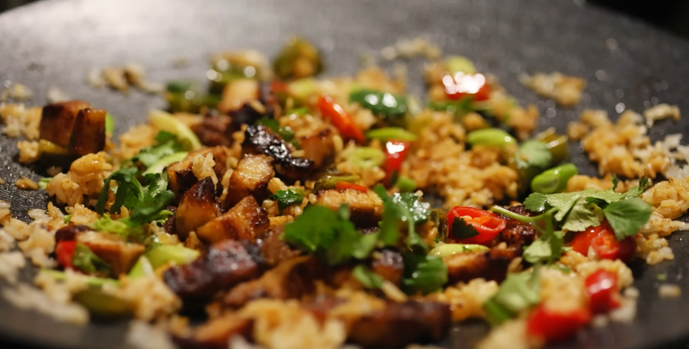
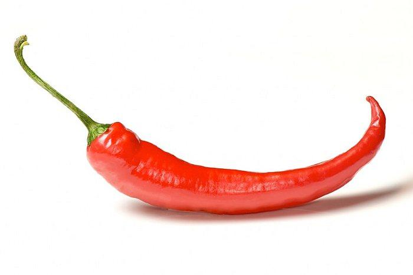
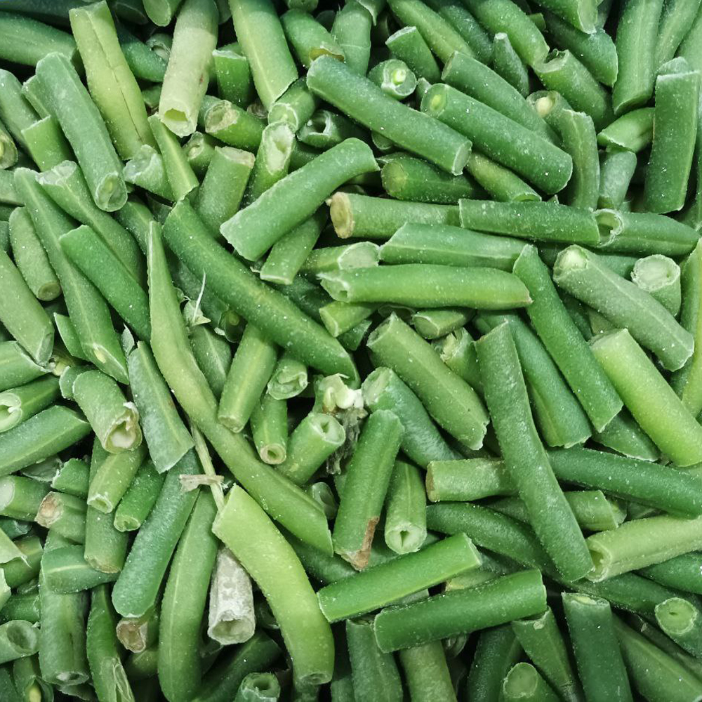
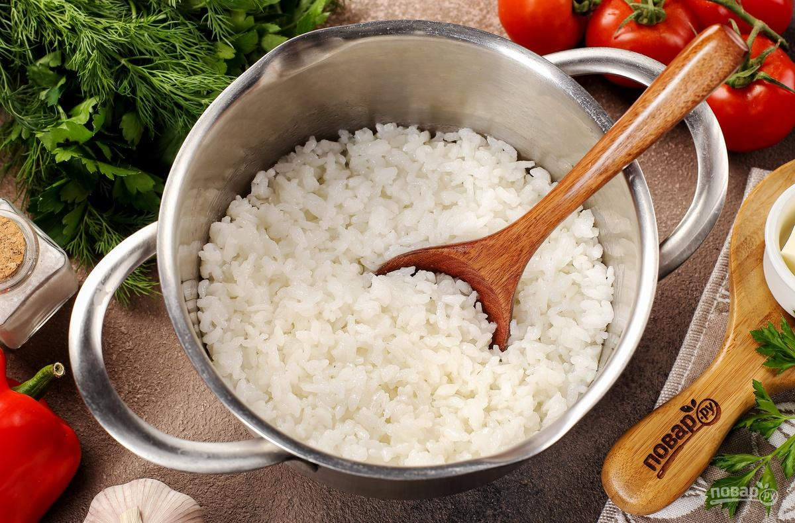
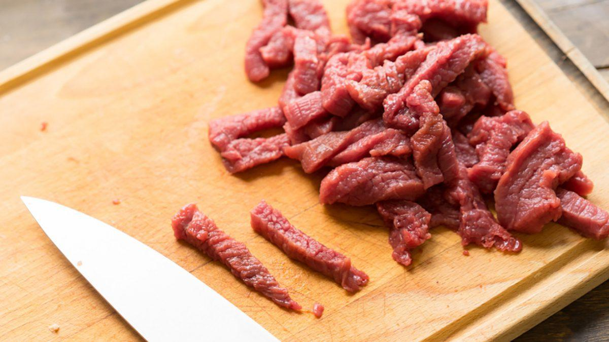
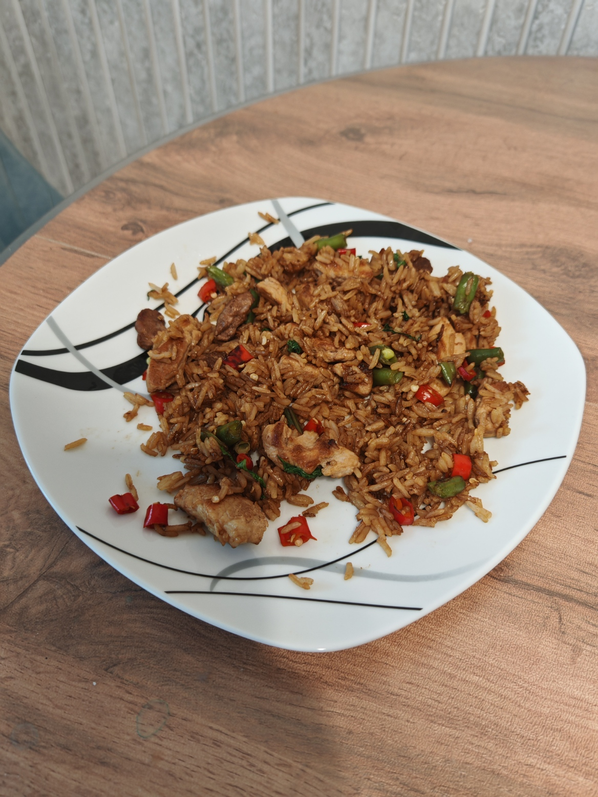

<!--
{
  "draft": false,
  "tags": ["Другое"]
}
-->

# Жареный рис со свининой (азиатский стиль)

```blogEnginePageDate
28 июня 2026
```

Недавно смотрел ролик на youtube в стиле solo кемпинг на
машине ([Lanbo & Lyra | Camping Life](https://www.youtube.com/watch?v=eLOUbwUYVxU&list=LL&index=41&t=1169s)) и так
понравилось блюдо в азиатском стиле типа жареный рис со свининой, что я решил найти его рецепт.



Сходу рецепт найти не получилось, но копаясь в инете и в ИИшке вот что у меня получилось по рецепту. Читайте внимательно
т.к. там есть хитрости в приготовлении.

## Ингридиенты:

1. стручковый перец чили - 1 маленькие шт. (болгарский нельзя он сладкий, а не острый)
2. **вчерашний** жасминовый рис - 250 г. (альтернатива Басмани, круглозёрный для суши нельзя превратиться в кашу)
3. стручковая фасоль - 10 штучек (строчков)
4. свинная шея - 250 г.
5. соевый соус — 4 ст. л
6. петрушка - чуток





## Подготовка риса

Необходимо заранее сварить рис и положить его в холодильник на ночь (или хотя бы на 1 час) иначе при жарки получится
каша. Вчерашний рис:

* подсушен → не слипается
* хорошо впитывает соус
* даёт правильную “вок-текстуру”

Идеальная схема:

1. Промыть рис (пока вода не станет почти прозрачной)
2. Смешать в пропорции 1 стакан риса на 1.5 стакана воды
3. Довести до кипения до кипения
4. Уменьшить огонь → накрыть крышкой
5. Варить:
    * жасмин → 12–15 мин
    * басмати → 10-12 мин
6. Выключить → дать постоять 10 минут под крышкой
7. Остудить
8. Убрать в холодильник на 60 минут (идеально на ночь)

❌ **Частые ошибки**:

* мешать во время варки → каша
* много воды → липкий рис
* сразу жарить горячий → всё слипнется



## Подготовка мяса

Основные правила Как резать свинину (шея):

1. Резать поперёк волокон
    * мясо будет мягким
    * если вдоль — будет жеваться как резина
2. Формат нарезки - тонкая соломка
    * быстро жарится, как в ресторане
    * Толщина - 3–5 мм (толще - не прожарится быстро, тоньше - пересушится)



## Жарка блюда

Как это обычно готовят (логика блюда):

1. Сильно разогревается сковорода
2. Обжаривается свинина до румяной корочки
3. Добавляются овощи: перец (лучше нарезать, можно убрать зерна) + сручковая фасоль
4. Потом добавляется рис и всё перемешивается
5. В конце соевый соус и петрушка

## Натурный эксперимент

Как-то так...

