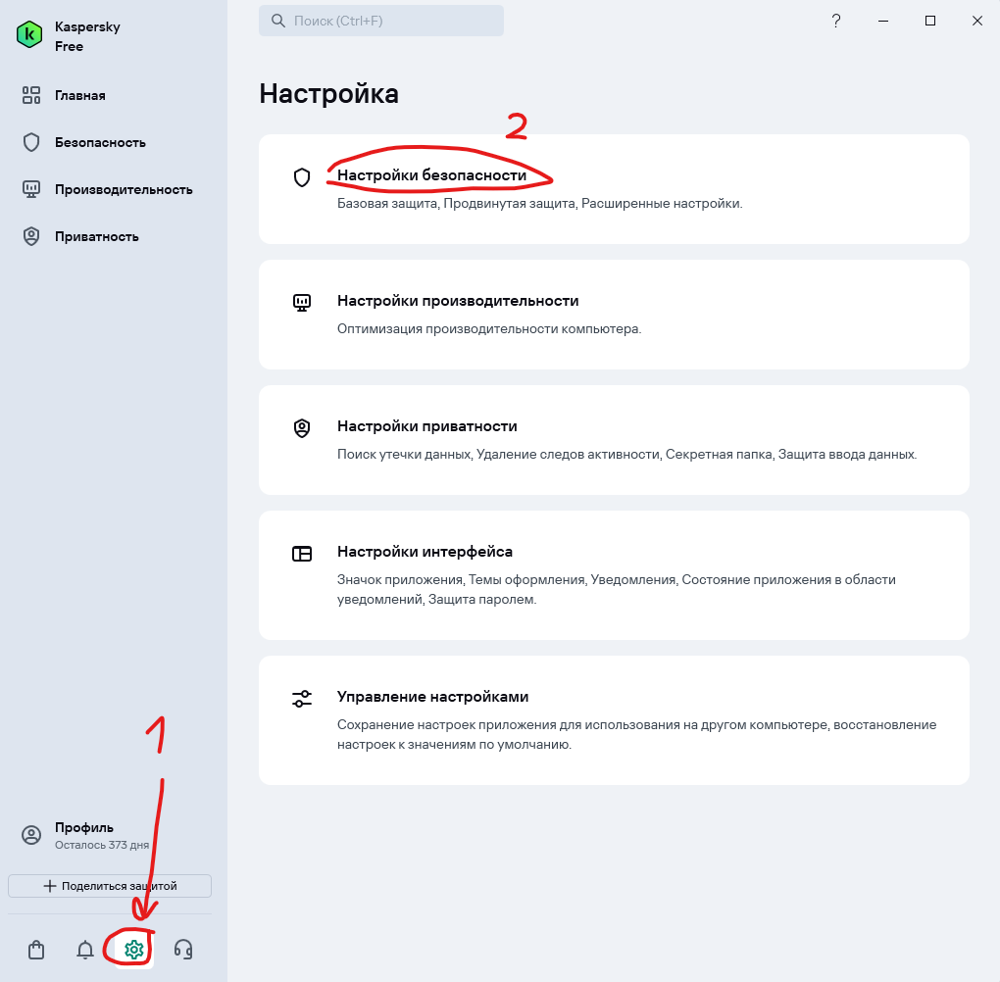
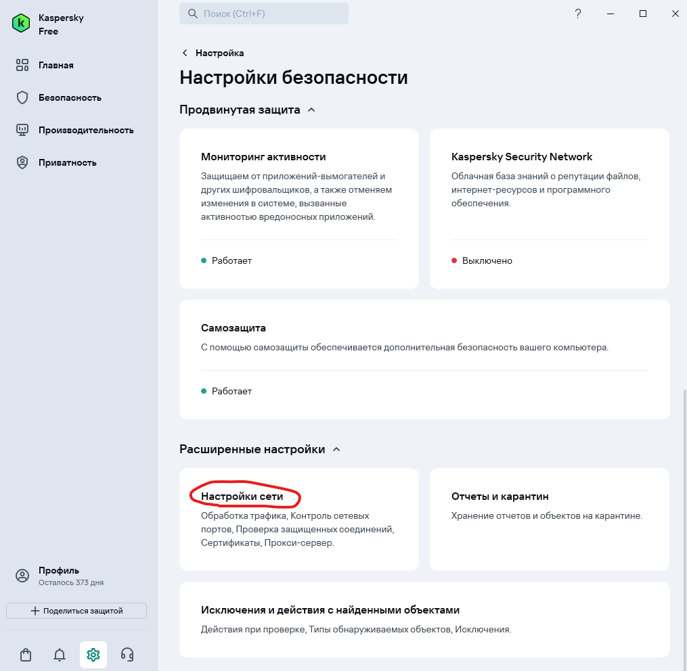
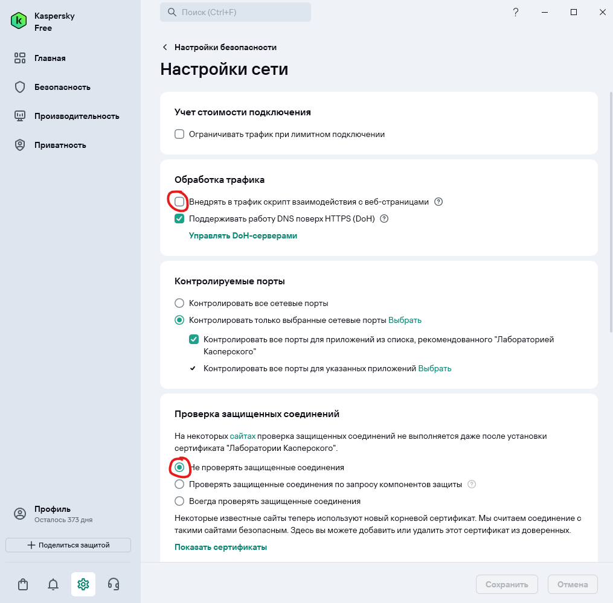

<!--
{
  "draft": false,
  "tags": ["Другое"]
}
-->

# Как убрать запросы ff.kis.v2.scr.kaspersky-labs.com

```blogEnginePageDate
26 февраля 2026
```

Когда установлен Kaspersky Free в devtools браузера каждые 3 секунды летят запросы на
`ff.kis.v2.scr.kaspersky-labs.com`. Это очень мешает при разработке. Один из вариантов проверить и отключить плагины, но
если их нет, то нужно отключить в антивирусе. К сожалению UI антивируса обновился и сложно найти где же эта заветная
опция. Чтобы вам жилось легче - она вот тут теперь:







Отключите **Внедрять в трафик скрипт взаимодействия с веб-страницами** чтобы убрать запросы на
`ff.kis.v2.scr.kaspersky-labs.com`.

Также можете выставить **Не проверять защищенные соединения** чтобы не появлялось постоянно окошко о том, что Kaspersky
считает самоподписанные сертификат, которые периодически встречаются при разработке, небезопасным и каждый раз не
запрашивал подтверждение чтобы войти на сайт.

По мотивам
статьи [Если бесит Kaspersky Free и ff.kis.v2.scr.kaspersky-labs.com](https://alexis2k.ru/windows-2/esli-besit-kaspersky-free-i-ff-kis-v2-scr-kaspersky-labs-com.html).