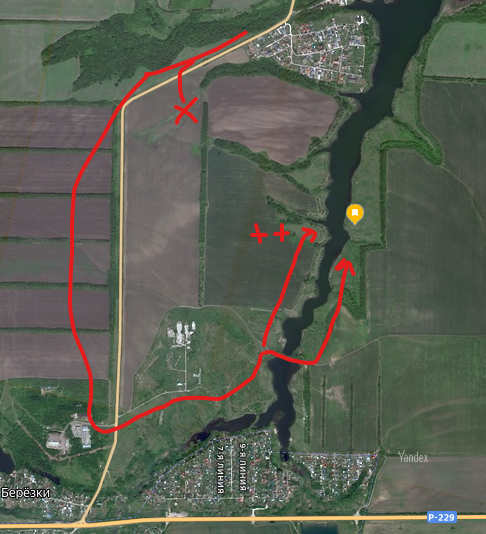
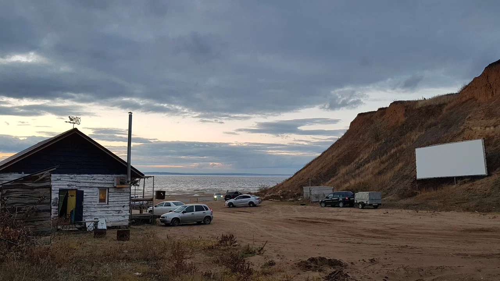
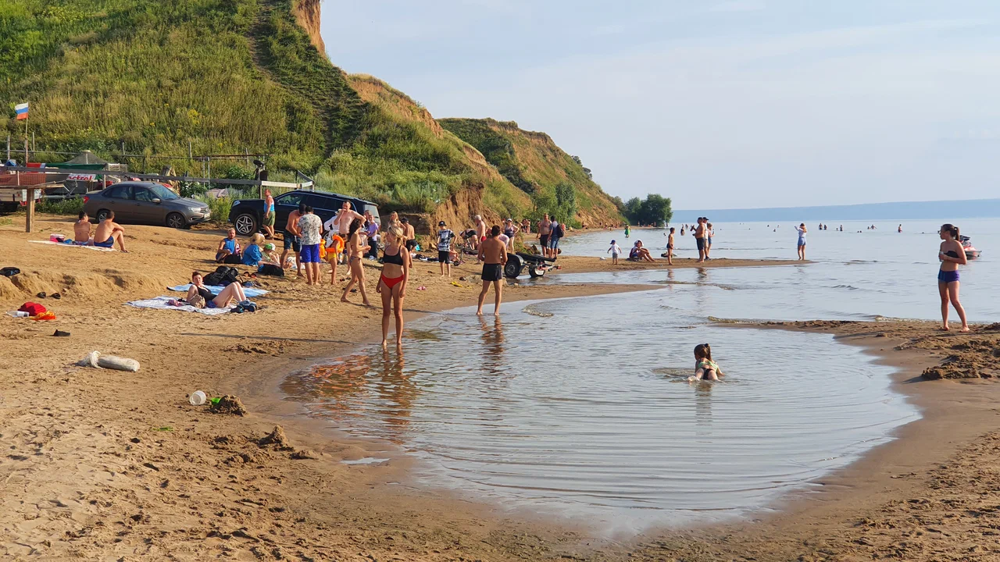
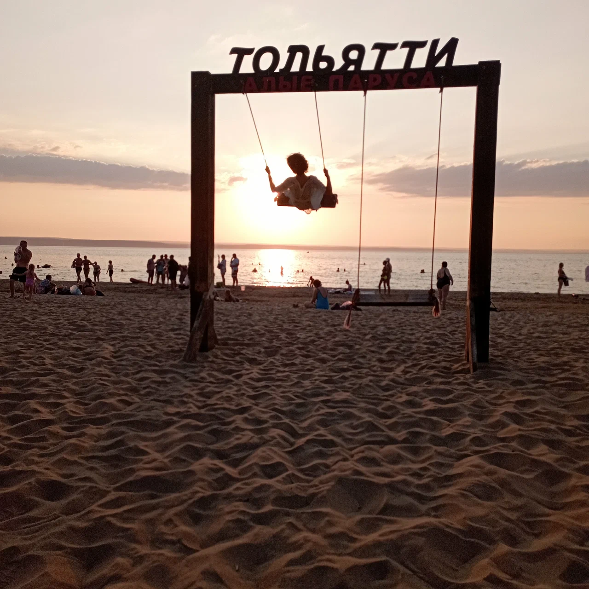
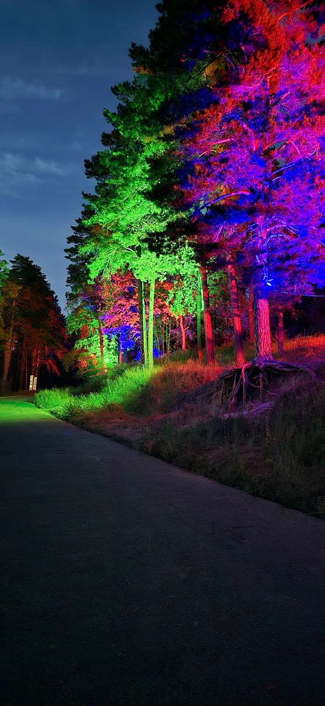
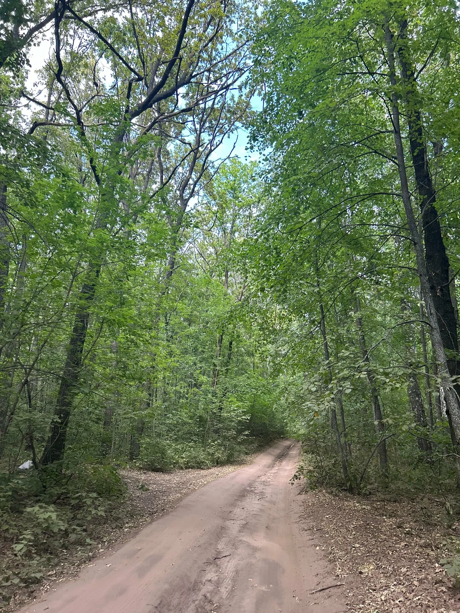
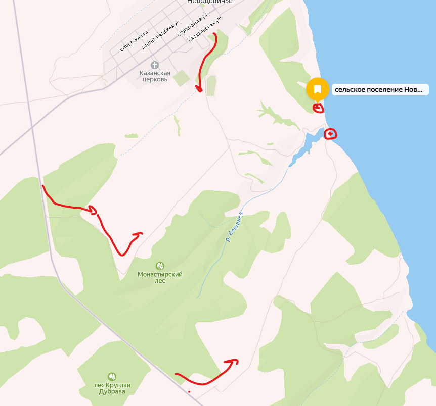
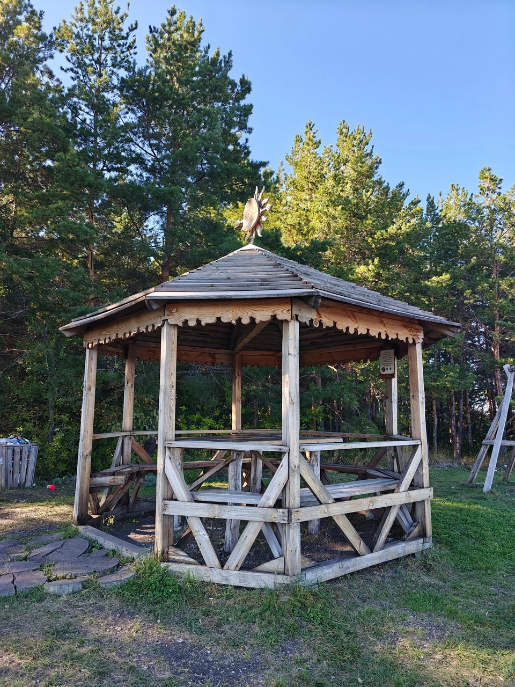
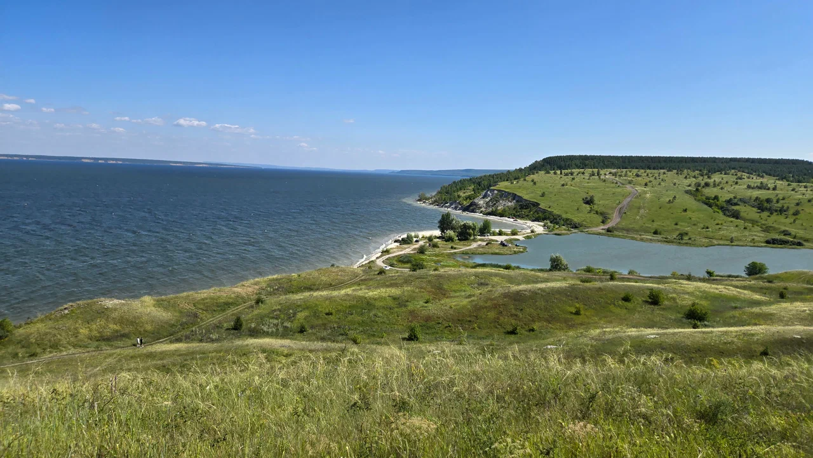

<!--
{
  "draft": false,
  "tags": ["Путешествие"]
}
-->

# Куда съездить в Самаре? (Часть 5) - Немного новых точек

```blogEnginePageDate
27 июля 2026
```

Теперь отправимся в район Тольятти. Там я обнаружил еще пару интересных точек, которые не захватил в прошлоб большом
маршруте. Если интересно, то предыдущая часть 4
тут - [Куда съездить в Самаре? (Часть 4)](../../2023/КудаСъездитьВСамареЧасть4/index.html)

## Полянка на озере около Новоберезовского\Аглоса

> 53.026598, 50.176191



По карте хоть и есть 2 съезда однако, я не нашел, поэтому поехал по дальнему. Далее догора идет через "дамбу", там
меньше народа но глубоко я не заезжал, т.к. побоялся поцарапать машну. Да и с другой стороны более пологий берег удобный
для купания, лучше останавливать там.

## Пляж села Ягодное под Тольятти

> 53.614615, 49.028433

Ставим машину перед въездом.



И идем гулять по косе.



Осенью машин мало, гоняют на квадрацоклых. Еще можно въехать на горку слева, но я не попробовал. Вероятно можно
добраться до леса.

## Пляж села Ягодное под Тольятти около леса

> 53.566459, 49.012827

Вот здесь как раз можно покататься на качелях.



Чтобы туда попасть, останавливаемся на стоянке и идем пешком.



Также тут можно покататься по Ягодинскому лесу



## Беседка под Новодевичьем

> 53.594172, 48.866262

Добираемся одним из 3х путей.



Яндекс меня завел через второй, а выехал я через нижний. Средний чуть сложнее чем нижний, первый раз включил помощь при
спуске.

Первыя точка это беседка, которая может быть уже занята кем-нибудь.



Вторая точка это "коса" выложенная из белых камней, ощущение как на море, очень советую заехать сюда посидеть.



