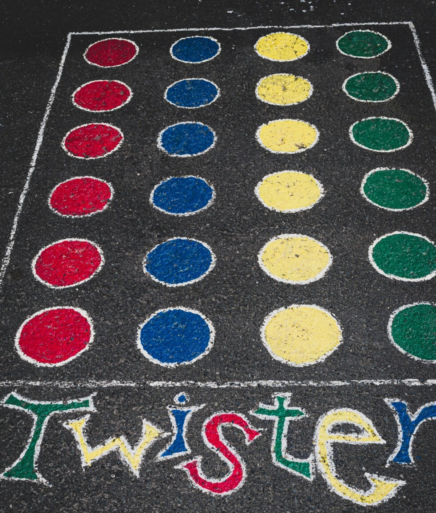
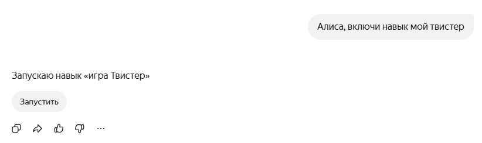
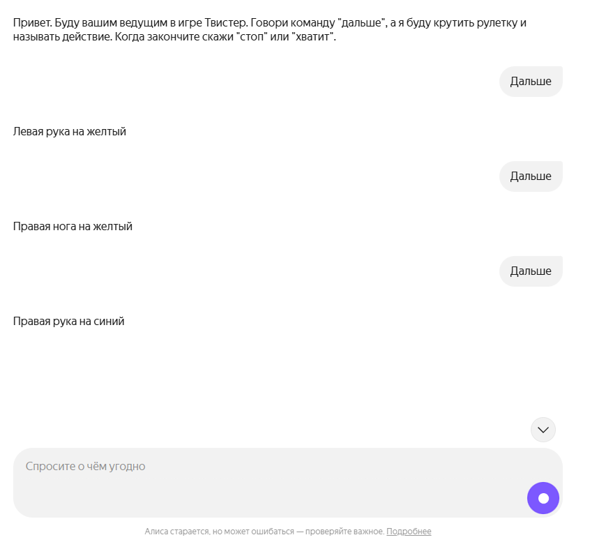

<!--
{
  "draft": false,
  "tags": ["Программирование"]
}
-->

# Мой Твистер - Навык для Алисы

```blogEnginePageDate
29 июня 2026
```

Както с детьми втроем играли в твистер, но некому было крутить стрелку. А если кто-то быдет крутить то играть будут
всего-лишь двое, что довольно скучно. И тут родилась мысль а почему бы Алисе из Яндекса не крутить эту самую стрелку,
все равно у нее ног нет.



Чтобы запустить навык просто скажите `Алиса, запусти навый "Мой Твистер"` (или можно пройти по
ссылке [Мой Твистер](https://dialogs.yandex.ru/store/skills/2006f673-moj-tvister)).



А дальше наслаждайсей игрой периодически говоря `Дальше`



## Под капотом

Под капотом имеем Node.js server, который реагирует на post запрос с body вида:

```js
{
    meta: {
        //...
    }
    session: {
        //...
    }
    request: {
        original_utterance: "Пользовательський ввод"
        //...
    }
    version: "1.0"
}
```

Тут нам важно `request.original_utterance`, если он равен:

* 'ping' - то отвечаем `response: { text: 'ОК', end_session: true }`
* '""' (пусто) - отвечаем приветствием `response: { text: '<привествие>', end_session: false }`
* все остальное - отвечаем согласно вашей логике, например:

```js
const a = ['Левая', 'Правая'];
const b = ['рука', 'нога'];
const c = ['на'];
const d = ['желтый', 'красный', 'синий', 'зеленый'];
const e = ['круг'];
const answer = `${sample(a)} ${sample(b)} ${sample(c)} ${sample(d)} ${sample(e)}`;
res.send({
    version, session,
    response: {
        text: answer, buttons: [], end_session: isEndSession
    }
}).status(200);
```

Несколько советов:

* приводите все к одному регистру для более легкого поиска
* при проверке `utterance`, также добавляейте синонимы (например `['дальше', 'продолжить', 'продолжать', 'продолжай']`)
* если не смогли рапознать, то попросите пользователя повторить или переформулировать

Исходный код можно найти тут - https://github.com/stswoon/alice-tutorial-skill/blob/master/index.js