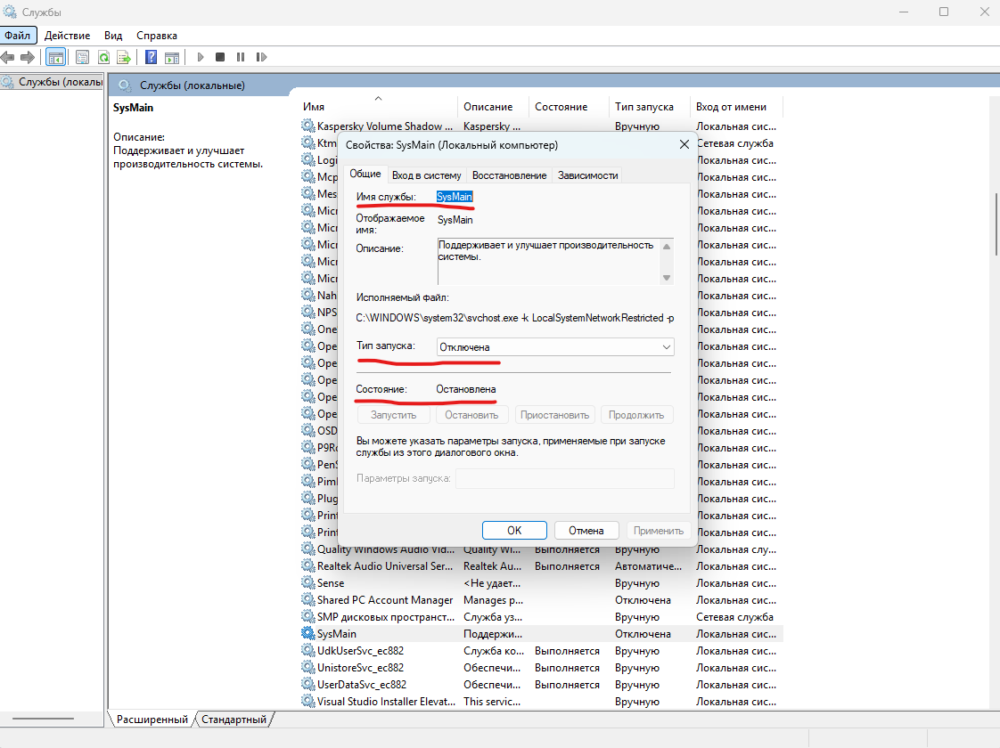
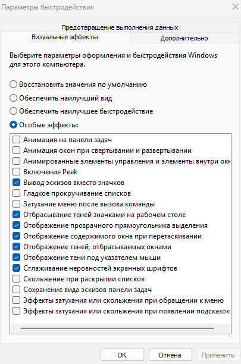
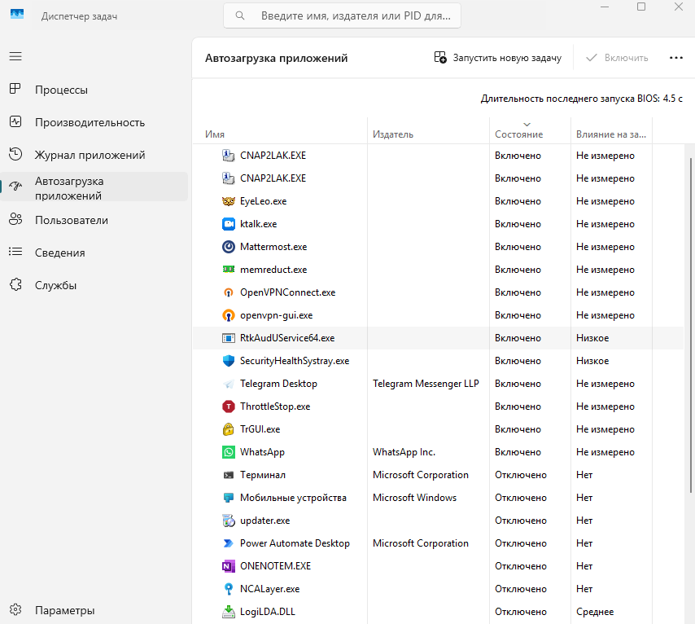
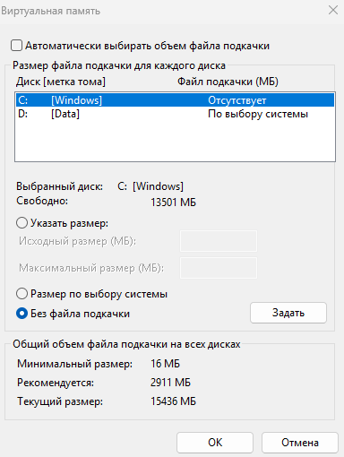
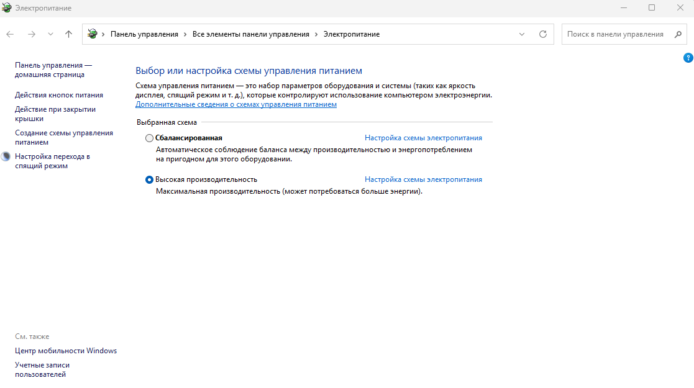
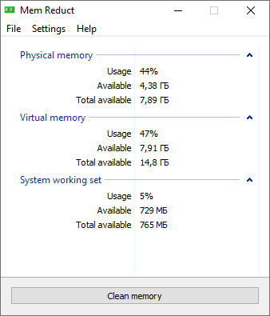

<!--
{
  "draft": false,
  "tags": ["Другое"]
}
-->

# Оптимизация оперативной памяти

```blogEnginePageDate
20 февраля 2026
```

Что делать, если 16 ГБ ОЗУ не хватает для разработки? При запуске сложного проекта (монорепозитории, Docker, несколько
сервисов, IDE, браузер с DevTools и т.д.) 16 ГБ оперативной памяти могут быстро закончиться. Да, комфортный минимум
сегодня — **32 ГБ**, а для крупных проектов — уже **48–64 ГБ**. Но если апгрейд пока невозможен, ниже — практические
шаги, которые реально помогают выжать максимум из текущей конфигурации.

### 1. Закрыть всё лишнее (самый простой и эффективный способ)

Банально, но работает:

- Мессенджеры (Telegram, Slack, Discord)
- Облака (OneDrive, Google Drive)
- Лишние вкладки Chrome (👉 Chrome с 20 вкладками легко «съедает» 2–4 ГБ.)
- Фоновые лаунчеры (Steam, Epic и т.д.)

### 2. Удалить ненужные программы

Если что-то висит в фоне постоянно — лучше удалить. Помочь могут утилиты вроде IObit Uninstaller. Но используйте
осторожно — не удаляйте системные компоненты.

### 3. Отключить службу SysMain (Superfetch)

SysMain предзагружает часто используемые приложения в память. На слабых конфигурациях это может ухудшать ситуацию. Как
отключить:

1. Win + R → `services.msc`
2. Найти **SysMain**
3. Остановить службу
4. Установить тип запуска «Отключена»



### 4. Отключить визуальные эффекты Windows

Анимации и прозрачности потребляют ресурсы. Путь: `Система → Дополнительные параметры → Быстродействие → Настроить`
Полное отключение выглядит не очень (особенно шрифты), поэтому лучше настраивать вручную.



### 5. Почистить автозагрузку

Некоторые программы стартуют вместе с системой и не отображаются в панели задач. Путь:
`Ctrl + Shift + Esc → Автозагрузка`. Отключите всё, что не критично.



### 6. Настроить файл подкачки

Если физической памяти мало, Windows использует файл подкачки (pagefile). Можно перенести его на другой раздел (если на
системном заканчивается место). Также можно почистить диск для профилактики.

⚠️ Это не замена RAM, но помогает избежать крашей.



### 7. Включить режим максимальной производительности

Путь: `Панель управления → Электропитание → Высокая производительность`. Особенно актуально для ноутбуков.


### 8. Обновить драйверы и программы

Иногда утечки памяти связаны со старыми драйверами. Можно использовать IObit Driver Booster.

### 9. Реестр

Проверить реестр через CCleaner или аналог [Glary Utilities](https://www.glarysoft.com/)

### 10. Использование Mem Reduct

Mem Reduct — утилита для очистки RAM. Иногда позволяет вернуть 3–5 ГБ. Полезно перед запуском тяжелых
приложений\компиляции почистить.

⚠️ Но есть нюанс - во время очистки могут падать локальные дебаг-сессии. Поэтому лучше
запускать вручную, либо не чаще раза в час.



### 11. Ограничить потребление памяти

- Найти IntelliJ IDEA параметры по пути `C:\Program Files\JetBrains\jetbra\vmoptions` и сохранить `-Xms512m -Xmx2g`
- VS Code запускать с флагом `--disable-gpu`
- Ограничить память Docker `--memory 2g`
- Для Node.js `NODE_OPTIONS=--max-old-space-size=4096`

---

## Итог

Если вы регулярно упираетесь в 16 ГБ — это сигнал, что пора планировать апгрейд. Разработка в 2026 году с Docker,
микросервисами и тяжёлой фронтенд-сборкой на 16 ГБ — это уже «режим выживания», а не комфортная работа.

## Полезные ссылки

* https://www.youtube.com/watch?v=gJ6ZrtjMo_Y&list=LL&index=9&t=1s
